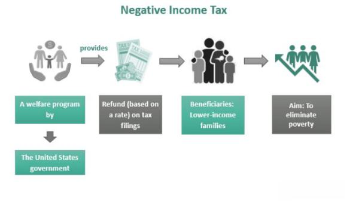

In today's dynamic economic landscape, understanding various income tax mechanisms is essential for individuals and policymakers. The tax policy framework encompasses multiple components, including the negative income tax (NIT), which offers a progressive approach to providing a safety net for low-income earners. Introduced by economist Milton Friedman, NIT proposes a system whereby individuals earning below a specified threshold receive supplemental financial assistance, thereby reducing poverty and boosting economic security.

Simultaneously, advancements in technology have introduced algorithmic trading, significantly impacting financial markets on a global scale. Algorithmic trading, also known as algo trading, employs sophisticated computer algorithms to execute trades at high speed, transforming market dynamics through enhanced efficiency and liquidity. Despite its benefits, algo trading also incites discussions on market volatility and regulatory challenges.

This article explores the intersection of these concepts—negative income tax and algorithmic trading—and their implications for economic stability and growth. By analyzing the historical contexts and examining different perspectives, our objective is to provide a comprehensive understanding of these complex topics. The synergy between innovative tax models like NIT and evolving financial technologies represents a frontier for devising strategies geared towards sustainable economic development. Understanding these mechanisms proves crucial for policymakers, businesses, and individuals navigating the modern financial landscape as they seek to craft solutions for a more resilient and inclusive economic future.

## Table of Contents

## Understanding Income Tax Mechanisms

Income tax mechanisms play a crucial role in underpinning government operations and providing essential public services. By collecting revenue from individuals and businesses, governments can fund infrastructure, healthcare, education, and other critical areas vital for societal well-being. These mechanisms are diverse and vary across jurisdictions, but they generally include progressive tax systems and alternative approaches such as the Negative Income Tax (NIT).

Progressive tax systems are designed to ensure that tax liability is apportioned according to an individual's ability to pay. In these systems, the tax rate increases as income increases. This structure is predicated on the principle of vertical equity, which posits that individuals with higher incomes should contribute a larger share to the public coffers, thereby reducing income inequality and ensuring a fairer distribution of resources. A common example of a progressive tax system can be expressed mathematically as:

$$
T = r(Y) \times Y
$$

where $T$ is the total tax paid, $r(Y)$ is the tax rate function that increases with income $Y$.

Despite their advantages, progressive tax systems can sometimes introduce complexities in tax compliance and administration. High marginal tax rates may also lead to disincentives for [earning](/wiki/earning-announcement) additional income, potentially affecting productivity and economic growth.

An alternative approach to traditional progressive taxation is the Negative Income Tax (NIT), which aims to provide financial assistance to individuals and families whose income falls below a predetermined threshold. Proposed by economist Milton Friedman, the NIT seeks to simplify welfare systems by providing direct monetary transfers rather than traditional welfare payments. The NIT concept functions by providing a guaranteed minimum income, which decreases as other income rises, eventually being phased out at higher income levels.

The NIT can be conceptualized through the following formula:

$$
I = B - t \times Y
$$

where $I$ is the income received through NIT, $B$ is the basic income guarantee, $t$ is the tax rate on earned income, and $Y$ is the earned income. If an individual earns an amount below the threshold, the government supplements their income up to the level of $B$.

The benefits of NIT include its potential to reduce poverty efficiently and its simplicity compared to conventional welfare programs. However, challenges include determining appropriate income thresholds, setting the tax rate $t$ to balance public finances, and avoiding work disincentives.

In conclusion, both progressive tax systems and the Negative Income Tax present unique advantages and challenges. By understanding these mechanisms, policymakers can tailor tax policies to enhance fairness, economic efficiency, and social welfare, contributing to the overall objective of sustainable economic growth and societal equity.

## Tax Policy and Economic Stability

Tax policy plays a crucial role in shaping economic stability, influencing both individual choices and corporate financial strategies. Governments utilize tax policies to achieve a variety of objectives, including stimulating economic growth, ensuring equitable income distribution, and generating revenue for public services.

A well-structured tax policy is integral to promoting economic growth. By providing incentives for investment and innovation, tax policy can stimulate economic activity. For instance, reductions in corporate tax rates are often aimed at encouraging business investments, leading to job creation and higher productivity. Similarly, tax incentives targeted at research and development can foster technological advancements and economic expansion. These measures are not merely about lowering tax rates; they involve designing a tax system that encourages productive economic behavior while ensuring sufficient revenue generation.

Furthermore, tax policies are a key tool in addressing income inequality. Progressive tax systems, where tax rates increase with income levels, are designed to ensure that those with higher incomes contribute a larger share of their earnings. This approach helps in redistributing wealth and reducing economic disparities, which contributes to a more balanced and fair economy. However, intricate designs are necessary to avoid discouraging work or investment among higher earners.

The concept of a negative income tax (NIT) presents an innovative approach to complement existing welfare programs and enhance economic resilience. Proposed by economist Milton Friedman, the NIT provides direct cash transfers to individuals earning below a certain threshold instead of supporting them through complex welfare programs. This system aims to simplify social welfare mechanisms by integrating financial support into the tax system itself, thereby reducing bureaucratic overhead and targeting assistance more effectively.

Balancing economic growth with social welfare objectives involves making complex policy decisions. Policymakers must consider the implications of tax policies on both microeconomic and macroeconomic levels, ensuring that incentives for growth do not come at the expense of social welfare and vice versa. The challenges lie in crafting policies that maintain fiscal sustainability while addressing the socio-economic needs of the population.

Tax policies also interplay with broader economic trends and global financial markets. International tax competition, regulatory environments, and cross-border economic activities add layers of complexity to national tax policies. Policymakers must navigate these dimensions to sustain economic stability and growth amid evolving global economic landscapes.

In summary, tax policy is a multifaceted tool that requires careful design to fulfill its dual role of promoting economic growth and ensuring social equity. The integration of mechanisms like a negative income tax could streamline welfare systems and support economic resilience, ultimately contributing to a stable and adaptable economy.

## Negative Income Tax: Concept and Implementation

Negative income tax (NIT) is a social welfare program that aims to provide a financial safety net for individuals whose income falls below a specified level. This concept was first introduced by the renowned economist Milton Friedman, who proposed NIT as a means to simplify the welfare system while promoting economic security and reducing poverty. 

### Theoretical Underpinnings

The basic premise of the NIT is straightforward: it functions as a tax system that provides direct cash transfers to those earning below a certain threshold rather than taxing them. The government pays a guaranteed amount to individuals with no income, which gradually decreases as their earnings rise, complementing traditional income streams and providing a gradual transition back to higher income levels.

Mathematically, the NIT can be represented using the formula:

$$
\text{Net Benefit} = \text{Guaranteed Income} - (\text{Tax Rate} \times \text{Earned Income})
$$

In this equation, the guaranteed income is the amount provided to individuals with zero earnings, while the tax rate represents the rate at which the benefits phase out as income increases. This system encourages workforce participation since individuals retain a portion of earnings without losing all benefits.

### Real-world Applications

Various countries have experimented with NIT or similar models. One notable example is Canada’s Mincome experiment in the 1970s, which took place in Manitoba. This pilot program provided guaranteed minimum income to residents, intending to assess whether direct cash payments would decrease work incentives. The results showed little to no reduction in working hours for most recipients, demonstrating NIT's potential to support economic stability without drastically affecting labor supply.

Another case is the U.S. Earned Income Tax Credit (EITC), which, while not a pure NIT, shares similar principles in providing income support to low- and moderate-income working families. The EITC effectively supplements earnings and has been credited with reducing poverty and encouraging workforce participation.

### Feasibility and Impact

The implementation of NIT could potentially streamline existing welfare programs. By consolidating various support mechanisms within a single framework, administrative costs might be reduced, and the stigma often associated with welfare programs could be minimized. Furthermore, by guaranteeing a safety net, NIT aids in stabilizing consumption patterns, which is beneficial for overall economic resilience.

However, NIT's feasibility hinges on several factors, including political will, fiscal capacity, and public acceptance. Concerns about program costs and potential disincentives to work due to cash transfers remain prevalent. Yet, the managed phase-out rate in NIT systems seeks to address these concerns.

Pilot programs and comparative studies highlight both the promise and challenges of implementing a negative income tax. While empirical evidence suggests potential benefits in poverty reduction and income stability, successful nationwide implementation would require careful consideration of local economic conditions and fiscal constraints.

## Algorithmic Trading: An Overview

Algorithmic trading, often referred to as algo trading, is a sophisticated method of executing trades in financial markets using pre-programmed computer algorithms. These algorithms are designed to automatically manage trading activities based on predetermined criteria such as timing, price, and [volume](/wiki/volume-trading-strategy), thereby optimizing trade execution at speeds beyond human capability. 

The integration of [algorithmic trading](/wiki/algorithmic-trading) into financial markets has significantly enhanced both efficiency and [liquidity](/wiki/liquidity-risk-premium). By automating the trading process, algorithms can quickly assimilate large volumes of data, make split-second trading decisions, and execute trades across multiple exchanges simultaneously. This efficiency reduces transaction costs, minimizes human errors, and improves the overall market liquidity by ensuring that buy and sell orders are matched swiftly and seamlessly.

Despite its advantages, algorithmic trading presents several challenges and potential pitfalls. One major concern is market [volatility](/wiki/volatility-trading-strategies). High-frequency trading, a subset of algorithmic trading characterized by extremely fast order execution, has been associated with increased market volatility and flash crashes, where rapid sell-offs lead to abrupt market downturns. The 2010 Flash Crash exemplifies how quickly algorithmic strategies can exacerbate market movements, highlighting the need for robust risk management systems.

Regulatory challenges also arise with the proliferation of algorithmic trading. Regulators face the task of ensuring market integrity and protecting investors from manipulative practices such as spoofing, where traders place fake orders to manipulate prices. Consequently, regulatory bodies, including the Securities and Exchange Commission (SEC) in the United States and the European Securities and Markets Authority (ESMA), have implemented rules and guidelines to govern algorithmic trading activities. These regulations require greater transparency, rigorous testing of algorithms, and the implementation of real-time monitoring systems to detect and prevent market abuse.

In summary, algorithmic trading represents a profound technological shift in financial markets, offering increased efficiency and liquidity benefits. However, it also demands careful oversight to mitigate risks associated with market volatility and regulatory compliance. As technology continues to advance, ongoing efforts to balance these aspects will be critical in leveraging algorithmic trading's full potential while safeguarding the stability and integrity of financial markets.

## Negative Income Tax and Algorithmic Trading: Potential Synergies

Negative income tax (NIT) and algorithmic trading, although seemingly distinct, both hold significant implications for economic stability and policy-making. The innovative combination of these two concepts can yield remarkable benefits for financial inclusion and market efficiency.

Negative income tax is designed to alleviate poverty and offer economic security by providing financial assistance to individuals whose earnings fall below a specified threshold. By ensuring a basic income floor, NIT can enhance consumer demand and stimulate economic activity. This could be particularly beneficial in regions where traditional welfare mechanisms are ineffective or underfunded.

On the other hand, algorithmic trading involves the use of complex algorithms to execute trading orders at speeds and frequencies beyond human capability. It has dramatically increased market efficiency and liquidity, while also contributing to volatility and regulatory challenges. Algorithmic trading can process large volumes of transactions rapidly, adjusting to market conditions in real-time, which ensures market responsiveness.

When considering the synergies between NIT and algorithmic trading, several potential benefits emerge:

1. **Financial Inclusion**: Integrating NIT with advanced trading systems could enhance financial inclusion by ensuring even low-income individuals have better market access and visibility. Algorithmic trading platforms can be designed to consider NIT beneficiaries, offering tailored financial products that accommodate their income levels and spending capabilities.

2. **Market Efficiency**: The implementation of NIT could lead to increased consumption among lower-income groups, thereby affecting market demand patterns. Algorithmic models can be adjusted to predict these changes in consumption, allowing for more responsive pricing and inventory adjustments. This dynamic interplay could contribute to more stable markets.

3. **Data-Driven Policy**: Algorithmic trading technologies can analyze vast amounts of data to predict economic trends. These insights could inform NIT policies, optimizing aid distribution and timing. Policymakers could simulate NIT impacts using trading algorithms to assess economic resilience strategies under various scenarios.

4. **Economic Resilience and Growth**: Both NIT and algorithmic trading can together promote equitable growth. While NIT provides the safety net to maintain consumer confidence and demand, algorithmic trading ensures market liquidity and efficiency, essential for economic resilience. The synergy between stable consumer bases provided by NIT and responsive markets facilitated by algorithmic trading can foster a more resilient economic structure.

Despite potential synergies, integrating these systems involves managing complexities such as ensuring data security, ethical AI use, and aligning technical and policy frameworks. Future exploration into the practical application of these synergies is crucial in determining how these innovative solutions can contribute to a balanced, inclusive, and robust economic outlook.

## Challenges and Future Directions

Implementing a negative income tax (NIT) and regulating algorithmic trading together present substantial challenges within both economic and political contexts. These require a balanced approach to ensure financial sustainability while aiming to maximize social benefits without disrupting market operations.

One key challenge in implementing NIT is ensuring financial sustainability. Governments must balance funding NIT programs with other budgetary obligations, including infrastructure, healthcare, and education. A sustainable NIT system must guarantee sufficient revenue without overly burdening taxpayers or depleting government resources. The trade-off between adequate social support and maintaining fiscal responsibility is critical. Policymakers might consider gradual implementation or scaling based on economic conditions to alleviate budgetary pressures.

Minimizing market disruptions is crucial when regulating algorithmic trading. Algorithmic trading can significantly enhance market efficiency and liquidity, but it also poses risks of increased volatility and potential systemic crises, as seen during the 2010 “Flash Crash” [1]. Regulatory frameworks must focus on transparency, monitoring trading activities, and ensuring that algorithms do not exploit market weaknesses. Establishing circuit breakers and requiring detailed reporting of algorithmic strategies can mitigate risks.

Achieving policy coherence between NIT and algorithmic trading regulations is another challenge. Both must align with broader economic goals, such as decreasing inequality and promoting market stability. Coordination between fiscal policies, market regulations, and other social welfare initiatives is essential. For example, the revenue generated from financial transaction taxes, possibly imposed on high-frequency trades, could fund NIT programs, linking the two mechanisms into a unified strategy.

Future directions involve integrating NIT and algorithmic trading into expansive economic frameworks fostering inclusive growth. This could involve leveraging data analytics to optimize NIT distribution, ensuring it meets the needs of intended beneficiaries effectively. Exploring synergies where advancements in trading technologies contribute to economic stability can support innovative policy initiatives that embrace digital transformation and financial inclusion.

Developing flexible policies adaptable to technological advances and economic shifts is essential. Continuous evaluation of NIT programs and trading regulations will help refine strategies and adapt to new economic realities. Encouraging cross-sector collaborations and global cooperation can accelerate progress and knowledge sharing, guiding these initiatives towards sustainable solutions that promote equitable economic growth.

Reference:
[1] Kirilenko, A., Kyle, A. S., Samadi, M., & Tuzun, T. (2017). The Flash Crash: High‐Frequency Trading in an Electronic Market. *The Journal of Finance*, 72(3), 967-998.

## Conclusion

In today's rapidly changing economic landscape, innovative approaches such as negative income tax and algorithmic trading present both opportunities and challenges. Understanding these concepts is vital for policymakers, businesses, and individuals striving to navigate the modern financial environment. Negative income tax, first proposed by Milton Friedman, seeks to reduce poverty and enhance economic security by providing financial support to low-income individuals. This approach not only addresses income inequality but also proposes a streamlined alternative to traditional welfare systems. 

Algorithmic trading, on the other hand, has revolutionized financial markets by improving efficiency and liquidity through high-speed, computer-driven transactions. However, it has also introduced complexities such as market volatility and regulatory issues that require careful management. The intersection of these two concepts suggests potential synergies that could foster financial inclusion and market efficiency. For instance, the integration of algorithmic trading technologies with tax policies might refine the targeting and distribution mechanisms of negative income tax, enhancing its effectiveness.

Exploring the implications of these concepts helps formulate strategies for sustainable economic growth. Policymakers must engage in ongoing research, dialogue, and collaboration to harness these innovations effectively. By addressing the challenges posed by negative income tax and algorithmic trading, it is possible to pave the way for a resilient economic future. The continuous adaptation and refinement of these mechanisms will be essential to building an inclusive financial system that supports equitable growth and stability in the 21st century.

## References & Further Reading

[1]: Friedman, M. (1962). ["Capitalism and Freedom"](https://ctheory.sitehost.iu.edu/resources/fall2020/Friedman_Capitalism_and_Freedom.pdf). University of Chicago Press.

[2]: Kirilenko, A., Kyle, A. S., Samadi, M., & Tuzun, T. (2017). ["The Flash Crash: High‐Frequency Trading in an Electronic Market."](https://www.jstor.org/stable/26652722) The Journal of Finance, 72(3), 967-998.

[3]: Lopez de Prado, M. (2018). ["Advances in Financial Machine Learning."](https://www.amazon.com/Advances-Financial-Machine-Learning-Marcos/dp/1119482089) Wiley.

[4]: McKinsey Global Institute. (2019). [“Advanced analytics in asset management: Beyond the buzz.”](https://www.mckinsey.com/~/media/McKinsey/Industries/Financial%20Services/Our%20Insights/Advanced%20analytics%20in%20asset%20management%20Beyond%20the%20buzz/Advanced-analytics-in-asset-management-vf.ashx)

[5]: Jansen, S. (2020). ["Machine Learning for Algorithmic Trading."](https://github.com/stefan-jansen/machine-learning-for-trading) Packt Publishing.