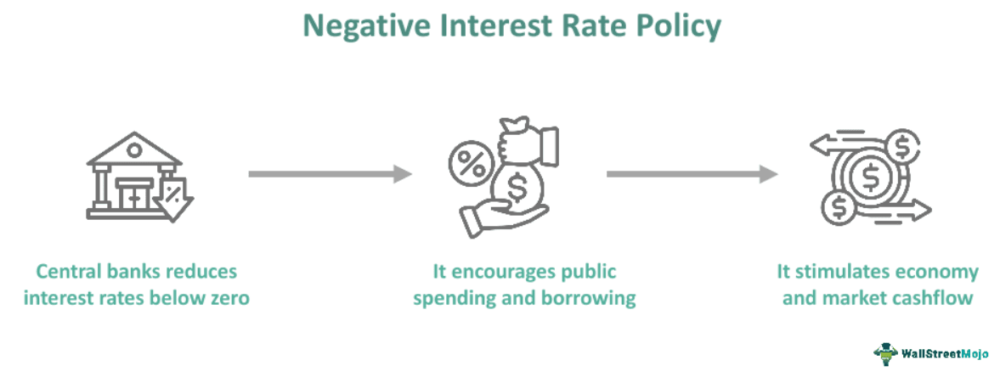

## Table of Contents

## What is a negative interest rate policy (NIRP)?

A negative interest rate policy (NIRP) is when a country's central bank sets interest rates below zero. This means that banks have to pay to keep their money at the central bank, instead of earning interest on it. The idea behind NIRP is to encourage banks to lend more money to businesses and people, rather than keeping it in the central bank. By doing this, the central bank hopes to boost spending and investment in the economy, which can help to fight against low inflation or even deflation.

NIRP is a tool used by central banks when other methods, like lowering interest rates to zero, haven't worked well enough. It's a bit like a last resort to get the economy moving. However, NIRP can also have some downsides. For example, it might hurt the profits of banks, and it can be confusing for people who are used to earning interest on their savings. So, while NIRP can be helpful in certain situations, it's not a perfect solution and needs to be used carefully.

## How does a negative interest rate policy work?

A negative interest rate policy, or NIRP, is when a country's big bank, called the central bank, decides to charge other banks for keeping their money there. Usually, banks earn a little bit of money for keeping their cash at the central bank, but with NIRP, they have to pay instead. The central bank does this to make banks want to lend out their money to people and businesses more. When banks lend more, people and businesses can spend and invest more, which can help the economy grow.

The goal of NIRP is to fight against problems like low inflation or even deflation, where prices keep going down. When the economy is not doing well, the central bank might use NIRP as a special tool to try and fix things. But, NIRP can also cause some problems. Banks might not like having to pay to keep their money safe, and it can be tough for people who are used to getting a little interest on their savings. So, while NIRP can help in some cases, it's not a perfect fix and needs to be used carefully.

## Why would a central bank implement a negative interest rate policy?

A central bank might use a negative [interest rate](/wiki/interest-rate-trading-strategies) policy, or NIRP, when the economy is not doing well. They want to encourage banks to lend more money to people and businesses instead of keeping it safe at the central bank. By charging banks to keep their money, the central bank hopes that banks will lend it out more. This can help people and businesses spend and invest more, which can make the economy grow.

NIRP is often used when other methods, like lowering interest rates to zero, haven't worked well enough. It's a special tool to fight against problems like low inflation or even deflation, where prices keep going down. But, NIRP can also have some downsides. It might make it harder for banks to make money, and it can be confusing for people who expect to earn interest on their savings. So, while NIRP can help in some situations, it's not a perfect solution and needs to be used carefully.

## What are the potential benefits of a negative interest rate policy?

A negative interest rate policy, or NIRP, can help the economy by making banks want to lend more money. When banks have to pay to keep their money at the central bank, they are more likely to lend it out to people and businesses. This can lead to more spending and investment, which can help the economy grow. If the economy is not doing well, with low inflation or even prices going down, NIRP can be a way to give it a boost.

However, NIRP is not perfect and can have some downsides. It might make it harder for banks to make money because they have to pay to keep their cash safe. This can also be confusing for people who are used to [earning](/wiki/earning-announcement) a little interest on their savings. But, when used carefully, NIRP can be a helpful tool for central banks to try and fix economic problems when other methods aren't working well enough.

## What are the potential drawbacks of a negative interest rate policy?

A negative interest rate policy, or NIRP, can cause problems for banks. When banks have to pay to keep their money at the central bank, it can hurt their profits. Banks might then be less willing to lend money because they are trying to save money themselves. This can make it harder for people and businesses to get loans, which can slow down the economy instead of helping it grow.

NIRP can also be confusing and tough for people who save money. Usually, people expect to earn a little interest on their savings, but with NIRP, they might have to pay to keep their money in the bank. This can make people unhappy and less likely to save money. If people stop saving, it can affect the overall economy because there's less money available for banks to lend out. So, while NIRP can help in some situations, it needs to be used carefully because of these potential drawbacks.

## Can you provide historical examples of countries that have implemented NIRP?

Some countries have tried using negative interest rate policy, or NIRP, to help their economies. One example is Japan. In 2016, the Bank of Japan started using NIRP to fight against low inflation and a slow economy. They hoped that by charging banks to keep their money, banks would lend more to people and businesses, which would help the economy grow. Another country that used NIRP is Sweden. The Swedish central bank, called the Riksbank, started using NIRP in 2015 to fight against low inflation and help their economy.

In Europe, the European Central Bank, or ECB, also used NIRP. They started this policy in 2014 to help the economies of the countries that use the euro. The ECB wanted to encourage banks to lend more money so that people and businesses could spend and invest more. These examples show how different countries have used NIRP when other ways of helping the economy were not working well enough.

## How do negative interest rates affect savers and borrowers?

Negative interest rates can make things tough for people who save money. Usually, when you put money in a bank, you get a little bit of money back as interest. But with negative interest rates, you might have to pay the bank to keep your money there. This can be confusing and upsetting for savers because they expect to earn something on their savings, not lose money. As a result, people might decide to spend their money instead of saving it, which can affect how much money they have for the future.

For people who borrow money, negative interest rates can be good news. When interest rates are negative, it can be cheaper to borrow money from the bank. This means that people might be more willing to take out loans for things like buying a house or starting a business. Borrowing money becomes less expensive, which can help people and businesses spend and invest more. This can help the economy grow, but it depends on how much people actually decide to borrow and spend.

## What impact does NIRP have on the banking sector?

Negative interest rate policy, or NIRP, can make things hard for banks. When banks have to pay to keep their money at the central bank, it can hurt their profits. Banks usually make money from the interest they charge on loans and the interest they earn from the central bank. But with NIRP, they get less money from the central bank, which means they have less money to work with. This can make banks more careful about lending money, because they want to save money themselves. If banks lend less, it can slow down the economy instead of helping it grow.

NIRP can also change how banks work with their customers. Banks might start charging fees to people who want to keep a lot of money in their accounts, because the banks are losing money by keeping it at the central bank. This can make people unhappy, especially those who save money and expect to earn interest on it. Banks might also try to find other ways to make money, like charging more for services or looking for new ways to invest. All of these changes can affect how banks operate and how they interact with their customers.

## How do negative interest rates influence inflation and economic growth?

Negative interest rates are used by central banks to try and make the economy grow faster and to fight against low inflation. When interest rates are negative, banks have to pay to keep their money at the central bank. This encourages banks to lend more money to people and businesses. When people and businesses borrow more, they can spend and invest more, which can help the economy grow. If the economy is growing, it can also help to increase inflation, which is when prices go up a little bit over time. Central banks like a bit of inflation because it means the economy is healthy.

However, negative interest rates don't always work the way central banks hope. Sometimes, banks might not want to lend more money even if they have to pay to keep it at the central bank. They might be worried about the economy and want to save money instead. If banks don't lend more, people and businesses won't spend and invest as much, and the economy might not grow as fast as the central bank wants. Also, if people see that they have to pay to keep their money in the bank, they might decide to spend it instead of saving it. This can affect how much money is available for banks to lend out, which can slow down the economy instead of helping it grow.

## What are the challenges in implementing and maintaining a negative interest rate policy?

Implementing and maintaining a negative interest rate policy can be really tricky for central banks. One big challenge is that it can hurt banks' profits. When banks have to pay to keep their money at the central bank, they might not want to lend as much. This can make it harder for people and businesses to get loans, which can slow down the economy instead of helping it grow. Banks might also start charging their customers more fees to make up for the money they're losing, which can make people unhappy and less likely to save.

Another challenge is that negative interest rates can be confusing and tough for people who save money. Usually, people expect to earn a little interest on their savings, but with negative rates, they might have to pay to keep their money in the bank. This can make people upset and less likely to save, which can affect how much money is available for banks to lend out. It's also hard for central banks to know if negative interest rates will actually work to boost the economy. If banks don't lend more, or if people don't spend more, the policy might not help as much as the central bank hopes.

## How do negative interest rates affect international capital flows and currency valuation?

Negative interest rates can change how money moves between countries. When a country has negative interest rates, investors might take their money out of that country and put it into countries where they can still earn interest. This can lead to less money coming into the country with negative rates, which can make it harder for that country's economy to grow. On the other hand, countries with positive interest rates might see more money coming in from investors looking for better returns, which can help their economies.

Negative interest rates can also affect how much a country's money, or currency, is worth compared to other countries' money. When a country has negative rates, its currency might become less valuable because investors want to move their money to places where they can earn more. A weaker currency can make things cheaper for other countries to buy, which might help the country's exports. But it can also make imports more expensive, which can affect the cost of living for people in that country. So, negative interest rates can have a big impact on how money moves around the world and how much a country's currency is worth.

## What are the long-term implications of sustained negative interest rate policies?

If a country keeps using negative interest rates for a long time, it can cause some big changes. Banks might keep losing money because they have to pay to keep their cash at the central bank. This can make banks very careful about lending money, and they might even start charging people more fees to make up for their losses. If banks don't lend as much, it can be harder for people and businesses to get loans, which can slow down the economy instead of helping it grow. People might also get used to not earning interest on their savings and might decide to spend their money instead of saving it, which can affect how much money is available for banks to lend out.

Over time, negative interest rates can also change how money moves around the world. Investors might take their money out of the country with negative rates and put it into countries where they can still earn interest. This can make the country's currency less valuable because fewer people want to hold onto it. A weaker currency can make the country's exports cheaper for other countries to buy, which might help the economy a bit. But it can also make imports more expensive, which can make life more costly for people living in that country. So, keeping negative interest rates for a long time can have big effects on the economy, the banking system, and how much a country's money is worth.

## References & Further Reading

[1]: Bergstra, J., Bardenet, R., Bengio, Y., & Kégl, B. (2011). ["Algorithms for Hyper-Parameter Optimization."](https://dl.acm.org/doi/10.5555/2986459.2986743) Advances in Neural Information Processing Systems 24.

[2]: ["Advances in Financial Machine Learning"](https://www.amazon.com/Advances-Financial-Machine-Learning-Marcos/dp/1119482089) by Marcos Lopez de Prado

[3]: ["Evidence-Based Technical Analysis: Applying the Scientific Method and Statistical Inference to Trading Signals"](https://www.amazon.com/Evidence-Based-Technical-Analysis-Scientific-Statistical/dp/0470008741) by David Aronson

[4]: ["Machine Learning for Algorithmic Trading"](https://github.com/stefan-jansen/machine-learning-for-trading) by Stefan Jansen

[5]: ["Quantitative Trading: How to Build Your Own Algorithmic Trading Business"](https://www.amazon.com/Quantitative-Trading-Build-Algorithmic-Business/dp/1119800064) by Ernest P. Chan