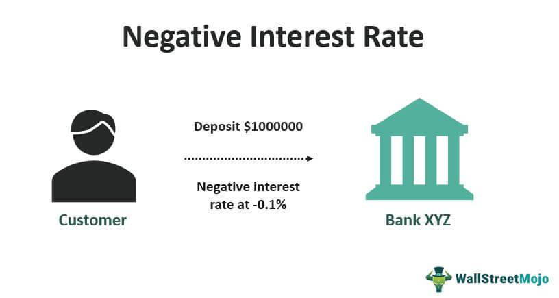

The financial landscape is evolving rapidly with the advent of unconventional monetary policies like the Negative Interest Rate Policy (NIRP). NIRP emerges as a significant tool utilized by central banks to stimulate economic growth, particularly in times when traditional monetary solutions prove inadequate. Under NIRP, nominal interest rates fall below zero, effectively charging banks for holding excess reserves. This counterintuitive measure aims to incentivize increased lending and expenditure, thus combating deflationary challenges and encouraging economic expansion.

Historically, NIRP has been implemented in regions such as Europe and Japan, especially after the 2008 financial crisis. These implementations have sparked intense debates regarding the policy's efficacy and its broader implications for the global financial ecosystem. As economies grapple with low growth and inflation rates, the role of NIRP takes on added significance, prompting financial institutions and investors to adapt to an unfamiliar interest rate environment.



In this context, algorithmic trading, or algo trading, becomes a powerful tool for navigating the complexities introduced by NIRP. Leveraging sophisticated computer algorithms, traders can swiftly adjust to fluctuations in interest rates, exploiting any market inefficiencies that arise. Algorithmic strategies are adept at managing risks associated with negative rates while optimizing potential returns, thereby offering a strategic advantage in this challenging economic climate.

This article seeks to demystify the mechanics of NIRP and its influence on financial markets. We will explore how algorithmic trading strategies can be effectively employed to address the unique challenges posed by negative interest rates, equipping readers with insights into both the complexities and opportunities of this evolving financial paradigm.

## Table of Contents

## Understanding Negative Interest Rate Policy (NIRP)

Negative Interest Rate Policy (NIRP) is an unconventional monetary strategy implemented by central banks where nominal interest rates are set below zero. This unorthodox approach is part of monetary policy efforts to stimulate economic activity by discouraging savings and encouraging spending and borrowing, primarily in times of low inflation or deflationary pressures.

Traditionally, central banks lower interest rates during economic downturns to make borrowing cheaper, thereby prompting both consumer spending and business investments. However, when rates are already near zero and the economy requires further stimulus, central banks may resort to NIRP. By imposing a negative rate, central banks aim to charge commercial banks for holding excess reserves, incentivizing these banks to increase lending to consumers and businesses instead of hoarding money.

The dual logic behind NIRP is economic stimulation through increased lending and spending. When consumers and businesses have access to cheaper loans, they are more likely to invest and spend, which can foster economic growth and counteract deflation. Additionally, NIRP can encourage investors to seek higher yields in riskier assets, further injecting capital into the market.

Significant implementations of NIRP have occurred in regions like the Eurozone and Japan, particularly following the global financial crisis of 2008. For instance, the European Central Bank and the Bank of Japan adopted negative rates to combat prolonged low inflation and stimulate their respective economies. These central banks set their deposit rates below zero, effectively charging financial institutions to park excess funds, thus pushing them towards increasing credit availability.

In summary, NIRP challenges the traditional notion of interest-bearing savings by making holding money costly, steering the economic environment toward greater [liquidity](/wiki/liquidity-risk-premium) and consumption. However, while it intends to invigorate economic conditions, the broader and long-term implications of NIRP remain a topic of considerable debate among economists and policymakers.

## Mechanics and Rationale Behind NIRP

Under the Negative Interest Rate Policy (NIRP), central banks set nominal interest rates below zero. This policy charges commercial banks for holding excess reserves with the central bank. The rationale behind this strategy is to incentivize banks to reduce their reserve holdings and increase lending to businesses and households. By imposing a penalty, in the form of negative rates, for holding excess funds, central banks aim to circulate money in the economy, thereby stimulating economic activity.

The primary objective of NIRP is to combat deflationary pressures and promote economic growth. By encouraging banks to lend more, consumers and businesses are prompted to increase spending and investment rather than saving. This increased financial activity can help raise inflation to a desired level, typically around 2%, which is considered healthy for economic growth.

While theoretically beneficial, the practical application of NIRP can be challenging. One of the complexities involves determining the optimal negative [interest rate](/wiki/interest-rate-trading-strategies) that balances stimulating lending without excessively squeezing bank profit margins. The impact on savings and loans is another area of concern. For savers, negative interest rates can lead to negligible or even diminishing returns on their deposits, potentially altering saving behaviors. Conversely, borrowers might benefit from lower interest rates on loans, making borrowing more attractive.

Moreover, negative interest rates can affect the banking sector's profitability. Traditional bank models rely on the spread between the interest rates on deposits and loans. Negative rates can compress this spread, leading to lower net interest income, potentially driving banks to find alternative revenue streams or riskier lending practices.

In summary, the mechanics of NIRP involves a delicate balance of stimulating economic conditions through increased lending and spending while managing the operational and profitability challenges it poses to financial institutions.

## Algorithmic Trading in a NIRP Environment

Algorithmic trading, known as "algo trading," leverages sophisticated computer algorithms to automate the execution of trades. These algorithms are designed to react to market conditions and execute trades based on pre-defined criteria such as timing, price, or quantity. In environments characterized by Negative Interest Rate Policies (NIRP), [algorithmic trading](/wiki/algorithmic-trading) systems become particularly advantageous due to their ability to rapidly adjust to fluctuating interest rate landscapes, enabling traders to exploit market inefficiencies more effectively.

In a NIRP environment, interest rates fall below zero, creating unique challenges and opportunities for market participants. Algorithms can swiftly recalibrate trading strategies in response to these changes, optimizing the potential for returns. Traditional trading approaches may struggle to adapt quickly enough to such unconventional monetary conditions, but algorithmic systems are equipped to handle these shifts in real-time. This adaptability is crucial in a volatile interest rate scenario where the cost of borrowing and lending dynamics are altered.

Furthermore, traders employ algorithmic trading to hedge against the potential risks associated with negative interest rates. For example, algorithms can be programmed to mitigate exposure to interest rate fluctuations by using derivatives like futures or options, ensuring that portfolios remain balanced even if the underlying rates change unpredictably. Additionally, algorithms can identify [arbitrage](/wiki/arbitrage) opportunities created by discrepancies in asset valuations caused by NIRP, such as variations in currency exchange rates or bond yields.

Consider the Python example below which demonstrates a simple algorithmic trading strategy that reacts to interest rate changes:

```python
import numpy as np

def trading_strategy(interest_rates):
    positions = []
    for rate in interest_rates:
        if rate < 0:
            positions.append("Buy Bonds")  # Assuming bonds yield better returns than cash in NIRP
        else:
            positions.append("Sell Bonds")
    return positions

# Example series of interest rates
interest_rates = [-0.5, 0.1, -0.2, -1.0]
trading_strategy = trading_strategy(interest_rates)
print(trading_strategy)
```

This code determines whether to buy or sell bonds depending on the interest rate, a simple yet illustrative depiction of how one might approach trading in a NIRP context. As market conditions evolve and new data becomes available, these strategies can be dynamically refined to ensure continued efficacy in maximizing returns while hedging risk.

Ultimately, algorithmic trading is not just about reacting to market changes rapidly but also about capitalizing on the structural changes introduced by policies like NIRP. By utilizing [machine learning](/wiki/machine-learning) techniques and advanced statistical models, these algorithms can provide a competitive edge, parsing vast amounts of market data to deliver insights and opportunities that manual trading might miss. This ability to continuously learn and adapt underscores the potential of algo trading as a vital tool in navigating the complexities of a NIRP-influenced financial landscape.

## Case Studies and Historical Context

Negative Interest Rate Policy (NIRP) has been applied in various countries, notably Switzerland, Denmark, and Japan, to stimulate economic activity in times of low growth. Each case offers unique insights into the effects of this monetary policy on local economies and financial markets.

### Switzerland
Switzerland introduced NIRP in January 2015, with the Swiss National Bank (SNB) setting interest rates on sight deposit accounts to -0.75% [1]. This policy aimed to mitigate the appreciation pressure on the Swiss franc, a safe-haven currency, especially after the removal of the franc's cap against the euro. The negative rates were intended to disincentivize holding Swiss francs and encourage capital to flow into other assets, stimulating economic activities.

In the Swiss context, NIRP had significant implications for the financial markets and the economy. It led to increased bank lending and higher valuations in the stock market as investors sought higher returns in equities and other assets. However, it also squeezed banks' interest margins, impacting profitability. Algorithmic trading strategies in Switzerland adapted to these changes, using quantitative models to capitalize on currency fluctuations and interest rate differentials.

### Denmark
Denmark began utilizing NIRP in 2012 to maintain the Danish krone’s peg to the euro [2]. The Danish central bank lowered its deposit rate to -0.2%, which was later adjusted to -0.75%, with the goal of deterring capital inflows that could disrupt the currency peg. NIRP in Denmark helped stabilize the krone and influence interest rate trends within the Eurozone.

The application of NIRP in Denmark influenced asset price increases and a surge in real estate investments, as lower borrowing costs made property investments more attractive. Danish banks navigated these pressures with varied success, with some passing on the costs to large depositors. Algorithmic traders leveraged the environment to exploit volatilities in exchange rates and shifts in government bond yields, optimizing returns using automated portfolio management techniques.

### Japan
Japan's adoption of NIRP came later, in January 2016, when the Bank of Japan set the interest rate on excess reserves to -0.1% [3]. This move was part of a broader strategy to combat decades-long deflationary pressures and stimulate inflation towards a 2% target. NIRP in Japan sought to lower borrowing costs further and encourage bank lending.

The impact on Japan’s economy and financial markets included initial depreciation of the yen and a boost to the stock market, as anticipated by the policy's advocates. Nonetheless, the results were mixed, with challenges in achieving significant inflation growth. Japanese banks faced pressure on net interest margins and profitability, with some turning to cost-cutting measures. Algorithmic trading in Japan played a crucial role in adjusting to these new market conditions, employing algorithms designed for high-frequency trading to take advantage of interest rate arbitrage opportunities and other inefficiencies created by the negative rates.

In conclusion, the implementation of NIRP in Switzerland, Denmark, and Japan has had varied impacts on local economies and financial markets. While incentivizing lending and investment, these policies have also posed challenges, particularly for banking sectors. Algorithmic trading has emerged as a vital tool for navigating the complexities introduced by NIRP, enabling traders to respond quickly to market changes and optimize returns through sophisticated trading strategies.

### References
[1] Swiss National Bank. (2015). Monetary policy decision and interest rate announcement.  
[2] Nationalbanken. (2012). Denmarks National Bank Interest Rate Announcement.  
[3] Bank of Japan. (2016). Introduction of "Quantitative and Qualitative Monetary Easing with a Negative Interest Rate".

## Implications for Financial Markets

Negative Interest Rate Policy (NIRP) has profound implications for financial markets, primarily through its influence on currency valuation, asset pricing, and institutional profitability. By setting nominal interest rates below zero, central banks often see a depreciation of their local currencies. This depreciation, while potentially beneficial for export competitiveness, can complicate international trade dynamics as it affects exchange rates, leading to fluctuations in trade balances.

For asset prices, NIRP tends to lead to increased valuations of stocks and bonds. As traditional savings yield minimal returns, investors are driven towards equities and other investment vehicles seeking higher yields. This shift can result in elevated stock market prices and compressed bond yields. The underlying mechanism involves the reduced opportunity cost of holding non-interest-bearing assets, which becomes more attractive when cash holdings incur a cost due to negative rates.

Despite its intention to stimulate economic activity, NIRP poses significant challenges. Banks, confronted with negative interest margins, experience squeezed profit margins, complicating their traditional business models. In a low or negative interest rate environment, the difference between the interest income generated and the interest paid to depositors narrows. This pressure impacts their ability to lend, potentially counteracting the economic stimulus intentions of NIRP.

Consumer behavior also reflects these challenges, as low or negative returns on savings discourage conventional saving habits, influencing consumption patterns. Savers, disillusioned by low returns, might increase consumption in the short term or explore riskier investments in search of better returns, possibly leading to asset bubbles.

Moreover, banks may be disincentivized to pass on negative rates to depositors due to reputational risks and potential customer dissatisfaction, thereby absorbing the costs themselves. This dynamic could affect their financial stability and long-term viability, prompting strategic adaptations such as increased fees on banking services or cost-cutting measures.

In summary, while NIRP aims to bolster economic growth by stimulating spending and investment, its implications ripple through financial markets, altering currency values, asset prices, and the financial health of banking institutions. The policy demands careful consideration of its economic impacts and systemic risks, necessitating strategic responses from central banks and market participants alike.

## Challenges and Risks of NIRP

Negative Interest Rate Policy (NIRP) presents a multifaceted array of challenges and risks that critics argue may undermine financial stability. A primary concern is the erosion of banks' profit margins. Under NIRP, financial institutions are disincentivized from holding excess reserves by having to pay a charge to the central bank. Consequently, banks face squeezed margins as they cannot fully pass on negative rates to depositors or borrowers. This pressure on profitability hampers their ability to lend, invest, and manage risks effectively, raising concerns about long-term viability and capital adequacy.

Public perception poses another significant challenge, especially among savers experiencing negligible returns on deposits. Traditional savings lose their allure as interest rates dip below zero, leading to potential behavioral shifts among consumers. This dissatisfaction can spur reduced savings rates and undermine trust in financial institutions, potentially destabilizing consumption patterns and savings behavior.

Furthermore, in an effort to maintain profitability, financial institutions and investors may engage in risk-taking behavior by seeking higher yields in riskier asset classes. This quest for returns can contribute to inflated asset bubbles across markets, exposing the financial system to systemic risks. Asset bubbles, characterized by unsustainably high market prices, heighten the risk of sharp corrections, which can lead to substantial financial distress.

The combination of these factors—diminished bank profitability, consumer discontent, and incentivized risk-taking—outlines a precarious scenario in the financial landscape. Policymakers and financial institutions must carefully navigate these challenges to prevent unintended consequences that could exacerbate economic vulnerabilities. The contemplation of potential outcomes underscores the need for a balanced approach in implementing and managing NIRP within the broader economic framework.

## Future Prospects and Conclusion

The debate over the long-term viability and effectiveness of Negative Interest Rate Policy (NIRP) remains a focal point among economists and policymakers. This unconventional monetary policy, while theoretically designed to stimulate economic activity by encouraging borrowing and spending, presents both opportunities and challenges.

**Advances in Financial Technology**

Technological advancements in the financial sector may enhance the effectiveness of NIRP. One such area is the improvement of monetary policy transmission through digital platforms. Fintech innovations can facilitate quicker dissemination and execution of policy changes, thereby potentially increasing responsiveness to interest rate adjustments. For instance, blockchain technology could offer more efficient inter-bank settlements and faster payment systems, while [artificial intelligence](/wiki/ai-artificial-intelligence) could predict consumer spending patterns, allowing banks to tailor products better suited to a low or negative interest rate environment.

Algorithmic Trading and NIRP

Algorithmic trading stands as a significant opportunity in a NIRP environment. This technology allows traders to rapidly adapt to market changes, capitalizing on inefficiencies created by negative rates. The algorithms can be programmed to execute trades when certain conditions related to interest rates are met, such as buying stocks that historically perform well in low-interest-rate environments. The precise and automated nature of these trades can also help hedge against the [volatility](/wiki/volatility-trading-strategies) often associated with NIRP.

```python
# Example of a simplistic algorithmic trading strategy in a NIRP context
# Buy stock if interest rate is below a certain threshold and the stock price has dipped recently

interest_rate_threshold = 0  # Negative interest rate threshold
stock_price_dip_percentage = 5

def should_buy_stock(current_interest_rate, recent_stock_price, current_stock_price):
    if current_interest_rate < interest_rate_threshold:
        if (recent_stock_price - current_stock_price) / recent_stock_price * 100 > stock_price_dip_percentage:
            return True
    return False
```

**Conclusion**

While NIRP presents undeniable challenges, such as potential financial instability and diminished bank profitability, it also offers opportunities for strategic adaptation. The development of financial technologies could improve the implementation of NIRP, enhancing its impact on economic growth. Simultaneously, algorithmic trading can serve as a tool to navigate the complexities of a negative interest rate setting, offering a means to optimize investment strategies and hedge against risks.

Ultimately, the future of NIRP will depend on an equilibrium between innovative solutions and traditional economic principles. As the global financial landscape continues to evolve, a comprehensive understanding of NIRP and its implications will be crucial for stakeholders aiming to maximize the opportunities that arise amidst these challenges.

## References & Further Reading

[1]: Bergstra, J., Bardenet, R., Bengio, Y., & Kégl, B. (2011). ["Algorithms for Hyper-Parameter Optimization."](https://dl.acm.org/doi/10.5555/2986459.2986743) Advances in Neural Information Processing Systems 24.

[2]: ["Advances in Financial Machine Learning"](https://www.amazon.com/Advances-Financial-Machine-Learning-Marcos/dp/1119482089) by Marcos Lopez de Prado

[3]: ["Evidence-Based Technical Analysis: Applying the Scientific Method and Statistical Inference to Trading Signals"](https://www.amazon.com/Evidence-Based-Technical-Analysis-Scientific-Statistical/dp/0470008741) by David Aronson

[4]: ["Machine Learning for Algorithmic Trading"](https://github.com/stefan-jansen/machine-learning-for-trading) by Stefan Jansen

[5]: ["Quantitative Trading: How to Build Your Own Algorithmic Trading Business"](https://www.amazon.com/Quantitative-Trading-Build-Algorithmic-Business/dp/1119800064) by Ernest P. Chan