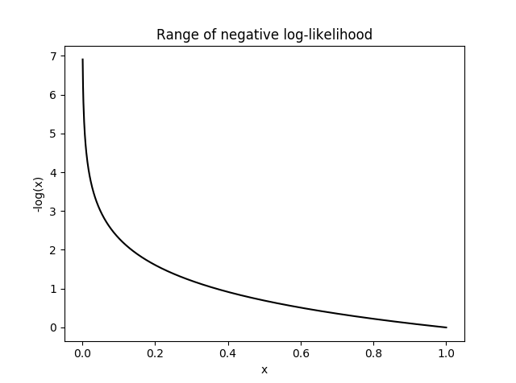

## Table of Contents

## What is a log loss score?

Log loss, or logarithmic loss, is a way to measure how well a model predicts outcomes, especially in classification problems. It looks at the difference between the predicted probabilities and the actual results. The smaller the log loss score, the better the model is at predicting the right outcomes. If a model gives a high probability to the correct class, the log loss will be low. But if the model is unsure or predicts the wrong class with high probability, the log loss will be high.

Log loss is often used in machine learning because it penalizes confident and wrong predictions more than it rewards confident and correct ones. This encourages models to be more accurate and less overconfident. For example, if a model predicts a 90% chance of rain and it doesn't rain, the log loss will be much higher than if it had predicted a 50% chance. This makes log loss a useful tool for improving and evaluating models in fields like weather forecasting, medical diagnosis, and fraud detection.

## Why is log loss used in machine learning?

Log loss is used in [machine learning](/wiki/machine-learning) because it helps measure how good a model is at predicting things. It looks at the difference between what the model thinks will happen and what actually happens. If a model is good at guessing right, the log loss score will be low. But if the model often guesses wrong, especially when it's very sure about its wrong guesses, the log loss score will be high. This makes log loss a good way to see if a model is working well or needs to be better.

Using log loss is helpful because it makes models try harder to be accurate. It's tougher on the model when it's wrong and confident than when it's right and confident. This means the model learns to be more careful and less overconfident. For example, if a model predicts a 90% chance of something happening and it doesn't, the log loss will be much higher than if it had predicted a 50% chance. This encourages models to be more precise, which is important in areas like predicting the weather, diagnosing diseases, or detecting fraud.

## How is log loss calculated?

Log loss, or logarithmic loss, is a way to see how good a model is at guessing things. It's calculated by looking at the difference between what the model thinks will happen and what really happens. For each guess the model makes, you take the logarithm of the probability it gave to the thing that actually happened. If the model guessed right, the log loss for that guess will be low. But if the model guessed wrong, especially if it was very sure about its wrong guess, the log loss will be high.

To find the total log loss for a bunch of guesses, you add up the log loss for each guess and then find the average. The formula is pretty simple: for each guess, you multiply the logarithm of the probability the model gave to the right answer by -1. Then, you add up all these numbers and divide by the total number of guesses. A lower log loss score means the model is doing a better job at guessing right.

## What does a negative log loss score mean?

A negative log loss score doesn't make sense because log loss is always a positive number or zero. The way we calculate log loss involves taking the logarithm of probabilities, and the logarithm of a number between 0 and 1 (which is what probabilities are) is always negative. But we multiply that negative number by -1, so the result is always positive or zero.

If you see a negative log loss score, it's probably a mistake in how the calculation was done. Log loss is used to see how good a model is at predicting things, and a lower score means the model is doing better. But the score can never be negative, so if you see a negative number, you should check your math again.

## Can log loss scores be negative, and if so, under what conditions?

Log loss scores cannot be negative. They are always positive numbers or zero. This is because log loss is calculated by taking the logarithm of probabilities, which are numbers between 0 and 1. The logarithm of a number between 0 and 1 is always negative, but in log loss, we multiply this negative number by -1, which makes the result positive or zero.

If you see a negative log loss score, it means there's a mistake in the calculation. Log loss is used to measure how well a model predicts things, and a lower score means the model is doing better. But since log loss can't be negative, seeing a negative number means you need to check your math again to find the error.

## How does a negative log loss score affect model evaluation?

A negative log loss score means there's a mistake in how you figured out the score. Log loss is always a positive number or zero, so if you see a negative number, it's a sign that something went wrong in your math. This can happen if you mixed up the steps or used the wrong numbers when calculating the log loss.

When you're trying to see how good your model is at guessing things, a negative log loss score can mess up your evaluation. It can make you think your model is doing worse than it really is, or even better if you're comparing it to other models. So, it's important to double-check your calculations to make sure your log loss score is right, so you can trust your model's performance.

## What are the implications of achieving a negative log loss score in practice?

If you get a negative log loss score, it means there's a mistake in your calculations. Log loss is always a positive number or zero, so a negative score shows that something went wrong. You might have mixed up the steps or used the wrong numbers when figuring out the log loss.

In practice, a negative log loss score can mess up how you see your model's performance. It might make you think your model is doing worse than it really is, or even better if you're comparing it to other models. So, it's important to check your calculations again to make sure your log loss score is right, so you can trust how well your model is working.

## How do negative log loss scores compare to positive log loss scores in terms of model performance?

A negative log loss score doesn't mean your model is doing better or worse than a positive log loss score. Log loss is always a positive number or zero, so if you see a negative number, it's a sign that you made a mistake in your calculations. You might have mixed up the steps or used the wrong numbers when figuring out the log loss. 

In terms of model performance, a negative log loss score can confuse you. It might make you think your model is doing worse than it really is, or even better if you're comparing it to other models. So, it's important to check your calculations again to make sure your log loss score is right, so you can trust how well your model is working.

## What are common scenarios where a model might produce a negative log loss score?

A model might produce a negative log loss score if there's a mistake in how the score is calculated. This can happen if someone mixes up the steps or uses the wrong numbers. For example, if you forget to multiply the logarithm of the probability by -1, you'll end up with a negative number because the logarithm of a probability (which is always between 0 and 1) is negative.

Another common scenario is when there's an error in the software or code used to calculate the log loss. If the code has a bug or if someone changes the formula without realizing it, the result can be a negative log loss score. It's important to double-check the calculations and the code to make sure the log loss score is correct, so you can trust how well your model is performing.

## How can one interpret a negative log loss score in the context of probabilistic predictions?

A negative log loss score doesn't mean your model is doing better or worse in terms of probabilistic predictions. Log loss is always a positive number or zero, so if you see a negative number, it's a sign that you made a mistake in your calculations. You might have mixed up the steps or used the wrong numbers when figuring out the log loss.

In the context of probabilistic predictions, a negative log loss score can confuse you. It might make you think your model is doing worse than it really is, or even better if you're comparing it to other models. So, it's important to check your calculations again to make sure your log loss score is right, so you can trust how well your model is working.

## What are the mathematical properties of negative log loss scores?

Log loss scores can never be negative because of how they are calculated. Log loss is a way to see how good a model is at predicting things. It involves taking the logarithm of probabilities, which are numbers between 0 and 1. The logarithm of a number between 0 and 1 is always negative. But in the log loss formula, we multiply this negative number by -1, which makes the result always positive or zero. So, if you see a negative log loss score, it means there's a mistake in your math.

A negative log loss score doesn't tell you anything about how well your model is doing. It just shows that something went wrong when you were figuring out the score. You might have mixed up the steps or used the wrong numbers. This can make you think your model is doing worse than it really is, or even better if you're comparing it to other models. So, it's important to check your calculations again to make sure your log loss score is right, so you can trust how well your model is working.

## How should one handle or adjust models that consistently produce negative log loss scores?

If your model keeps giving you negative log loss scores, it means there's a problem with how you're calculating the scores. Log loss is always supposed to be a positive number or zero. So, if you keep seeing negative numbers, you need to go back and check your math. Make sure you're following the right steps and using the correct numbers. A common mistake is forgetting to multiply the logarithm of the probability by -1, which can lead to negative scores.

Once you fix the calculation mistake, you can trust the log loss scores again. If your model still isn't doing well, you might need to look at other parts of your model. Maybe you need more data, or maybe you need to change how your model is set up. The important thing is to make sure your log loss scores are right so you can see how well your model is really doing.

## What is Understanding Log Loss?

Log Loss, also known as Cross-Entropy Loss, is a crucial metric for evaluating the performance of classification models where the prediction output is a probability value ranging between 0 and 1. This metric essentially quantifies the accuracy of a model by assessing how closely the predicted probabilities align with the actual outcomes. 

The fundamental characteristic of Log Loss is its ability to heavily penalize predictions that are both confident and incorrect. Confidence, in this sense, refers to the model assigning a probability close to 1 or 0 to a certain class, but the actual class being different. This substantial penalty ensures that a model does not make overly confident predictions in the wrong direction, thereby encouraging balanced probability estimations that reflect the model's uncertainty effectively.

Mathematically, Log Loss is computed using the formula:

$$

\text{Log Loss} = -\frac{1}{n} \sum_{i=1}^{n} [y_i \log(p_i) + (1-y_i) \log(1-p_i)]
$$

Here, $n$ is the number of examples, $y_i$ represents the true label (either 0 or 1), and $p_i$ denotes the predicted probability of the instance belonging to the class labelled as '1'. The term $y_i \log(p_i)$ calculates the penalty for the positive class, and $(1-y_i) \log(1-p_i)$ for the negative class, ensuring that both true positive and true negative predictions are accounted for.

A lower Log Loss value signifies that the model's predicted probabilities are close to the actual outcomes, indicating better model performance. This is why Log Loss is particularly valuable in scenarios where not just the classification but the certainty of those predictions is important, such as in financial models used for [algorithmic trading](/wiki/algorithmic-trading). By providing a gradient of model performance based on prediction probabilities, Log Loss facilitates the development and refinement of models to enhance their predictive power and reliability.

## References & Further Reading

[1]: Bergstra, J., Bardenet, R., Bengio, Y., & Kégl, B. (2011). ["Algorithms for Hyper-Parameter Optimization."](https://papers.nips.cc/paper/4443-algorithms-for-hyper-parameter-optimization) Advances in Neural Information Processing Systems 24.

[2]: ["Advances in Financial Machine Learning"](https://www.amazon.com/Advances-Financial-Machine-Learning-Marcos/dp/1119482089) by Marcos Lopez de Prado

[3]: ["Evidence-Based Technical Analysis: Applying the Scientific Method and Statistical Inference to Trading Signals"](https://www.amazon.com/Evidence-Based-Technical-Analysis-Scientific-Statistical/dp/0470008741) by David Aronson

[4]: ["Machine Learning for Algorithmic Trading"](https://github.com/PacktPublishing/Machine-Learning-for-Algorithmic-Trading-Second-Edition) by Stefan Jansen

[5]: ["Quantitative Trading: How to Build Your Own Algorithmic Trading Business"](https://books.google.com/books/about/Quantitative_Trading.html?id=j70yEAAAQBAJ) by Ernest P. Chan