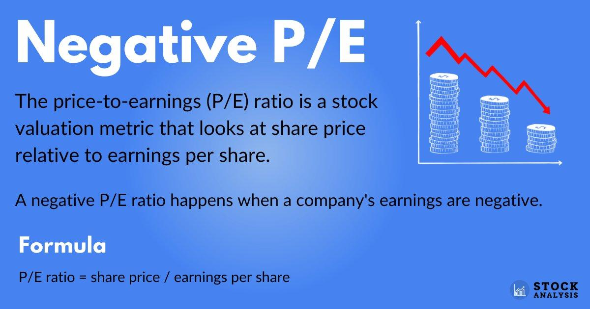

## Table of Contents

## What is a Price-to-Earnings (P/E) ratio?

The Price-to-Earnings (P/E) ratio is a way to figure out how much investors are willing to pay for a company's earnings. It's calculated by taking the current stock price and dividing it by the earnings per share (EPS). For example, if a company's stock is trading at $50 and its EPS is $5, the P/E ratio would be 10. This means investors are willing to pay $10 for every $1 of the company's earnings.

P/E ratios can help compare different companies or see if a stock is a good buy. A high P/E ratio might mean that investors expect the company to grow a lot in the future. On the other hand, a low P/E ratio could mean the company is not expected to grow much or might be undervalued. However, it's important to look at other factors too, because P/E ratios alone don't tell the whole story about a company's value.

## How is the P/E ratio calculated?

The P/E ratio is calculated by dividing a company's stock price by its earnings per share (EPS). The stock price is how much one share of the company costs in the market. Earnings per share is the company's total earnings divided by the number of shares. For example, if a company's stock is $50 and its EPS is $5, you divide $50 by $5 to get a P/E ratio of 10.

This ratio tells you how much investors are willing to pay for each dollar of the company's earnings. A P/E ratio of 10 means investors are willing to pay $10 for every $1 of earnings. It's a simple way to see if a stock might be a good buy or to compare different companies. But remember, it's just one piece of the puzzle and other factors should be considered too.

## What does a negative P/E ratio indicate about a company?

A negative P/E ratio means a company is losing money. Instead of making a profit, the company's earnings per share (EPS) is less than zero. When you divide the stock price by a negative EPS, you get a negative P/E ratio. This tells investors that the company isn't [earning](/wiki/earning-announcement) any money right now.

It's important to understand why a company has a negative P/E ratio. It could be going through a tough time, like a new business that hasn't started making profits yet, or an older company facing challenges. Investors should look at other information too, like the company's plans for the future and how it's doing compared to other companies in the same industry. A negative P/E ratio isn't always bad, but it's a sign to be careful and do more research.

## Can you explain why a stock might have a negative P/E ratio?

A stock might have a negative P/E ratio because the company is losing money. This happens when a company's earnings per share (EPS) is less than zero. When you divide the stock price by a negative number, you get a negative P/E ratio. This shows that the company isn't making any profit at the moment. It's like if you run a lemonade stand and you spend more on lemons and sugar than what you make from selling lemonade, you're losing money.

There can be many reasons why a company has a negative P/E ratio. It could be a new company that hasn't started making profits yet. For example, a tech startup might be spending a lot on research and development before it can sell its product. Or, it could be an older company facing tough times, maybe because people aren't buying its products anymore. Investors need to look at other things too, like the company's plans for the future and how it's doing compared to other companies in the same business. A negative P/E ratio isn't always a bad sign, but it's a warning to be careful and do more research.

## What are the implications of investing in a stock with a negative P/E ratio?

Investing in a stock with a negative P/E ratio means you're buying into a company that's currently losing money. This can be risky because the company isn't making any profit right now. It's like betting on a sports team that's losing a lot of games. You hope they'll turn things around, but there's no guarantee they will. So, you need to think carefully about whether the company has a good plan to start making money again.

On the other hand, a negative P/E ratio can also be a chance to buy a stock at a lower price if you believe the company will recover. Sometimes, companies go through tough times but have strong plans to improve. For example, a company might be investing a lot in new technology or trying to enter new markets. If you think these efforts will pay off, buying the stock when it's down could lead to big gains later. But it's important to do a lot of research and not just focus on the P/E ratio alone.

## How common are negative P/E ratios in the stock market?

Negative P/E ratios are not very common in the stock market. Most companies that are listed on big stock exchanges are making money, so they have positive P/E ratios. But sometimes, you might see a negative P/E ratio, especially with newer companies or companies that are going through a tough time.

When a company has a negative P/E ratio, it means they are losing money right now. This can happen if a company is spending a lot of money to grow or if they are facing problems that make it hard to make a profit. Even though negative P/E ratios are not common, they can be important to watch because they might show a chance to buy a stock at a low price if you think the company will get better in the future.

## What industries are more likely to have stocks with negative P/E ratios?

Industries that are more likely to have stocks with negative P/E ratios are often those that are new or growing quickly. For example, technology startups and biotech companies often spend a lot of money on research and development before they start making profits. This means they might have negative earnings and, as a result, negative P/E ratios. These companies are trying to create new products or services, and it can take time before they start making money.

Another group of industries that might have negative P/E ratios are those that are going through tough times. This could include companies in the energy sector when oil prices are low, or retail companies when people are not buying as much. These companies might be losing money because of problems in their industry, even if they were profitable before. So, when looking at stocks with negative P/E ratios, it's good to think about whether the company is in a growing industry or one that's struggling.

## How should investors interpret a negative P/E ratio in the context of market conditions?

When investors see a stock with a negative P/E ratio, it's important to think about what's happening in the market. A negative P/E ratio means the company is losing money right now. If the whole market is doing badly, like during a recession, more companies might have negative P/E ratios because everyone is struggling. But if the market is doing well, a negative P/E ratio might mean the company is having its own problems, even if other companies are making money.

In a growing market, a negative P/E ratio could be a sign that a company is investing a lot to get bigger. For example, a tech startup might be spending money to create new products, hoping to make profits later. If investors believe the company will succeed, they might see the negative P/E ratio as a chance to buy the stock at a low price. But if the market is shaky, a negative P/E ratio could be a warning sign to be careful, because the company might not recover if things get worse.

## What are the potential risks associated with stocks that have negative P/E ratios?

Investing in stocks with negative P/E ratios can be risky because the company is losing money right now. It's like betting on a sports team that's losing a lot of games. You hope they'll turn things around, but there's no guarantee they will. If the company keeps losing money, the stock price could go down even more, and you might lose the money you invested. Also, if the whole market is doing badly, like during a recession, it can be even harder for the company to start making money again.

On the other hand, sometimes a negative P/E ratio can be a sign that a company is spending a lot of money to grow. For example, a tech startup might be investing in new technology or trying to enter new markets. If you believe these efforts will pay off, buying the stock when it's down could lead to big gains later. But it's a risky bet because if the company's plans don't work out, you could lose money. So, it's important to do a lot of research and not just focus on the P/E ratio alone.

## Can a negative P/E ratio be a sign of future growth or recovery for a company?

A negative P/E ratio can sometimes be a sign that a company is getting ready for future growth or recovery. It might mean the company is spending a lot of money right now to build something new or to enter new markets. For example, a tech startup could be investing in new technology or a biotech company might be spending on research and development. If these efforts pay off, the company could start making profits in the future, and the stock price could go up a lot. So, if you believe in the company's plans, a negative P/E ratio could be a chance to buy the stock at a low price and make a big gain later.

But a negative P/E ratio can also be a warning sign. It means the company is losing money right now, and if the company keeps losing money, the stock price could go down even more. If the whole market is doing badly, like during a recession, it can be even harder for the company to start making money again. So, while a negative P/E ratio might be a sign of future growth, it's also risky. It's important to do a lot of research and think carefully before investing in a company with a negative P/E ratio.

## How do analysts use negative P/E ratios in their valuation models?

Analysts use negative P/E ratios to understand that a company is currently losing money. When they see a negative P/E ratio, they know the company's earnings per share (EPS) is less than zero. This tells them the company is spending more than it's making right now. Analysts will then look deeper into why the company is losing money. They might check if the company is spending a lot to grow, like a new tech company investing in research and development, or if it's facing problems that make it hard to make a profit.

In their valuation models, analysts don't just stop at the negative P/E ratio. They use it as a starting point to ask more questions. They look at the company's plans for the future, its industry, and how it's doing compared to other companies. If they believe the company can start making money again, they might see the negative P/E ratio as a sign to buy the stock at a low price. But if they think the company will keep losing money, they might see it as a warning to stay away. So, a negative P/E ratio helps analysts decide if a stock could be a good investment or a risky one.

## What alternative financial metrics should investors consider when a stock has a negative P/E ratio?

When a stock has a negative P/E ratio, it means the company is losing money right now. Instead of just looking at the P/E ratio, investors should look at other financial metrics to get a better picture of the company. One important metric is the price-to-sales (P/S) ratio, which compares the stock price to the company's revenue. This can be helpful because even if a company isn't making a profit, it might still be making sales. Another metric to consider is the price-to-book (P/B) ratio, which compares the stock price to the company's net assets. This can show if the stock is cheap compared to what the company owns.

Investors should also look at the company's debt levels. High debt can be risky, especially if the company is losing money. The debt-to-equity ratio can help show how much debt the company has compared to its equity. Additionally, cash flow is important. Even if a company has negative earnings, it might still have enough cash to keep running and investing in growth. The free cash flow metric shows how much cash the company has left after spending on operations and capital expenditures. By looking at these other metrics, investors can make a better decision about whether a stock with a negative P/E ratio is a good investment or too risky.

## What is the Price-to-Earnings (P/E) Ratio and how do we understand it?

The Price-to-Earnings (P/E) ratio is an essential tool for evaluating a stock's value in the market. This ratio is a reflection of the relationship between a company's share price and its earnings per share (EPS). It is mathematically represented as:

$$
\text{P/E Ratio} = \frac{\text{Market Price per Share}}{\text{Earnings per Share (EPS)}}
$$

This ratio empowers investors with the ability to assess how much they are willing to pay for each dollar of a company's earnings. Essentially, the P/E ratio can serve as a quick gauge of a company's financial health, and potential growth, or to signify potential issues.

A high P/E ratio could indicate that investors expect future growth and are therefore willing to pay a premium for the stock. This might be because investors believe that the company's earnings will increase, justifying the higher P/E ratio. For example, tech companies often have high P/E ratios as they are considered to have significant growth potential due to innovation and market expansion opportunities.

Conversely, a low P/E ratio may suggest that the stock is undervalued. However, it could also signal potential financial trouble, such as declining earnings or a loss of competitive advantage. A low P/E might attract investors looking for a bargain, but it also flags the need for careful analysis to understand the underlying reasons for the stock's valuation.

Overall, the P/E ratio is a versatile metric, providing insights into both market sentiment and fundamental valuation of stocks. It is an integral part of deciding whether a stock represents a reasonable investment at its current price level.

## References & Further Reading

[1]: Bergstra, J., Bardenet, R., Bengio, Y., & Kégl, B. (2011). ["Algorithms for Hyper-Parameter Optimization."](https://proceedings.neurips.cc/paper/2011/file/86e8f7ab32cfd12577bc2619bc635690-Paper.pdf) Advances in Neural Information Processing Systems 24.

[2]: ["Advances in Financial Machine Learning"](https://www.amazon.com/Advances-Financial-Machine-Learning-Marcos/dp/1119482089) by Marcos Lopez de Prado

[3]: ["Evidence-Based Technical Analysis: Applying the Scientific Method and Statistical Inference to Trading Signals"](https://www.semanticscholar.org/paper/Evidence-Based-Technical-Analysis%3A-Applying-the-and-Aronson/3b33df8737f1772e9e14d66a08c9696f140a2ee1) by David Aronson

[4]: ["Machine Learning for Algorithmic Trading"](https://github.com/stefan-jansen/machine-learning-for-trading) by Stefan Jansen

[5]: ["Quantitative Trading: How to Build Your Own Algorithmic Trading Business"](https://www.amazon.com/Quantitative-Trading-Build-Algorithmic-Business/dp/1119800064) by Ernest P. Chan