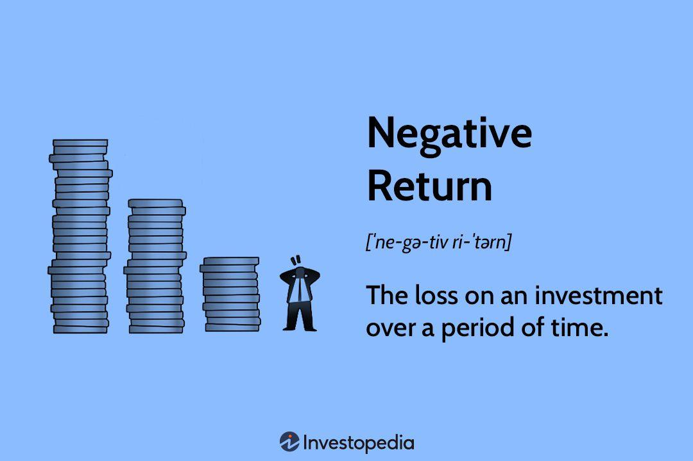

## Table of Contents

## What is a negative return in finance?

A negative return in finance means you lose money on an investment. When you invest in something like stocks, bonds, or real estate, you hope to earn more money than you put in. But sometimes, the value of your investment goes down instead of up. If you sell your investment for less than what you paid for it, you have a negative return.

For example, imagine you buy a stock for $100. If the stock's price drops to $80 and you sell it at that price, you have a negative return of $20. This is because you lost $20 from your original investment. Negative returns can happen for many reasons, like a company doing poorly or the overall market going down. It's important to understand that all investments carry some risk, and negative returns are a part of that risk.

## How is negative return calculated?

To calculate a negative return, you need to know how much you paid for the investment and how much you got when you sold it. If you sell the investment for less than what you paid, the difference between these two amounts is your negative return. For example, if you bought a stock for $100 and sold it for $80, your negative return would be $20. This is because you lost $20 from your original investment.

It's also common to express returns as a percentage. To find the percentage of your negative return, you subtract the selling price from the purchase price, divide that by the purchase price, and then multiply by 100. Using the same example, you would subtract $80 from $100 to get $20, then divide $20 by $100 to get 0.20, and finally multiply by 100 to get a 20% negative return. This percentage helps you understand the size of your loss relative to your initial investment.

## Can you provide a simple example of a negative return?

Imagine you bought a toy for $10 because you thought you could sell it later for more money. But when you tried to sell it, the best offer you got was $7. So, you sold the toy for $7. This means you lost $3 from your original $10. That $3 loss is your negative return.

In simple terms, a negative return happens when you end up with less money than you started with after selling something. If you paid $10 for the toy and only got $7 back, your negative return is the $3 difference. It shows that your investment didn't work out as you hoped.

## What are the common causes of negative returns?

Negative returns can happen for many reasons. One big reason is when the company you invested in does not do well. If a company makes less money or has problems, the price of its stock can go down. This means if you sell your stock, you might get less money than you paid for it. Another reason is when the whole market goes down. Sometimes, things like bad news or economic problems can make many stocks lose value at the same time. If you need to sell your investments during these times, you might face a negative return.

Another cause of negative returns is when interest rates change. If interest rates go up, borrowing money becomes more expensive, and this can slow down the economy. This can make stock prices fall. Also, if you invest in bonds and interest rates rise, the value of your bonds can drop because new bonds will offer higher interest. Lastly, sometimes people just expect too much from their investments. If you buy something hoping it will go up a lot but it doesn't, you might have to sell it for less than you paid, leading to a negative return.

## How do negative returns affect investment portfolios?

Negative returns can hurt your investment portfolio. When you have a negative return, it means you lose money on that part of your investments. If this happens to a big part of your portfolio, it can lower the total value of your investments. Imagine you have a basket of fruits, and some of the fruits start to go bad. The bad fruits can make the whole basket less valuable. That's what negative returns do to your investment portfolio. They can make it harder to reach your financial goals, like saving for a house or retirement, because you have less money to work with.

But negative returns aren't always bad news for your whole portfolio. If you have a mix of different kinds of investments, like stocks, bonds, and real estate, a negative return in one area might be balanced out by positive returns in others. This is called diversification. It's like having different fruits in your basket; if one type goes bad, the others can still be good. So, while negative returns can be tough, having a well-balanced portfolio can help protect you from big losses and keep you on track towards your financial goals.

## What strategies can investors use to mitigate the risk of negative returns?

Investors can use diversification to lower the risk of negative returns. This means spreading your money across different types of investments, like stocks, bonds, and real estate. If one investment goes down, the others might still do well and balance out the loss. Think of it like not putting all your eggs in one basket. By having a mix of investments, you can protect your portfolio from big drops in value because not all your money is tied to one thing.

Another strategy is to keep a long-term view. Investments can go up and down a lot in the short term, but over many years, they often grow. If you don't need your money right away, you can wait out the bad times and still come out ahead. This means not selling your investments just because their value drops for a while. Staying calm and sticking to your plan can help you avoid selling at a loss and give your investments time to recover.

Lastly, doing your homework and understanding your investments can help too. Knowing what you're putting your money into can help you make better choices and avoid risky investments that might lead to big losses. Regularly checking your portfolio and making small changes as needed can also keep your investments in line with your goals and help manage the risk of negative returns.

## How do negative returns impact different types of investments, such as stocks, bonds, and real estate?

Negative returns can affect stocks, bonds, and real estate in different ways. For stocks, a negative return happens when the stock price goes down and you sell it for less than you paid. This can happen if the company does poorly or if the whole stock market goes down. Stocks can be risky because their prices can change a lot, so negative returns are more common. But over time, stocks can still grow and make up for short-term losses if you hold onto them.

Bonds are usually seen as safer than stocks, but they can still have negative returns. If you buy a bond and then interest rates go up, the value of your bond can drop because new bonds will offer higher interest. If you need to sell your bond before it matures, you might get less money than you paid for it. But if you hold onto the bond until it matures, you'll get your money back plus interest, so negative returns are less likely if you can wait.

Real estate can also have negative returns if the property value goes down and you sell it for less than you paid. This can happen if the local housing market goes down or if something goes wrong with the property. Real estate can be a good long-term investment, but it can be hard to sell quickly if you need to, which can make negative returns more likely if you have to sell at a bad time. Like with stocks and bonds, holding onto real estate for a long time can help you avoid negative returns and even make a profit.

## What is the historical frequency of negative returns in major stock markets?

Negative returns in major stock markets happen sometimes, but how often they happen can change a lot depending on the time you look at. Over short times like a year or less, negative returns can happen pretty often. For example, in the U.S., the stock market has had negative returns in about one out of every three years since the 1920s. This means if you look at any random year, there's a good chance the market went down that year.

But if you look at longer times, like 10 years or more, negative returns are much less common. Over a 10-year period, the U.S. stock market has almost always made money. In fact, since the 1920s, there have only been a few times when the market lost money over a whole decade. So, while negative returns can happen a lot in the short term, they are much rarer if you look at longer periods of time.

## How do economic cycles influence the occurrence of negative returns?

Economic cycles can make negative returns more likely to happen. When the economy is doing well, people have more money to spend, and businesses make more profit. This can make stock prices go up, and negative returns are less common. But when the economy starts to slow down or go into a recession, people spend less money, and businesses make less profit. This can make stock prices go down, and negative returns become more common. So, the ups and downs of the economy can change how often you see negative returns in your investments.

During a recession, not just stocks but other investments like bonds and real estate can also see negative returns. If people are worried about the economy, they might sell their investments to have more cash, which can make prices drop even more. But when the economy starts to get better, and we enter a recovery phase, investments can start to do better again. Over time, as the economy goes through these cycles, the risk of negative returns can go up and down. Understanding where we are in the economic cycle can help investors prepare for times when negative returns might be more likely.

## What role do interest rates play in generating negative returns?

Interest rates can affect whether you get a negative return on your investments. When interest rates go up, borrowing money becomes more expensive. This can slow down the economy because businesses and people might not want to borrow as much. If the economy slows down, stock prices can go down too. So, if you need to sell your stocks during a time when interest rates are high, you might get less money than you paid for them, leading to a negative return.

Interest rates also affect bonds. When interest rates rise, new bonds start paying more interest than older ones. This makes the older bonds less valuable because people would rather buy the new bonds with higher interest. If you need to sell your older bonds before they mature, you might have to sell them for less than you paid, which gives you a negative return. But if you can hold onto your bonds until they mature, you'll get your money back plus the interest, so you won't have a negative return.

## How can advanced statistical models predict the likelihood of negative returns?

Advanced statistical models can help predict the chance of negative returns by looking at lots of data from the past. These models use things like how the stock market has moved before, what the economy was doing, and even what people are saying on social media. By studying all this information, the models can find patterns that might show when negative returns are more likely to happen. For example, if the model sees that the stock market usually goes down when interest rates go up, it can warn investors that negative returns might be coming if interest rates start to rise.

These models also use math to figure out how likely negative returns are. They can look at how much stocks or other investments have gone up and down in the past and use that to guess what might happen next. This helps investors understand the risk of losing money. But even with all this math and data, these models can't predict the future perfectly. They give us a better idea of what might happen, but there's always a chance that things will turn out differently. So, while these models are helpful, investors should still be careful and not rely on them completely.

## What are the long-term implications of frequent negative returns on an investor's wealth accumulation?

Frequent negative returns can make it harder for an investor to build wealth over time. When you keep losing money on your investments, it can slow down how fast your money grows. Imagine you're trying to fill a bucket with water, but there are lots of holes in it. Every time you pour water in, some of it leaks out. That's what frequent negative returns do to your wealth. They can make it take longer to reach your financial goals, like saving for a house or retirement, because you have to keep starting over after each loss.

But even with frequent negative returns, it's still possible to grow your wealth if you stick with it for a long time. If you keep investing and don't give up, the good years can help make up for the bad ones. It's important to have a mix of different investments and not to panic and sell everything when the market goes down. Over many years, the market usually goes up, so if you can wait out the bad times, you might still end up with more money in the end.

## References & Further Reading

Damodaran, A. (2011). *Applied Corporate Finance*. John Wiley & Sons. This reference provides a comprehensive overview of corporate finance principles, including crucial insights into managing financial performance and understanding the nuances of return on investment (ROI) in various financial contexts. It is a valuable resource for financial analysts and those interested in applying corporate finance theories to real-world scenarios.

Investopedia: Return on Equity (ROE) - Understanding its implications in investment scenarios. This online resource offers an essential explanation of Return on Equity, a critical metric in evaluating financial performance. It discusses how ROE is an indicator of a company’s profitability and efficiency in using equity to generate profits, making it a vital tool in assessing investment potential and managing negative returns.

Fama, E.F., & French, K.R. (1993). "Common Risk Factors in the Returns on Stocks and Bonds". This seminal paper is a cornerstone in understanding the factors affecting stock and bond returns. By identifying common risk factors, it aids investors in comprehending the underlying risks that contribute to negative returns and assists in developing strategies to optimize their portfolios.

Additional literature on [algorithmic trading](/wiki/algorithmic-trading) and negative return strategies. Continuing advancements in algorithmic trading necessitate staying informed about the latest strategies and technologies. This literature covers state-of-the-art approaches to mitigate negative returns, focusing on algorithmic models that incorporate real-time data analysis, advanced hedging techniques, and market-neutral strategies. These resources are essential for those engaged in developing and refining trading algorithms to effectively manage investment risks and enhance financial performance.

