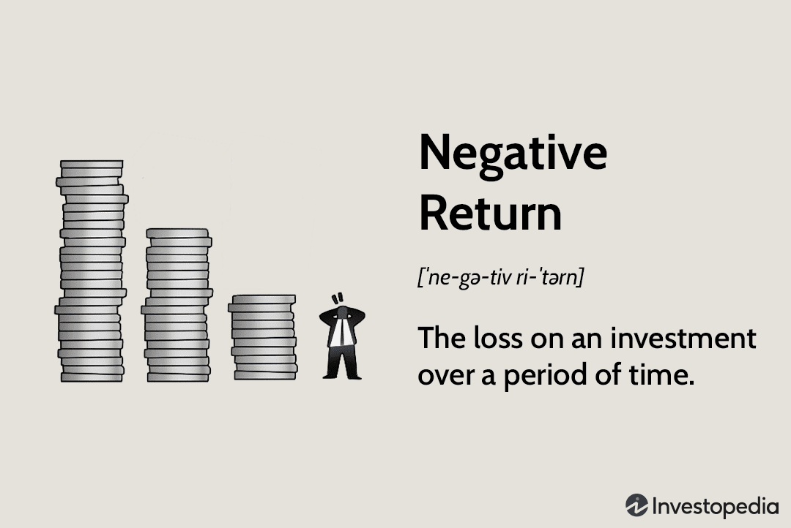

In today's dynamic financial landscape, understanding the intricacies of negative returns and their impact on financial performance is crucial for investors and financial professionals. Negative returns, which occur when the value of investments declines over a specific period, can significantly affect an individual's or a company's financial standing, influencing everything from operational decisions to market perception. A thorough grasp of these concepts is essential to devise effective strategies for managing financial risk and optimizing investment outcomes.

Algorithmic trading, a pivotal development in modern finance, leverages advanced technology and complex algorithms to execute trades with speed and precision. This approach to trading presents both opportunities and challenges when it comes to managing investment risks, particularly in environments with unpredictable market conditions. The ability of algorithmic systems to process vast amounts of data in real-time enables traders to make informed decisions swiftly, potentially mitigating negative returns. However, the reliance on automated systems also introduces risks that require careful consideration and management.



This article explores the concept of negative return on investment, elucidating its implications for financial performance. Additionally, it examines the crucial role algorithmic trading plays in navigating the challenges posed by negative financial outcomes. By integrating technology and strategic risk management, investors and traders can better position themselves to weather market uncertainties and achieve long-term success in the financial marketplace.

## Table of Contents

## Understanding Negative Return on Investment

A negative return on investment (ROI) manifests when the value of an investment falls below its initial cost over a specified period, resulting in a financial loss for the investor. This concept is pivotal in financial management as it directly impacts investment viability and the overall financial health of individual and institutional investors. There are several causes behind negative returns, each with distinct implications.

Market volatility is one of the most significant contributors to negative returns. Financial markets are inherently volatile due to a wide range of factors, including economic events, geopolitical uncertainties, and changes in investor sentiment. This volatility can lead to sharp declines in asset prices, thereby eroding the value of investments. For instance, unexpected interest rate hikes by central banks often result in abrupt market corrections, affecting equity and bond valuations.

Poor investment choices also contribute to negative ROI. These include purchasing overvalued stocks, investing in underperforming industries, or lack of diversification in an investment portfolio. An investor might, for example, concentrate all their assets in a single sector, such as technology. If this sector experiences a downturn, the lack of diversification can exacerbate losses, leading to a more pronounced negative return.

External economic factors such as inflation, recession, and changes in fiscal policy can profoundly impact investment outcomes. Inflation erodes the purchasing power of returns, sometimes resulting in nominal gains turning negative in real terms. During a recession, business profits and consumer spending typically decline, causing stock prices to fall and bond yields to drop, again leading to negative returns.

It's essential to discern between temporary setbacks and more serious financial indicators in an investment portfolio. Temporary setbacks might include short-term market fluctuations, which are part of regular market cycles. Investors often weather these with a long-term investment strategy, as markets historically recover over time.

In contrast, more serious indicators of financial distress could be prolonged underperformance of an asset or a sector, which might indicate structural issues or shifts in market dynamics. For example, if a company consistently fails to meet earnings forecasts over several quarters, it may suggest deeper operational inefficiencies or shifting consumer preferences that could warrant reevaluation of its investment potential.

Analyzing these factors requires a structured approach to investment that considers both qualitative and quantitative data. Investors may use statistical models to predict potential returns and risks. Consider the following simple Python code snippet that calculates the ROI and determines whether it is negative. 

```python
def calculate_roi(initial_investment, final_value):
    roi = (final_value - initial_investment) / initial_investment
    print(f"ROI: {roi:.2%}")
    if roi < 0:
        print("Negative ROI observed.")
    else:
        print("Positive ROI observed.")

# Example Usage
initial_investment = 1000
final_value = 900
calculate_roi(initial_investment, final_value)
```

Investors and analysts must continuously monitor these variables to distinguish between normal market [volatility](/wiki/volatility-trading-strategies) and underlying issues requiring strategic shift or portfolio reallocation. This approach is necessary to minimize losses and optimize long-term investment returns.

## Impact on Financial Performance

Negative returns can significantly impact a company's financial performance, often cascading into broader aspects of its economic stability. When a company experiences consistent negative returns, this can erode shareholder confidence. Shareholders, who are essentially the company's investors, look to these returns as indicators of the company's profitability and future growth prospects. Shrinking confidence can result in decreased stock prices as investors sell off their shares, fearing further financial decline. This downturn in shareholder sentiment can also complicate efforts to raise new capital. Investors may be reluctant to inject more funds into what is perceived as a sinking ship, leading to [liquidity](/wiki/liquidity-risk-premium) issues.

It's essential to understand the potential consequences of continuous negative returns. Over time, they can compound, putting a company at risk of insolvency. In severe cases, prolonged negative financial performance can escalate to bankruptcy if the company is unable to meet its financial obligations. This is often seen in companies with high debt levels, where interest payments become unsustainable in the absence of positive cash flows.

Businesses have developed strategies to counteract the adverse effects of negative returns. One approach is cost management, where companies streamline operations and reduce unnecessary expenditure to improve their financial statements. Another strategy is portfolio diversification, where investments are spread across different areas to balance the risk associated with any single asset or market. Additionally, firms may employ financial hedging techniques to protect against significant adverse price movements. These techniques can involve derivatives such as options and futures to lock in prices and mitigate potential losses.

Moreover, businesses often engage in proactive stakeholder communication to manage expectations and maintain some degree of confidence among investors and the public. Transparent and consistent communication can help mitigate panic and foster a more controlled response compared to what might occur with silence or misinformation.

Ultimately, while negative returns present challenges, strategic management and proactive measures can alleviate some of the adverse impacts, allowing companies a better chance at recovering and stabilizing their financial performance.

## Negative Returns in Algorithmic Trading

Algorithmic trading systems have significantly transformed financial markets by facilitating rapid and efficient trading operations. These systems utilize advanced algorithms to process vast amounts of data, execute trades at high speed, and, crucially, manage negative returns through strategic decision-making.

One primary advantage of [algorithmic trading](/wiki/algorithmic-trading) in managing negative returns is its capability to analyze real-time data efficiently. Traders can harness these capabilities to identify market trends, forecast potential downturns, and execute trades designed to minimize losses or reverse a negative trend. Through sophisticated algorithms, they can implement strategies like short selling or automated stop-loss orders that react instantaneously to adverse market movements, thus curbing potential losses.

Return on Equity (ROE) is a vital metric within algorithmic trading strategies, used to assess a company's profitability relative to shareholder equity. By integrating ROE into trading algorithms, traders can filter out investments with lower profitability, focusing instead on opportunities that promise higher returns. For instance, a simplified algorithmic approach could involve the following Python logic to screen for investments with high ROE:

```python
def filter_high_roe_investments(investments, threshold):
    return [investment for investment in investments if investment.roe > threshold]

# Example usage
investments = [{'name': 'Company A', 'roe': 15}, {'name': 'Company B', 'roe': 8}]
high_roe_investments = filter_high_roe_investments(investments, 10)
print(high_roe_investments)  # Output: [{'name': 'Company A', 'roe': 15}]
```

This code snippet highlights a fundamental method by which algorithmic trading systems can prioritize profitable investments, potentially reversing negative returns by focusing capital on higher-performing assets. 

Additionally, algorithmic systems use complex predictive models such as regression analysis, [machine learning](/wiki/machine-learning), and [artificial intelligence](/wiki/ai-artificial-intelligence) to forecast market behaviors and optimize trading decisions. For example, a regression model may predict future stock prices based on historical data, while machine learning algorithms can adapt to changing market conditions, refining strategies to maintain or improve returns.

In summary, algorithmic trading offers significant tools to manage negative returns by leveraging real-time data analysis and sophisticated trading strategies that can rapidly adapt to changing market conditions. By incorporating financial metrics like ROE and using advanced predictive analytics, traders can enhance their ability to mitigate losses and capitalize on profitable trading opportunities.

## Challenges and Limitations of Algorithmic Trading

Algorithmic trading, known for its capability to enhance trading efficiency and speed, also presents distinct challenges and limitations, particularly in volatile markets characterized by unpredictable price shifts. One prominent challenge is the risk of over-reliance on algorithms that may lead to systemic failures. These failures can occur when trading strategies are overly dependent on historical data, resulting in an issue known as overfitting. Overfitting arises when a model is excessively tailored to past data, capturing noise instead of underlying patterns, thus performing poorly with new and unseen data. This can lead to substantial financial losses when the market does not behave as predicted.

Moreover, algorithmic trading systems may inadvertently contribute to increased market volatility. Rapid execution speeds and high-frequency trades could exacerbate price fluctuations, as seen in events like the Flash Crash of 2010. Such incidents underscore the potential systemic risks associated with algorithmic trading, where malfunctioning algorithms or erroneous trades can lead to extensive disruptions in financial markets.

Ethical considerations also play a critical role in the landscape of algorithmic trading. The opacity of some algorithmic models raises questions about fairness and transparency. For instance, predatory trading practices that exploit small market inefficiencies at the expense of long-term investors can lead to ethical dilemmas. These practices can diminish market integrity and undermine investor confidence.

Regulatory challenges further compound these issues. Algorithmic trading systems are sometimes subject to insufficient regulatory oversight, partly due to the rapid pace of technological advancement outstripping legislative processes. Regulatory bodies are tasked with ensuring market stability and protecting investor interests, yet crafting effective regulations that keep pace with technological innovation remains a continuous challenge.

The implementation of algorithmic trading demands robust risk management frameworks to mitigate these challenges. This includes developing algorithms with adaptive capabilities, capable of adjusting to changing market conditions to avoid overfitting. Additionally, thorough testing using synthetic data and stress testing under varied market scenarios can help in identifying potential weaknesses in trading algorithms.

In conclusion, while algorithmic trading provides substantial benefits, recognizing and addressing its challenges is crucial for maintaining market stability and integrity. Balancing technological advancements with ethical practices and regulatory measures is essential to harness the full potential of algorithmic trading while safeguarding against its inherent risks.

## Mitigating Negative Returns with Algorithmic Strategies

To mitigate negative returns using algorithmic strategies, traders integrate advanced analytical models and real-time data processing into their decision-making frameworks. These efforts involve employing various strategies such as hedging, diversification, and market-neutral approaches aimed at protecting investments from adverse market conditions. 

Hedging, for instance, is a risk management strategy used to offset potential losses in one investment by taking a position in another. Traders often utilize algorithmic trading systems to implement hedging techniques with precision. For example, they might use options or futures contracts, which algorithms can dynamically adjust based on market conditions to protect against downside risks.

Another effective method is diversification. By spreading investments across a range of assets, traders can reduce the impact of a poor-performing asset on the overall portfolio. Algorithmic strategies facilitate diversification by quickly assessing and rebalancing portfolio compositions based on real-time data. These algorithms help maintain an optimal allocation of assets that aligns with the risk tolerance and investment goals of the trader.

Additionally, market-neutral strategies aim to eliminate market risk by taking offsetting long and short positions. These strategies are designed to generate returns irrespective of market direction through algorithms that analyze [arbitrage](/wiki/arbitrage) opportunities and implement trades that capitalize on pricing inefficiencies. Python-based frameworks like `pandas` and `numpy` can be instrumental in processing historical data to derive statistical relationships that inform such trades.

A fundamental aspect of these algorithmic strategies is the continuous evaluation and adaptation of strategies to maintain optimal performance. Markets are inherently dynamic, and strategies need to evolve to stay effective. Algorithms must be regularly backtested against updated data sets to refine their decision rules and ensure robust performance. Here’s an example of Python code used for [backtesting](/wiki/backtesting) an algorithmic trading strategy:

```python
import pandas as pd
import numpy as np

# Sample historical data loading
data = pd.read_csv('historical_data.csv')
prices = data['Close']

# Simple moving average strategy
short_window = 40
long_window = 100

# Calculate short and long moving averages
signals = pd.DataFrame(index=data.index)
signals['signal'] = 0.0
signals['short_mavg'] = prices.rolling(window=short_window, min_periods=1, center=False).mean()
signals['long_mavg'] = prices.rolling(window=long_window, min_periods=1, center=False).mean()

# Generate buy/sell signals
signals['signal'][short_window:] = np.where(signals['short_mavg'][short_window:] 
                                            > signals['long_mavg'][short_window:], 1.0, 0.0)   

# Calculate daily returns from signals
signals['positions'] = signals['signal'].diff()
returns = prices.pct_change()
strategy_returns = returns * signals['positions'].shift()

# Performance evaluation
performance = (1 + strategy_returns).cumprod() - 1
print(f"Strategy Return: {performance[-1]:.2f}")
```

This script provides a basic framework for testing a moving average crossover strategy, illustrating the utility of algorithmic approaches in real-time market analysis and strategy refinement.

Overall, leveraging algorithmic strategies allows for proactive management of investment portfolios, enabling traders not only to mitigate negative returns but also to capitalize on market conditions efficiently and effectively. However, the success of these strategies hinges on continuous assessment and refinement to keep pace with evolving market dynamics.

## Conclusion

In the ever-evolving financial markets, managing negative returns remains a fundamental challenge for investors and traders. As investment strategies and technologies advance, the ability to effectively address these challenges is crucial for achieving long-term financial success. Algorithmic trading presents a significant opportunity in this context. By employing advanced algorithms that analyze vast amounts of financial data in real-time, traders can make informed decisions aimed at minimizing losses and optimizing returns. 

However, the effectiveness of algorithmic trading is contingent on addressing its inherent challenges. While algorithms can process data rapidly and respond to market changes within milliseconds, they can also lead to systemic risks if not properly managed. The complexity of financial markets requires that algorithms be continually updated and tested against a range of market conditions to avoid overfitting and ensure robustness. 

To truly harness the benefits of algorithmic trading, it is essential to integrate sophisticated risk management strategies that are adaptive to both foreseeable and unpredictable market scenarios. Techniques like diversification and hedging can be embedded into algorithms to distribute risk and protect against adverse price movements. Additionally, continuous monitoring and periodic evaluation of trading strategies are crucial to adapt and refine the approach over time. 

Ultimately, a well-rounded approach that combines cutting-edge technology with tried-and-tested financial principles is imperative. By balancing innovation with caution, traders and investors can better navigate the complexities of negative returns, paving the way for sustainable investment success.

## References & Further Reading

Damodaran, A. (2011). *Applied Corporate Finance*. John Wiley & Sons. This reference provides a comprehensive overview of corporate finance principles, including crucial insights into managing financial performance and understanding the nuances of return on investment (ROI) in various financial contexts. It is a valuable resource for financial analysts and those interested in applying corporate finance theories to real-world scenarios.

Investopedia: Return on Equity (ROE) - Understanding its implications in investment scenarios. This online resource offers an essential explanation of Return on Equity, a critical metric in evaluating financial performance. It discusses how ROE is an indicator of a company’s profitability and efficiency in using equity to generate profits, making it a vital tool in assessing investment potential and managing negative returns.

Fama, E.F., & French, K.R. (1993). "Common Risk Factors in the Returns on Stocks and Bonds". This seminal paper is a cornerstone in understanding the factors affecting stock and bond returns. By identifying common risk factors, it aids investors in comprehending the underlying risks that contribute to negative returns and assists in developing strategies to optimize their portfolios.

Additional literature on algorithmic trading and negative return strategies. Continuing advancements in algorithmic trading necessitate staying informed about the latest strategies and technologies. This literature covers state-of-the-art approaches to mitigate negative returns, focusing on algorithmic models that incorporate real-time data analysis, advanced hedging techniques, and market-neutral strategies. These resources are essential for those engaged in developing and refining trading algorithms to effectively manage investment risks and enhance financial performance.

