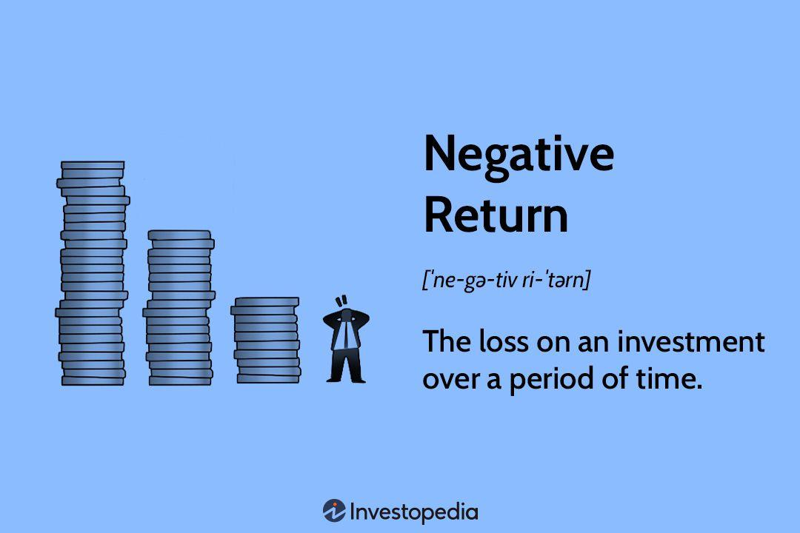

Return on Equity (ROE) is a fundamental metric used in financial analysis to evaluate a company's ability to generate profit from its shareholders' equity. It provides a snapshot of how effectively management is using a company’s assets to create earnings. Calculated as the net income divided by shareholders' equity, ROE is expressed as a percentage:

$$
\text{ROE} = \left( \frac{\text{Net Income}}{\text{Shareholders' Equity}} \right) \times 100
$$



While a positive ROE indicates that a company is efficiently generating earnings, a negative ROE points to potential financial issues. A negative value suggests that a company is losing money and consuming, rather than adding value to, its equity. This scenario might arise from operational losses, poor asset management, or excessive debt, signaling underlying financial challenges. 

The implications of negative ROE extend beyond mere profitability concerns. It can affect the market perception of a company’s financial health and influence its valuation, making it a critical consideration for investors. Analyzing this metric helps investors assess the risk associated with investing in a particular company and guides their decision-making process.

Moreover, the integration of ROE analysis into algorithmic trading systems presents advanced opportunities for optimizing investment strategies. By incorporating real-time ROE data, algorithmic models can enhance the accuracy of trading decisions, identify potential investment opportunities, and manage risk effectively. Technological advancements in data processing and analysis increase the feasibility of such integrations, underscoring the importance of understanding ROE for traders relying on automated systems.

For investors, analysts, and traders, grasping the intricacies of ROE, particularly when negative, is vital. It equips them with the insight needed to balance their portfolios better and strategize with foresight in an ever-complex financial landscape.

## Table of Contents

## Understanding Return on Equity (ROE)

Return on Equity (ROE) is an essential metric in financial analysis that measures a company's ability to generate profit from its shareholders' equity. It provides insights into how effectively a company is using its equity base to produce earnings and indicates management's efficiency in turning equity investments into profits. The formula to calculate ROE is:

$$
\text{ROE} = \frac{\text{Net Income}}{\text{Shareholders' Equity}}
$$

where:
- **Net Income** is the company's total earnings after taxes over a specific period, usually a fiscal year.
- **Shareholders' Equity** represents the residual interest in the assets of the company after deducting liabilities, essentially the net assets available to shareholders.

A positive ROE signifies that a company is successfully utilizing its equity to generate profits, reflecting efficient management and sustainability in operations. This is often seen as a positive indicator by investors, suggesting that the company has credible growth prospects and is effectively creating value from the shareholders' investments.

Conversely, a negative ROE raises concerns as it suggests that the company is incurring losses relative to the equity financing it has received. This could indicate various issues such as operational inefficiencies, poor asset management, or an unfavorable market environment affecting profitability.

Interpreting ROE can vary significantly across different industries, where certain sectors might inherently have higher or lower typical ROE values due to the nature of their operations. For example, industries that require substantial capital investments, such as utilities or telecommunications, often operate with lower ROE compared to tech companies, which might exhibit higher ROE due to their asset-light models and rapid growth potential.

In practical applications, ROE offers valuable information to investors, analysts, and other stakeholders seeking to understand a company's financial performance and strategic positioning. However, it is important to consider the industry context and compare ROE against peers and historical performance benchmarks rather than evaluating it in isolation.

## The Implications of Negative ROE

Negative Return on Equity (ROE) is a significant warning sign for investors, often indicating that a company is experiencing financial difficulties. ROE is calculated by dividing a company's net income by its shareholders' equity, reflecting how efficiently equity capital is being utilized to generate profit. When this metric turns negative, it generally means that the company is incurring losses, which could be attributed to a variety of underlying factors.

One primary cause of negative ROE is operational losses, where the company's core business activities do not generate sufficient revenue to cover its expenses. This situation often arises in industries facing economic downturns or companies that are unable to maintain competitive advantages. Another contributing [factor](/wiki/factor-investing) could be poor asset management, where resources are not efficiently allocated or utilized, leading to diminished returns. Excessive inventory, high production costs, or underperforming investments might exacerbate this issue, culminating in an overall negative return.

Additionally, an elevated debt level can lead to a negative ROE. Companies that leverage significant debt may face high-interest payments, eroding net income. A high debt-to-equity ratio can also exacerbate [volatility](/wiki/volatility-trading-strategies) in earnings, making the company more susceptible to market downturns and operational challenges. In such scenarios, even a slight drop in revenue can lead to a situation where interest obligations sharply reduce net income, turning ROE negative.

The implications of negative ROE on a company's financial health are wide-ranging. Beyond signaling potential operational inefficiencies, it can depress a company's valuation in a competitive market. Investors, wary of heightened financial risk, might demand higher returns, leading to increased cost of capital. In some cases, this can result in a downward spiral where the company struggles to attract fresh investment, further compounding financial instability.

For investment decisions, understanding the drivers of a negative ROE is crucial. Investors should assess whether the negative ROE is symptomatic of short-term issues or indicative of a deeper, structural problem. This assessment often involves a thorough analysis of the company's financial statements, market position, and industry conditions. Furthermore, valuation models such as the discounted cash flow analysis can be employed to adjust for projected improvements or continued struggles, providing a forward-looking perspective on the company's financial trajectory.

In summary, negative ROE serves as an important indicator of financial unrest within a company, warranting careful scrutiny from investors. Evaluating the root causes behind the negative figure aids in gauging the severity of the financial distress and informs strategic investment choices. As such, incorporating detailed financial analysis alongside traditional ROE assessments is essential for holistic investment decision-making.

## Case Studies: Analyzing Companies with Negative ROE

Analyzing companies with a sustained negative Return on Equity (ROE) offers valuable insights into the challenges faced by firms that struggle with profitability and the strategies they employ to navigate these difficulties. A negative ROE indicates that a company's financial performance is insufficient to generate returns on shareholders' equity. This section examines several case studies of companies with negative ROE, shedding light on potential pitfalls and recovery strategies, as well as the significance of contextualizing ROE within industry norms and market circumstances.

One notable example is the case of J.C. Penney, a major department store chain that experienced prolonged periods of negative ROE. The company's negative ROE was primarily driven by declining sales and substantial losses, which were exacerbated by strategic missteps, such as unsuccessful rebranding efforts and inventory management issues. J.C. Penney's attempts to recover involved restructuring initiatives, including store closures, cost-cutting measures, and changes in executive leadership. Despite these efforts, the company's negative ROE persisted, highlighting the challenges of reversing financial declines in a highly competitive retail environment. This case underscores the importance of aligning recovery strategies with market trends and consumer preferences to overcome sustained negative ROE.

Another illustrative example is Sears Holdings, which faced a negative ROE due to dwindling market share, outdated business practices, and a heavy debt burden. The company attempted to rectify its financial trajectory by leveraging its real estate assets, spinning off successful brands, and pursuing aggressive cost reduction programs. However, these measures were insufficient to improve ROE significantly because they did not address the core operational inefficiencies and changing retail landscape. Sears’ experience points to the necessity of comprehensive strategic planning that considers both internal efficiencies and external economic conditions.

In contrast, Tesla Inc. once exhibited negative ROE during its early phases due to substantial capital investments in product development and manufacturing capacity. Unlike the previous examples, Tesla's negative ROE was less about operational inefficiencies and more about strategic growth investments. The company’s eventual success in achieving positive ROE was attributed to its innovative technology, growth in electric vehicle adoption, and strategic scaling of production capabilities. Tesla’s journey illustrates how negative ROE can sometimes be a temporary phase in a company's growth trajectory when driven by strategic investments with long-term dividends.

These case studies highlight that negative ROE can arise from diverse causes, ranging from poor strategic decisions and market misalignments to temporary phases of heavy investment. Each scenario emphasizes the critical need for companies to adapt their strategies to align with industry norms and dynamic market conditions. In evaluating companies with negative ROE, investors and analysts must consider the underlying factors and potential for recovery based on industry context. Understanding these dynamics aids in determining whether a negative ROE indicates a fundamental issue or a strategic investment opportunity poised for future gains.

## Algorithmic Trading: Integrating ROE Analysis

Algorithmic trading systems have transformed modern financial markets by executing trades with speed and precision that human traders cannot match. These systems often rely on financial metrics like Return on Equity (ROE) to inform their trading strategies. ROE provides insights into a company's efficiency in generating profits from shareholders' equity, making it a critical parameter in the assessment of a company's financial health.

### Assessing ROE Data for Trading Opportunities and Risk Management

Algorithmic trading platforms utilize ROE as part of a broader set of data points to identify lucrative trading opportunities. A high ROE might signal a robust company worth investing in, while a negative ROE may trigger warnings, prompting further analysis to avoid risky investments. Algorithms can analyze historical ROE data patterns to predict future performance and adjust strategies accordingly.

Incorporating ROE analysis into algorithms involves assessing both absolute values and trends over time. For instance, consistently improving ROE numbers could indicate strong management practices, while declining ROE might suggest impending operational difficulties. Algorithms might use thresholds or flags to suggest trade actions—buy, sell, or hold—based on these ROE trends in conjunction with other indicators.

### Technological Advancements in Real-Time ROE Analysis

Recent technological advancements have significantly enhanced the capacity to process and analyze financial data in real-time. High-frequency trading platforms utilize vast computing power and sophisticated algorithms to interpret ROE data swiftly, which enables traders to capitalize on fleeting market inefficiencies. The use of Distributed Ledger Technologies (DLTs) and [machine learning](/wiki/machine-learning) in real-time data processing ensures that algorithms remain accurate and responsive to rapid market changes.

### Integration of ROE into Algorithmic Systems

Integrating ROE into [algorithmic trading](/wiki/algorithmic-trading) systems involves the construction of a model where ROE acts as a pivotal input. Modern trading algorithms might employ machine learning techniques to refine how ROE is used to evaluate company value. For example, an algorithm might implement the following Python pseudo-code to assess ROE:

```python
def assess_ROE_data(company_data):
    for company in company_data:
        roe = company.net_income / company.shareholders_equity
        if roe > threshold:
            execute_trade('buy', company)
        elif roe < 0:
            execute_trade('sell', company)
        else:
            analyze_further(company)
```

Such a framework allows for scalability and adaptability in various market conditions. The algorithms can factor in sector-specific ROE benchmarks and adjust for industry volatility, ensuring that ROE analysis aligns with broader market trends.

By refining the integration of ROE into trading algorithms, traders can potentially boost the profitability and effectiveness of their automated trading strategies. The challenge lies in ensuring these systems interpret ROE data in context with other financial metrics, facilitating a comprehensive and strategic approach to algorithmic trading.

## Challenges and Limitations

Return on Equity (ROE), while essential for gauging a company’s financial health, has its limitations. Its interpretation can be problematic, especially when negative values arise from temporary setbacks or accounting quirks rather than indicative of long-term financial distress.

One of the key challenges with negative ROE is its potential to mislead investors if not contextualized properly. A company might post a negative ROE due to a one-time extraordinary expense or asset write-down, which doesn't necessarily reflect its ongoing operational performance. Therefore, a negative ROE might not always signify chronic issues but could point to temporary obstacles or specific accounting treatments, such as aggressive depreciation or conservative revenue recognition.

Given these limitations, it is crucial to adopt a holistic approach to financial analysis. Relying solely on ROE may omit other vital aspects of a company's performance. Comprehensive analysis should include other financial ratios and qualitative factors like industry position, management effectiveness, and macroeconomic conditions. For example, a thorough examination could employ the DuPont analysis to dissect ROE into key components: profit margin, asset turnover, and financial leverage. This analysis helps identify the underlying factors driving any changes in ROE.

For algorithmic trading systems, integrating ROE into trading strategies presents computational challenges, especially within volatile markets. Algorithms must interpret ROE dynamically, considering its potential fluctuations and context-relative meaning. Programmers often need to implement algorithms that can adapt to short-term anomalies by setting filters for volatility thresholds or incorporating machine learning techniques to enhance predictive accuracy. Below is an example of a simplistic approach in Python to filter ROE data before its utilization in trading algorithms:

```python
def filter_negative_roe(data):
    # Remove outliers and account for volatility
    filtered_data = [roe for roe in data if roe > -5 and roe < 5]  # Example thresholds
    return filtered_data

def compute_average_roe(filtered_data):
    if filtered_data:
        return sum(filtered_data) / len(filtered_data)
    return 0  # Default if no valid data points

roe_data = [-10, -3, 1, 4, -1, 20]  # Sample dataset with outlier and volatile entries
filtered_roe_data = filter_negative_roe(roe_data)
avg_roe = compute_average_roe(filtered_roe_data)

print("Average Filtered ROE:", avg_roe)
```

In summary, while ROE is an insightful metric, understanding its nuances and incorporating a wide array of financial indicators can aid in painting a more accurate picture of a company's financial standing. Algorithmic systems must therefore integrate strategies that account for ROE's variability and contextual interdependencies.

## Conclusion

Return on Equity (ROE) is an essential metric for assessing a company's financial health and its efficiency in creating returns on shareholder investments. Despite its significance, encountering negative ROE values demands thorough scrutiny. A negative ROE typically raises red flags, indicating potential financial distress or management issues within an organization. However, it's crucial that investors and traders evaluate these figures within the context of the company's overall financial landscape, considering aspects such as industry norms, market conditions, and the specific challenges the company faces. This comprehensive perspective helps avoid conclusions drawn from a single metric, which might be misleading.

Algorithmic trading has emerged as a valuable tool in modern financial markets, offering the potential to enhance trading strategies through the integration of ROE analysis. By employing sophisticated algorithms, traders can decode vast amounts of financial data, identifying trends, and making real-time decisions. Incorporating ROE into these systems allows traders to leverage the metric's insights, balancing it with other financial indicators to inform their strategies. This capacity for real-time analysis and execution underscores the cutting-edge capabilities of algorithmic trading in optimizing decision-making processes.

To navigate the complexities of financial markets effectively, reliance on ROE and similar metrics must be balanced against broader financial indicators. A holistic approach is needed, one that takes into account qualitative factors such as market sentiment, regulatory changes, and technological advancements. Additionally, strategic foresight is essential, enabling investors and traders to anticipate potential shifts and adjust their positions accordingly. This comprehensive approach fosters informed decision-making, allowing stakeholders to maximize opportunities while mitigating risks.

## References & Further Reading

[1]: Damodaran, A. (2011). ["Applied Corporate Finance"](https://www.amazon.com/Applied-Corporate-Finance-Aswath-Damodaran-ebook/dp/B00P6SS6MU). John Wiley & Sons.

[2]: ["Return on Equity (ROE)"](https://www.investopedia.com/terms/r/returnonequity.asp) on Investopedia, providing a comprehensive overview of ROE as a financial metric.

[3]: Greenblatt, J. (2006). ["The Little Book That Beats the Market"](https://www.amazon.com/Little-Book-That-Beats-Market/dp/0471733067). John Wiley & Sons.

[4]: ["Algorithmic Trading: Winning Strategies and Their Rationale"](https://www.amazon.com/Algorithmic-Trading-Winning-Strategies-Rationale-ebook/dp/B00CY5HC0U) by Ernie Chan

[5]: Fama, E.F., & French, K.R. (1993). ["Common Risk Factors in the Returns on Stocks and Bonds."](https://www.sciencedirect.com/science/article/pii/0304405X93900235) Journal of Financial Economics, 33, 3–56.

[6]: Graham, B., & Dodd, D. (1934). ["Security Analysis"](https://books.google.com/books/about/Security_Analysis_The_Classic_1934_Editi.html?id=wXlrnZ1uqK0C). McGraw-Hill Education.

[7]: ["Equity Asset Valuation"](https://www.investopedia.com/articles/investing/080913/equity-valuation-comparables-approach.asp) by Jerald E. Pinto, CFA Institute

[8]: Grinold, R. C., & Kahn, R. N. (2000). ["Active Portfolio Management: A Quantitative Approach for Producing Superior Returns and Controlling Risk"](https://www.amazon.com/Active-Portfolio-Management-Quantitative-Controlling/dp/0070248826). McGraw-Hill Education.