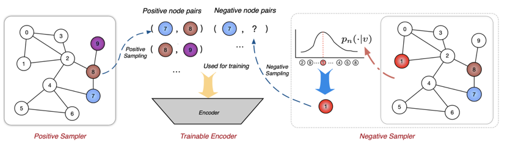

## Table of Contents

## What is Negative Sampling in machine learning?

Negative sampling is a technique used in machine learning, especially in training models for tasks like word embeddings and recommendation systems. The main idea is to improve the efficiency and effectiveness of training by focusing on a subset of the data. Instead of updating all the model parameters with every example, negative sampling updates them based on a small number of "negative" examples along with the "positive" example. This helps the model learn to distinguish between what it should predict and what it should not, making the training process faster and more scalable.

In the context of word embeddings, like Word2Vec, negative sampling works by taking a target word and its context word (the positive example) and then randomly selecting a few words that do not appear near the target word (the negative examples). The model then tries to maximize the probability of the positive pair while minimizing the probability of the negative pairs. This approach not only speeds up the training but also helps in capturing the semantic relationships between words more effectively. For instance, if the target word is "dog" and the context word is "bark," negative samples might include unrelated words like "apple" or "car," helping the model understand that "dog" and "bark" are closely related, while "dog" and "apple" are not.

## Why is Negative Sampling used in machine learning models?

Negative sampling is used in machine learning models to make training faster and more efficient. When training a model, it can be very slow and resource-intensive to consider all possible examples at once. Negative sampling helps by focusing on a smaller set of examples. Instead of looking at all the data, the model looks at one positive example and a few negative examples. This means the model can update its parameters more quickly and with less computational power. It's like learning by focusing on a few key mistakes rather than trying to correct everything at once.

In tasks like word embeddings, negative sampling helps the model learn the relationships between words more effectively. For example, if the model is trying to understand that "dog" and "bark" often go together, it will look at this pair as a positive example. Then, it will also look at a few negative examples, like "dog" and "apple," to learn that these words don't usually go together. By doing this, the model can better understand the context and meaning of words. This approach not only speeds up the training process but also improves the quality of the model's predictions.

## How does Negative Sampling differ from traditional softmax?

Negative sampling and traditional softmax are two different ways to train machine learning models, especially when dealing with lots of data. Traditional softmax looks at all possible outcomes and calculates the probability of each one. This can be very slow because it has to consider everything at once. For example, if you're training a model to predict words, softmax would calculate the probability of every word in the vocabulary being the next word. This is like trying to guess every number in a huge lottery all at once.

Negative sampling, on the other hand, focuses on just a few examples at a time. Instead of looking at all possible outcomes, it picks one correct (positive) example and a few incorrect (negative) examples. The model then tries to make the positive example more likely and the negative examples less likely. This makes training much faster because the model doesn't have to think about every possible outcome. It's like guessing a few numbers in the lottery instead of all of them, which is quicker and still helps the model learn well.

## Can you explain the process of implementing Negative Sampling in a neural network?

To implement negative sampling in a neural network, you start by choosing a positive example and several negative examples. For instance, if you're training a model to predict words, you might pick a word and its context as the positive example. Then, you randomly select a few words from the entire vocabulary that do not appear near the chosen word. These are your negative examples. The goal is to train the model to recognize that the positive example is correct and the negative examples are incorrect. This is done by adjusting the model's weights to increase the probability of the positive example and decrease the probability of the negative examples.

During training, you use the positive and negative examples to update the model's weights. For each example, you calculate the loss, which measures how far off the model's prediction is from the correct answer. The loss for the positive example is calculated using a binary cross-entropy loss function, which tries to make the model predict a high probability for the correct example. For the negative examples, the loss function tries to make the model predict a low probability. The total loss is the sum of the losses from the positive and negative examples. By minimizing this total loss, the model learns to distinguish between what it should predict and what it should not. This process is repeated many times with different examples until the model performs well.

## What are the advantages of using Negative Sampling over other techniques?

Negative sampling makes training faster because it doesn't look at all possible examples. Instead, it focuses on one correct example and a few wrong ones. This means the computer doesn't have to work as hard, so it can train the model quicker. For example, if you're trying to teach a computer about words, negative sampling helps it learn faster by only looking at a few words at a time instead of all of them.

Another advantage is that negative sampling can help the model learn better. By picking a few wrong examples, the model gets to practice telling the difference between what it should predict and what it shouldn't. This can make the model more accurate. For instance, if the model is learning about animals, negative sampling can help it understand that "dog" and "bark" go together, but "dog" and "apple" don't. This makes the model's predictions more reliable and useful.

## What types of machine learning problems can benefit from Negative Sampling?

Negative sampling is very helpful in machine learning problems where you need to predict something from a large set of choices. For example, it's great for word embedding tasks like Word2Vec. When you're trying to teach a computer about words, you want it to understand which words go together and which don't. Negative sampling helps the computer learn faster by focusing on a few wrong examples along with the right one. This makes the training process quicker and the model better at understanding word relationships.

Another type of problem where negative sampling is useful is in recommendation systems. These systems try to suggest things like movies or products that you might like. Instead of looking at all possible recommendations, negative sampling helps the system learn by focusing on a few bad recommendations along with the good ones. This makes the system faster and more accurate at guessing what you might enjoy. By using negative sampling, these systems can handle large amounts of data more efficiently and make better predictions.

## How does the choice of negative samples affect model performance?

The choice of negative samples can really change how well a model works. If you pick negative samples that are too different from the positive example, the model might not learn much. For example, if you're teaching a model about animals and you pick "car" as a negative sample for "dog," it's pretty obvious they're different. But if you pick "cat" as a negative sample, the model has to learn a more subtle difference, which can make it better at understanding the details.

On the other hand, if you pick negative samples that are too similar to the positive example, the model might get confused. For instance, if you're trying to teach a model about words and you pick "bark" as a negative sample for "dog," it might be hard for the model to tell them apart because they often appear together. So, choosing the right negative samples is important for helping the model learn well without getting too confused or not learning enough.

## What are common strategies for selecting negative samples?

One common strategy for picking negative samples is to choose them randomly from the whole set of possible examples. For example, if you're teaching a model about words, you might pick a few words at random that don't go with the word you're focusing on. This helps the model learn to tell the difference between what it should predict and what it shouldn't. But, you need to make sure the random samples aren't too easy or too hard for the model to learn from.

Another strategy is to use a method called "importance sampling." This means you pick negative samples that are more likely to be useful for the model to learn from. For instance, if you're teaching a model about animals, you might pick negative samples that are close to the animal you're focusing on, like picking "cat" as a negative sample for "dog." This can help the model learn more detailed differences. The right balance of easy and hard negative samples can make the model learn better and faster.

A third approach is to use a technique called "hard negative mining." This involves picking negative samples that the model often gets wrong. For example, if the model keeps mixing up "dog" and "wolf," you might pick "wolf" as a negative sample for "dog" more often. This helps the model focus on its mistakes and improve its accuracy. By choosing negative samples that challenge the model, you can help it become better at making the right predictions.

## How can the number of negative samples be optimized in Negative Sampling?

The number of negative samples used in negative sampling can really affect how well and quickly a model learns. If you use too few negative samples, the model might not learn enough because it's not getting enough chances to see what it should not predict. On the other hand, if you use too many negative samples, it can slow down the training process because the model has to look at more examples. A good way to find the right number is to try different amounts and see which one works best for your model. This is called "tuning" the number of negative samples.

One common method to optimize the number of negative samples is to start with a small number and slowly increase it while keeping an eye on how the model performs. For example, you might start with 5 negative samples and then try 10, 15, and so on. You can measure how well the model is doing by looking at its accuracy or another performance metric. If the model's performance gets better as you add more negative samples, you might want to keep increasing the number. But if the performance starts to get worse or doesn't change much, you've probably found the best number of negative samples for your model.

## What are the potential pitfalls or challenges when using Negative Sampling?

One challenge when using negative sampling is choosing the right negative samples. If the negative samples are too different from the positive example, the model might not learn much because the differences are too obvious. For example, if you're teaching a model about animals and you pick "car" as a negative sample for "dog," it's easy for the model to tell they're different. But if you pick "cat" as a negative sample, the model has to learn a more subtle difference, which can be harder but more useful. So, finding the right balance between easy and hard negative samples is important for the model to learn well.

Another potential pitfall is deciding on the right number of negative samples. Using too few negative samples might not give the model enough chances to learn what it should not predict, while using too many can slow down the training process. You need to find the right number that helps the model learn quickly and accurately. This often involves trying different numbers and seeing which one works best, a process called tuning. It can take time and effort to find the optimal number, but it's crucial for getting the best performance out of your model.

## How does Negative Sampling impact the training time and computational resources?

Negative sampling can make training a machine learning model faster and use fewer computational resources. Instead of looking at all possible examples, the model only focuses on one positive example and a few negative examples. This means the computer doesn't have to work as hard, so it can train the model quicker. For example, if you're teaching a computer about words, negative sampling helps it learn faster by only looking at a few words at a time instead of all of them.

However, choosing the right number of negative samples is important. If you use too few, the model might not learn enough because it's not getting enough chances to see what it should not predict. If you use too many, it can slow down the training because the model has to look at more examples. Finding the right balance helps the model learn quickly and accurately without using too many resources.

## Can you discuss any advanced techniques or variations of Negative Sampling used in recent research?

In recent research, one advanced technique that has been explored is called "adaptive negative sampling." This method adjusts the selection of negative samples based on how well the model is doing. For example, if the model is struggling with certain types of examples, adaptive negative sampling might choose more negative samples that are similar to those difficult examples. This helps the model focus on its weaknesses and improve more quickly. Researchers have found that this technique can lead to better performance because it makes the training process more targeted and efficient.

Another variation is "noise-contrastive estimation" (NCE), which is related to negative sampling but used in a slightly different way. NCE tries to distinguish between real data and noise by using a binary classifier. Instead of just focusing on negative examples, NCE uses both positive and negative examples to train the model to tell the difference between them. This can be particularly useful in tasks like language modeling, where the model needs to understand the context of words. By using NCE, researchers have been able to train models more effectively, especially when dealing with large datasets.