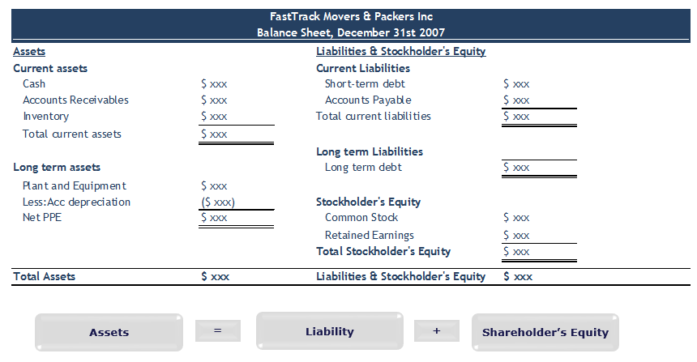

Understanding shareholders' equity is crucial for investors, as it offers a clear picture of a company's financial health and stability. By measuring the residual interest in the assets of the company after deducting liabilities, shareholders’ equity serves as a net worth indicator, reflecting the financial soundness and potential for growth. A positive shareholders’ equity suggests that a company owns more than it owes, allowing it to potentially finance its operations, expand its business, and withstand economic downturns. Conversely, negative equity, where liabilities surpass assets, signals potential financial distress and demands careful scrutiny from investors.

In this article, we will explore the financial implications of negative equity, focusing on how it interacts with modern trading methods such as algorithmic trading. The advent of algorithmic trading has transformed financial markets, utilizing complex mathematical models and high-speed data analysis to make trading decisions. A company’s equity status can significantly influence such trading algorithms, which automatically respond to financial data and news. Understanding the impact of negative equity on these computerized systems is essential for investors keen on navigating today's dynamic trading environment.



Furthermore, negative equity can profoundly affect a company's day-to-day operations and its attractiveness to potential investors. While negative equity often raises concerns about a company's viability, it is not always a definitive sign of failure. Instead, it highlights the need for diligent financial analysis and strategic management. Investors must consider both the potential risks and opportunities presented by companies with negative equity, as understanding these complexities can lead to strategic investment decisions and potential turnarounds.

In summary, shareholders' equity remains a fundamental metric in evaluating a company's financial condition. Through examining the implications of negative equity in modern trading contexts and operational stability, investors can make more informed decisions, aligning their strategies with the realities of today's financial landscape.

## Table of Contents

## What is Shareholders' Equity?

Shareholders' equity, often referred to as stockholders' equity, represents the residual interest in the assets of a company after deducting liabilities. It is the net worth of a company and is a fundamental indicator of its financial health. The formula for calculating shareholders' equity is:

$$
\text{Shareholders' Equity} = \text{Total Assets} - \text{Total Liabilities}
$$

This measure provides insight into a company's capacity to fulfill its obligations and its potential for growth. A positive shareholders' equity indicates that a company has more assets than liabilities, suggesting financial stability and the potential for expansion. Conversely, a negative shareholders' equity might suggest financial distress, signaling that liabilities exceed assets.

Shareholders' equity is comprised of capital contributed by shareholders, known as paid-in capital, and retained earnings, which are the cumulative net income retained by the company instead of being distributed as dividends. Additional components may include treasury stock, which represents shares that the company has repurchased. 

Key financial ratios derived from shareholders' equity, such as the return on equity (ROE), offer insight into how efficiently a company is using investments to generate earnings growth. ROE is calculated as:

$$
\text{Return on Equity (ROE)} = \frac{\text{Net Income}}{\text{Shareholders' Equity}}
$$

A higher ROE indicates more efficient use of equity investments. 

Understanding shareholders' equity is essential for investors, creditors, and analysts for assessing a company’s financial health, investment potential, and capacity to sustain operations and growth over time. As such, it serves as a critical barometer in financial analysis, influencing investment strategies and decision-making processes.

## Causes of Negative Equity

Negative equity arises when a company's liabilities surpass its assets, resulting in a deficit in shareholders' equity. This situation often signals underlying financial challenges and can occur due to several reasons.

Accumulated losses over time are a primary cause of negative equity. When a corporation consistently spends more than it earns, its retained earnings diminish, potentially turning negative if the losses persist. In accounting terms, retained earnings (RE) can be represented as:

$$
\text{RE} = \text{Beginning RE} + \text{Net Income} - \text{Dividends}
$$

A continuous reporting of net losses reduces retained earnings, and if dividends are disbursed simultaneously, it could lead to negative equity.

Excessive dividend payments that exceed retained earnings can exacerbate the situation. When companies distribute more in dividends than they have accrued in retained earnings, they chip away at their equity base. This practice might support shareholder satisfaction in the short term, but if it's not backed by equivalent earnings, it jeopardizes long-term financial stability. For instance, if a company's retained earnings are \$500,000 and it pays dividends of \$600,000, the shortfall adds to the deficit, directly affecting the company's equity.

Lastly, large borrowings without concurrent income or asset growth constitute another risk [factor](/wiki/factor-investing) for negative equity. When companies take on significant debt without parallel increases in income or asset value, their liabilities surpass their assets. This imbalance becomes apparent in the balance sheet equation:

$$
\text{Equity} = \text{Assets} - \text{Liabilities}
$$

If liabilities grow disproportionately due to borrowing, without corresponding asset augmentation or revenue increase, the equation results in negative equity. For instance, if a firm borrows \$1 million but generates only a \$500,000 increase in asset value or income, the unbalanced equation impacts the net equity adversely.

Each of these factors—accumulated losses, imprudent dividend payouts, and disproportionate borrowing—can independently or collectively cause negative equity, highlighting the importance of vigilant financial management to maintain a stable equity foundation.

## Financial Implications of Negative Equity

Negative equity, often perceived as an indicator of financial distress, can significantly impact a company’s operational capabilities and strategic outlook. When a company experiences negative equity, it signifies that its liabilities outweigh its assets, casting doubt on its financial stability. This situation tends to raise red flags for both creditors and investors due to the associated risks and uncertainties.

From a financing perspective, negative equity can severely impede a company's ability to secure additional capital. Creditors typically assess a company's equity position when evaluating their willingness to extend loans or other forms of credit. Since negative equity suggests that a company might struggle to meet its existing financial obligations, creditors may deem it too risky to lend further. Consequently, the company could face high borrowing costs or be denied access to funds entirely, limiting its options for pursuing growth initiatives or even maintaining current operations.

For investors, negative equity necessitates a more profound analysis of the company's financial statements and overall health. Investors need to examine several aspects, such as cash flow, revenue trends, and market conditions, to understand better the underlying causes of negative equity and assess the potential for recovery. Despite the challenges posed by a negative equity status, some companies manage to navigate these troubled waters successfully, often through restructuring, cost-cutting, or reinvention of business models. Therefore, diligent due diligence beyond surface-level financial metrics is crucial before acquiring or retaining shares in a company facing negative equity.

In summary, negative equity serves as a critical signal of financial strain, influencing both a company's capacity to raise funds and an investor’s decision-making process. Understanding the implications of negative equity is fundamental for stakeholders aiming to evaluate the risks and opportunities associated with a company's current and future financial performance.

## Negative Equity and Algorithmic Trading

Algorithmic trading systems are designed to execute trades based on predefined criteria, often responding instantaneously to changes in market data, including fluctuations in a company's equity status. When a company experiences negative equity, it can trigger specific responses from these automated systems. Negative equity, which occurs when a company's liabilities exceed its assets, can be perceived as a sign of financial vulnerability, prompting trading algorithms to recalibrate their positions.

The impact of negative equity on [algorithmic trading](/wiki/algorithmic-trading) can be substantial. Trading algorithms are programmed to assess various indicators of financial health, and a shift to negative equity may lead to increased caution. For instance, algorithms may reduce exposure to a stock with negative equity by either selling existing holdings or refraining from new purchases. This reaction can affect the [liquidity](/wiki/liquidity-risk-premium) of the stock, as a higher [volume](/wiki/volume-trading-strategy) of sell orders may lead to decreased demand, resulting in price declines.

Moreover, the sensitivity of algorithms to equity changes is often dictated by complex models that incorporate multiple financial metrics. For example, algorithms may factor in not only the equity status but also broader market conditions, recent news, and historical performance data. This multifaceted analysis helps in determining the level of risk associated with maintaining or altering positions in a particular stock.

Python, being a favored programming language in algorithmic trading due to its versatility and robust libraries, can be utilized to construct such algorithms. A simplified pseudocode example could look like this:

```python
def evaluate_stock_position(equity_status, market_conditions):
    if equity_status < 0:
        risk_factor = calculate_risk(market_conditions)
        if risk_factor > threshold:
            adjust_portfolio('sell', stock)
        else:
            hold_position(stock)
    else:
        hold_position(stock)

def calculate_risk(market_conditions):
    # Implement risk calculation based on market data
    risk_value = some_complex_model(market_conditions)
    return risk_value
```

In this example, `evaluate_stock_position` is a function that assesses a stock's equity status and makes trading decisions based on predefined risk factors. This type of automated response is characteristic of how algorithmic trading platforms might engage with stocks showing negative equity.

Ultimately, while negative equity can prompt algorithmic trading systems to adjust their positions, the broader market impact depends on the interplay of numerous factors, including the scale at which algorithms are trading the affected stock and the overall market sentiment. Such dynamics illustrate the intricate intersections between financial metrics and automated trading strategies.

## Case Studies: Companies with Negative Equity

Negative equity is commonly perceived as a sign of financial distress, yet several companies have managed to navigate these challenging waters and emerge successfully. Understanding how these companies have turned their fortunes around can offer valuable insights into effective strategic management and financial resilience.

One notable example is the restaurant chain Dine Brands Global, which encompasses popular brands such as IHOP and Applebee's. Amid financial pressures, Dine Brands experienced periods of negative equity but implemented a series of strategic decisions that facilitated recovery and growth. The core strategy involved remodeling and rebranding efforts focused on enhancing customer experience and renewing consumer interest. In parallel, the company pursued a franchise-focused business model, thereby reducing direct operational burdens while benefiting from franchising fees and royalties.

Another case is that of McDonald's Corporation. Despite not being constantly in negative equity, it has faced financial strains that could have easily led to such a state. During these periods, McDonald's focused on cost restructuring and menu innovation, incorporating technology for improved customer service and efficiency. This approach not only mitigated financial distress but also positioned McDonald's to capitalize on emerging market trends.

Technology companies, too, have faced negative equity scenarios. For example, at certain points during its development, Amazon reported negative equity. However, strategic investment in diversified product lines and global market expansion, along with a strong emphasis on data analytics to drive operations and customer engagement, contributed significantly to its eventual success. This long-term perspective, which prioritized growth over short-term profitability, required robust financial management and strategic foresight.

These examples underline the importance of strategic pivots and innovation in overcoming negative equity. Successful companies often employ targeted measures such as cost management, product rebranding, and operational restructuring. Furthermore, leveraging modern technology and data analytics plays a crucial role in improving efficiency and customer engagement.

Lessons from these companies underscore that while negative equity poses significant challenges, it is not insurmountable. By carefully managing resources, realigning strategies, and taking calculated risks, companies can overcome adverse financial positions and achieve sustainable growth. The ability to adapt and innovate remains pivotal in resolving negative equity and turning potential liabilities into opportunities for revival and success.

## Conclusion

For investors, negative equity should be interpreted as an indicator for thorough financial examination, rather than as an immediate obstacle to investment. Although negative equity often signals financial distress, it is not inherently synonymous with an insurmountable problem. By conducting meticulous financial scrutiny, investors can discern between temporary setbacks and structural deficiencies within a company’s financial framework. This careful assessment includes evaluating the underlying causes of negative equity, such as whether it results from short-term strategic choices or long-standing operational challenges. 

Understanding the intricacies of shareholders' equity enhances informed decision-making, particularly when integrated with financial management and trading strategies. Knowledge of how negative equity impacts financial ratios, such as the debt-to-equity ratio, can aid investors in assessing risk levels and financial stability. Moreover, consideration of algorithmic trading dynamics, which can influence stock prices based on equity changes, is crucial. Algorithmic trading may react to negative equity by altering investment patterns, impacting stock liquidity and [volatility](/wiki/volatility-trading-strategies).

For investors relying on automated trading systems, incorporating financial health indicators like shareholders' equity can refine algorithm triggers, leading to more strategic trade executions. Such adjustments may involve the integration of data analytics frameworks capable of analyzing real-time financial data, providing insights beyond conventional analysis. For instance, leveraging Python for data analysis through libraries like Pandas and NumPy allows for sophisticated modeling of company performance metrics, which can better anticipate market reactions to equity changes.

In conclusion, while negative equity necessitates cautious engagement, it should not automatically deter investment. Through comprehensive analysis and strategic financial assessment, combined with informed application of trading technologies, investors can navigate the complexities of negative equity. This approach not only mitigates risks associated with potential financial instability but also capitalizes on opportunities for investment in resilient and strategically adaptive companies.

## References & Further Reading

[1]: ["Advances in Financial Machine Learning"](https://www.amazon.com/Advances-Financial-Machine-Learning-Marcos/dp/1119482089) by Marcos Lopez de Prado

[2]: ["Evidence-Based Technical Analysis: Applying the Scientific Method and Statistical Inference to Trading Signals"](https://www.amazon.com/Evidence-Based-Technical-Analysis-Scientific-Statistical/dp/0470008741) by David Aronson

[3]: ["Machine Learning for Algorithmic Trading"](https://github.com/PacktPublishing/Machine-Learning-for-Algorithmic-Trading-Second-Edition) by Stefan Jansen

[4]: ["Quantitative Trading: How to Build Your Own Algorithmic Trading Business"](https://www.amazon.com/Quantitative-Trading-Build-Algorithmic-Business/dp/0470284889) by Ernest P. Chan

[5]: Damodaran, A. (2015). ["The Return of the Big Firm: Liquidation Against the Odds"](https://scholar.google.com/citations?user=RT5ojIwAAAAJ). NYU Stern School of Business.

[6]: ["Financial Shenanigans: How to Detect Accounting Gimmicks & Fraud in Financial Reports"](https://www.mheducation.com/highered/product/financial-shenanigans-fourth-edition-how-detect-accounting-gimmicks-fraud-financial-reports-schilit-perler/9781260117264.html) by Howard Schilit and Jeremy Perler