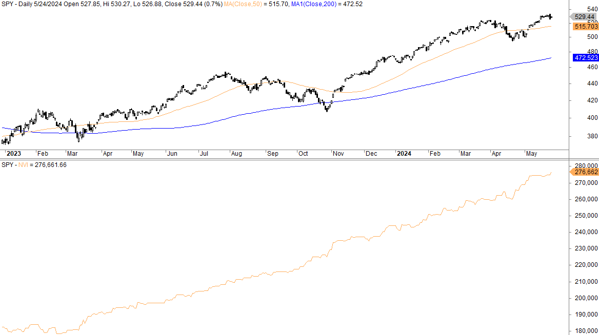

## Table of Contents

## What is the Negative Volume Index (NVI)?

The Negative Volume Index (NVI) is a technical indicator used in stock market analysis to help investors understand how stock prices move when trading volume decreases. It was developed by Paul L. Dysart Jr. in the 1930s and is based on the idea that smart investors tend to trade more actively on days when the volume is lower. The NVI starts with a base value of 1000 and changes based on whether the volume on a given day is lower than the previous day.

When the volume decreases, the NVI is adjusted according to the percentage change in the stock's price. If the volume increases, the NVI remains the same. The idea behind this is that on days with lower volume, the actions of informed investors are more visible and can provide insights into future price movements. Many investors use the NVI alongside other indicators to make more informed decisions about buying or selling stocks.

## Who developed the Negative Volume Index and when?

Paul L. Dysart Jr. developed the Negative Volume Index in the 1930s. He wanted to create a tool that could help investors understand how stock prices move when fewer shares are traded.

The NVI is based on the idea that smart investors trade more on days when the volume is low. This makes their actions easier to see and can give clues about where the stock price might go next.

## What is the basic premise behind the NVI?

The Negative Volume Index, or NVI, is based on the idea that smart investors tend to trade more when fewer shares are being traded. This means that on days with lower trading volume, the actions of these smart investors are easier to see. The NVI was created to help investors understand how stock prices move when there is less trading activity.

The NVI starts at 1000 and changes based on the stock's price when the trading volume goes down. If the volume is lower than the day before, the NVI is adjusted according to the percentage change in the stock's price. If the volume goes up, the NVI stays the same. By watching the NVI, investors can get clues about where the stock price might go next, especially when used with other tools.

## How is the NVI calculated step-by-step?

The Negative Volume Index (NVI) starts with a base value of 1000. To calculate it, you need to look at the trading volume of a stock from one day to the next. If the volume on the current day is lower than the volume on the previous day, you adjust the NVI. You do this by calculating the percentage change in the stock's price from the previous day to the current day. Then, you add this percentage change to the previous day's NVI value. For example, if the stock price went up by 2% and the previous NVI was 1000, the new NVI would be 1000 + (2% of 1000) = 1020.

If the volume on the current day is higher than the volume on the previous day, the NVI stays the same. It does not change at all. This is because the NVI is only meant to show what happens when fewer shares are traded. By keeping track of the NVI over time, investors can see how smart investors might be influencing the stock price on days with lower trading volume. This can help them make better decisions about buying or selling the stock.

## What data is needed to compute the NVI?

To compute the Negative Volume Index (NVI), you need to know the daily trading volume and the daily closing price of the stock. Start with a base NVI value of 1000. Each day, compare the trading volume to the volume of the previous day. If the current day's volume is lower than the previous day's volume, you will adjust the NVI based on the percentage change in the stock's closing price.

If the volume is lower, calculate the percentage change in the stock's price from the previous day to the current day. Add this percentage change to the previous day's NVI value to get the new NVI. For example, if the stock price increased by 2% and the previous NVI was 1000, the new NVI would be 1000 + (2% of 1000) = 1020. If the volume is higher than the previous day, the NVI remains unchanged. This simple process helps investors understand how stock prices move on days with lower trading volume.

## How does the NVI differ from the Positive Volume Index (PVI)?

The Negative Volume Index (NVI) and the Positive Volume Index (PVI) are both technical indicators used in stock market analysis, but they focus on different aspects of trading volume. The NVI looks at how stock prices move when there is less trading activity. It is based on the idea that smart investors trade more on days with lower volume, making their actions easier to see. The NVI only changes on days when the trading volume is lower than the day before. If the volume is lower, the NVI adjusts according to the percentage change in the stock's price. If the volume is higher, the NVI stays the same.

On the other hand, the Positive Volume Index (PVI) focuses on days when there is more trading activity. It is based on the idea that on days with higher volume, the market is influenced more by less-informed investors. The PVI changes only on days when the trading volume is higher than the day before. If the volume is higher, the PVI adjusts according to the percentage change in the stock's price. If the volume is lower, the PVI remains unchanged. By using both the NVI and PVI, investors can get a fuller picture of how volume affects stock prices and make more informed decisions about buying or selling stocks.

## What are the typical signals provided by the NVI?

The Negative Volume Index, or NVI, helps investors see how stock prices move when fewer shares are traded. A common signal from the NVI is when it starts to go up while the stock price stays the same or goes down. This can mean that smart investors are buying the stock even though the price isn't moving much. It might be a sign that the stock price could go up soon. Another signal is when the NVI goes down while the stock price goes up. This could mean that the stock's price increase is not being driven by smart investors, and it might not last.

Investors often use the NVI along with other tools to make better decisions. For example, they might look at the NVI and the stock's moving average together. If the NVI is going up and crosses above its moving average, it might be a good time to buy the stock. On the other hand, if the NVI is going down and crosses below its moving average, it might be a good time to sell. By watching these signals, investors can get clues about where the stock price might go next and make smarter choices about when to buy or sell.

## How can the NVI be used in technical analysis?

The Negative Volume Index, or NVI, is a tool that investors use to understand how stock prices move when fewer shares are traded. It starts with a base value of 1000 and changes only on days when the trading volume is lower than the day before. If the volume is lower, the NVI adjusts based on the percentage change in the stock's price. If the volume is higher, the NVI stays the same. This helps investors see what smart investors might be doing when there's less trading activity.

In technical analysis, the NVI can give important signals. When the NVI goes up while the stock price stays the same or goes down, it might mean that smart investors are buying the stock, and the price could go up soon. On the other hand, if the NVI goes down while the stock price goes up, it might mean that the price increase is not being driven by smart investors and might not last. Investors often use the NVI along with other tools, like moving averages, to make better decisions. For example, if the NVI crosses above its moving average, it might be a good time to buy the stock, and if it crosses below, it might be a good time to sell.

## What are some common strategies for using the NVI in trading?

One common strategy for using the Negative Volume Index (NVI) in trading is to watch for when the NVI starts to go up while the stock price stays the same or goes down. This can be a sign that smart investors are buying the stock even though the price isn't moving much. It might mean the stock price could go up soon. Traders might see this as a good time to buy the stock, hoping to get in before the price rises. They often look at the NVI along with other tools, like moving averages, to make sure their decision is a good one. If the NVI crosses above its moving average, it can be a strong signal to buy.

Another strategy is to pay attention to when the NVI goes down while the stock price goes up. This could mean that the stock's price increase is not being driven by smart investors, and it might not last. Traders might see this as a warning sign and think about selling the stock before the price drops. They might also use the NVI to confirm other signals they see in the market. For example, if the NVI crosses below its moving average, it might be a good time to sell. By using the NVI in these ways, traders can make better decisions about when to buy or sell stocks.

## Can the NVI be used in conjunction with other indicators? If so, which ones?

Yes, the Negative Volume Index (NVI) can be used with other indicators to help traders make better decisions about buying or selling stocks. One common indicator used with the NVI is the moving average. Traders often look at the NVI along with its moving average to spot trends. If the NVI crosses above its moving average, it can be a good time to buy the stock. On the other hand, if the NVI crosses below its moving average, it might be a good time to sell.

Another useful indicator to use with the NVI is the Relative Strength Index (RSI). The RSI helps traders see if a stock is overbought or oversold. By using the NVI and RSI together, traders can get a better idea of when to buy or sell. For example, if the NVI is going up and the RSI shows the stock is oversold, it might be a strong signal to buy. If the NVI is going down and the RSI shows the stock is overbought, it might be a good time to sell. Combining the NVI with these other indicators can help traders make smarter choices in the market.

## What are the limitations and criticisms of the NVI?

The Negative Volume Index (NVI) has some limitations that traders should know about. One big problem is that it only looks at days when the trading volume is lower than the day before. This means it might miss important information on days when the volume is high. Also, the NVI is based on the idea that smart investors trade more when fewer shares are traded. But this idea might not always be true. Sometimes, other things can affect the stock price, like news or big events, and the NVI might not show these things.

Another criticism of the NVI is that it can give false signals. For example, the NVI might go up while the stock price stays the same or goes down, suggesting that smart investors are buying. But this might not always lead to a price increase. Traders might buy the stock based on this signal and then lose money if the price doesn't go up. Because of these limitations, it's a good idea to use the NVI along with other tools and indicators to make better trading decisions.

## How has the effectiveness of the NVI been tested or validated in academic research?

Researchers have looked at how well the Negative Volume Index (NVI) works by studying how it predicts stock prices. Some studies found that the NVI can help investors see when smart investors are buying stocks on days with less trading. These studies showed that if the NVI goes up while the stock price stays the same or goes down, it might mean the stock price will go up soon. This can be a useful signal for traders trying to decide when to buy or sell stocks.

However, other research has pointed out that the NVI is not perfect. It only looks at days when the trading volume is lower, so it might miss important information on days when the volume is high. Also, the idea that smart investors trade more on low volume days might not always be true. Some studies showed that the NVI can give false signals, leading traders to make bad decisions. Because of these findings, many experts suggest using the NVI with other tools to get a better picture of the market.

## How does NVI work?

The Negative Volume Index (NVI) operates by analyzing price movement on days when trading [volume](/wiki/volume-trading-strategy) declines compared to the previous day. The primary hypothesis is that significant price changes influenced by institutional investors, or "smart money," occur under low-volume conditions. This is captured through the use of the NVI calculation formula.

The NVI for a given day, $NVIt$, is calculated as follows when trading volume decreases from the previous day:

$$
NVIt = NVIt-1 + \left(\frac{Pt - Pt-1}{Pt-1}\right)
$$

where:
- $NVIt$ is the Negative Volume Index for the current day,
- $NVIt-1$ represents the NVI value from the previous day,
- $Pt$ denotes the closing price of the current day,
- $Pt-1$ is the closing price from the previous day.

Essentially, on days when today's trading volume is lower than that of the previous day, the NVI is recalibrated to reflect the proportionate change in price relative to its prior value. This method effectively highlights the potential influence of smart money on price movements occurring in less active market conditions. In contrast, on high-volume days when today's trading volume surpasses that of the previous day, the NVI remains unchanged. This underscores its deliberate focus on low-volume periods for detecting meaningful trends. 

Implementing changes based on volumes and price dynamics enables traders to discern where institutional investors might be driving market shifts, which could be otherwise masked by the noise of high-volume trading days. By concentrating on the behavior of prices on these quieter days, the NVI can provide insights into the more subtle shifts occurring within financial markets.

## References & Further Reading

[1]: Fosback, N. G. (1995). ["Stock Market Logic: A Sophisticated Approach to Profit on Wall Street."](https://archive.org/details/stockmarketlogic00fosb) Dearborn Financial Publishing.

[2]: Arnold, G., & Lewis, J. G. (2008). ["The Professional Risk Managers' Guide to Financial Markets."](https://books.google.com/books/about/Corporate_Financial_Management.html?id=LvSMDwAAQBAJ) McGraw-Hill Education.

[3]: Murphy, J.J. (1999). ["Technical Analysis of the Financial Markets: A Comprehensive Guide to Trading Methods and Applications."](https://archive.org/details/technicalanalysi0000murp) New York Institute of Finance.

[4]: Schwager, J.D. (1994). ["The New Market Wizards: Conversations with America's Top Traders."](https://archive.org/details/newmarketwizards00jack) HarperBusiness.

[5]: Elder, A. (2002). ["Come Into My Trading Room: A Complete Guide to Trading."](https://www.amazon.com/Come-Into-My-Trading-Room/dp/0471225347) Wiley Trading.