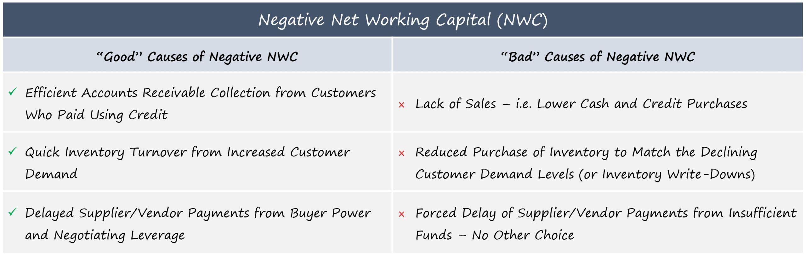

Understanding key financial metrics is critical in the finance sector, as they provide insights necessary for making informed decisions. Among these metrics, the working capital turnover ratio holds significant importance, particularly within algorithmic trading. This metric evaluates a company's efficiency in utilizing its working capital to generate sales and maintain liquidity, reflecting its operational competence.

The working capital turnover ratio is calculated as:



$$

\text{Working Capital Turnover Ratio} = \frac{\text{Net Sales}}{\text{Average Working Capital}} 
$$

A negative working capital turnover ratio can occur when a company's current liabilities surpass its current assets, suggesting potential financial distress. Such a scenario can serve as a warning to businesses and investors, highlighting challenges in meeting short-term obligations and possibly requiring additional funding.

In algorithmic trading, the implications of a negative working capital turnover ratio extend further. Trading algorithms incorporate financial metrics like this ratio to assess company health, potentially flagging liquidity concerns which may impact trading strategies. Identifying such critical cues can lead to more data-driven investment decisions and risk assessments.

The article will examine the nuances of the working capital turnover ratio, its negative aspects, and its ramifications on trading strategies. Additionally, it will underscore the importance of backtesting and risk management in algorithmic trading, essential processes that ensure trading algorithms meet expected performance standards under real market conditions. These elements are integral for traders aiming to refine strategies and manage financial risks effectively, navigating the complexities of market dynamics efficiently.

## Table of Contents

## Understanding Working Capital Turnover Ratio

The working capital turnover ratio is a pivotal financial metric that evaluates how effectively a company utilizes its working capital to generate revenue. It is computed using the formula:

$$
\text{Working Capital Turnover Ratio} = \frac{\text{Net Sales}}{\text{Average Working Capital}}
$$

Here, net sales represent the total revenue generated from operations after deducting returns, allowances, and discounts. Average working capital is derived by calculating the mean of the beginning and ending working capital over a specific period. This metric provides an insight into the efficiency of a company in turning its working capital into sales.

A higher working capital turnover ratio indicates that the company is using its resources efficiently to produce revenue. However, if the ratio turns negative, it implies that a company's current liabilities have exceeded its current assets. This scenario can signal potential financial distress, suggesting that the company may not have enough short-term assets to cover its short-term liabilities.

### Components of Working Capital

1. **Current Assets**: These include cash and equivalents, accounts receivable, inventory, and other liquid assets expected to be converted into cash within a year. Efficient management of current assets is crucial for maintaining a healthy working capital turnover ratio.

2. **Current Liabilities**: These are obligations that a company is expected to settle within a year, such as accounts payable, short-term debt, and other accrued liabilities. Timely management and payment of current liabilities are vital to preventing the working capital turnover ratio from turning negative.

### Impact on Turnover Ratio

The working capital turnover ratio is intrinsically linked to the company's operational efficiency. For instance:

- **Inventory Management**: Higher inventory levels relative to sales may indicate overstocking or slowing sales, leading to a lower ratio. Conversely, efficient inventory management that reduces excess stock and enhances turnover contributes positively to the ratio.

- **Receivables Management**: Slow collection of accounts receivable can tie up working capital and reduce the turnover ratio. Companies that adeptly manage receivables to optimize cash inflows tend to display higher ratios.

- **Payables Management**: While delaying payments to suppliers can temporarily enhance liquidity, excessive reliance on this practice could harm supplier relationships and increase the risk of the ratio turning negative.

Understanding these components and their management allows businesses to efficiently utilize working capital and maintain a favorable turnover ratio.

## The Implications of a Negative Working Capital Turnover Ratio

A negative working capital turnover ratio suggests that a company is possibly experiencing financial distress, signaling potential challenges in meeting its immediate financial obligations. This situation arises when a company's current liabilities surpass its current assets, implying that it relies on external financial support or additional funding to operate sustainably. Such a scenario can occur due to delayed payments to vendors or excessive credit from suppliers, which can strain a company's cash flow.

The risks associated with a negative working capital turnover ratio are significant. Companies may face difficulties in fulfilling short-term debts, which could lead to penalties, damaged relationships with suppliers, and a tarnished credit rating. If left unaddressed, the company's solvency may be threatened, elevating the risk of bankruptcy. This precarious financial position can also deter investors, making it difficult to secure funding through traditional means, thus exacerbating the [liquidity](/wiki/liquidity-risk-premium) crisis.

To mitigate these risks and improve working capital turnover, companies can adopt several strategies. Efficient inventory management is crucial; reducing excess stock can free up cash otherwise tied in unsold goods. Additionally, optimizing accounts receivable by tightening credit policies and pursuing timely collections can improve cash inflows. On the accounts payable front, extending payment terms without incurring penalties can also help conserve cash.

Furthermore, internal processes should be streamlined to enhance operational efficiency. This may involve adopting technologies that automate and integrate financial operations to minimize costs and reduce reliance on external borrowing. Finally, in some cases, restructuring existing debt may provide temporary relief from financial pressure, allowing companies more flexibility to realign their capital structure.

Overall, a negative working capital turnover ratio demands immediate and strategic actions to stabilize the company's financial position and ensure its ability to meet short-term obligations, thereby safeguarding long-term viability.

## Working Capital and Algo Trading

In [algorithmic trading](/wiki/algorithmic-trading), assessing a company’s financial health is paramount, and financial ratios like the working capital turnover ratio play a crucial role in this evaluation. The working capital turnover ratio, calculated by dividing net sales by average working capital, serves as an indicator of how efficiently a company uses its working capital to generate sales. In Python, this can be represented as:

```python
def working_capital_turnover_ratio(net_sales, current_assets, current_liabilities):
    working_capital = current_assets - current_liabilities
    if working_capital <= 0:
        raise ValueError("Negative or zero working capital")
    return net_sales / working_capital
```

For traders utilizing algorithmic trading strategies, a negative working capital turnover ratio often serves as an immediate red flag. This negative value indicates that a company’s current liabilities exceed its current assets, hinting at potential liquidity issues. Such issues may render the company unable to meet its short-term financial obligations without obtaining additional funding. Consequently, traders might interpret this financial state as a warning sign, necessitating further investigation before making investment decisions.

The utilization of working capital ratios in trading algorithms allows traders to make data-driven decisions. By incorporating these ratios, algorithms can systematically screen and analyze vast datasets to identify companies that manage their working capital effectively. This ability to quickly evaluate financial health and operational efficiency is invaluable in the fast-paced world of trading, where timely and informed decisions can significantly impact returns.

Furthermore, the relationship between effective working capital management and algorithmic trading success should not be underestimated. Companies with positive working capital turnover ratios tend to demonstrate financial stability and operational efficiency, traits often associated with robust and sustainable revenue generation. In contrast, firms with negative ratios may reveal inefficiencies or financial distress, posing potential risks for investors looking to include such companies in their trading portfolios.

In summary, working capital ratios serve as a critical component in algorithmic trading, providing insights into a company’s financial status. Traders leveraging these metrics can better assess the viability of investment opportunities, identify potential risks associated with liquidity issues, and make more informed decisions in constructing their trading strategies.

## Key Metrics in Algo Trading Backtesting

Backtesting serves as an essential process for the development of effective trading algorithms. It involves simulating a trading strategy using historical market data to assess its potential efficacy in real-world conditions. Critical to this evaluation are several key performance metrics, including the Sharpe Ratio, Sortino Ratio, Maximum Drawdown, and Value-at-Risk (VaR).

The Sharpe Ratio is a widely used metric for evaluating the risk-adjusted return of an investment strategy. It is calculated as:

$$
\text{Sharpe Ratio} = \frac{R_p - R_f}{\sigma_p}
$$

where $R_p$ is the expected portfolio return, $R_f$ is the risk-free rate of return, and $\sigma_p$ is the standard deviation of the portfolio's excess return. A higher Sharpe Ratio indicates a more favorable risk-adjusted performance.

The Sortino Ratio is a modification of the Sharpe Ratio that focuses solely on downside risk, or negative [volatility](/wiki/volatility-trading-strategies). The formula for the Sortino Ratio is:

$$
\text{Sortino Ratio} = \frac{R_p - R_f}{\sigma_d}
$$

where $\sigma_d$ represents the standard deviation of the negative asset returns. By focusing on downside risk, the Sortino Ratio provides a more accurate measure of an investment's return per unit of bad risk.

Maximum Drawdown is a metric that captures the largest single drop from peak to trough during the life of an investment. It is used to assess the risk of a particular trading strategy by identifying the potential worst-case scenario. Mathematically, it is expressed as the largest loss in portfolio value experienced over a specified time period.

Value-at-Risk (VaR) quantifies the potential loss in value of an asset or portfolio over a defined period for a given confidence interval. VaR is commonly used to gauge the level of financial risk within a firm or portfolio over a specific time frame. It can be calculated using historical simulation, variance-covariance methods, or Monte Carlo simulation techniques.

Together, these metrics provide a comprehensive toolkit for traders to evaluate the potential effectiveness and risks associated with their trading strategies during the [backtesting](/wiki/backtesting) phase. By analyzing these metrics, traders can make informed decisions on whether to refine their strategies further before implementing them in live markets. This process helps in enhancing the overall robustness and reliability of trading systems in practice.

## Managing Risk in Algorithmic Trading

Risk management is a fundamental component of algorithmic trading, crucial for safeguarding investments against unexpected market movements and financial constraints. In the context of a negative working capital turnover ratio, risk management strategies become even more pertinent. This ratio, reflective of a company's financial strain, can signal liquidity concerns that might affect the stability and responsiveness of trading strategies. 

One effective strategy for managing risks associated with negative working capital turnover is portfolio diversification. By spreading investments across a variety of assets, traders can reduce the impact of poor performance in any single asset or sector. Diversification helps in balancing the overall risk profile, ensuring that potential losses in one area can be offset by gains in another. For example, a Python script using the `numpy` library can help evaluate the risk-return profile of a diversified portfolio:

```python
import numpy as np

# Assume historical returns data for multiple assets
returns = np.array([[0.02, 0.03, 0.04], [0.01, -0.02, 0.015], [0.03, 0.05, -0.01]])

# Calculate mean returns and covariance matrix
mean_returns = np.mean(returns, axis=0)
cov_matrix = np.cov(returns.T)

# Determine random weights for portfolio allocation
weights = np.random.random(len(mean_returns))
weights /= np.sum(weights)

# Calculate expected portfolio return and standard deviation
portfolio_return = np.dot(weights, mean_returns)
portfolio_std_dev = np.sqrt(np.dot(weights.T, np.dot(cov_matrix, weights)))

print("Expected Portfolio Return:", portfolio_return)
print("Portfolio Volatility:", portfolio_std_dev)
```

Stop-loss orders are another crucial technique in risk management. These orders automatically sell a security when it hits a particular price point, limiting potential losses. Traders can set stop-loss orders to prevent excessive loss when market prices move unfavorably.

Consistent monitoring and the adjustment of trading strategies are essential to maintain alignment with market dynamics. Market conditions can shift rapidly due to changes in economic indicators, geopolitical events, or shifts in industry trends. Thus, continuous evaluation and adaptation of trading algorithms are necessary.

Automatically adjusting trading parameters using real-time data can further enhance the robustness of trading strategies. For example, implementing an adaptive algorithm that adjusts stop-loss thresholds based on volatility indicators can provide more responsive risk management. Here's a basic framework using Python:

```python
def adaptive_stop_loss(current_price, volatility, base_threshold=0.05):
    """Adjust stop-loss based on market volatility."""
    adjusted_threshold = base_threshold + volatility
    stop_loss_price = current_price * (1 - adjusted_threshold)
    return stop_loss_price

# Example usage
current_market_price = 150  # Example current market price
current_volatility = 0.02   # Example volatility level

stop_loss_level = adaptive_stop_loss(current_market_price, current_volatility)
print("Adaptive Stop-Loss Level:", stop_loss_level)
```

The capacity to adapt trading strategies regularly not only mitigates risk but also positions traders to capitalize on emerging opportunities. Emphasizing the importance of risk management and strategic adjustments can lead to more stable and successful trading activities, particularly when dealing with potentially problematic financial ratios such as negative working capital turnover.

## Conclusion

Understanding and managing the working capital turnover ratio is crucial for maintaining financial stability and ensuring operational efficiency within any company. This metric offers insights into how effectively a company is utilizing its working capital to generate revenues, which is especially pertinent in sectors requiring agile financial operations, like algorithmic trading.

In algorithmic trading, the constant monitoring of financial metrics, including the working capital turnover ratio, enables traders to make decisions that are both informed and data-driven. Such decisions are critical, given the high-speed nature and complexity of this form of trading, where financial and market conditions can shift rapidly.

Traders should prioritize diligent backtesting to evaluate trading strategies against historical data. This process helps to identify potential weaknesses and refine strategies as needed to align with evolving market conditions and financial constraints. Continuous backtesting acts as a safeguard, ensuring that strategies remain robust and adaptive to changes.

Effective working capital management, coupled with comprehensive risk assessment, significantly enhances the chances of achieving success in trading activities. By maintaining a keen awareness of liquidity and other financial constraints, traders can better manage risks and optimize their portfolios for maximum return.

Lastly, staying informed about a company's financial health indicators, such as the working capital turnover ratio, is essential for navigating the complexities associated with algorithmic trading. A strong grasp of these metrics allows traders to anticipate potential challenges and swiftly adapt their strategies, ensuring sustained success in dynamic markets.

## References & Further Reading

[1]: ["Working Capital Management: Theory and Strategy"](https://openlibrary.org/books/OL25840990M/Working_Capital_Management_Theory_and_Strategy) by James Sagner

[2]: "Understanding Working Capital" on [Investopedia](https://www.investopedia.com/terms/w/workingcapital.asp)

[3]: ["High-Frequency Trading: A Practical Guide to Algorithmic Strategies and Trading Systems"](https://www.ahmetbeyefendi.com/wp-content/uploads/2020/07/High-Frequency-Trading-Irene-Aldridge.pdf) by Irene Aldridge

[4]: ["Backtesting Strategies on a Fixed Income Portfolio"](https://quant.stackexchange.com/questions/63909/how-to-backtest-with-fixed-income-instruments) by Zhuo Chen and Xuejun Jiang, Applied Economics Letters

[5]: ["Financial Ratio Analysis: A Guide to Interpreting Financial Statements"](https://corporatefinanceinstitute.com/resources/accounting/financial-ratios/) by Michael Thomsett