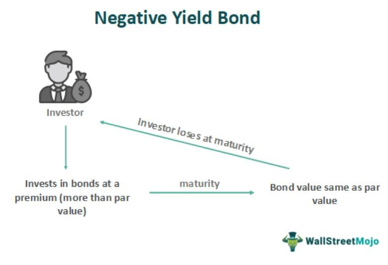

Financial markets are intricate systems involving a wide array of instruments, including stocks, bonds, and derivatives. These instruments facilitate the transfer of capital and risk, influencing the global economy. In recent years, one notable topic that has emerged within the bond market is the phenomenon of negative yield bonds. These bonds are peculiar because they offer a return that is less than the initial investment by the bondholder, challenging traditional investment logic.

The advent of negative yield bonds reflects broader macroeconomic trends and policies, including aggressive monetary policy measures like negative interest rates and quantitative easing employed by central banks. These policies aim to stimulate economies but have led to the unusual situation where investors accept bonds guaranteed to return less than their purchase price, primarily focusing on safety and liquidity rather than yield. Negative yield bonds have significant implications for the overall bond market and present unique challenges and opportunities for investors.



Alongside these developments in the bond market, the rise of algorithmic trading has profoundly influenced financial market dynamics. Algorithmic trading involves the use of automated systems to execute trades based on pre-defined criteria, leveraging speed and efficiency to capitalize on market trends and volatility. In the context of negative yield bonds, algorithmic trading can identify and exploit subtle market movements, benefiting from strategies like yield curve arbitrage and duration management.

Understanding the interplay between negative yield bonds, the bond market, and algorithmic trading is crucial for investors seeking to navigate today’s complex financial landscape. This article aims to elucidate these concepts and their interactions, providing insights and strategies that can assist in managing investments in an era where traditional financial paradigms are continually evolving.

## Table of Contents

## Understanding Negative Yield Bonds

Negative yield bonds represent an unusual scenario in financial markets where the bondholder receives less money upon the bond's maturity than the amount initially paid for it. This situation contradicts traditional expectations where investors earn interest as compensation for lending their capital.

### Key Drivers of Negative Bond Yields

The occurrence of negative yields is driven by several interconnected factors:

1. **Central Bank Policies**: Central banks play a significant role in the development of negative yield bonds through specific monetary policy instruments. One common tool is the implementation of negative interest rates, which are designed to incentivize spending and investment by making it costly to hold onto cash. Additionally, central banks may engage in quantitative easing (QE), which involves large-scale purchases of assets, including government bonds. These actions increase demand for fixed-income securities, thus driving up their prices and pushing yields lower, sometimes even into negative territory.

2. **Investor Behavior**: In periods of economic uncertainty, investors may exhibit behavior that prioritizes safety over returns. This can result in a flight to quality, where investors seek the security of government bonds despite negative yields, valuing the preservation of capital over the potential for gain. This behavior contributes to sustained demand for these bonds, maintaining or even further pushing down yields.

3. **Economic Conditions**: Certain economic environments naturally lead to negative yields. For instance, fears of deflation—where the general price level of goods and services declines over time—can make real returns on holding cash or cash-equivalent instruments negative. In such scenarios, the nominal negative yield on a bond may still offer a more favorable real return compared to the erosion of value from deflation.

These dynamics form the framework that supports the existence of negative yield bonds, marked by a confluence of policy actions and market sentiments that diverge from traditional financial logic. Understanding these factors is crucial for those engaged in modern financial markets, particularly amidst the complex, interconnected global economy.

## Reasons for Negative Yields

Negative yields can largely be attributed to central bank policies designed to stimulate economies by discouraging savings and encouraging spending and investment. Central banks, such as the European Central Bank and the Bank of Japan, have employed quantitative easing and negative [interest rate](/wiki/interest-rate-trading-strategies) policies as tools to achieve these objectives. By lowering interest rates below zero, central banks effectively charge financial institutions for holding excess reserves, thus incentivizing them to lend more to businesses and consumers.

Economic uncertainty and deflation fears also play a crucial role in driving yields negative. During periods of economic instability, investors often seek safe havens to protect their capital, causing a surge in demand for high-quality government bonds. This heightened demand drives up bond prices and, consequently, pushes yields further into negative territory. In environments where deflation is a concern, the real yield—or the yield after adjusting for inflation—can still be positive even if the nominal yield is negative, making bonds an attractive investment despite their negative nominal returns.

Moreover, regulatory requirements can compel financial institutions to hold large quantities of government securities, contributing to negative yields. Regulations such as Basel III require banks to maintain certain [liquidity](/wiki/liquidity-risk-premium) ratios, often leading them to purchase government bonds as low-risk assets to satisfy these requirements. This institutional demand can depress yields, particularly when combined with other factors.

Speculation can amplify the phenomenon of negative yields. Investors might speculate on further declines in interest rates or yield movements, anticipating capital gains from rising bond prices. This speculative behavior can perpetuate a cycle of increasing bond purchases and falling yields.

In summary, negative yields are influenced by a combination of central bank policies, investor behavior driven by economic uncertainty and deflation fears, regulatory requirements, and speculative activities. These factors collectively contribute to a complex financial environment where traditional notions of bond yields are frequently upended.

## Impact on the Bond Market

Negative yield bonds present a significant shift in traditional investing by fundamentally altering risk-reward expectations. Typically, investors purchase bonds to receive periodic interest payments and the return of the bond’s face value at maturity. However, negative yield bonds invert this expectation, where investors are guaranteed to receive less than they initially paid if held to maturity. This defies the conventional principle of investment returns compensating for risks and time preference, thereby reshaping bond market dynamics.

The presence of negative yield bonds impacts credit markets by distorting capital allocation. When significant portions of government or high-grade corporate debt yield negative returns, capital that would typically flow to these bonds in search of modest but positive returns might either shift to riskier assets in pursuit of yield or settle for the safety of negative yields during periods of heightened economic uncertainty. This shift can consequently lower the borrowing costs for issuers across the credit spectrum, inadvertently encouraging increased issuance of debt. Such distortions in the availability and pricing of credit can lead to inefficient allocation of resources within the economy.

Moreover, negative yield bonds contribute to the potential formation of financial bubbles. As traditional income-generating assets offer lower or negative returns, investors might be driven towards higher-yielding investments without sufficient regard for associated risks, inflating asset prices. This dynamic was observed during periods when central banks implemented ultra-loose monetary policies, pushing investors to search for yield across asset classes. When asset prices increase based primarily on the pursuit of yield rather than fundamental value, the market becomes susceptible to bubbles that may eventually burst, leading to market corrections and financial instability.

Issuers of negative yield bonds benefit significantly from this situation. With investors willing to accept negative returns, issuers enjoy the peculiar advantage of being effectively paid to borrow. This occurs because the bondholders are essentially paying a premium over the principal for the privilege of holding these securities, leading to situations where the issuer receives more at issuance than what they repay at maturity. This phenomenon has enabled sovereign and some corporate issuers in countries like Japan and Germany to issue debt at unprecedented favorable terms, supporting extensive fiscal stimuli or refinancing needs at minimal or even negative costs.

In summary, negative yield bonds create a complex landscape in the bond market by challenging traditional investment paradigms. They alter risk-reward calculus, distort capital allocation, affect credit markets, and present unusual benefits for issuers. Investors and policymakers must navigate these changes carefully, considering the broader implications on financial stability and economic health.

## Algorithmic Trading in the Bond Market

Algorithmic trading in the bond market is characterized by the use of automated systems that execute trades based on pre-defined criteria and strategies. These systems leverage computational algorithms to analyze market data and identify profitable opportunities. 

In the bond market, [algorithmic trading](/wiki/algorithmic-trading) is particularly effective in exploiting yield curve strategies. The yield curve, which plots the interest rates of bonds having equal credit quality but differing maturity dates, provides vital information on future interest rate changes and economic activity. Algorithms can execute trades to capitalize on these changes by employing strategies such as yield curve flattener and steepener trades. A flattener involves buying long-term bonds while selling short-term bonds if the yield curve is expected to flatten. Conversely, a steepener involves selling long-term bonds and buying short-term ones when the curve is anticipated to steepen.

Duration management strategies are another area where algorithmic trading offers advantages. Duration measures a bond's sensitivity to interest rate changes, and algorithms can be programmed to optimize holding periods to minimize risk or maximize returns in response to anticipated rate moves. Algorithms can quickly rebalance portfolios to match desired duration targets based on projected market conditions.

Arbitrage opportunities also present themselves in the bond market due to inefficiencies or mispricing. Algorithmic trading systems can observe and analyze thousands of bond prices and cross-market correlations simultaneously. When discrepancies are detected, such as differences in prices between similar bonds or derivatives, algorithms can execute trades in fractions of a second to profit from these variances before the market corrects them.

The speed and efficiency of algorithmic trading are particularly beneficial in taking advantage of the [volatility](/wiki/volatility-trading-strategies) associated with negative yield bonds. As bond prices change rapidly due to market sentiment, economic news, or policy shifts, algorithmic systems can instantaneously react to favorable conditions. This immediacy offers the potential to capture short-lived profits in a market where manual trading would be too slow.

Python, often used in algorithmic trading, provides libraries such as NumPy and Pandas for data manipulation and analysis, along with tools like TA-Lib for technical analysis. A simple example of algorithmic trading code might involve calculating the moving average of bond yields:

```python
import pandas as pd

# Suppose 'bond_yield_data.csv' is a file containing historical bond yield data.
data = pd.read_csv('bond_yield_data.csv', parse_dates=['Date'], index_col='Date')

# Calculate a 20-day moving average for bond yields.
data['20_MA'] = data['Yield'].rolling(window=20).mean()

# Implement a basic trading strategy to signal buy and sell
data['Signal'] = 0
data['Signal'][20:] = np.where(data['Yield'][20:] > data['20_MA'][20:], 1, 0)  # Buy
data['Position'] = data['Signal'].diff()  # Indicates where to buy or sell
```

In this code, the algorithm calculates a moving average to create a basic strategy signaling when to buy or sell based on yield trends relative to this average. More sophisticated algorithms can incorporate [machine learning](/wiki/machine-learning) models and real-time data feeds to adjust strategies dynamically.

## Strategies for Navigating Negative Yields

Carry trade strategies are a popular mechanism for navigating the challenging environment of negative yield bonds. These strategies involve borrowing funds at negative interest rates and investing in assets that offer higher yields. By capitalizing on the differential between borrowing costs and investment returns, investors can potentially generate profits despite the seemingly unfavorable conditions of negative yields. The core idea is to leverage low-cost financing to access more lucrative investment opportunities, often in international markets where yields might still be positive.

Yield curve strategies provide another way to exploit opportunities in a negative yield environment. These strategies center on predicting changes in the yield curve and involve techniques such as flattener and steepener trades. A yield curve flattener strategy is employed when an investor expects the yield curve to become less steep, which typically occurs when long-term interest rates decrease relative to short-term rates. Conversely, a steepener strategy is used when expecting the yield curve to steepen, meaning long-term rates increase relative to short-term rates. These strategies seek to profit from shifts in interest rate differentials across different maturities.

Diversification plays a crucial role in mitigating the risks associated with negative yield exposures. By spreading investments across a range of asset classes—including equities, real assets (such as real estate and commodities), and alternative investments (like hedge funds or private equity)—investors can reduce their reliance on fixed income returns alone. Diversification not only cushions the impact of negative yields but also enhances the overall risk-return profile of an investment portfolio. In particular, equities and real assets often provide inflation protection and growth potential that fixed income cannot offer in a low or negative yield environment.

In summary, while negative yield bonds present challenges, investors have multiple strategies to manage and potentially benefit from such conditions. By employing [carry](/wiki/carry-trading) trades, yield curve strategies, and diversification, investors can navigate the complexities of the bond market and achieve their financial objectives despite the prevailing low-yield backdrop.

## Conclusion

Negative yield bonds are emblematic of the intricate dynamics prevailing in modern financial markets, shaped largely by economic conditions and policy interventions. These instruments signify a shift from traditional risk-reward paradigms, where investors weigh potential losses against the security of their principal in an era of persistent economic uncertainty. Their emergence is largely attributable to central bank policies emphasizing negative interest rates and quantitative easing aimed at stimulating economic activity by incentivizing spending over saving.

Algorithmic trading emerges as a pivotal tool in this landscape, offering the ability to navigate the complexities presented by negative yields. Through the use of advanced algorithms and automated processes, traders can efficiently evaluate and exploit fleeting opportunities in the bond market, capitalizing on volatility more swiftly than manual processes would permit. However, reliance on algorithmic trading is fraught with inherent risks, including potential amplification of market volatility and errors stemming from algorithmic mispricing or design flaws.

For investors navigating these challenging conditions, a nuanced strategy is essential. A balanced approach that incorporates diversified strategies and active management can mitigate the negative impact of yield disparities. By leveraging carry trade strategies, yield curve techniques, and diversifying into equities and alternative investments, investors can position themselves favorably amid negative yields. This multi-faceted approach ensures that portfolios remain resilient, enhancing the potential for sustainable returns even when traditional strategies face limitations. The dynamic interplay of policy, economic conditions, and innovative trading mechanisms underscores the evolving nature of the bond market, necessitating adaptability and informed decision-making for successful investment outcomes.

## References & Further Reading

[1]: Vayanos, D., & Vila, J.-L. (2009). "A Preferred-Habitat Model of the Term Structure of Interest Rates." *NBER Working Papers*. [Link](https://www.nber.org/system/files/working_papers/w15487/w15487.pdf)

[2]: Bernanke, B. S. (2020). "The New Tools of Monetary Policy." *American Economic Review*, 110(4), 943-983. [Link](https://www.aea