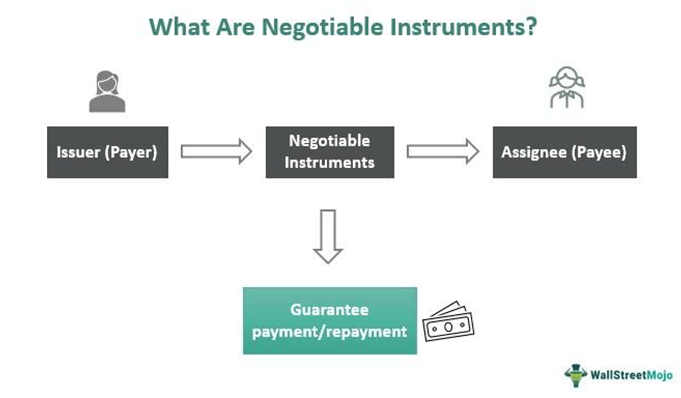

In the fast-evolving world of finance and trading, negotiable goods, securities contracts, and algorithmic trading play crucial roles. These elements are integral to the efficiency and dynamism of modern financial markets, fostering innovation and facilitating global commerce. Investors and traders continually seek ways to optimize their strategies for better returns, leveraging technology and sophisticated contracts to navigate the complexities of the market landscape.

Negotiable goods form the bedrock of trade, representing assets that can be easily transferred between parties, thus serving as the linchpin for smooth and efficient transactions. They encompass both tangible items and financial instruments, with commodities like gold, oil, and grains among the most traded globally. The liquidity and transferability of these goods are essential for ensuring seamless operations in commerce and the financial markets.



Securities contracts complement negotiable goods by providing the legal framework necessary for the trade of stocks, bonds, and derivatives. These contracts delineate the terms and conditions of transactions, offering clarity and legal backing that protects the interests of all parties involved. Their significance extends beyond simple transactions, facilitating risk management, hedging, and enabling large-scale financial activities.

Algorithmic trading (or algo trading) has revolutionized the execution of trades by utilizing computer algorithms to perform transactions at unprecedented speeds and frequencies. By employing complex mathematical models and automated processes, algo trading enhances decision-making and efficiency, particularly in high-frequency trading and portfolio management. This technological advancement minimizes trading costs and transforms the financial environment, driven by advances in technology and data analytics.

This article explores the interplay between these vital components—negotiable goods, securities contracts, and algorithmic trading—highlighting their significance in shaping the future of modern finance. Understanding how these elements work in tandem is crucial for creating value and achieving efficiency within the trading ecosystem. Starting with negotiable goods, the article will examine their pivotal role and importance, setting the stage for a deeper analysis of securities contracts and algorithmic trading. Through this exploration, readers will gain insights into how these components have become indispensable in securing competitive advantages in a rapidly transforming financial landscape.

## Table of Contents

## Understanding Negotiable Goods

Negotiable goods are integral to the efficient functioning of trade, acting as essential elements that ensure smooth and effective transactions. They stand as assets that can be effortlessly transferred between parties, frequently encompassing both tangible items and financial instruments. These assets are characterized by their liquidity and transferability, making them critical for commerce and financial markets globally.

One of the primary attributes of negotiable goods is their easy transferability, embodying the capability to move ownership or control from one entity to another seamlessly. This feature is foundational in a trading environment where speed and reliability are crucial. Negotiable goods typically include commodities like gold, oil, and grains, which are actively traded across international markets.

The [liquidity](/wiki/liquidity-risk-premium) of negotiable goods is another essential [factor](/wiki/factor-investing) contributing to their significance. Liquidity refers to the ease with which an asset can be converted into cash or used in transactions. This trait ensures that negotiable goods can quickly meet the financial demands of trading entities, facilitating dynamic trading operations and contributing to the vitality of global markets.

In practice, the management and trading of these goods entail a complex array of processes designed to optimize efficiency and performance. Efficient trading involves leveraging sophisticated techniques and technologies to track, analyze, and predict market trends, thereby ensuring seamless transactions. This technological integration aids in minimizing transaction costs while maximizing the returns from trades.

For instance, consider the trading of commodities like [crude oil](/wiki/crude-oil). The market for oil involves futures contracts, spot trading, and a host of derivative instruments. Efficient systems and platforms help manage this labyrinth of transactions, ensuring that stakeholders can communicate and transact at high speeds and low costs. This efficiency is paramount, as even minor delays can lead to significant financial discrepancies.

Modern trading platforms often incorporate data analytics and algorithmic strategies to enhance the management of negotiable goods. These platforms are programmed to automatically execute trades based on pre-set criteria, which helps streamline operations and reduce human error. This level of automation is crucial in handling large volumes of trades in global markets where negotiable goods are a significant category.

In summary, negotiable goods, with their liquidity and transferability, are vital to the structure of trade and commerce, enabling smooth and efficient operations across global markets. They are managed using a blend of traditional methods and modern technologies, ensuring that they meet the demands of contemporary financial environments. Understanding and managing these goods effectively is key to navigating and thriving in today’s dynamic and fast-paced trading ecosystems.

## Securities Contracts and Their Role

Securities contracts are pivotal legal guidelines established to facilitate the trade of securities like stocks, bonds, and derivatives. These documents meticulously detail the terms and conditions essential for ensuring clarity and providing legal assurance in the execution of trades. By defining these parameters, securities contracts serve a variety of functions fundamental to the smooth operation of financial markets.

Primarily, these contracts are intrinsic to managing risk. Through instruments such as options and futures, traders are afforded the ability to hedge against potential market [volatility](/wiki/volatility-trading-strategies). Options, for example, grant the buyer the right, but not the obligation, to buy or sell an underlying asset at a predetermined price before a specific expiration date. In contrast, futures contracts obligate the buyer to purchase, and the seller to sell, the asset at a set future date and price.

Below is a simple Python code example demonstrating the valuation of a call option using the Black-Scholes formula, a widely used model for pricing European options:

```python
from math import exp, log, sqrt
from scipy.stats import norm

def black_scholes_call(S, K, T, r, sigma):
    d1 = (log(S / K) + (r + 0.5 * sigma ** 2) * T) / (sigma * sqrt(T))
    d2 = d1 - sigma * sqrt(T)
    call_price = S * norm.cdf(d1) - K * exp(-r * T) * norm.cdf(d2)
    return call_price

# Example Parameters
S = 100  # Current stock price
K = 105  # Option exercise price
T = 1    # Time to expiration in years
r = 0.05 # Risk-free interest rate
sigma = 0.2 # Volatility

call_option_price = black_scholes_call(S, K, T, r, sigma)
print("Call Option Price:", call_option_price)
```

The importance of securities contracts also extends to facilitating large-scale financial transactions. In these contexts, the contracts provide a framework for the exchange of significant quantities of securities, reducing transaction costs and increasing market efficiency. This is critical as it allows markets to scale, enabling broader participation by both small and institutional investors.

The structuring of securities contracts involves a meticulous process, ensuring that all terms are tailored to meet the needs of market participants while adhering to regulatory requirements. This structuring often considers factors such as credit ratings, maturity dates, and interest payment schedules for bonds, while accounting for volatility and underlying asset behaviors for derivatives.

In financial markets, the implications of securities contracts are profound. They conjoin market participants with diverse expectations and requirements, allowing for the strategic management of portfolio risks and the acquisition of assets under favorable conditions. This interconnectedness fosters dynamic market environments where liquidity is enhanced and market prices reflect available information efficiently. As the financial landscape evolves, the refinement and adaptation of these contracts will continue to play a key role in driving financial innovation and stability.

## The Rise of Algorithmic Trading

Algorithmic trading, commonly referred to as algo trading, is a technological innovation that has revolutionized the financial markets. By utilizing computer algorithms, this trading method executes orders at speeds and frequencies unattainable by human traders. The core of [algorithmic trading](/wiki/algorithmic-trading) lies in its ability to leverage mathematical models and sophisticated data analytics to make precise trading decisions swiftly and autonomously.

**Mathematical Models and Systems**: At the heart of algorithmic trading are mathematical models which help in analyzing historical data to predict future market movements. These models incorporate complex statistical techniques, such as regression analysis and machine learning, to forecast price trends and potential market shifts. Here's a Python example demonstrating a simple linear regression model for predicting stock prices:

```python
from sklearn.linear_model import LinearRegression
import numpy as np

# Sample data: historical prices
X = np.array([1, 2, 3, 4, 5]).reshape(-1, 1)
y = np.array([100, 105, 110, 115, 120])

# Create and train the model
model = LinearRegression().fit(X, y)

# Predict future price
future_time = np.array([[6]])
predicted_price = model.predict(future_time)
print(f"Predicted stock price: {predicted_price}")
```

**High-Frequency Trading (HFT)**: A notable facet of algorithmic trading is High-Frequency Trading. HFT capitalizes on executing a large number of orders in fractions of a second. This is achieved via powerful computing systems co-located within exchange facilities to minimize latency.

**Portfolio Management and Cost Efficiency**: Algorithmic trading also facilitates efficient portfolio management. Algorithms can rebalance portfolios automatically, adjusting the asset mix according to predefined criteria, ensuring optimal returns and minimizing risks. Moreover, automation reduces trading costs by minimizing human errors and enhancing decision accuracy.

**Technological and Analytical Advancements**: The rise of algo trading has been significantly driven by technological advancements. Powerful computing, improved telecommunications infrastructure, and sophisticated data analytics have paved the way for more refined algorithms capable of processing and acting upon vast datasets in real-time.

**Benefits and Challenges**: Among the primary benefits of algorithmic trading is its ability to enhance liquidity in financial markets. By executing trades quickly, it also reduces transaction costs and slippage. However, this practice is not without challenges. The reliance on complex algorithms introduces systemic risks, where erroneous algorithms can cause significant market disruptions, as seen in past "flash crash" events.

Moreover, the competitive advantage offered by access to superior technology and data can lead to market disparities, where only firms with substantial resources can compete effectively. Therefore, regulatory oversight is crucial to mitigate these risks and ensure fair trading practices.

In conclusion, as the sophistication and accessibility of technology continue to evolve, algorithmic trading will remain an integral part of the financial markets, offering both opportunities and challenges. Capitalizing on the positive aspects while managing the associated risks is essential for the sustainable evolution of trading practices.

## Integration and Impact on Modern Trading

The integration of negotiable goods, securities contracts, and algorithmic trading has fundamentally altered the landscape of modern trading practices, offering numerous advantages such as enhanced liquidity, reduced transaction costs, and improved market efficiency. Each component plays a critical role, and their combined synergy provides significant benefits.

Enhanced liquidity is one of the most notable impacts of this integration. Algorithmic trading enables rapid execution and processing of trades, bridging the gap between buyers and sellers more efficiently. This instantaneous trade execution promotes higher turnover rates for negotiable goods, such as commodities and financial instruments, thereby increasing market liquidity. For instance, the advent of dark pools, which are private exchanges for trading large volumes without impacting public markets, showcases how algorithmic trading contributes to maintaining liquidity for securities contracts by reducing market impact.

Moreover, the combined use of securities contracts and algorithmic trading reduces transaction costs significantly. Algorithms streamline trade execution by optimizing order placement and timing, minimizing slippage and opportunity costs. For example, VWAP (Volume-Weighted Average Price) algorithms are extensively used to execute large orders incrementally to minimize price disruption, maintaining cost efficiency.

Market efficiency benefits greatly from this integration. Algorithmic trading removes human emotional involvement from trading decisions, ensuring more rational and data-driven decisions. The improved efficiency facilitates price discovery and aligns market prices closer to their intrinsic value. This is evident in the way high-frequency trading strategies, leveraging algorithmic techniques, contribute to narrowing bid-ask spreads, leading to a more efficient market environment.

Case studies demonstrate the profound impact of integration. One such example is the use of algorithmic trading in energy markets, where electricity futures contracts are traded. Energy companies utilize algorithms to optimize their hedging strategies, integrating various securities contracts to stabilize their financial positions amid volatile market conditions. This optimizes their trading outcomes and leads to innovation by allowing market participants to hedge effectively and price risks more accurately.

Looking ahead, the future of trading is poised to experience further transformation powered by the integration of these elements. As technology evolves, particularly with advancements in [artificial intelligence](/wiki/ai-artificial-intelligence) and [machine learning](/wiki/machine-learning), algorithmic trading strategies will become more sophisticated, interpreting vast amounts of data and refining trading strategies in real time. Financial institutions striving for a competitive edge will continue to invest in the development of advanced trading algorithms and more intricate securities contracts that can dynamically respond to market changes.

In conclusion, the integration of negotiable goods, securities contracts, and algorithmic trading is continuously shaping the future of trading, promising not only enhanced opportunities but also presenting new challenges. As these components become increasingly interconnected, participants in modern trading must evolve alongside these technological advancements to leverage the benefits while adeptly navigating the challenges posed by an ever-changing financial landscape.

## Conclusion

Negotiable goods, securities contracts, and algorithmic trading are foundational to the current financial ecosystem. Their interconnected roles significantly enhance the efficiency and dynamism of global markets. Negotiable goods, like commodities and financial instruments, are pivotal for providing liquidity and facilitating trade. Securities contracts provide the necessary legal frameworks, ensuring that transactions are conducted with transparency and reduced risk. Algorithmic trading uses sophisticated models to execute trades with unmatched speed and precision, optimizing costs and managing large volumes of transactions effortlessly.

Understanding these concepts allows traders and investors to skillfully navigate the complexities of modern finance. It is crucial to recognize how each component contributes to a streamlined trading process. For example, the rise of algorithmic trading has led to more efficient price discovery and tighter bid-ask spreads, benefiting both institutional and retail investors.

As technology continues to advance, these components will increasingly shape the future of trading. Innovations in artificial intelligence and data analytics promise to further revolutionize algorithmic trading, potentially leading to more sophisticated strategies and implementations. The integration of blockchain technology may enhance the security and efficiency of managing negotiable goods and executing securities contracts.

Staying informed and adaptable is essential for capitalizing on the opportunities presented by this evolving landscape. Financial professionals must continually update their skills and knowledge to remain competitive. Embracing technological advancements and understanding their implications will enable investors and traders to leverage these innovations fully, ensuring their success in the rapidly changing world of finance.

## References & Further Reading

[1]: Elliot, R., & Warr, R. S. (2003). ["Price Pressure on the NYSE and NASDAQ: Evidence from Institutional Buying and Selling."](https://papers.ssrn.com/sol3/Delivery.cfm?abstractid=453280) Journal of Financial and Quantitative Analysis, 38(1).

[2]: Hull, J. C. (2012). ["Options, Futures, and Other Derivatives."](https://www.semanticscholar.org/paper/Options%2C-Futures%2C-and-Other-Derivatives-Hull/89bdee500c8623864fc9eb7a471546aa713acc44) Pearson Education.

[3]: Narang, R. K. (2013). ["Inside the Black Box: The Simple Truth About Quantitative Trading."](https://onlinelibrary.wiley.com/doi/book/10.1002/9781118267738) Wiley.

[4]: Aldridge, I. (2013). ["High-Frequency Trading: A Practical Guide to Algorithmic Strategies and Trading Systems."](https://www.amazon.com/High-Frequency-Trading-Practical-Algorithmic-Strategies/dp/1118343506) Wiley.

[5]: Beber, A., & Brandt, M. W. (2009). ["Impact and Timing of Major Events on Liquid Assets' Returns."](https://papers.ssrn.com/sol3/papers.cfm?abstract_id=891736) Review of Financial Studies, 22(3).

[6]: Lopez de Prado, M. (2018). ["Advances in Financial Machine Learning."](https://www.amazon.com/Advances-Financial-Machine-Learning-Marcos/dp/1119482089) Wiley. 

[7]: Aronson, D. R. (2006). ["Evidence-Based Technical Analysis: Applying the Scientific Method and Statistical Inference to Trading Signals."](https://www.amazon.com/Evidence-Based-Technical-Analysis-Scientific-Statistical/dp/0470008741) Wiley.

[8]: Jansen, S. (2020). ["Machine Learning for Algorithmic Trading."](https://github.com/stefan-jansen/machine-learning-for-trading) Packt Publishing.

[9]: Chan, E. P. (2008). ["Quantitative Trading: How to Build Your Own Algorithmic Trading Business."](https://github.com/ftvision/quant_trading_echan_book) Wiley.