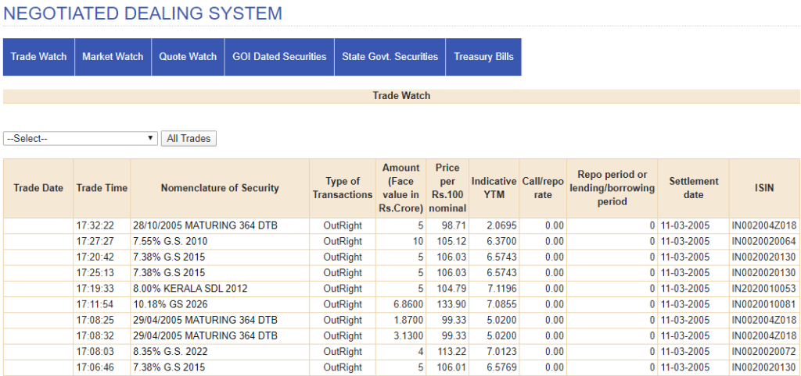

## Table of Contents

## What is the Negotiated Dealing System (NDS)?

The Negotiated Dealing System (NDS) is a platform used by banks and financial institutions to buy and sell government securities in India. It helps these institutions trade bonds and other securities easily and quickly. The system is managed by the Reserve Bank of India (RBI), which makes sure that all trades are done fairly and safely.

NDS makes trading easier by allowing dealers to see the prices at which securities are being bought and sold. This helps them make better decisions about when to buy or sell. The system also keeps track of all trades, which helps in maintaining transparency and reducing the chances of fraud. Overall, NDS plays a crucial role in the smooth functioning of the government securities market in India.

## How does the NDS facilitate trading in government securities?

The Negotiated Dealing System (NDS) makes trading government securities in India easier by providing a platform where banks and financial institutions can buy and sell these securities. It shows the prices at which securities are being traded, helping dealers decide when to buy or sell. This means dealers can see what others are doing and make better choices.

The system also keeps a record of all trades, which makes everything clear and helps prevent cheating. The Reserve Bank of India (RBI) runs the NDS and makes sure that all trades are fair and safe. By doing this, the NDS helps the government securities market work smoothly and efficiently.

## Who can become a member of the NDS?

Membership in the Negotiated Dealing System (NDS) is open to banks and primary dealers in India. Banks, including both public and private sector banks, can become members if they meet the criteria set by the Reserve Bank of India (RBI). Primary dealers, who are financial institutions specialized in trading government securities, are also eligible to join the NDS.

To become a member, these institutions need to apply to the RBI and follow certain rules. The RBI checks if the applicants are reliable and have the right systems in place to trade safely and fairly. Once approved, members can use the NDS to buy and sell government securities, helping them manage their investments better.

## What are the different types of membership available in the NDS?

There are two main types of membership in the Negotiated Dealing System (NDS): direct members and indirect members. Direct members can trade directly on the NDS platform. This type of membership is usually for banks and primary dealers who meet the criteria set by the Reserve Bank of India (RBI). They can see the prices of securities and make trades on their own.

Indirect members, on the other hand, cannot trade directly on the NDS. They need to go through a direct member to make trades. This type of membership is for smaller financial institutions or those that do not meet the criteria for direct membership. They still benefit from the NDS but rely on direct members to [carry](/wiki/carry-trading) out their trades.

## What are the benefits of becoming an NDS member?

Becoming a member of the Negotiated Dealing System (NDS) offers several benefits. For direct members, like banks and primary dealers, it means they can trade government securities directly on the platform. This gives them a clear view of the market prices, helping them make better trading decisions. They can also manage their investments more effectively because they have direct access to the latest information and can trade quickly.

Indirect members also gain from being part of the NDS, even though they trade through direct members. They can still take part in the government securities market, which might be hard for them to do on their own. This way, smaller financial institutions can benefit from the transparency and efficiency of the NDS without needing to meet the strict criteria for direct membership. Overall, being an NDS member helps both types of members trade more safely and efficiently.

## How does one apply for NDS membership?

To apply for NDS membership, banks and primary dealers need to contact the Reserve Bank of India (RBI). They should fill out an application form that the RBI provides. The form asks for details about the institution, like its financial status and trading systems. The RBI will check this information to make sure the applicant is reliable and has the right systems in place to trade safely and fairly.

Once the application is submitted, the RBI will review it carefully. If everything is in order and the institution meets the criteria, the RBI will approve the membership. Direct members can then start trading directly on the NDS platform, while indirect members will need to work through a direct member to make trades. This process helps ensure that only qualified institutions can join the NDS, keeping the trading environment safe and transparent.

## What are the operational requirements for NDS members?

To be an NDS member, banks and primary dealers need to have good systems for trading. They must use secure technology to make sure their trades are safe. They also need to keep good records of all their trades. This helps the RBI check that everything is done correctly. Members must follow the rules set by the RBI, like reporting trades on time and making sure they have enough money to cover their trades.

For direct members, they need to be able to trade on their own on the NDS platform. They must have the right software and staff to do this. Indirect members don't trade directly, but they still need to work with a direct member. They should have a good relationship with their direct member to make sure their trades go smoothly. Both types of members need to stay updated with any changes in the rules or technology used by the NDS.

## How does the NDS ensure the security and integrity of transactions?

The NDS keeps transactions safe and honest by using strong security measures. It uses special technology to make sure that only people who are supposed to can trade on the platform. This means that all trades are done by trusted members who follow the rules. The system also keeps a close watch on all trades, making sure that everything is recorded correctly and no one can cheat.

The Reserve Bank of India (RBI) plays a big role in making sure the NDS stays secure. They check all the trades to make sure they are fair and follow the rules. If something looks wrong, the RBI can step in to fix it. This helps keep the whole system honest and safe for everyone who uses it.

## What are the recent updates or enhancements made to the NDS?

The Negotiated Dealing System (NDS) has seen some important updates recently to make it work better. One big change is the introduction of the NDS-OM (Order Matching) system. This new part of the NDS lets members trade government securities in a way that's more like a stock market. It matches buy and sell orders automatically, which makes trading faster and easier. This update helps members get better prices and trade more quickly.

Another update is the improvement in the reporting system. Now, members have to report their trades faster and in more detail. This helps the Reserve Bank of India (RBI) keep a closer eye on the market and make sure everything is fair. These changes make the NDS more transparent and efficient, helping everyone who uses it to trade government securities more safely and effectively.

## How does the NDS integrate with other financial systems or platforms?

The NDS works well with other financial systems and platforms to make trading easier. It connects with the Clearing Corporation of India Limited (CCIL), which helps settle trades safely. This means that when someone buys or sells a security on the NDS, CCIL makes sure the trade goes through smoothly and everyone gets what they're supposed to. The NDS also shares information with other systems like the RBI's e-Kuber platform, which helps manage the government's money and keep track of transactions.

These connections help the NDS work better because it can use information from other systems to make trading faster and safer. For example, by linking with CCIL, the NDS can quickly check if a member has enough money to make a trade. And by working with e-Kuber, the NDS can make sure that all trades follow the rules set by the RBI. This way, the NDS helps keep the government securities market running smoothly and safely.

## What are the common challenges faced by NDS members and how can they be addressed?

NDS members often face challenges like keeping up with technology changes and making sure they follow all the rules. The NDS is always getting updates, so members need to learn how to use new features quickly. This can be tough, especially if they don't have a lot of staff to help. Also, the RBI has strict rules that members must follow. If they make a mistake, they could get in trouble, which can be stressful.

To deal with these challenges, NDS members can focus on training their staff to use new technology. They can set up regular training sessions to make sure everyone knows how to use the latest features. For following the rules, members can set up good systems for checking their work. They can also talk to the RBI if they're not sure about something, which can help them stay on the right track. By doing these things, NDS members can handle the challenges better and keep trading smoothly.

## What future developments are expected for the NDS and how might they impact its members?

In the future, the NDS might get even better with new technology. They might add more ways to trade, like using smartphones or other devices. This could make trading easier and faster for members. The NDS might also use smart technology, like [artificial intelligence](/wiki/ai-artificial-intelligence), to help members make better trading choices. This could mean the system gives advice on when to buy or sell, making trading more efficient.

These changes could help members a lot, but they might also face new challenges. Members will need to learn how to use new technology, which could be hard at first. They might need to spend more time training their staff. But once they get used to it, the new features could help them trade better and make more money. The NDS will keep working with the RBI to make sure all these changes are safe and fair for everyone.

## References & Further Reading

[1]: Mishra, A. K., & Zipser, B. (2013). ["Developing Treasury and Debt Markets in Asia: An Overview of Recent Reforms."](https://onlinelibrary.wiley.com/doi/pdf/10.1016/j.jom.2013.07.006) Asian Development Bank.

[2]: Reserve Bank of India. (2002). ["Introduction of Negotiated Dealing System (NDS) Platform and Its Benefits."](https://www.rbi.org.in/scripts/NDSIndex.aspx)

[3]: Reserve Bank of India. ["Report on Implementation of Negotiated Dealing System."](https://www.rbi.org.in/Scripts/NdsUserXsl.aspx)

[4]: ["Clear Markets: A Case Study of CCIL - Analyzing the Structured Development of the NDS."](https://www.ccilindia.com/) Clearing Corporation of India Ltd.

[5]: Saunders, A., & Cornett, M. M. (2011). ["Financial Markets and Institutions"](https://www.amazon.com/Financial-Markets-Institutions-Anthony-Saunders/dp/1259919714), McGraw-Hill Education.

[6]: Biswajit, Ch. (2015). ["Evolution of the Indian Financial System and Related Reforms."](https://www.nyayasastra.com/post/historical-evolution-of-the-indian-financial-system) Journal of Economic and Financial Studies.