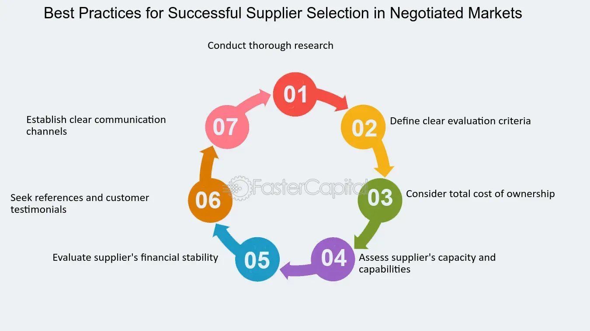

## Table of Contents

## What is a negotiated market?

A negotiated market is a type of market where the prices of goods or services are determined through direct discussions and agreements between buyers and sellers. Instead of having fixed prices, both parties talk to each other to reach a price that they both find acceptable. This kind of market is common in situations where the products or services are unique or customized, and standard prices don't apply.

In a negotiated market, the final price can depend on many things, like how much the buyer wants the product, how much the seller needs to sell it, and what other options are available. For example, when buying a car, the buyer and the car dealer might negotiate the price until they agree on a number that works for both. This way, both the buyer and the seller feel happy with the deal they made.

## How does a negotiated market differ from other types of markets?

A negotiated market is different from other types of markets because it doesn't have set prices. Instead, buyers and sellers talk to each other to agree on a price that works for both. This is different from a fixed price market, where the price is the same for everyone and you can't change it. For example, when you buy groceries, the price on the tag is what you pay, and you can't negotiate it.

In a negotiated market, the price can change based on how much the buyer wants the item and how much the seller needs to sell it. This is different from an auction market, where people bid against each other and the highest bidder wins. In an auction, the price goes up as more people want the item, but in a negotiated market, the price is set through private talks between the buyer and seller. This makes negotiated markets more flexible and personal, but it can also take more time and effort to reach a deal.

## What are the key components of a negotiated market?

In a negotiated market, the main thing is that buyers and sellers talk to each other to agree on a price. They don't just accept a price that's already set. Instead, they discuss until they find a price that both are happy with. This kind of market works well for things that are special or different, like buying a house or a piece of art. The price can change based on how much the buyer wants the item and how much the seller needs to sell it.

Another important part of a negotiated market is that it's more personal and flexible than other markets. Because the price is set through talking, both the buyer and the seller can feel good about the deal they made. But, it can take more time and effort to reach an agreement. In the end, a negotiated market is all about finding a price that works for both people through talking and understanding each other's needs.

## Can you explain the basic mechanism of a negotiated market?

In a negotiated market, the price of something is not set in stone. Instead, the buyer and the seller talk to each other to find a price that they both like. This happens because the thing they are buying or selling might be special or different, like a house or a piece of art. The buyer might say, "I want to pay this much," and the seller might say, "I need at least this much." They keep talking until they find a price that works for both of them.

This kind of market is more personal and flexible than other markets. Because the price is decided through talking, both the buyer and the seller can feel good about the deal they made. But, it can take more time and effort to reach an agreement. In the end, a negotiated market is all about finding a price that works for both people through talking and understanding each other's needs.

## Who are the typical participants in a negotiated market?

In a negotiated market, the main people involved are the buyers and the sellers. Buyers are the ones who want to buy something, like a car or a house. They talk to the sellers, who are the ones who have the thing to sell. Both the buyer and the seller need to agree on a price that they both like.

Sometimes, other people can be involved too. For example, a buyer might bring a friend or a family member to help them decide. Or, a seller might have a salesperson or an agent who helps them talk to the buyer. But no matter who else is there, the main people are always the buyer and the seller, and they are the ones who need to agree on the price.

## What are the advantages of using a negotiated market?

One big advantage of using a negotiated market is that it lets buyers and sellers find a price that works for both of them. Because they talk to each other, they can understand what each other needs and wants. This can lead to a deal where both the buyer and the seller feel happy. For example, if a buyer really wants a special piece of art, they might be willing to pay more. But if the seller needs to sell it quickly, they might agree to a lower price. This flexibility can make everyone feel good about the deal.

Another advantage is that negotiated markets can be more personal. When buyers and sellers talk to each other, they can build a relationship. This can be important for things like buying a house or a car, where trust matters. Also, because the price isn't set, buyers might be able to get a better deal if they are good at negotiating. This can save them money and make them feel like they got a good deal. Overall, negotiated markets can lead to better deals and happier customers.

## What are the potential disadvantages or challenges of a negotiated market?

One challenge of a negotiated market is that it can take a lot of time and effort. When buyers and sellers have to talk to each other to agree on a price, it can take many meetings or phone calls. This can be tiring and frustrating, especially if they can't agree quickly. For example, if you're trying to buy a car, you might spend hours at the dealership going back and forth on the price. This can make the whole process feel long and hard.

Another disadvantage is that not everyone is good at negotiating. Some people might feel nervous or unsure when they have to talk about prices. This can make it hard for them to get a good deal. If a buyer isn't good at negotiating, they might end up paying more than they should. On the other hand, if a seller isn't good at it, they might have to sell their item for less than they wanted. This can make the whole experience stressful and unfair for some people.

## How is price determined in a negotiated market?

In a negotiated market, the price is decided through talking between the buyer and the seller. They don't just accept a price that's already set. Instead, they discuss until they find a price that both are happy with. This happens because the thing they are buying or selling might be special or different, like a house or a piece of art. The buyer might say, "I want to pay this much," and the seller might say, "I need at least this much." They keep talking until they find a price that works for both of them.

The price can change based on how much the buyer wants the item and how much the seller needs to sell it. For example, if a buyer really wants a special piece of art, they might be willing to pay more. But if the seller needs to sell it quickly, they might agree to a lower price. This kind of market is more personal and flexible than other markets. Because the price is decided through talking, both the buyer and the seller can feel good about the deal they made.

## What role does negotiation play in the functioning of a negotiated market?

Negotiation is the key part of how a negotiated market works. It's all about the buyer and seller talking to each other to find a price they both like. They don't just take a price that's already set. Instead, they discuss until they agree on a number that works for both of them. This is important because the thing they are buying or selling might be special or different, like a house or a piece of art. The buyer might say, "I want to pay this much," and the seller might say, "I need at least this much." They keep talking until they find a price that makes both happy.

The way they negotiate can change the price a lot. It depends on how much the buyer wants the item and how much the seller needs to sell it. For example, if a buyer really wants a special piece of art, they might be willing to pay more. But if the seller needs to sell it quickly, they might agree to a lower price. This kind of market is more personal and flexible than other markets. Because the price is decided through talking, both the buyer and the seller can feel good about the deal they made.

## Can you provide examples of industries or sectors where negotiated markets are commonly used?

Negotiated markets are commonly used in the real estate industry. When people buy or sell houses, the price isn't set in stone. Instead, the buyer and seller talk to each other to agree on a price that works for both. This is because every house is different, and the price can change based on things like the location, size, and condition of the house. The buyer might say they want to pay a certain amount, and the seller might say they need more. They keep talking until they find a price that makes both happy.

Another industry where negotiated markets are often used is the art world. When someone wants to buy a painting or a sculpture, the price isn't fixed. The buyer and the artist or gallery owner discuss to find a price that they both like. This is because each piece of art is unique, and its value can depend on things like the artist's fame, the size of the artwork, and how much the buyer wants it. The buyer might offer a certain amount, and the seller might counter with a different price. They keep negotiating until they reach a deal that works for both.

## How do regulations affect the operation of negotiated markets?

Regulations can affect how negotiated markets work by setting rules that buyers and sellers have to follow. For example, in the real estate market, there might be laws about how much information a seller has to give to a buyer. This can change how they talk about the price. If a seller has to tell the buyer about problems with the house, the buyer might be able to negotiate a lower price. Also, some places have rules about how much a seller can raise the price during a negotiation. This can make the talks more fair and help both sides feel better about the deal.

In some industries, like the art world, regulations might not be as strict. But there can still be rules about things like how art is sold at auctions or how much artists can charge for their work. These rules can affect how much buyers and sellers can negotiate. For example, if there's a rule that says an artist has to sell their work for at least a certain amount, it can limit how much the buyer can negotiate the price down. Overall, regulations can make negotiated markets more fair and clear, but they can also make it harder for buyers and sellers to reach a deal that works for both.

## What advanced strategies can participants use to optimize outcomes in a negotiated market?

In a negotiated market, one advanced strategy that participants can use is to do a lot of research before they start talking about the price. Buyers should learn as much as they can about the thing they want to buy, like how much it usually costs and what other people are paying for it. This can help them know if the seller's price is fair and give them a good starting point for the negotiation. Sellers can also do research to find out what similar items are selling for and what buyers are willing to pay. This can help them set a good starting price and be ready for the buyer's offers.

Another strategy is to be good at listening and understanding the other person's needs. When buyers and sellers talk to each other, they should try to find out what the other person really wants. For example, a buyer might want to pay less, but they might also care about getting the item quickly. If the seller can offer a fast delivery, they might be able to keep the price higher. On the other hand, a seller might need to sell the item quickly, so they might be willing to accept a lower price if the buyer can pay right away. By understanding what the other person needs, both sides can find a deal that works for them.

A third strategy is to be ready to walk away if the deal isn't good enough. Sometimes, the best way to get a better price is to show that you're willing to leave if you don't get what you want. For buyers, this means being ready to look at other options if the seller won't lower the price. For sellers, it means being ready to wait for another buyer if the current one won't pay enough. This can make the other person think harder about their price and be more willing to negotiate. By using these strategies, participants in a negotiated market can get better deals and feel happier with the outcome.

## References & Further Reading

[1]: Harris, L. (2003). ["Trading and Exchanges: Market Microstructure for Practitioners."](https://www.amazon.com/Trading-Exchanges-Market-Microstructure-Practitioners/dp/0195144708) Oxford University Press.

[2]: Hasbrouck, J. (2007). ["Empirical Market Microstructure: The Institutions, Economics, and Econometrics of Securities Trading."](https://academic.oup.com/book/52241) Oxford University Press.

[3]: Aldridge, I. (2010). ["High-Frequency Trading: A Practical Guide to Algorithmic Strategies and Trading Systems."](https://www.ahmetbeyefendi.com/wp-content/uploads/2020/07/High-Frequency-Trading-Irene-Aldridge.pdf) Wiley Trading.

[4]: O'Hara, M. (1995). ["Market Microstructure Theory."](https://openlibrary.org/books/OL1103097M/Market_microstructure_theory) Blackwell Publishers.

[5]: Bouchaud, J-P., & Potters, M. (2003). ["Theory of Financial Risk and Derivative Pricing: From Statistical Physics to Risk Management."](https://www.cambridge.org/core/books/theory-of-financial-risk-and-derivative-pricing/5BBBA04CE72ED9E5E7C1C028D9A94FCB) Cambridge University Press.