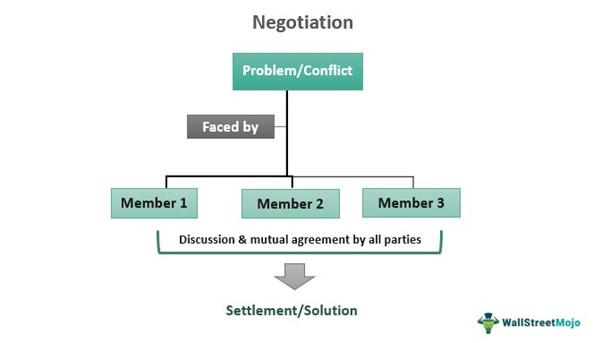

The financial markets operate through various mechanisms that facilitate the buying and selling of securities. One of the essential components in this environment is the market structure itself, where negotiated markets play a pivotal role. These markets contribute to a dynamic and complex ecosystem enabling direct negotiation of security prices between buyers and sellers without the intervention of intermediaries. This structural characteristic presents both opportunities and challenges.

Negotiated markets function differently compared to traditional exchange-based trading environments, relying heavily on the principles of supply and demand. They provide a platform where buyers place bid orders and sellers place ask orders, directly influencing price discovery. However, the intrinsic inefficiency of these markets contrasts with more automated mechanisms like auction markets due to the time-consuming nature of trade negotiations.



This article explores the interaction between negotiated markets, market mechanisms, and advanced trading technologies such as algorithmic trading (algo trading). As technology revolutionizes financial market operations, the significance of these components becomes increasingly apparent. Algorithmic trading, utilizing sophisticated computer algorithms, executes trades at speeds and frequencies far beyond human capability. This innovation has optimized trading strategies, enhancing liquidity and reducing transaction costs while simultaneously increasing concerns about market stability.

The integration of these concepts forms a modern financial landscape where traditional negotiation techniques integrate with technology-driven efficiencies. As such, understanding how negotiated markets, market mechanisms, and algo trading interconnect is crucial for creating an efficient trading ecosystem. Through this exploration, we will see how these elements converge to form a more dynamic and possibly disruptive market environment, shaping the future of financial markets.

## Table of Contents

## Understanding Negotiated Markets

Negotiated markets represent a type of secondary market where trading participants engage in direct price negotiations without the involvement of intermediaries such as market makers. This market structure stands in contrast to auction markets, which utilize a centralized order book to match buy and sell orders through an auction process. Instead, negotiated markets hinge on the principles of supply and demand, whereby potential buyers submit bid prices and sellers issue ask prices. The interaction between these bid and ask prices allows for the determination of a final transaction price, reflecting the current market equilibrium for the specific security being traded.

One significant attribute of negotiated markets is the inherent inefficiency due to the manual and often time-consuming nature of trade negotiations. Unlike auction markets, where transactions can be executed rapidly and automatically through electronic systems, negotiated markets require direct communication and agreement between parties. This necessity for personal negotiation results in extended timeframes for trade completion, higher transaction costs, and reduced liquidity.

The inefficiency of negotiated markets, while a drawback, also caters to the trading of less standardized or more complex securities that require bespoke negotiations to determine appropriate valuations. These markets are adaptable to securities lacking the requisite [volume](/wiki/volume-trading-strategy) or standardization necessary for auction markets. Typically, negotiated markets are utilized for trading over-the-counter (OTC) securities, including various derivatives, exotic or structured products, and non-standardized contracts, which do not easily fit into the framework of an exchange.

In summary, while negotiated markets play a crucial role in accommodating diverse and complex financial instruments, their operational inefficiencies pose challenges. These inefficiencies hamper market fluidity compared to auction markets, yet they offer the flexibility needed for individualized negotiation and tailored trading solutions.

## Market Mechanisms in Financial Markets

Market mechanisms in financial markets are essential frameworks that enable participants to [carry](/wiki/carry-trading) out trades under established regulations and processes. These mechanisms are integral to the structure and function of financial markets, as they offer the procedural infrastructure needed to facilitate the buying and selling of securities, commodities, and other assets. Markets can be categorized into various types based on the rules and processes they employ.

One prominent type of market mechanism is the organized exchange. These exchanges, such as the New York Stock Exchange (NYSE) or the London Stock Exchange (LSE), operate under stringent regulations with formalized trading rules designed to standardize and streamline transactions. In these environments, the trading of securities is highly structured, with defined listing requirements, trading hours, and settlement processes. Organized exchanges help ensure market transparency and reliability by providing a centralized location where supply and demand for securities converge.

Conversely, negotiated markets or over-the-counter (OTC) trades represent a more decentralized approach to trading. In OTC markets, trades are executed directly between two parties without such centralized oversight as found in traditional exchanges. This means that the terms of the trade, including price, are negotiated directly by the parties involved. OTC markets are prevalent in areas like foreign exchange or derivative trading, where bespoke contracts and arrangements can be more suited to trader needs than standard exchange offerings.

A thorough understanding of these market mechanisms is vital for grasping market dynamics and the flow of capital. The diverse structures in financial markets influence [liquidity](/wiki/liquidity-risk-premium), price discovery, and risk management. For instance, organized exchanges benefit from greater liquidity and more efficient price discovery due to the volume and transparency of trades. In contrast, OTC markets can offer more flexible solutions tailored to specific trading strategies or risk profiles but might suffer from reduced transparency and liquidity.

These mechanisms also determine how effectively markets respond to supply and demand fluctuations, affecting overall economic stability. In organized markets, this can be seen in the bids and offers that allow for continuous price adjustment based on the prevailing market sentiment. In contrast, negotiated markets might exhibit slower adjustments since trades depend on individual negotiations.

In conclusion, market mechanisms vary considerably in their structure and function, significantly impacting how capital flows through the financial system. Understanding the differences between organized exchanges and negotiated markets equips market participants to navigate these environments effectively, optimizing strategies and ensuring compliance within defined regulatory frameworks.

## The Role and Impact of Algorithmic Trading

Algorithmic trading, often referred to as algo trading, utilizes computer algorithms to automate the execution of trade orders. By leveraging advanced mathematical models and data analysis, algo trading systems can make decisions and execute trades at speeds that are impossible for humans. This capability is critical in modern financial markets, where milliseconds can significantly impact trading outcomes.

Algo trading optimizes trading strategies by evaluating vast amounts of historical and real-time market data. Algorithms are programmed to identify profitable trading opportunities based on pre-defined criteria, such as price movements, timing, or other complex variables. This form of trading significantly enhances market efficiency by increasing the liquidity available in the market. Liquidity, the ease with which an asset can be bought or sold without affecting its price, is crucial for minimizing transaction costs and ensuring stable market conditions.

The reduction in transactional costs is another significant benefit of [algorithmic trading](/wiki/algorithmic-trading). By automating processes, algo trading minimizes the bid-ask spread—the difference between the price buyers are willing to pay and the price sellers are willing to accept. A narrower spread typically translates into lower costs for traders, thereby improving the overall trading experience and making markets more accessible to a broader range of participants.

However, despite its benefits, algo trading also raises concerns regarding market stability. High-frequency trading ([HFT](/wiki/high-frequency-trading-strategies)), a subset of algorithmic trading that involves executing a large number of orders at extremely high speeds, has been a particular focus of scrutiny. While HFT can provide liquidity, its propensity to react to market signals at high speeds can lead to increased [volatility](/wiki/volatility-trading-strategies) in the market. Instances such as "flash crashes," where the market experiences rapid price declines followed by a swift recovery, are often cited as examples of the potential negative impact of unregulated algorithmic activities on market stability.

In conclusion, while algorithmic trading is a cornerstone of modern financial markets, offering enhanced efficiency, liquidity, and reduced transaction costs, it necessitates careful oversight. Regulatory frameworks are essential to ensure that the benefits of algo trading are achieved without compromising the market's integrity and stability. As technology continues to evolve, striking the right balance between innovation and regulation will remain a key challenge for financial market stakeholders.

## Integration of Negotiated Markets and Algo Trading

Negotiated markets and algorithmic trading represent two distinct paradigms within financial markets, yet they can converge in innovative ways. Negotiated markets, where prices are agreed upon directly between buyers and sellers, are typically less fluid and more reliant on human interaction. In contrast, algorithmic trading employs computational algorithms to automatically execute trades, often at speeds and volumes beyond human capability.

Despite these differences, algorithmic trading can influence negotiated markets through several mechanisms. First, algorithms can process vast amounts of data to identify favorable pricing opportunities that would otherwise go unnoticed. By assessing historical data and current market conditions, algo systems can suggest optimal bid and ask prices, potentially enhancing the efficiency of negotiated markets.

Moreover, algorithms can increase transparency by facilitating the collection and dissemination of information. This can aid participants in negotiated markets by providing a clearer picture of current market conditions, thereby informing their negotiation strategies. For instance, [order book](/wiki/order-book-trading-strategies) algorithms, which aggregate buy and sell orders, can provide insights into market depth, enabling better price discovery.

### Example: Market Making Algorithms

Consider [market making](/wiki/market-making) algorithms that provide liquidity by continuously quoting buy and sell prices. These algorithms can operate within negotiated markets by offering continuously updated prices based on prevailing market conditions. Such algorithms not only improve pricing accuracy but also reduce the bid-ask spread, thereby lowering transaction costs.

```python
# Example python code for a simple market making algorithm

class MarketMaker:
    def __init__(self, asset, spread, inventory):
        self.asset = asset
        self.spread = spread
        self.inventory = inventory

    def provide_quote(self, market_price):
        buy_price = market_price - self.spread / 2
        sell_price = market_price + self.spread / 2
        return buy_price, sell_price

market_maker = MarketMaker("stock_XYZ", 0.05, 100)
market_price = 50.0
buy_price, sell_price = market_maker.provide_quote(market_price)
```

This code snippet illustrates a simple market-making algorithm that calculates buy and sell prices based on a given market price and predefined spread. Such algorithms can be adapted for use in negotiated markets to streamline price negotiations and improve execution efficiency.

In summary, while negotiated markets and algorithmic trading may initially seem at odds, their integration can foster a more efficient market environment. By optimizing prices and improving transparency, algorithmic strategies can enhance the traditional negotiation processes, striking a balance between human judgment and computational precision. This synergy represents a blend of traditional market mechanisms with cutting-edge technological advancements, paving the way for a dynamic financial ecosystem.

## Challenges and Considerations

Negotiated markets and algorithmic trading, although offering significant benefits in financial market operations, bring with them distinct challenges. Negotiated markets, characterized by direct interactions between buyers and sellers, often face inefficiencies. These inefficiencies arise from the time and effort required to conclude trades without intermediaries. This inefficiency contrasts with more streamlined auction markets and can lead to significant delays and increased transaction costs. The reliance on manual negotiation can sometimes result in non-competitive pricing and reduced liquidity, further complicating trade execution.

On the other hand, algorithmic trading, while enhancing market efficiency by automating trades and reducing transaction costs, introduces the risk of rapid and unpredictable market movements, commonly referred to as flash crashes. These events occur when algorithms, driven by complex data patterns and trading signals, lead to extreme market volatility in very short periods. Flash crashes undermine market stability and can lead to significant financial losses within seconds, raising concerns about the robustness of algorithmic systems.

Regulatory scrutiny intensifies as technological innovations in markets progress. Authorities are increasingly focused on ensuring that these advancements do not compromise fair and transparent trading practices. Regulatory bodies work to establish frameworks that balance innovation with investor protection, promoting market stability. This involves setting guidelines for the use of high-frequency trading systems and monitoring their impact on market conditions.

Navigating these challenges demands a balanced approach that fosters innovation while safeguarding market integrity. Market participants must embrace technological advancements responsibly, incorporating robust risk management strategies. This includes implementing safeguards such as circuit breakers and kill switches to prevent runaway algorithms from destabilizing markets. Collaboration between regulators, trading entities, and technology providers is imperative to develop solutions that enhance market efficiency without compromising security and fairness. By prioritizing the integrity of financial markets, stakeholders can ensure that technological evolutions contribute positively to the trading ecosystem.

## Conclusion

The convergence of negotiated markets, market mechanisms, and algorithmic trading signifies a transformative phase in financial market operations. Each of these elements plays a distinct role in the trading ecosystem. Negotiated markets focus on direct buyer-seller negotiations, offering flexibility and price discovery opportunities. Market mechanisms, whether organized exchanges or over-the-counter systems, define the rules and processes for trade execution, shaping market dynamics. Algorithmic trading leverages advanced computing techniques to optimize trading strategies, providing liquidity and reducing transaction costs at speeds unattainable by human traders.

The integration of these components fosters a more efficient and dynamic market environment. Negotiated markets benefit from increased transparency and optimized pricing through the indirect influence of algorithmic strategies. Market mechanisms adapt to technological advancements, seamlessly incorporating algo trading into their frameworks to enhance operational efficiency.

Despite this potential, such integration can also lead to disruptions. The rapid pace at which algorithmic trading occurs may contribute to market instability, highlighted by events like flash crashes. Moreover, the complexity of these systems necessitates heightened regulatory scrutiny to maintain market integrity.

As the financial sector continues to embrace technology, understanding these elements' interconnections becomes increasingly vital for market participants. Adapting to and thriving within this evolving landscape requires not only an appreciation of the distinct features of each market element but also a strategic approach to leveraging their synergies. This understanding is key to navigating and contributing to the future of financial markets.

## References & Further Reading

[1]: Harris, L. (2003). ["Trading and Exchanges: Market Microstructure for Practitioners."](https://www.amazon.com/Trading-Exchanges-Market-Microstructure-Practitioners/dp/0195144708) Oxford University Press.

[2]: Hasbrouck, J. (2007). ["Empirical Market Microstructure: The Institutions, Economics, and Econometrics of Securities Trading."](https://academic.oup.com/book/52241) Oxford University Press.

[3]: Aldridge, I. (2010). ["High-Frequency Trading: A Practical Guide to Algorithmic Strategies and Trading Systems."](https://www.ahmetbeyefendi.com/wp-content/uploads/2020/07/High-Frequency-Trading-Irene-Aldridge.pdf) Wiley Trading.

[4]: O'Hara, M. (1995). ["Market Microstructure Theory."](https://openlibrary.org/books/OL1103097M/Market_microstructure_theory) Blackwell Publishers.

[5]: Bouchaud, J-P., & Potters, M. (2003). ["Theory of Financial Risk and Derivative Pricing: From Statistical Physics to Risk Management."](https://www.cambridge.org/core/books/theory-of-financial-risk-and-derivative-pricing/5BBBA04CE72ED9E5E7C1C028D9A94FCB) Cambridge University Press.