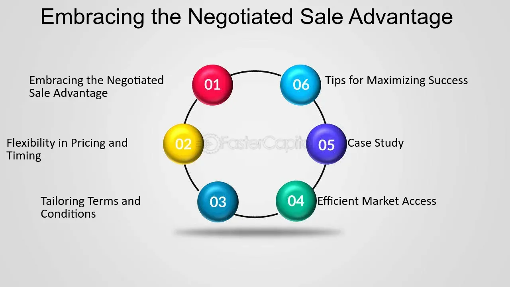

## Table of Contents

## What is a negotiated sale?

A negotiated sale is when a company or government decides to sell something, like bonds or stocks, by talking directly with one buyer instead of selling to many people at once. This is different from an auction or public sale where anyone can buy. In a negotiated sale, the seller and buyer agree on the price and other details privately.

This type of sale can be useful when the thing being sold is special or hard to value. For example, a city might use a negotiated sale to sell bonds for a big project. They can work with one buyer to set terms that fit their needs. But, it can also be risky because the seller might not get the best price if they don't talk to enough buyers.

## How does a negotiated sale differ from other types of sales?

A negotiated sale is different from other types of sales because it involves talking directly with one buyer instead of selling to many people at once. In a public sale or auction, anyone can bid on the item, and the highest bidder wins. But in a negotiated sale, the seller and buyer work together to agree on the price and terms privately. This can be good for selling special or hard-to-value items, like bonds for a city project, because the seller can set terms that fit their needs.

Other types of sales, like competitive bidding or open market sales, are more open to the public. In a competitive bidding sale, multiple buyers can submit bids, and the seller chooses the best offer. This can help the seller get a better price because more people are competing. An open market sale is when the item is sold to anyone who wants to buy it at a set price, like selling stocks on a stock exchange. These methods can be faster and more straightforward, but they might not allow for the customization that a negotiated sale offers.

## What is the process involved in a negotiated sale?

In a negotiated sale, the process starts with the seller choosing a buyer to talk to. This is different from other sales where anyone can bid. The seller might pick a buyer they know or one they think will offer a good deal. Once they have a buyer, the seller and buyer start talking about the price and other details. They might go back and forth until they agree on everything. This can take some time because they need to make sure both sides are happy with the deal.

After they agree on the price and terms, they write everything down in a contract. This contract says what each side has to do. The buyer pays the agreed price, and the seller gives the buyer the item, like bonds or stocks. Once the contract is signed and the money is paid, the sale is done. This way, the seller can make sure the item goes to the right buyer and gets the terms they need, but it can take longer than other types of sales.

## Who are the key parties involved in a negotiated sale?

The key parties in a negotiated sale are the seller and the buyer. The seller is the one who wants to sell something, like bonds or stocks. They choose a buyer they think will give them a good deal. The buyer is the one who wants to buy what the seller is selling. They talk to the seller to agree on the price and other details of the sale.

In some cases, there might be other people involved, like lawyers or financial advisors. These people help the seller and buyer understand the deal and make sure everything is fair. They might help write the contract or give advice on the price and terms. But the main people in a negotiated sale are always the seller and the buyer.

## What are the typical steps taken before entering into a negotiated sale?

Before entering into a negotiated sale, the seller needs to decide what they want to sell and why. They might want to sell bonds to raise money for a project or sell stocks to get cash. The seller then thinks about who might want to buy what they're selling. They might look at past buyers or talk to people they know in the industry. Once they have some ideas, the seller picks one buyer to talk to. This buyer should be someone the seller thinks will offer a good price and agree to the terms they need.

After choosing a buyer, the seller starts talking to them about the sale. They share information about what they're selling, like how much it's worth and any special terms they want. The seller and buyer go back and forth, trying to agree on the price and other details. They might need to talk a lot to make sure both sides are happy. If they can't agree, the seller might need to find another buyer. But if they do agree, they move forward to the next steps of the sale.

## What are the advantages of a negotiated sale for the seller?

A negotiated sale can be good for the seller because it lets them talk directly with one buyer. This means the seller can set the price and terms that work best for them. For example, if a city wants to sell bonds for a big project, they can work with one buyer to make sure the terms fit their needs. This can be helpful when the thing being sold is special or hard to value, because the seller can explain why it's worth a certain price.

Another advantage is that the seller can build a good relationship with the buyer. Since they talk a lot during the sale, they can get to know each other better. This can help the seller in the future if they need to sell more things. Also, a negotiated sale can be more private than other types of sales. The seller doesn't have to share details with a lot of people, which can be important if they want to keep things quiet.

## What are the advantages of a negotiated sale for the buyer?

A negotiated sale can be good for the buyer because they can talk directly with the seller. This means the buyer can ask a lot of questions and get all the details they need about what they're buying. They might find out things that they wouldn't know in a public sale. This can help the buyer decide if the price is fair and if they want to buy it.

Also, in a negotiated sale, the buyer can sometimes get better terms. They can work with the seller to set up a payment plan or other conditions that fit their needs. This can be really helpful if the buyer needs special terms to make the deal work. Plus, the buyer might build a good relationship with the seller, which can help them in the future if they want to buy more things.

## What are the potential disadvantages of a negotiated sale for the seller?

A negotiated sale can be risky for the seller because they might not get the best price. When they talk to just one buyer, they don't know if other buyers would offer more money. If the seller doesn't talk to enough buyers, they might end up selling for less than they could have. This can be a big problem if the thing they're selling is worth a lot of money.

Also, a negotiated sale can take a long time. The seller and buyer need to talk a lot to agree on the price and terms. This back-and-forth can slow things down, especially if they can't agree easily. If the seller needs money fast, a negotiated sale might not be the best choice because it can be slow and might not give them the best deal.

## What are the potential disadvantages of a negotiated sale for the buyer?

A negotiated sale can be tricky for the buyer because they might end up paying more than they need to. When they only talk to one seller, they don't know if other sellers would offer a better price. If the buyer doesn't look at other options, they might pay too much for what they're buying. This can be a big problem if the item is expensive or if the buyer needs to be careful with their money.

Also, a negotiated sale can take a lot of time. The buyer and seller need to talk a lot to agree on the price and other details. This can be slow and frustrating, especially if they have trouble agreeing. If the buyer needs the item quickly, a negotiated sale might not be the best choice because it can be slow and might not give them the best deal.

## How can one prepare effectively for a negotiated sale?

To prepare effectively for a negotiated sale, the seller should first figure out what they want to sell and why. They need to know the value of what they're selling and any special terms they need. The seller should also think about who might want to buy it. They can look at past buyers or talk to people they know in the industry. Once they have some ideas, the seller should pick a buyer they think will offer a good price and agree to their terms. It's important for the seller to gather all the information they need about the item and be ready to explain why it's worth a certain price.

The buyer should also prepare by learning as much as they can about what they want to buy. They need to know the value of the item and any special terms they need. The buyer should ask a lot of questions and get all the details they can from the seller. It's helpful for the buyer to think about other options and see if they can get a better deal somewhere else. Both the seller and buyer should be ready to talk a lot and be patient, because a negotiated sale can take time. They need to be clear about what they want and be willing to work together to make a deal that works for both sides.

## What legal considerations should be taken into account during a negotiated sale?

When doing a negotiated sale, it's important to think about the legal stuff. Both the seller and buyer need to make sure they follow the laws about selling and buying things. They should have a contract that says what each side has to do. This contract should be clear and fair, and both sides should agree to it. If the sale involves special things like bonds or stocks, there might be extra rules they need to follow. They might need to talk to a lawyer to make sure everything is legal and to help write the contract.

Also, the seller and buyer need to think about any rules that might affect the sale. For example, if the seller is a city or government, they might have to follow special rules about how they can sell things. They need to make sure they don't break any of these rules. The buyer should check if there are any laws that say they can't buy certain things or if they need special permission. Talking to a lawyer can help both sides understand these rules and make sure the sale goes smoothly and legally.

## Can you provide case studies or examples of successful negotiated sales?

One example of a successful negotiated sale is when the city of Chicago sold bonds to finance the expansion of its public transportation system. The city worked directly with a large financial institution to negotiate the terms of the bond sale. This allowed the city to secure favorable interest rates and repayment terms that fit their budget and project timeline. By negotiating with one buyer, the city was able to ensure that the sale was tailored to their specific needs, resulting in a successful financing of the project.

Another example is when a tech startup decided to sell a portion of its shares to a single investor. The startup was in the early stages and needed capital to grow. Instead of going through a public offering, they chose to negotiate directly with an investor who believed in their vision. Through these negotiations, the startup was able to secure not only the funding they needed but also a strategic partner who provided valuable industry connections and advice. This negotiated sale helped the startup to grow and eventually become a successful company in its market.

## References & Further Reading

[1]: Hildreth, B. W., & Zorn, C. K. (2005). ["The Evolution of Municipal Bond Structuring: From Traditional Negotiated Sales to Competitive Auctions."](https://snippetsofparis.com/ile-de-france/) Public Budgeting & Finance.

[2]: Narang, R. K. (2009). ["Inside the Black Box: The Simple Truth About Quantitative Trading."](https://onlinelibrary.wiley.com/doi/book/10.1002/9781118267738) John Wiley & Sons.

[3]: Aldridge, I. (2013). ["High-Frequency Trading: A Practical Guide to Algorithmic Strategies and Trading Systems."](https://onlinelibrary.wiley.com/doi/pdf/10.1002/9781119203803.fmatter) Wiley Finance Series.

[4]: Hasbrouck, J. (2003). ["Intraday Price Formation in U.S. Equity Markets."](https://onlinelibrary.wiley.com/doi/10.1046/j.1540-6261.2003.00609.x) The Review of Financial Studies.

[5]: Fabozzi, F. J., & Peterson, P. P. (2003). ["Financial Management and Analysis Workbook: Step-by-Step Exercises and Tests to Help You Master Financial Management and Analysis."](https://www.amazon.com/Financial-Management-Analysis-Frank-Fabozzi/dp/0471234842) John Wiley & Sons.