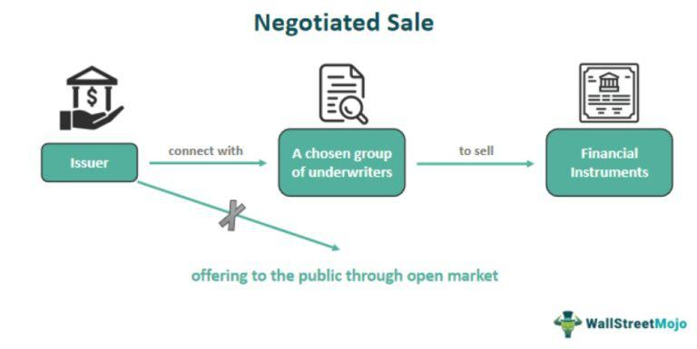

In the world of trading and investments, various processes and methodologies can significantly enhance decision-making and success. Two key areas often highlighted are negotiated sales and algorithmic trading, each presenting unique advantages and challenges. This article explores the pros and cons of these two distinct approaches to trading and aims to provide insights into their methodologies. We will examine how these processes operate, assess their benefits, and discuss their associated challenges. By understanding these aspects, investors can make informed choices suited to their trading strategies.

## Table of Contents

## Understanding Negotiated Sale

A negotiated sale is a financial transaction method where negotiations occur directly between the issuer and a limited number of potential buyers. This process is predominantly associated with municipal bonds, offering a distinctive approach compared to competitive bidding. In a negotiated sale, the parties involved collaboratively determine key terms such as interest rates, call features, and the purchase price. This contrasts with competitive bidding where multiple participants place bids, and the issuer selects the most favorable offer.

One of the hallmark features of a negotiated sale is its ability to ensure confidentiality. Sensitive transaction details remain confined to the participating parties, providing an element of privacy not typically present in other bidding processes. This confidentiality can be advantageous for issuers who require discretion for strategic reasons.

The efficiency of negotiated sales is another notable benefit. As this method involves fewer participants and less public scrutiny, it reduces operational disruptions, allowing the transaction to proceed more smoothly and swiftly than competitive bidding scenarios. The streamlined nature of negotiated sales means that the issuers can often bring bonds to market quicker, meeting deadlines without the broader interruptions typical of competitive processes.

Moreover, negotiated sales offer flexibility regarding market timing. Issuers can time the release of their bonds to coincide with favorable market conditions, potentially securing better interest rates and terms. This timing advantage allows issuers to strategically enter the market based on prevailing economic conditions, thus optimizing the financial outcomes of the sale.

Overall, negotiated sales provide a path for issuers seeking a controlled, private, and efficient sales process. This process facilitates the tailoring of terms to suit specific needs while allowing issuers to leverage advantageous market conditions.

## Pros of Negotiated Sale

Negotiated sales offer several notable advantages, particularly in terms of confidentiality. This method allows the sensitive details of a financial transaction to remain strictly between the involved parties, ensuring that proprietary information and strategic intentions are not disclosed to competitors or the public. This privacy can be crucial in maintaining a strategic advantage in markets where competitive intelligence is highly valued.

Additionally, the approach is designed to be less disruptive to ongoing operations. By facilitating a more streamlined and efficient process, negotiated sales help existing workflows and business activities to continue with minimal interruption. The lack of an open competitive bidding process means that fewer resources are devoted to managing public disclosures and interactions, freeing up time and energy for other business priorities.

Moreover, negotiated sales provide a fertile ground for cultivating trust and strong relationships with potential buyers. Over time, this can lead to more favorable transaction terms as repeat interactions build understanding and mutual respect. Customized deals result from this relationship-building, aligning more closely with the strategic interests and needs of both the issuer and the buyer. By fostering long-term partnerships, issuers may negotiate more advantageous terms, ultimately enhancing the potential for beneficial outcomes.

## Cons of Negotiated Sale

In negotiated sales, issuers may encounter several challenges primarily due to the reduced competitive atmosphere inherent in the process. One prominent downside is the decreased negotiating power there is for issuers, as the absence of multiple bids often results in a diminished competitive edge. This lack of competition can potentially allow buyers to exert pressure on issuers to agree to terms that may not fully reflect the value of the securities being negotiated.

When participating in a negotiated sale, issuers must be particularly cautious to ensure that they secure the best possible price and terms. Without the advantage of competitive bidding, there is a limitation in how many offers can be entertained at one time. This constraint can result in issuers settling for conditions that are less favorable than those attainable through competitive sale methods, where multiple bids might drive better terms and pricing.

Furthermore, issuers may not have the leverage to engage multiple offers simultaneously. In competitive bidding processes, the presence of several bids can foster a more favorable atmosphere for issuers, often leading to improved terms owing to the competitive tension among buyers. In contrast, negotiated sales limit these advantages, necessitating issuers to be vigilant and strategic in their negotiations to avoid yielding too much advantage to buyers.

 to Algorithmic Trading

Algorithmic trading, commonly referred to as algo trading, utilizes computer algorithms to execute trading orders based on predetermined strategies and criteria. This methodology revolutionizes the trading sector by automating decision-making processes and executing trades at speeds and accuracies unattainable by human traders. Algorithms assess multiple market variables in real-time, allowing for rapid execution, which is critical for capitalizing on fleeting market opportunities.

The primary objective of [algorithmic trading](/wiki/algorithmic-trading) is to enhance trading efficiency, notably by reducing human-related errors and emotional decision-making factors. By following strict instructions or a series of parameters, these algorithms ensure consistency and precision in executing trades. For instance, algorithms can be designed to execute trades when a security's price crosses a certain threshold or when specific market conditions are met, thus minimizing human delays and inaccuracies.

Algo trading supports diverse trading strategies, making it adaptable across various financial contexts. It is widely used in [arbitrage](/wiki/arbitrage), where traders exploit price differentials of the same asset across different markets. With the ability to process information milliseconds faster than human traders, algorithms can execute arbitrage opportunities before they dissipate.

Trend following is another strategy employed in algorithmic trading, where algorithms trade based on the direction of market prices. This strategy assumes that the asset's price will continue moving in the observed direction and profits from these movements. Such strategies often rely on technical indicators like moving averages and [momentum](/wiki/momentum) oscillators, which can be efficiently processed by algorithms to determine optimal entry and [exit](/wiki/exit-strategy) points.

Furthermore, [market making](/wiki/market-making) is a strategy supported by algo trading and involves providing [liquidity](/wiki/liquidity-risk-premium) to the market by simultaneously posting buy and sell orders. Algorithms continually adjust these orders based on market changes to earn the bid-ask spread profit. This approach enhances market liquidity and stability, allowing for smoother trading operations.

In summary, algorithmic trading automates the trading process through highly efficient, precise, and diverse strategies suitable for modern financial markets. By streamlining execution and minimizing human intervention, algo trading provides an advantageous tool for traders seeking sophisticated and timely solutions in an increasingly complex trading environment.

## Pros of Algorithmic Trading

Algorithmic trading offers several advantages that make it an appealing choice for traders seeking to enhance the efficiency and precision of their trading activities.

One of the primary benefits of algorithmic trading is the ability to execute trades at exceptionally high speeds and with remarkable accuracy. This is achieved through the use of complex algorithms that can process vast amounts of data in real-time, identifying and reacting to market opportunities with unparalleled speed. Such rapid execution allows traders to capitalize on minute price fluctuations that might be missed by human traders. This capability is particularly beneficial in high-frequency trading ([HFT](/wiki/high-frequency-trading-strategies)), where the speed of execution can significantly influence profitability.

Another significant advantage of algorithmic trading is its capacity to minimize the impact of human emotions on trading decisions. Emotional trading, influenced by fear, greed, or other psychological factors, can lead to irrational decision-making and inconsistent results. Algorithmic trading, by contrast, operates on pre-set criteria and logical rules, ensuring a disciplined approach to trading. This rational framework eliminates emotional bias, fostering more consistent and rational trading outcomes.

In addition to speed and emotional detachment, algorithmic trading provides the valuable capability of [backtesting](/wiki/backtesting) strategies. Backtesting involves running trading algorithms against historical market data to evaluate their potential effectiveness before implementing them in real markets. This process helps traders refine and optimize their strategies, identifying potential risks and pitfalls without financial risk. By leveraging historical data, traders can iteratively improve their algorithms, enhancing their likelihood of success when executed live.

Algorithmic trading's ability to integrate these elements—swift execution, emotional neutrality, and strategic validation through backtesting—creates a robust framework for traders aiming to optimize their trading performance and enhance their competitive edge in increasingly complex financial markets.

## Cons of Algorithmic Trading

One major challenge of algorithmic trading is its reliance on technology. This dependence renders trading systems vulnerable to technical failures, such as hardware malfunctions or software bugs, which can disrupt trading activities and potentially lead to financial losses. These disruptions can result in missed trading opportunities or unintended trades that deviate from the intended strategy.

The initial development of an algorithmic trading system involves substantial costs. Designing and implementing efficient algorithms requires skilled professionals and robust technological infrastructure. This includes acquiring high-speed servers, data feeds, and networking equipment to ensure that trades execute with minimal latency. Ongoing maintenance and upgrades add to these costs, making the financial barrier to entry significant.

Furthermore, algorithmic trading faces stringent regulatory oversight worldwide. Regulators enforce compliance with evolving legal standards to ensure market stability and fairness. For instance, regulations may require traders to implement stringent risk management protocols and maintain transparency in their algorithmic strategies. Failing to comply can lead to penalties, restricting the trader's ability to operate in certain markets.

These challenges highlight the complexity inherent in balancing technological efficiency with regulatory adherence and financial costs, imperative for success in algorithmic trading.

## Conclusion

Both negotiated sales and algorithmic trading introduce unique benefits and challenges in the trading arena. Negotiated sales, with their focus on direct negotiation and relationship building, offer confidentiality and operational efficiency that can be advantageous for municipalities or organizations looking to minimize market disruptions. However, the absence of competitive bidding may lead to less favorable financial terms for the issuer, necessitating a careful evaluation to ensure fair pricing.

Algorithmic trading, on the other hand, employs advanced computational algorithms to enhance trading efficiency through speed and precision. Its capacity for backtesting strategies using historical data enables traders to refine their approaches before engaging in live markets. Despite these advantages, algorithmic trading carries the risk of technological failures and requires significant infrastructural investment and compliance with regulatory frameworks.

Understanding the intricacies of each approach can empower investors to optimize their strategies and manage risks effectively. Selecting the right trading method depends on the specific needs, goals, and resources of the investor. For instance, investors prioritizing confidentiality and negotiation may prefer negotiated sales, while those focusing on speed and data analysis might find algorithmic trading more suitable.

Ultimately, balancing technology, human insight, and market understanding remains critical to trading success. Effective strategies must integrate these elements to navigate the complexity of financial markets and achieve optimal outcomes. By leveraging the strengths of both negotiated sales and algorithmic trading where applicable, investors can enhance their decision-making processes and align with their strategic objectives.

## References & Further Reading

[1]: Hildreth, B. W., & Zorn, C. K. (2005). ["The Evolution of Municipal Bond Structuring: From Traditional Negotiated Sales to Competitive Auctions."](https://snippetsofparis.com/ile-de-france/) Public Budgeting & Finance.

[2]: Narang, R. K. (2009). ["Inside the Black Box: The Simple Truth About Quantitative Trading."](https://onlinelibrary.wiley.com/doi/book/10.1002/9781118267738) John Wiley & Sons.

[3]: Aldridge, I. (2013). ["High-Frequency Trading: A Practical Guide to Algorithmic Strategies and Trading Systems."](https://onlinelibrary.wiley.com/doi/pdf/10.1002/9781119203803.fmatter) Wiley Finance Series.

[4]: Hasbrouck, J. (2003). ["Intraday Price Formation in U.S. Equity Markets."](https://onlinelibrary.wiley.com/doi/10.1046/j.1540-6261.2003.00609.x) The Review of Financial Studies.

[5]: Fabozzi, F. J., & Peterson, P. P. (2003). ["Financial Management and Analysis Workbook: Step-by-Step Exercises and Tests to Help You Master Financial Management and Analysis."](https://www.amazon.com/Financial-Management-Analysis-Frank-Fabozzi/dp/0471234842) John Wiley & Sons.