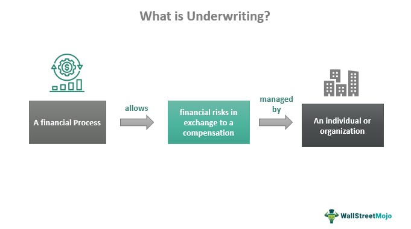

In today's financial landscape, underwriting and algorithmic trading are two pivotal mechanisms significantly influencing the investment and securities market. Underwriting, particularly negotiated underwriting, plays a crucial role in the process of issuing new securities. Through negotiated underwriting, issuers of securities engage directly with underwriters to establish terms, including purchase and offering prices. This strategic interaction is particularly relevant during initial public offerings (IPOs), setting groundwork that impacts market positioning and security profitability.

On the other hand, algorithmic trading revolutionizes trading activities by employing sophisticated computer algorithms to automate transactions. This technology optimizes trading strategies, enhancing efficiency, precision, and market liquidity while reducing transaction costs. Algorithmic trading has introduced a paradigm shift in how trades are executed, emphasizing the need for rapid decision-making and execution.



Understanding the dynamics of negotiated underwriting in conjunction with algorithmic trading presents new opportunities for both investors and issuers. By leveraging negotiated underwriting for its ability to tailor issuance terms and combining it with the precision and speed of algorithmic trading, stakeholders can potentially increase their market advantage. This article examines the essential financial mechanisms involved in negotiated underwriting, outlines the underwriting process, and analyzes the impact of algorithmic trading on these domains. Through this exploration, we aim to highlight the synergies and potential advancements in the financial market landscape.

## Table of Contents

## What is Negotiated Underwriting?

Negotiated underwriting is a critical process within the financial sector, where an issuer of securities enters into direct negotiations with a single underwriter. This negotiation is primarily aimed at determining the purchase and offering prices of the securities about to be issued. This method is especially relevant in scenarios such as an initial public offering (IPO), where terms established during these negotiations significantly influence both the market placement and the overall profitability of the security in question.

During this process, several key elements come into play. One of the primary considerations is the underwriting spread, which represents the difference between the price at which the underwriter purchases the securities from the issuer and the price at which these securities are sold to the public. The underwriting spread compensates the underwriter for the risks they assume and the services they provide, including marketing and selling the securities.

In addition to the underwriting spread, negotiated underwriting may involve the concept of devolvement. This requires the underwriter to assume ownership of unsold shares if the entire issue is not sold to the public. This scenario can occur when there is not enough public demand for the securities at the offered price. Devolvement ensures that the issuer receives the capital they sought to raise, while the underwriter mitigates market risk associated with the unsold shares by potentially taking them onto their [books](/wiki/algo-trading-books). 

Negotiated underwriting allows issuers to establish a direct relationship with an underwriter who can tailor the underwriting terms to better suit the issuer's needs. This customized approach can lead to more favorable financial terms and potentially smoother market entry, benefiting both the issuer and the broader investment community.

## The Underwriting Process Explained

The underwriting process is a critical component of the financial securities market, involving meticulous evaluation and risk assessment to establish the terms and conditions for issuing securities. This process serves as a bridge between issuers, such as corporations or governments, and investors, ensuring that the securities can be offered effectively in the market.

### Steps in the Underwriting Process

1. **Due Diligence**: This initial step requires a thorough investigation into the issuer’s financial health, business model, management team, and market potential. The underwriter evaluates all pertinent information to assess the risks associated with the issuance. This phase often includes reviewing financial statements, market research, and legal evaluations to ensure the accuracy and completeness of disclosures.

2. **Pricing**: Once due diligence is complete, the underwriter collaborates with the issuer to establish an appropriate offering price for the securities. This involves analyzing current market conditions, comparable company valuations, and investor sentiment to determine a competitive yet attractive price for buyers. The goal is to price the securities in a manner that balances maximizing proceeds for the issuer with ensuring investor interest.

3. **Regulatory Compliance**: Underwriters must navigate various regulatory requirements to ensure the securities offering complies with relevant laws. This includes preparing and filing necessary documentation with regulatory bodies, such as the Securities and Exchange Commission (SEC) in the United States. Compliance ensures transparency and protects both the issuer and investors from legal and financial repercussions.

4. **Marketing**: Marketing the securities is crucial for generating investor interest and demand. Underwriters develop and implement marketing strategies to reach potential investors. This may involve roadshows, presentations, and distributing detailed prospectuses that highlight the investment’s potential benefits and risks.

### Types of Underwriting

1. **Firm Commitment Underwriting**: In this type, the underwriter agrees to buy the entire securities issuance from the issuer and resell it to the public. This arrangement transfers the risk of unsold securities to the underwriter. The underwriter earns an underwriting spread, the difference between what they pay the issuer and what they receive from selling the securities.

2. **Best Efforts Underwriting**: Unlike firm commitment, in a best efforts arrangement, the underwriter does not purchase the securities outright. Instead, they agree to use their best efforts to sell as many securities as possible on behalf of the issuer. Any unsold securities remain with the issuer, who bears the associated risk.

These underwriting types demonstrate the variability in risk-bearing mechanisms between the issuer and underwriter. Firm commitment provides more security to the issuer but increases the underwriter's risk. In contrast, best efforts lightens the underwriter's risk but may result in less capital raised for the issuer.

Understanding these components of the underwriting process underscores its importance in ensuring the successful issuance and placement of securities in the financial markets.

## Algorithmic Trading: A Game Changer

Algorithmic trading involves the use of computer algorithms to execute trading orders with speed and precision, automating strategies that were once manually implemented. This automation not only enhances the efficiency of trading activities but also significantly impacts market dynamics by improving [liquidity](/wiki/liquidity-risk-premium) and reducing transaction costs.

By leveraging [algorithmic trading](/wiki/algorithmic-trading) technology, financial markets have witnessed a substantial increase in liquidity. Liquidity, the ease with which assets can be bought or sold without affecting their market price, is vital for the smooth functioning of financial markets. Algorithms are designed to execute trades at optimal times and prices, considering factors such as market [volume](/wiki/volume-trading-strategy) and historical price patterns. This continuous buying and selling activity increases the availability of securities in the market, enabling participants to transact with minimal price disturbance.

Additionally, algorithmic trading helps in reducing transaction costs. Traditional trading methods often involve significant manual intervention, which can be both time-consuming and costly. In contrast, algorithms can process huge volumes of data in real-time, identify trading opportunities, and execute orders at high speeds, minimizing the costs associated with human errors and delays. Algorithms can also engage in high-frequency trading ([HFT](/wiki/high-frequency-trading-strategies)), which involves executing a large number of trades in fractions of a second, further driving down costs through economies of scale.

The integration of algorithmic trading within underwriting processes has also reshaped the roles of market participants, particularly in market-making and securities pricing. Market makers, who provide liquidity by being ready to buy and sell securities, can use algorithms to swiftly adjust bids and offers in response to market changes, thereby maintaining an orderly market. This functionality is crucial during underwriting, particularly when new securities enter the market, as it helps stabilize their prices and ensures a smoother transition from issuance to active trading.

Moreover, algorithms enhance the accuracy of pricing models used in underwriting by analyzing vast datasets to forecast price movements and determine fair market values. By employing sophisticated techniques such as [machine learning](/wiki/machine-learning) and statistical analysis, algorithms can identify patterns and trends that might not be apparent through traditional methods. This capability aids underwriters in setting more competitive prices, improving the attractiveness of new issues to potential investors.

In summary, algorithmic trading is a transformative force in financial markets, offering efficiencies and cost reductions that benefit traders and institutions alike. Its integration into underwriting processes, particularly in [market making](/wiki/market-making) and pricing, underscores its pivotal role in modern finance, paving the way for more strategic, data-driven decision-making.

## The Intersection of Algorithmic Trading and Underwriting

With advances in technology, algorithmic trading is gradually interfacing with underwriting processes to optimize decision-making and execution. This integration is proving to be revolutionary, facilitating improved risk management, enhanced market strategies, and more accurate pricing models. Here's how:

### Improved Risk Management

Algorithmic trading algorithms are designed to analyze vast datasets with precision, identifying patterns and correlations that might not be immediately evident through traditional analysis. In the underwriting process, this analytical capability aids in the accurate assessment of the risk associated with a particular security. By integrating algorithmic trading, underwriters can develop more nuanced risk models, enabling them to make informed decisions about pricing and risk distribution.

Python can be particularly useful in developing such models. Consider a hypothetical function that evaluates risk using historical data:

```python
import pandas as pd
from sklearn.linear_model import LinearRegression

def assess_risk(historic_data):
    model = LinearRegression()
    X = historic_data.drop('risk_factor', axis=1)
    y = historic_data['risk_factor']
    model.fit(X, y)
    predicted_risk = model.predict(X)
    return predicted_risk
```

This script uses linear regression to evaluate risk factors based on historical data.

### Enhanced Market Strategies

The synthesis of algorithmic trading with underwriting enables the development of more sophisticated market strategies. Algorithms can evaluate multiple scenarios and provide recommendations based on market conditions. This dynamic responsiveness ensures the implementation of strategies that maximize profitability while minimizing exposure to adverse market conditions.

### Accurate Pricing Models

Pricing of securities during underwriting is critical, as it determines both the attractiveness to investors and the proceeds to the issuer. Algorithmic trading systems can rapidly process information about market sentiment, demand-supply dynamics, and historical pricing trends to suggest optimal pricing points.

For example, a basic function to calculate an optimal pricing strategy could be structured as follows:

```python
def calculate_optimal_price(demand_elasticity, historical_prices):
    optimal_price = sum(historical_prices) / len(historical_prices) * (1 + demand_elasticity)
    return optimal_price
```

This function takes historical prices and demand elasticity to compute a potential pricing point.

### Case Studies and Examples

Several case studies illustrate the successful intersection of algorithmic trading and underwriting. For instance, some investment banks have begun using AI-driven platforms to aid in the underwriting process, allowing them to adjust pricing in real-time based on market movements and investor behavior. Such systems have demonstrated significant improvements in both pricing accuracy and the speed of execution.

In another example, a fintech firm successfully integrated algorithmic trading tools with its underwriting operations, resulting in enhanced market penetration for a client’s IPO. The system used real-time data analysis to adjust offer sizes and pricing dynamically, leading to a successful issuance and robust aftermarket performance.

Ultimately, the intersection of algorithmic trading and underwriting represents a forward leap in financial market operations, with significant benefits for market participants. By harnessing the power of technology, financial institutions can achieve greater precision, efficiency, and success in underwriting endeavors.

## Challenges and Future Trends

The convergence of algorithmic trading and underwriting introduces several challenges that must be addressed to maximize their synergistic benefits. One of the primary concerns is regulatory compliance. Financial markets are governed by complex regulations designed to ensure stability, and the integration of algorithms in trading and underwriting can complicate adherence to these rules. Algorithmic systems must be transparent and auditable to satisfy regulatory bodies, which often require detailed logs and reports to verify compliance.

Data security is another critical challenge. With algorithmic trading relying heavily on vast amounts of data, the risk of data breaches and cyberattacks increases. Protecting sensitive information and preventing unauthorized access is paramount to maintain trust and integrity in financial operations. Advanced encryption methods, secure data handling practices, and continuous monitoring are essential components of a robust security framework.

Technological integration represents a further hurdle. Existing financial systems may not readily accommodate the rapid advancements in algorithmic technologies, necessitating significant upgrades or replacements. This integration requires substantial investment, both in terms of infrastructure and human resources, to ensure that all components function seamlessly together. It also demands expertise in both financial and technological domains to facilitate smooth transitions and minimize disruptions.

Looking ahead, several trends are poised to transform the intersection of algorithmic trading and underwriting. Artificial intelligence (AI) is anticipated to play a pivotal role, offering enhanced predictive models and decision-making capabilities. AI-driven systems can analyze market trends, assess risks, and optimize trading strategies with unprecedented accuracy and speed, thus enhancing both underwriting and trading processes.

Blockchain technology also holds promise for reshaping financial markets by providing decentralized and transparent transaction records. Its ability to securely and efficiently process and verify trades could reduce the risk of fraud and improve accountability. For underwriting, blockchain can simplify the issuance process, making it faster and more secure.

Personalized investment solutions are emerging as another significant trend. Leveraging AI and machine learning, financial services can offer tailored investment strategies that meet individual client needs. This personalization can lead to improved customer satisfaction and a more inclusive market environment.

In conclusion, while challenges such as regulatory compliance, data security, and technological integration must be carefully managed, the future of underwriting and algorithmic trading appears promising. The adoption of AI, blockchain, and personalized solutions will likely drive innovation, improve efficiency, and reshape the financial landscape in profound ways. Staying abreast of these developments is crucial for stakeholders seeking to capitalize on the opportunities that lie ahead.

## Conclusion

Underwriting and algorithmic trading are integral components of the financial ecosystem that offer significant value when properly executed. Underwriting, particularly negotiated underwriting, provides the necessary framework for issuing securities effectively, ensuring that the interests of issuers and investors are balanced. In tandem, algorithmic trading introduces efficiency and precision to trading activities, facilitating faster execution and better market liquidity.

By understanding and leveraging the synergies between negotiated underwriting and algo trading, financial institutions can better manage risks and seize market opportunities. Negotiated underwriting offers a tailored approach to setting the terms for a securities issuance, which becomes even more potent when enhanced with algorithmic trading's capability to analyze vast datasets and predict market behavior. This powerful combination not only results in improved pricing strategies but also enhances the ability of financial institutions to assume and distribute risk effectively.

As both fields continue to evolve, staying informed about technological advancements and market dynamics is essential for stakeholders in the financial sector. The incorporation of cutting-edge technologies such as [artificial intelligence](/wiki/ai-artificial-intelligence) and blockchain has the potential to further transform underwriting and trading processes. Moreover, keeping abreast of regulatory changes and ensuring robust data security measures will be crucial in navigating future challenges. Therefore, professionals in the financial sector must commit to continuous learning and adaptation to fully capitalize on the benefits that underwriting and algorithmic trading present.

## References & Further Reading

[1]: ["Underwriting Services and the New Issues Market"](https://www.sciencedirect.com/book/9780128032824/underwriting-services-and-the-new-issues-market) 

[2]: ["Algorithmic and High-Frequency Trading"](https://assets.cambridge.org/97811070/91146/frontmatter/9781107091146_frontmatter.pdf) by Álvaro Cartea, Sebastian Jaimungal, and José Penalva 

[3]: ["The Role of Underwriters in the Initial Public Offering Process"](https://blog.trillionize.com/the-role-of-underwriters-in-ipos/) by Tim Loughran and Jay R. Ritter. Journal of Financial Economics.

[4]: ["Machine Learning for Asset Managers"](https://github.com/emoen/Machine-Learning-for-Asset-Managers) by Marcos Lopez de Prado 

[5]: ["Building Winning Algorithmic Trading Systems"](https://www.amazon.com/Building-Winning-Algorithmic-Trading-Systems/dp/1118778987) by Kevin J. Davey