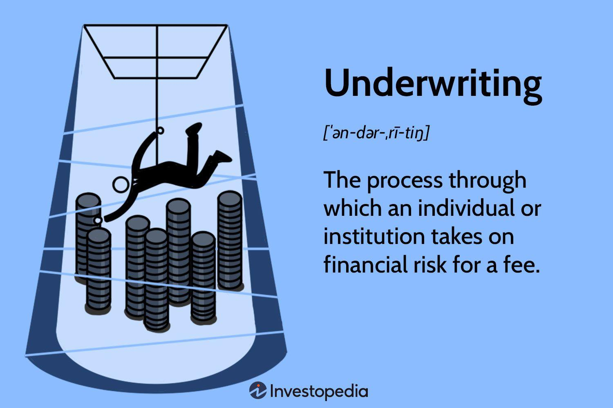

## Table of Contents

## What is negotiated underwriting?

Negotiated underwriting is a way for companies to sell their stocks or bonds to the public. In this method, the company talks directly with an investment bank to decide on the price and other details of the sale. This is different from other methods where the price might be set by bidding or other competitive processes. The company and the bank work together to figure out the best price that will attract investors but also give the company a good return.

This type of underwriting is often used when a company wants more control over the sale process. It can be helpful for new or smaller companies that might not be well-known yet. By working closely with an investment bank, the company can get advice on how to make the sale successful. The bank helps by finding investors and making sure the sale goes smoothly. This can be a good choice when a company needs to raise money quickly and efficiently.

## How does negotiated underwriting differ from other types of underwriting?

Negotiated underwriting is different from other types of underwriting because it involves direct talks between a company and an investment bank. In this method, they agree on the price and other details of selling stocks or bonds without going through a bidding process. This gives the company more control over how the sale happens. It's like choosing a friend to help you sell your stuff, where you can discuss and decide everything together.

Other types of underwriting, like competitive bidding, work differently. In competitive bidding, several investment banks bid to win the right to underwrite the securities. The company usually goes with the bank that offers the best price. This can be good for getting the highest price, but the company has less say in how things are done. It's like having an auction where you have to accept the highest bid, even if you don't know the bidder well.

Another type is best efforts underwriting, where the bank tries its hardest to sell the securities but doesn't guarantee they will all be sold. This can be riskier for the company because they might not get all the money they need. In contrast, negotiated underwriting often comes with a firm commitment from the bank to buy all the securities, which can give the company more certainty about the funds they will receive.

## What are the key components of a negotiated underwriting agreement?

A negotiated underwriting agreement has several important parts that both the company and the investment bank agree on. The first key part is the price of the securities. The company and the bank talk about what price will work best to attract investors while also being good for the company. They also decide on how many securities will be sold. This is important because it affects how much money the company will raise. Another part is the underwriting fee, which is what the bank gets paid for helping with the sale. This fee is usually a percentage of the total money raised.

The second key part is the type of underwriting commitment. In a negotiated underwriting, the bank often makes a firm commitment to buy all the securities from the company, no matter if they can sell them all to investors. This gives the company more certainty about the money they will get. The agreement also includes details about the timing of the sale, like when the securities will be offered to the public and when the company will get the money. Lastly, there are usually some legal and regulatory requirements that need to be followed, so the agreement will have sections about these to make sure everything is done correctly.

## Who are the main parties involved in negotiated underwriting?

The main parties in a negotiated underwriting are the company that wants to sell its securities and the investment bank that helps with the sale. The company could be any business looking to raise money by selling stocks or bonds. They choose to work with an investment bank because they need help finding investors and making sure the sale goes smoothly. The investment bank is like a middleman that knows a lot about selling securities and can give the company good advice on how to do it.

The company and the investment bank talk directly to each other to agree on important details like the price of the securities and how many will be sold. They also decide on the bank's fee for helping with the sale. This direct negotiation gives the company more control over the process compared to other methods where they might have to accept whatever price comes from a bidding process. The investment bank often promises to buy all the securities from the company, which helps the company know exactly how much money they will get.

## What are the steps involved in the process of negotiated underwriting?

The process of negotiated underwriting starts when a company decides it wants to sell its stocks or bonds to raise money. The company then picks an investment bank to work with. They sit down together and talk about the details of the sale. They need to agree on the price of the securities, how many will be sold, and what the bank will get paid for helping. This part is important because it sets the stage for the whole sale. The company and the bank might go back and forth a few times until they are happy with the deal.

Once they have agreed on everything, the investment bank makes a firm commitment to buy all the securities from the company. This means the company knows exactly how much money they will get, which can be a big relief. The bank then starts working to sell the securities to investors. They use their connections and knowledge to find people who want to buy the stocks or bonds. The bank also makes sure all the legal and regulatory stuff is taken care of. When the sale is done, the company gets the money they need, and the bank gets their fee for helping out.

## What are the advantages of using negotiated underwriting for issuers?

Negotiated underwriting gives issuers a lot of control over how they sell their securities. When a company works directly with an investment bank, they can talk about the price and other details until they are happy with the deal. This is really helpful for companies that are new or not very well-known because they can get advice from the bank on how to make the sale go well. The bank knows a lot about selling securities and can help the company find the right investors.

Another big advantage is that the investment bank usually makes a firm commitment to buy all the securities. This means the company knows exactly how much money they will get, which can be a big relief. It's like having a safety net because the company doesn't have to worry about whether the securities will sell or not. This can be especially important if the company needs the money quickly and doesn't want to take risks.

## What are the potential disadvantages or risks for issuers in negotiated underwriting?

One potential disadvantage of negotiated underwriting for issuers is that it might not get them the best price for their securities. Since the company works directly with one investment bank, they might not be able to shop around and see what other banks would offer. If the chosen bank knows they are the only one being considered, they might not give the best deal. This can mean the company gets less money than they could have if they had used a competitive bidding process where different banks compete to offer the highest price.

Another risk is that the company might become too dependent on the advice of one investment bank. If the bank gives bad advice or makes a mistake, it could hurt the company's sale. The company might also feel pressured to agree to terms that aren't the best for them because they don't want to lose the bank's help. This can be risky, especially for smaller or new companies that might not have a lot of experience with selling securities.

## How do underwriters benefit from negotiated underwriting?

Underwriters benefit from negotiated underwriting because they get to work closely with the company selling the securities. This means they can build a strong relationship with the company. They can give advice and help the company make the sale successful. The underwriter also gets to set the terms of the deal, which can be good for them. They can agree on a fee that they think is fair for the work they will do. This can be more money than they might get in a competitive bidding process where they have to offer the lowest fee to win the job.

Another way underwriters benefit is that they have more control over the sale process. They can decide how to market the securities and who to sell them to. This can help them make sure the sale goes smoothly and that they can sell all the securities. If the underwriter makes a firm commitment to buy all the securities, they can also make money by selling them to investors at a higher price than they paid. This can be a good way for the underwriter to make a profit.

## What role does due diligence play in negotiated underwriting?

Due diligence is a very important part of negotiated underwriting. It's like doing homework before making a big decision. The investment bank checks everything about the company that wants to sell its securities. They look at the company's financials, business plans, and any risks that might be involved. This helps the bank make sure the company is telling the truth about its business and that the securities are a good investment. If the bank finds any problems, they can talk about them with the company and maybe change the terms of the deal.

Doing due diligence also helps protect the bank and the investors. If the bank doesn't do a good job checking the company, they could get in trouble later. Investors trust the bank to make sure the securities are safe to buy. So, the bank has to be very careful and thorough. This process can take some time, but it's worth it to make sure everything goes smoothly and everyone is happy with the deal.

## How does the pricing mechanism work in negotiated underwriting?

In negotiated underwriting, the company and the investment bank talk to each other to decide on the price of the securities. They want to find a price that will attract investors but also give the company a good return. The bank uses its knowledge of the market to suggest a price that they think will work well. The company can then agree or ask for a different price. They keep talking until they both think the price is right.

Once they agree on the price, the bank makes a firm commitment to buy all the securities at that price. This means the company knows exactly how much money they will get. The bank then tries to sell the securities to investors at a slightly higher price to make a profit. If the bank can't sell all the securities, they still have to pay the company the agreed-upon price. This can be risky for the bank, but it gives the company more certainty about the money they will receive.

## Can you explain a real-world example of negotiated underwriting?

Let's look at when Tesla went public in 2010. Tesla chose to use negotiated underwriting to sell its shares. They talked directly with the investment bank Morgan Stanley to set the price of the shares and decide on other details. Tesla and Morgan Stanley agreed on a price of $17 per share. This price was what they thought would attract investors while also being good for Tesla. Morgan Stanley promised to buy all the shares at this price, which meant Tesla knew exactly how much money they would get from the sale.

Morgan Stanley then worked to sell the shares to investors. They used their connections and knowledge to find people who wanted to buy Tesla's stock. The bank sold the shares at a slightly higher price than they paid, which is how they made their profit. This process helped Tesla raise the money they needed to grow their business. By working closely with Morgan Stanley, Tesla was able to control the sale and make sure it went smoothly.

## What are the regulatory considerations and compliance requirements for negotiated underwriting?

When a company uses negotiated underwriting, they have to follow certain rules and regulations. These rules come from places like the Securities and Exchange Commission (SEC) in the United States. The company and the investment bank need to make sure all the information they give to investors is true and complete. They have to file documents with the SEC, like a registration statement, that tell investors everything they need to know about the company and the securities being sold. This helps keep things fair and honest.

There are also rules about how the securities can be sold. The company and the bank need to follow laws about advertising and making sure they don't do anything that could trick investors. They have to be careful about what they say and how they say it. The bank also has to make sure they are following their own rules and the rules of any stock exchange where the securities will be sold. All of this is to protect investors and make sure the sale is done the right way.

## References & Further Reading

[1]: ["Underwriting Services and the New Issues Market"](https://www.sciencedirect.com/book/9780128032824/underwriting-services-and-the-new-issues-market) 

[2]: ["Algorithmic and High-Frequency Trading"](https://assets.cambridge.org/97811070/91146/frontmatter/9781107091146_frontmatter.pdf) by Álvaro Cartea, Sebastian Jaimungal, and José Penalva 

[3]: ["The Role of Underwriters in the Initial Public Offering Process"](https://blog.trillionize.com/the-role-of-underwriters-in-ipos/) by Tim Loughran and Jay R. Ritter. Journal of Financial Economics.

[4]: ["Machine Learning for Asset Managers"](https://github.com/emoen/Machine-Learning-for-Asset-Managers) by Marcos Lopez de Prado 

[5]: ["Building Winning Algorithmic Trading Systems"](https://www.amazon.com/Building-Winning-Algorithmic-Trading-Systems/dp/1118778987) by Kevin J. Davey