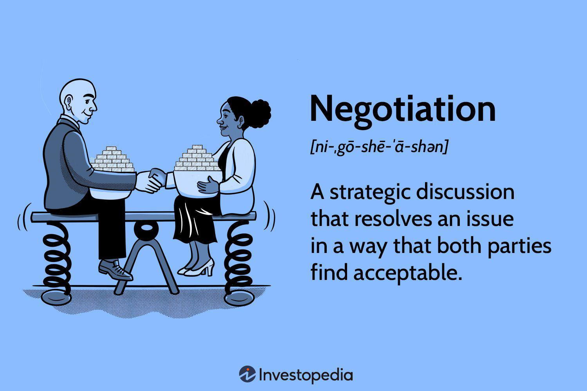

In the fast-paced world of algorithmic trading, effective negotiation skills can significantly impact the effectiveness of trading strategies. Negotiation techniques, traditionally associated with human interaction, can be crucial in enhancing decision-making processes within automated trading systems. Understanding how to integrate these skills with algorithmic trading can provide traders with a competitive advantage, ultimately improving their financial outcomes.

This article examines how applying negotiation techniques can refine trading methodologies and foster better results. By scrutinizing the relationship between negotiation and algorithmic trading, we offer valuable insights for traders seeking to improve their strategies. The application of structured communication strategies, such as identifying interests and exercising adaptability, is not limited to face-to-face negotiations but can also be incorporated into the logic of algorithmic trading platforms, allowing for more optimized trade executions.



Whether you're an experienced trader or a newcomer to algorithmic trading, mastering negotiation skills can prove beneficial in enhancing your operational performance. These skills can play a pivotal role in achieving more advantageous trading conditions and navigating through volatile market scenarios with confidence. Understanding negotiation dynamics allows traders to refine their algorithms, respond effectively to market signals, and secure better trading positions.

Join us on this journey to understand and implement negotiation tactics within your algorithmic trading practices. By effectively leveraging these techniques, traders can aim for not just survival, but success in the competitive landscape of financial markets.

## Table of Contents

## Understanding Negotiation Techniques

Negotiation techniques involve structured communication strategies used to reach an agreement effectively. At their core, these techniques focus on understanding the interests of both parties involved, which is essential in framing discussions and crafting mutual gains. One critical element of successful negotiation is active listening. This involves not merely hearing the words being spoken but fully comprehending and considering the viewpoints presented. By building rapport through empathy and understanding, negotiators can facilitate trust, a foundational element in reaching beneficial agreements.

Another fundamental aspect of negotiation is recognizing the importance of timing and adaptability. Situational awareness allows negotiators to choose the right moment to propose solutions or make requests, and flexibility ensures they can adjust their strategies as circumstances change. Negotiations are dynamic, and being too rigid can often lead to missed opportunities or breakdowns in discussions.

In trading scenarios, specific negotiation techniques can be directly applied to enhance performance. For instance, when negotiating entry and [exit](/wiki/exit-strategy) points in trades, understanding counterparty motivations can lead to more advantageous positioning. Similarly, building rapport with market participants through consistent interaction can lead to better information flow and trade execution.

These negotiation skills can be honed and developed through practice and real-world application. For traders, this means engaging in continuous learning and applying negotiation strategies across various trading situations. Simulations or role-playing exercises can be useful for this purpose. Repeated exposure to different negotiation scenarios helps traders refine their techniques and build confidence in high-pressure situations, ultimately contributing to improved trading outcomes.

## Essential Negotiation Skills for Traders

In [algorithmic trading](/wiki/algorithmic-trading), the ability to negotiate effectively generates significant advantages by optimizing trades and market interactions. Key negotiation skills, including persuasion, conflict resolution, and risk assessment, are fundamental for traders seeking to enhance their profitability.

**Persuasion** is a vital skill in trading, as it enables traders to influence market participants, secure optimal trade terms, and facilitate favorable market dynamics. Persuasion involves understanding the motives and behavior of other traders and using this insight to influence their decisions. It requires strong communication skills and the ability to present information in a convincing manner. In practice, persuasive strategies might involve presenting data compellingly to showcase the potential of a trade or demonstrating the benefits of a particular trading partnership.

**Conflict resolution** is essential for navigating disputes that arise from market interactions. Effective resolution strategies prevent escalation and help maintain healthy relationships with trading partners and market participants. This skill necessitates a calm, composed approach and the ability to empathize and negotiate fair solutions. By resolving conflicts amicably, traders can minimize disruptions and maintain focus on their trading objectives.

**Risk assessment** is another crucial skill that enables traders to evaluate potential threats and uncertainties in the market accurately. Traders must balance risk and reward, often under tight deadlines, making swift yet informed decisions. Risk assessment involves quantitative analysis and a deep understanding of market dynamics to anticipate and mitigate potential losses. By developing this skill, traders can identify high-risk scenarios and adapt their strategies accordingly, protecting their investments and maximizing returns.

Moreover, **emotional intelligence** significantly contributes to successful negotiations. It involves the ability to recognize and manage one’s emotions and those of others, facilitating smoother interactions and reducing the likelihood of emotional decision-making. Traders with high emotional intelligence are better equipped to handle stress, assess the emotional currents in negotiations, and adjust their strategies to align with the emotional state of their counterparts.

Additionally, **time management** is critical in the fast-moving trading environment, where decisions often need to be made quickly to capitalize on fleeting market opportunities. Efficient time management allows traders to prioritize tasks, manage their schedules effectively, and allocate resources where they are most needed. This skill ensures that traders can respond promptly to market developments and execute trades at the optimal moment.

Finally, strong **decision-making skills** are essential for traders to evaluate data and make precise judgments under pressure. This involves not only analyzing quantitative information but also incorporating qualitative insights and market intuition. Traders must weigh various factors, such as market trends, economic indicators, and geopolitical events, to make strategic decisions that align with their trading goals.

In conclusion, by mastering skills such as persuasion, conflict resolution, risk assessment, emotional intelligence, time management, and decision-making, traders can significantly improve their performance and profitability in algorithmic trading. These skills lead to more effective negotiation strategies, ensuring traders can capitalize on market opportunities and navigate challenges with greater ease and confidence.

## Integrating Negotiation Strategies into Algo Trading

Algorithmic trading utilizes automated systems to execute trades based on predefined criteria, leveraging computational power to analyze vast amounts of market data and execute trades at speeds and frequencies impractical for human traders. Enhancing such systems with negotiation principles presents an opportunity to optimize trade execution beyond rigid algorithms, potentially achieving better outcomes by incorporating adaptive and responsive decision-making capacity.

By integrating negotiation strategies, algorithms can be programmed to evaluate market signals and react optimally, similar to negotiating a deal. This involves recognizing patterns and nuances in market data that indicate shifts in supply and demand dynamics or potential price movements. For example, an algorithm could be designed to recognize when a stock's price is approaching a resistance level and adjust its trading strategy accordingly by either scaling back or preparing for a [breakout](/wiki/breakout-trading), much like a negotiator sensing the moment to increase leverage or make concessions.

To illustrate the impact of negotiation-infused algorithms, consider a case study involving a high-frequency trading ([HFT](/wiki/high-frequency-trading-strategies)) firm that implemented adaptive pricing strategies based on market conditions. The firm developed an algorithm that dynamically adjusted bid-ask spreads in response to real-time [volatility](/wiki/volatility-trading-strategies) metrics and [order book](/wiki/order-book-trading-strategies) depth. This strategy, akin to negotiating prices based on perceived value and urgency, allowed the firm to capture more advantageous trades and improve profitability during unstable market conditions.

Understanding market psychology plays a crucial role in this integration. Neuroscience and behavioral economics research suggest that traders' decisions are influenced by psychological biases and emotions, such as fear and greed. An example of integrating negotiation tactics in this context could be designing algorithms that identify and capitalize on anomalies created by herd behavior or market overreactions, effectively 'negotiating' better entry and exit points.

Python offers powerful libraries, like NumPy and pandas, which facilitate the development of sophisticated algorithms that can incorporate negotiation strategies. By leveraging historical market data, these algorithms can be trained to recognize specific patterns and learn adaptive responses, moving beyond static rule-based systems to more fluid, negotiation-like decision-making frameworks.

```python
import numpy as np
import pandas as pd

# Example of using market data to adjust trading strategy
def adaptive_trading_strategy(price_data):
    signals = []
    for i in range(1, len(price_data)):
        if price_data[i] > price_data[i-1] * (1 + threshold):  # Adjust 'threshold' based on negotiation principles
            signals.append("buy")
        elif price_data[i] < price_data[i-1] * (1 - threshold):
            signals.append("sell")
        else:
            signals.append("hold")
    return signals

# Load market data
price_data = pd.read_csv('market_data.csv')['Close']
threshold = 0.02  # Example threshold for decision making
signals = adaptive_trading_strategy(price_data)
print(signals)
```

Ultimately, incorporating negotiation strategies into algorithmic trading involves creating systems that are not only technically proficient but also strategically astute, capable of interpreting and responding to an ever-shifting market landscape. This integration provides traders a competitive edge, enabling them to negotiate the intricacies of the market with greater precision and agility.

## Real-world Applications and Case Studies

Successful traders often employ negotiation tactics to secure improved prices and terms within the algorithmic trading framework. These tactics can include techniques such as price anchoring, establishing credible commitment, and strategically managing information asymmetry. In algorithmic trading, where efficiency and speed are crucial, adapting negotiation strategies into automated systems presents unique advantages.

One real-world example of negotiation tactics in algorithmic trading can be seen in the methodology employed by high-frequency trading (HFT) firms. These firms use algorithms that incorporate negotiation principles to optimize execution strategies. For instance, through the use of ‘iceberg orders’, HFT firms reveal only a portion of the order's total [volume](/wiki/volume-trading-strategy) to the market, thereby concealing the full extent of their demand or supply. This tactic resembles a negotiation strategy where traders manage the information revealed to their counterparts, aiming to secure better trade execution without significantly impacting market prices.

A pertinent case study is that of [arbitrage](/wiki/arbitrage) trading firms that engage in cross-venue trading. These firms often need to negotiate latency and [liquidity](/wiki/liquidity-risk-premium) factors to capitalize on price discrepancies across different markets. By embedding advanced negotiation algorithms in their trading systems, they achieve optimized order routing, minimizing transaction costs and execution time. For example, a firm might program its trading algorithm to adaptively shift orders between venues considering the current liquidity and transaction costs, effectively 'negotiating' the best path for trade execution.

In the arena of [market making](/wiki/market-making), algorithms can employ negotiation-based rules to adjust bid-ask spreads dynamically. A notable example involves firms that leverage market data to continuously adjust their spreads based on the trade flow and perceived market sentiment. Such algorithms can be designed to increase the bid-ask spread during periods of high volatility and uncertainty, mimicking how a human negotiator might seek better terms under risky conditions. This ensures that market makers maintain profitability while managing exposure during adverse market movements.

Leading trading firms integrate negotiation techniques into their strategies by focusing on psychological market factors. For instance, some firms develop sentiment analysis tools that gauge the emotional state of the market through news sentiment and social media indicators. These firms incorporate negotiation tactics like empathy and rapport-building into their algorithms, allowing them to 'understand' market sentiment and adjust trading strategies accordingly. This approach resembles human traders attempting to negotiate terms by first understanding the counterpart’s perspective.

By studying these real-world applications, aspiring algo traders can glean valuable insights into how negotiation principles can enhance trading strategies. The integration of negotiation tactics into algorithmic trading represents a sophisticated approach to optimizing trade execution, risk management, and strategic interaction with the market. Understanding these practical applications allows traders to refine their strategies, leading to greater efficiency and profitability in their trading activities.

## Conclusion

Negotiation skills are indispensable tools for traders in the algorithmic trading landscape, offering significant advantages in strategy optimization and outcomes improvement. Mastering negotiation techniques allows traders to better align their strategies with market conditions and execute trades that capitalize on the fluidity of market dynamics. Negotiation, when integrated with algorithmic trading, forges a powerful synergy that fosters innovation, providing traders with mechanisms to enhance their decision-making capabilities and optimize trade execution.

In the competitive market environment, the continuous development of negotiation skills is crucial for maintaining and enhancing a trader's edge. As market conditions evolve, agile responses facilitated by strong negotiation strategies can lead to more favorable trading outcomes. This adaptability not only enhances profitability but also leverages the vast potential of algorithmic trading systems.

Encouraging traders to embrace negotiation as a core component of their trading strategies is essential for achieving lasting success. By embedding negotiation principles into algorithmic frameworks, traders can devise more sophisticated algorithms capable of dynamic adjustments in response to shifting market signals. This approach not only adds depth to trading strategies but also ensures robustness against market volatility, ultimately leading to sustained competitive advantage and success.

## References & Further Reading

[1]: Bergstra, J., Bardenet, R., Bengio, Y., & Kégl, B. (2011). ["Algorithms for Hyper-Parameter Optimization."](https://papers.nips.cc/paper/4443-algorithms-for-hyper-parameter-optimization) Advances in Neural Information Processing Systems 24.

[2]: ["Advances in Financial Machine Learning"](https://www.amazon.com/Advances-Financial-Machine-Learning-Marcos/dp/1119482089) by Marcos Lopez de Prado

[3]: ["Evidence-Based Technical Analysis: Applying the Scientific Method and Statistical Inference to Trading Signals"](https://www.amazon.com/Evidence-Based-Technical-Analysis-Scientific-Statistical/dp/0470008741) by David Aronson

[4]: ["Machine Learning for Algorithmic Trading"](https://github.com/stefan-jansen/machine-learning-for-trading) by Stefan Jansen

[5]: ["Quantitative Trading: How to Build Your Own Algorithmic Trading Business"](https://www.amazon.com/Quantitative-Trading-Build-Algorithmic-Business/dp/1119800064) by Ernest P. Chan