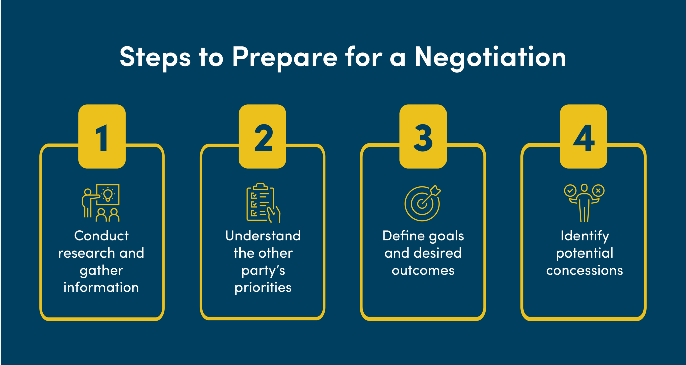

## Table of Contents

## What is negotiation and why is it important?

Negotiation is when two or more people talk to reach an agreement. They might be trying to solve a problem or decide on something important. It's like a discussion where everyone tries to get what they want, but they also have to think about what the other person wants.

Negotiation is important because it helps people work together and find solutions that everyone can agree on. It's used in many places, like at work, in business, or even at home. When people negotiate well, they can avoid fights and make sure everyone feels happy with the result.

## What are the basic principles of negotiation?

Negotiation is guided by some basic principles that help people reach agreements. One important principle is preparation. Before you start talking, it's good to know what you want and what the other person might want. This helps you plan what to say and how to say it. Another principle is clear communication. You need to explain your thoughts and listen carefully to the other person. This way, everyone understands each other better.

Another key principle is looking for a win-win situation. This means trying to find a solution where both sides are happy. It's not just about winning for yourself, but making sure the other person feels good about the deal too. Lastly, being flexible is important. Sometimes, you need to change your plan a bit to make the other person happy. Being willing to compromise can help everyone reach an agreement.

## How can one prepare effectively for a negotiation?

To prepare effectively for a negotiation, start by understanding your own goals and what you want to achieve. Think about what is most important to you and what you are willing to give up. It's also helpful to know your limits, so you don't agree to something you'll regret later. Next, research the other person or group you'll be negotiating with. Try to learn about their needs and what they might want from the negotiation. This can give you a better idea of how to approach the discussion and find a solution that works for everyone.

Once you have a good understanding of both sides, plan your strategy. Think about different ways the negotiation could go and how you would respond. Practice what you want to say and how you want to say it. It can be useful to role-play the negotiation with a friend or by yourself to get more comfortable. Finally, gather any materials or information you might need during the negotiation, like data or examples that support your points. Being well-prepared will help you feel more confident and increase your chances of reaching a successful agreement.

## What are common negotiation tactics used by beginners?

Beginners often start with a tactic called "anchoring." This means they begin the negotiation by stating a high or low number, hoping to set the tone for the rest of the discussion. For example, if someone is selling a bike, they might start by asking for a much higher price than they expect to get. This gives them room to come down in price during the negotiation, making the other person feel like they are getting a better deal.

Another common tactic is "compromise." Beginners might quickly agree to split the difference between what they want and what the other person wants. This can be seen as a way to end the negotiation fast and make both sides feel like they won something. However, it can also mean that they might give up more than they need to if they don't think it through carefully.

Lastly, beginners might use "emotional appeal." They might try to make the other person feel sorry for them or excited about the deal by sharing personal stories or showing strong feelings. This can work sometimes, but it can also make the negotiation feel less professional and might not be taken seriously by the other side.

## How does active listening impact negotiation outcomes?

Active listening can make a big difference in how a negotiation turns out. When you listen carefully to what the other person is saying, you understand their needs and feelings better. This helps you find solutions that work for both of you. For example, if someone is selling a car and they mention they need to sell it quickly, you can use that information to suggest a faster deal that makes them happy and still works for you.

Also, active listening shows the other person that you respect them and care about what they have to say. This can build trust and make the negotiation go more smoothly. When people feel heard, they are often more willing to work with you and find a good solution. So, by really listening and showing you understand, you can make the other person more open to your ideas and more likely to agree to a deal that benefits everyone.

## What role does emotional intelligence play in negotiations?

Emotional intelligence is very important in negotiations because it helps people understand and manage their own feelings and the feelings of others. When you are good at reading emotions, you can tell if the other person is getting upset or happy with the negotiation. This can help you change your approach to keep things calm and positive. For example, if you see the other person is getting frustrated, you might take a break or suggest a different way to solve the problem.

Also, emotional intelligence helps you control your own emotions during a negotiation. If you stay calm and patient, even when things get tough, you can think more clearly and make better decisions. This can lead to better outcomes because you are not letting your feelings get in the way of finding a good solution. By understanding and managing emotions well, you can build trust and make the other person feel more comfortable, which can make the whole negotiation process go more smoothly.

## How can one handle difficult negotiators?

Handling difficult negotiators can be tough, but it's important to stay calm and patient. When someone is being difficult, they might be trying to push you or make you feel uncomfortable. The best thing to do is to keep your cool and not let their behavior affect you too much. Listen carefully to what they are saying and try to understand why they are acting that way. Sometimes, difficult negotiators are just trying to get a better deal or feel like they are winning. By staying calm, you can show them that you are still in control and willing to work with them.

Another good way to handle difficult negotiators is to set clear boundaries and stick to them. If someone is being too pushy or not listening to you, it's okay to say so. You can tell them that you want to find a solution that works for both of you, but you won't agree to something that isn't fair. Being firm but polite can help keep the negotiation on track. Also, try to find common ground with the difficult negotiator. If you can agree on some small things, it can make them feel more comfortable and willing to work with you on the bigger issues.

## What advanced strategies can be used to create win-win situations?

One advanced strategy to create win-win situations is to focus on interests rather than positions. This means trying to understand what the other person really needs or wants, instead of just arguing over specific demands. For example, if you're negotiating a salary, instead of just asking for a higher number, you could talk about why you need more money, like to cover living expenses or to feel valued at work. By understanding each other's interests, you can find creative solutions that meet both of your needs. Maybe the company can't give you a higher salary right away, but they could offer other benefits like more vacation time or professional development opportunities.

Another strategy is to use integrative bargaining, which means looking for ways to expand the pie instead of just dividing it. This involves brainstorming and coming up with new ideas that can benefit both sides. For instance, if two companies are negotiating a partnership, instead of just fighting over who gets what share of the profits, they could think about how they can work together to increase the total profits. Maybe one company has a great product but needs help with distribution, while the other has a strong distribution network but needs a better product. By working together, they can create more value and share the bigger pie, making both companies better off.

## How does cultural awareness affect international negotiations?

Cultural awareness is really important when you are negotiating with people from different countries. Every culture has its own way of doing things, like how they talk, what they think is polite, and how they make decisions. If you know about these differences, you can talk to people in a way that makes them feel respected and understood. For example, in some cultures, it's normal to be very direct and say what you want right away. But in other cultures, people might talk around the topic and take more time to get to the point. If you don't understand this, you might get confused or even offend someone without meaning to.

Understanding cultural differences can also help you find better solutions in international negotiations. When you know what is important to the other side, you can suggest ideas that work well for everyone. For instance, in some cultures, building a good relationship is more important than the deal itself. So, spending time getting to know the other person and showing that you trust them can make them more willing to agree to your terms. By being aware of cultural differences, you can avoid misunderstandings and create agreements that everyone is happy with.

## What are the key elements of a successful negotiation strategy?

A successful negotiation strategy starts with good preparation. Before you start talking, you need to know what you want and what the other person might want. Think about what is most important to you and what you are willing to give up. It's also good to learn about the other person or group you will be negotiating with. This helps you understand their needs and find a solution that works for everyone. Having a clear plan and knowing your limits can make you feel more confident and help you reach a good agreement.

Another key element is clear communication. During the negotiation, you need to explain your thoughts well and listen carefully to the other person. This helps everyone understand each other better and find common ground. It's also important to look for a win-win situation, where both sides feel happy with the result. Being flexible and willing to compromise can help you find a solution that everyone agrees on. By staying calm and respectful, even when things get tough, you can build trust and make the negotiation go more smoothly.

## How can one use data and analytics to improve negotiation results?

Using data and analytics can really help you do better in negotiations. Before you start talking, you can look at data to understand what the other person might want or need. For example, if you are negotiating a salary, you could look at data about what people in similar jobs are paid. This helps you know what to ask for and makes your arguments stronger. During the negotiation, you can use numbers and facts to support what you are saying. This can make the other person trust you more and be more likely to agree with your ideas.

Also, after the negotiation, you can use analytics to see how you did and learn for next time. You can look at things like how long the negotiation took, what you agreed on, and how happy both sides were with the result. This information can help you see what worked well and what you can do better in the future. By using data and analytics, you can make smarter decisions and get better results in your negotiations.

## What are the best practices for continuous improvement in negotiation skills?

To keep getting better at negotiating, it's important to practice a lot. You can do this by looking for chances to negotiate in everyday life, like when you're buying something or talking about plans with friends. Each time you negotiate, think about what went well and what didn't. This helps you learn from your mistakes and do better next time. It's also good to ask for feedback from people you trust. They can tell you what they think you did well and what you could improve on. By practicing often and getting feedback, you can slowly get better at negotiating.

Another way to improve your negotiation skills is to keep learning. You can read [books](/wiki/algo-trading-books) or articles about negotiation, or even take classes if you want. Watching videos or listening to podcasts about successful negotiations can also give you new ideas. It's helpful to learn about different negotiation strategies and try them out to see what works best for you. By staying curious and always trying to learn more, you can keep improving your skills and become a better negotiator over time.

## References & Further Reading

[1]: Bergstra, J., Bardenet, R., Bengio, Y., & Kégl, B. (2011). ["Algorithms for Hyper-Parameter Optimization."](https://papers.nips.cc/paper/4443-algorithms-for-hyper-parameter-optimization) Advances in Neural Information Processing Systems 24.

[2]: ["Advances in Financial Machine Learning"](https://www.amazon.com/Advances-Financial-Machine-Learning-Marcos/dp/1119482089) by Marcos Lopez de Prado

[3]: ["Evidence-Based Technical Analysis: Applying the Scientific Method and Statistical Inference to Trading Signals"](https://www.amazon.com/Evidence-Based-Technical-Analysis-Scientific-Statistical/dp/0470008741) by David Aronson

[4]: ["Machine Learning for Algorithmic Trading"](https://github.com/stefan-jansen/machine-learning-for-trading) by Stefan Jansen

[5]: ["Quantitative Trading: How to Build Your Own Algorithmic Trading Business"](https://www.amazon.com/Quantitative-Trading-Build-Algorithmic-Business/dp/1119800064) by Ernest P. Chan