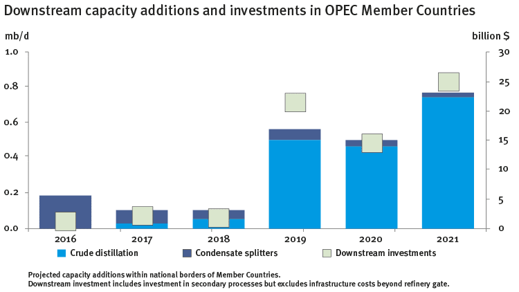

## Table of Contents

## What is the Nelson Complexity Index?

The Nelson Complexity Index (NCI) is a way to measure how complicated and advanced an oil refinery is. It looks at the different types of equipment and processes used in the refinery and gives a score based on how hard they are to build and run. A higher NCI means the refinery can do more advanced things with oil, like turning it into different products such as gasoline, diesel, and jet fuel.

This index is important because it helps people understand how much a refinery can do and how much it might cost to build or upgrade one. For example, a refinery with a high NCI can make more valuable products from oil, but it might also be more expensive to build and maintain. Companies and investors use the NCI to compare refineries and decide where to spend their money.

## Who developed the Nelson Complexity Index and when?

The Nelson Complexity Index was developed by Wilbur L. Nelson. He came up with this idea in the 1960s while working as an editor for the Oil & Gas Journal. Nelson wanted a simple way to compare how advanced different oil refineries were.

His index became popular because it helped people understand the capabilities of refineries without getting into too much technical detail. By using the Nelson Complexity Index, companies could see which refineries were better at turning crude oil into valuable products like gasoline and diesel. This made it easier for them to decide where to invest their money.

## Why is the Nelson Complexity Index important in the oil refining industry?

The Nelson Complexity Index is important in the oil refining industry because it helps people understand how advanced a refinery is. It looks at the different machines and processes used in a refinery and gives a score based on how hard they are to build and run. This score, called the NCI, tells companies and investors how well a refinery can turn crude oil into useful products like gasoline, diesel, and jet fuel. A higher NCI means the refinery can do more advanced things with oil, which can be more profitable.

This index is also useful for making decisions about where to spend money. Companies can use the NCI to compare different refineries and see which ones are better at making valuable products. This helps them decide if they should build a new refinery, upgrade an old one, or invest in a different one. The NCI makes it easier for everyone in the oil industry to understand and compare refineries without getting into too much technical detail.

## How is the Nelson Complexity Index calculated?

The Nelson Complexity Index is calculated by looking at the different machines and processes in a refinery. Each machine or process gets a score based on how hard it is to build and run. For example, a simple machine might get a low score, while a very advanced machine might get a high score. To find the total score for the refinery, you multiply the score of each machine by how much oil it can process. Then, you add up all these numbers.

Once you have the total score, you divide it by the total amount of oil the refinery can process. This gives you the Nelson Complexity Index. A higher number means the refinery is more advanced and can do more with the oil it processes. This index helps companies and investors understand how well a refinery can turn oil into valuable products like gasoline and diesel.

## What are the different types of refinery units considered in the Nelson Complexity Index?

The Nelson Complexity Index looks at different types of machines and processes in a refinery to figure out how advanced it is. Some of the simpler machines it considers are atmospheric distillation units, which separate crude oil into different parts like gasoline and diesel. Vacuum distillation units are a bit more complex; they help process the heavier parts of crude oil that atmospheric units can't handle. These units are important because they form the base of the refining process.

More advanced units include things like catalytic crackers, which break down heavy oil into lighter, more valuable products like gasoline. Hydrocrackers are even more complex; they use hydrogen to break down heavy oil into lighter products. Other units the index looks at are reformers, which improve the quality of gasoline, and cokers, which turn the heaviest parts of crude oil into useful products. Each of these units gets a score based on how hard they are to build and run.

The Nelson Complexity Index also considers units like alkylation units, which make high-octane gasoline, and isomerization units, which change the structure of molecules to make better products. Treating units, like hydrotreaters, clean up the oil to remove impurities. Each type of unit adds to the overall complexity of the refinery, and the index helps show how advanced a refinery is by considering all these different machines and processes.

## Can you explain the weighting factors used in the Nelson Complexity Index?

The Nelson Complexity Index uses weighting factors to show how hard different parts of a refinery are to build and run. Each type of machine or process in the refinery gets a special number, called a weighting factor. For example, a simple machine like an atmospheric distillation unit might get a low number because it's not very hard to build or run. On the other hand, a more complicated machine like a hydrocracker gets a higher number because it's harder to build and needs more care to run well.

To figure out the Nelson Complexity Index, you multiply the weighting factor of each machine by how much oil it can process. Then, you add up all these numbers to get a total score for the refinery. After that, you divide this total score by the total amount of oil the refinery can process. This gives you the final Nelson Complexity Index number. A higher number means the refinery is more advanced and can do more with the oil it processes.

## How does the Nelson Complexity Index help in comparing different refineries?

The Nelson Complexity Index helps in comparing different refineries by giving each one a number that shows how advanced it is. This number, called the NCI, is based on the different machines and processes in the refinery. Each machine gets a score depending on how hard it is to build and run. By looking at the NCI, companies and investors can see which refineries are better at turning crude oil into valuable products like gasoline and diesel. A higher NCI means the refinery can do more advanced things with oil, which can be more profitable.

This index makes it easier for people in the oil industry to understand and compare refineries without getting into too much technical detail. For example, if one refinery has an NCI of 10 and another has an NCI of 5, the first one is more advanced and can probably make more valuable products. Companies can use this information to decide where to spend their money. They might choose to build a new refinery, upgrade an old one, or invest in a different one based on the NCI. This helps them make smart decisions about where to put their resources.

## What are the limitations of the Nelson Complexity Index?

The Nelson Complexity Index (NCI) is a helpful tool, but it has some limitations. One big problem is that it doesn't consider how well the refinery actually works. A refinery might have a high NCI because it has a lot of advanced machines, but if those machines are old or not working well, the refinery won't be very good at turning oil into useful products. The NCI also doesn't look at things like how much it costs to run the refinery or how much money it makes. These are important things for companies to know when they're deciding where to spend their money.

Another limitation is that the NCI doesn't change over time. Once a refinery gets a score, it stays the same even if the refinery gets new machines or if the old ones start to wear out. This means the NCI might not always give a good picture of what the refinery can do now. Also, the NCI is based on how hard it is to build and run the machines, but it doesn't take into account new technology or changes in the oil industry. This can make it hard to compare refineries that use very new or very old technology.

## How has the Nelson Complexity Index evolved over time?

The Nelson Complexity Index was created by Wilbur L. Nelson in the 1960s. Back then, it was a simple way to compare how advanced different oil refineries were. It looked at the machines and processes in a refinery and gave each one a score based on how hard they were to build and run. Over the years, the basic idea of the NCI has stayed the same, but people have started using it in new ways. Companies and investors now use the NCI to make decisions about where to spend their money, like whether to build a new refinery or upgrade an old one.

Even though the NCI has been around for a long time, it hasn't changed much. It still uses the same weighting factors for different machines and processes. This means it doesn't always keep up with new technology or changes in the oil industry. Some people think the NCI should be updated to include things like how well a refinery works, how much it costs to run, and how much money it makes. But for now, the NCI is still a useful tool for comparing refineries, even if it has some limitations.

## Can you provide examples of refineries with high and low Nelson Complexity Index scores?

A good example of a refinery with a high Nelson Complexity Index score is the ExxonMobil refinery in Baytown, Texas. This refinery has a lot of advanced machines and processes, like catalytic crackers and hydrocrackers, which help it turn crude oil into valuable products like gasoline and diesel. Because it has these complicated machines, the Baytown refinery can do more with the oil it processes, which makes it more profitable. Its high NCI score shows that it's a very advanced refinery.

On the other hand, a refinery with a low Nelson Complexity Index score might be something like a small, older refinery that only has simple machines like atmospheric distillation units. These refineries can still process oil, but they can't do as much with it as more advanced refineries. They might only be able to make basic products and not the more valuable ones like high-octane gasoline. A low NCI score means the refinery is less complicated and might not be as profitable as one with a higher score.

## How does the Nelson Complexity Index influence investment decisions in the refining sector?

The Nelson Complexity Index helps companies and investors decide where to put their money in the refining sector. By looking at the NCI, they can see how advanced a refinery is and how well it can turn crude oil into valuable products like gasoline and diesel. A refinery with a high NCI score can do more with the oil it processes, which means it can be more profitable. This makes it a good choice for investment. Companies might decide to build a new, advanced refinery or upgrade an old one to increase its NCI and make more money.

However, the NCI doesn't tell the whole story. It doesn't show how well a refinery actually works or how much it costs to run. A refinery with a high NCI might have old machines that don't work well, which could make it less profitable than a refinery with a lower NCI but newer machines. Investors need to think about these things, along with the NCI, when they're deciding where to spend their money. The NCI is a helpful tool, but it's just one part of the bigger picture in the refining sector.

## What are the future trends and potential modifications to the Nelson Complexity Index?

The Nelson Complexity Index might change in the future to keep up with new technology and changes in the oil industry. Right now, the NCI doesn't look at how well a refinery works or how much money it makes. In the future, people might want to add these things to the NCI to make it a better tool. They might also change the scores for different machines to match new technology that's harder or easier to build and run. This would help the NCI stay useful for comparing refineries.

Another thing that could happen is that the NCI might start to consider how a refinery affects the environment. With more focus on being green, people might want to know how much pollution a refinery makes. If the NCI included this, it could help companies and investors pick refineries that are good for the planet as well as good for making money. Overall, the NCI could become a more complete tool that helps people make better decisions about where to spend their money in the refining sector.

## How does the Nelson Complexity Index work?

The Nelson Complexity Index (NCI) evaluates refinery complexity by assigning complexity factors to the various processing units within a refinery. These factors represent the relative cost and technical sophistication of these units compared to a standard crude distillation unit (CDU), which has a complexity [factor](/wiki/factor-investing) of 1. The choice of the CDU as the baseline reflects its fundamental role in separating [crude oil](/wiki/crude-oil) into its basic components through distillation—a process central to refinery operations.

Complexity factors for other processing units, such as catalytic cracking units, hydrocrackers, and coking units, are higher than 1. These units involve more complex chemical reactions or require more advanced technologies, thus contributing more to a refinery's overall complexity. For example, a catalytic cracker, which breaks down heavy hydrocarbons into lighter, more valuable products, may have a complexity factor considerably greater than 1 due to its technical demands and operational costs.

The overall Nelson Complexity Index score for a refinery is calculated by summing these weighted factors, taking into account the capacity of each unit. This metric is crucial as it provides a numerical representation of the refinery's capability to handle diverse crude oils and produce a wide array of products. The formula for calculating the total NCI score can be expressed as:

$$
NCI = \sum_{i} (C_i \times \text{Capacity}_i)
$$

where $C_i$ represents the complexity factor for unit $i$, and $\text{Capacity}_i$ denotes the capacity of the same unit.

By utilizing this scoring system, industry stakeholders can quantitatively assess the sophistication and processing power of different refineries. High NCI scores indicate refineries capable of maximizing product yield from varied crude types, thereby enhancing economic efficiency and competitive advantage in the market.

## References & Further Reading

[1]: Leffler, W. L., & Pattarozzi, R. (2004). ["Petroleum Refining in Nontechnical Language"](https://archive.org/details/petroleumrefinin0000leff). PennWell Books.

[2]: Gary, J. H., Handwerk, G. E., & Kaiser, M. J. (2007). ["Petroleum Refining: Technology and Economics"](https://www.taylorfrancis.com/books/mono/10.4324/9780203907924/petroleum-refining-james-handwerk-james-gary-david-geddes-mark-kaiser). CRC Press.

[3]: Speight, J. G. (2014). ["Refining Processes Handbook"](https://www.taylorfrancis.com/books/mono/10.1201/9781315374079/handbook-petroleum-refining-james-speight). McGraw-Hill Education.

[4]: Nelson, W. L. (1960). ["Petroleum Refinery Structure and Management"](https://www.scribd.com/document/520496031/Petroleum-Refinery-Engineering-W-L-Nelson-4th-Edition). Gulf Publishing Company.

[5]: Silvianita, S., & Galih, S. (2009). ["Determination of Nelson-Farrar Cost Index and its Applications"](https://scholar.google.com/citations?user=lfNGqF4AAAAJ&hl=en). Indonesian Journal of Oil and Gas Science and Technology.

[6]: De Marco, A., & Mangano, G. (2016). ["The Role of Refineries in the Global Oil Supply Chain"](https://www.semanticscholar.org/paper/Evolutionary-trends-in-smart-city-initiatives-Marco-Mangano/70879932f68fba6e7a31221aa417bc3202308a57). Taylor & Francis Group.

[7]: Khan, M. M. (2018). ["Algorithmic Trading in Energy Markets"](https://academic.oup.com/rfs/article-abstract/31/6/2184/4708266). Science Direct.