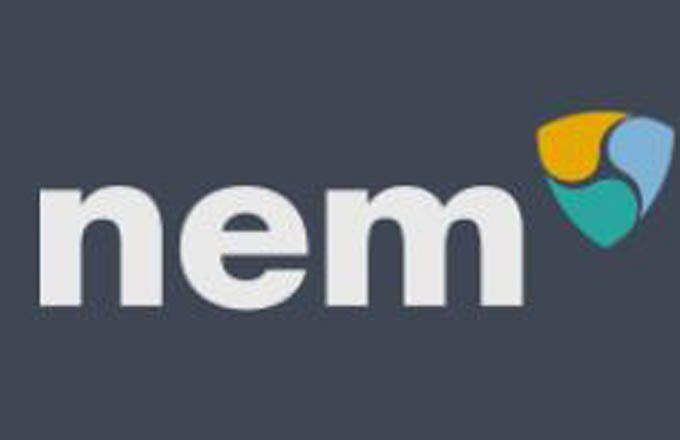

Over the past decade, cryptocurrencies have emerged as a transformative force in global finance. This new digital financial system enables decentralized transactions through blockchain technology, which offers security, transparency, and reduced reliance on traditional banking institutions. Initially introduced with Bitcoin in 2009, the cryptocurrency landscape has rapidly evolved, now encompassing thousands of different coins and tokens, each serving unique purposes and applications. Among these is NEM, a pioneering platform that introduced innovative blockchain solutions, including its native cryptocurrency, XEM.

NEM, which stands for New Economy Movement, was launched in 2015 with the aim of building a smarter and more technologically advanced blockchain. Its native currency, XEM, serves as a medium of exchange within the NEM ecosystem, facilitating a range of applications including payments, smart contracts, and secure records management. NEM's blockchain architecture is unique, utilizing a consensus mechanism called Proof-of-Importance (PoI), which differs from the more common Proof-of-Work (PoW) and Proof-of-Stake (PoS) systems. This approach rewards users based on their stake and transaction activity, advancing equitable participation and network security.

Blockchain technology, as exemplified by NEM, is increasingly relevant to modern financial systems. Its ability to provide secure, irreversible, and transparent transactions makes it a reliable alternative to traditional banking infrastructures. These characteristics have encouraged its adoption across industries, from finance to supply chain management, healthcare, and beyond. As global interest in blockchain solutions grows, the role of cryptocurrencies in everyday financial transactions is expected to expand, prompting innovations in how these digital assets are traded.

Algorithmic trading, or algo trading, is one such innovation, playing a significant role in the cryptocurrency markets. It involves using computer programs to execute trades based on pre-set criteria and mathematical models, allowing for high-speed and high-frequency trading that can respond to market changes in milliseconds. This form of trading capitalizes on the volatile nature of cryptocurrency markets, offering opportunities for profit that are less feasible in more stable financial markets. For XEM traders, developing algorithmic strategies can optimize trading performance and manage the inherent risks of cryptocurrencies.

The purpose and scope of this article are to provide a comprehensive overview of NEM, XEM, and the intersection with algorithmic trading. It will explore the unique aspects of NEM's blockchain technology, the potential advantages of XEM for traders, and how algorithmic trading can be applied to advance trading strategies in the cryptocurrency market. This discussion will also touch upon future prospects and challenges, offering insights into how NEM and XEM may evolve in the rapidly changing digital finance landscape.

## Table of Contents

## Understanding NEM Cryptocurrency and the XEM Blockchain

NEM, short for New Economy Movement, represents a significant innovation in the blockchain and cryptocurrency landscape. Launched in March 2015, NEM introduces a unique blockchain technology that diverges from traditional frameworks used by other cryptocurrencies like Bitcoin and Ethereum. The native cryptocurrency of the NEM platform is XEM. Unlike many other cryptos, XEM is not mined. Instead, it is harvested, a process that’s analogous but distinct from mining.

### Detailed Explanation of NEM and Its Significance

NEM was conceived to address the limitations of earlier blockchain systems by enhancing scalability, security, and efficiency. It introduced several advanced features that have been influential in broadening the application scope of blockchain technology. At the heart of NEM’s innovation is its custom-built blockchain that diverges from the typical proof-of-work (PoW) consensus mechanism.

### Features and Benefits of XEM Cryptocurrency

XEM, as the native currency of the NEM blockchain, benefits from several unique features:

1. **Proof-of-Importance (PoI)**: Unlike PoW or proof-of-stake (PoS) systems, NEM uses a proof-of-importance algorithm to secure its network. This mechanism selects nodes based on their importance score, determined by their engagement and vested amount of XEM, rather than just computational power or holdings.

2. **Efficient Transactions**: XEM allows for quick and secure transactions. The network is designed to handle a high volume of transactions efficiently, making it attractive for both individuals and businesses.

3. **Built-in Multi-Signature Accounts and Messaging**: XEM supports native multi-signature accounts and encrypted messaging capabilities, enhancing security and privacy.

### NEM's Unique Blockchain Architecture

NEM's architecture is built on a two-tier design: it comprises the blockchain itself and a business logic layer. This separation allows for more efficient transaction processing and provides extensive flexibility for creating decentralized applications.

1. **Mijin Private Blockchain**: NEM was one of the first to introduce a private blockchain, Mijin, used by financial institutions and businesses for private transactions and secure data management.

2. **Smart Assets**: NEM offers a Smart Asset System, which enables developers to design custom logic and use blockchain technology for various applications without needing complex coding languages.

### Comparison of XEM with Other Major Cryptocurrencies

When compared to Bitcoin (BTC) and Ethereum (ETH), XEM stands out due to its PoI consensus mechanism, which seeks to democratize the network by rewarding participants based on activity and holdings. 

- **Bitcoin**: Primarily a store of value, Bitcoin relies on PoW, leading to high energy consumption and slower transaction speeds.

- **Ethereum**: While versatile due to its smart contract capabilities, Ethereum has faced scalability issues, which NEM addresses through its dual-layer architecture and PoI system.

- **Cardano (ADA)**: Like NEM, Cardano emphasizes scalability and security with its PoS consensus but lacks the built-in multi-signature and encrypted messaging features native to NEM.

### Current Market Position and Adoption of NEM and XEM

As of now, NEM and XEM have carved a niche in the blockchain market, particularly in regions like Southeast Asia and Japan, where private blockchain applications have high adoption. NEM has collaborated with multiple enterprises and governmental entities, enhancing its reputation as a reliable and flexible blockchain solution. While XEM does not compete with the top-tier market valuations of BTC or ETH, it maintains a stable presence and is recognized for its technological contributions and enterprise applications.

In summary, NEM and its XEM [cryptocurrency](/wiki/cryptocurrency) offer a robust platform with distinctive features that cater to both enterprise solutions and individual needs within the cryptocurrency ecosystem. Exploring its ongoing developments further showcases its potential to influence the future trajectory of blockchain technologies.

## What is Cryptocurrency Harvesting?

Cryptocurrency harvesting within the NEM ecosystem represents an innovative approach to [earning](/wiki/earning-announcement) digital currency, specifically XEM, the native cryptocurrency of the NEM blockchain. This process is distinct from traditional mining, which is commonly associated with cryptocurrencies like Bitcoin. 

### Definition of Cryptocurrency Harvesting

Cryptocurrency harvesting in NEM is a method through which users can earn XEM by contributing to the network's operation without the need for energy-intensive proof-of-work (PoW) processes. Instead, NEM uses a consensus algorithm known as Proof-of-Importance (PoI). This system evaluates the importance of an account based on several factors, such as its stake of vested XEM, transaction history, and the network activity it generates. This model is designed to encourage active participation and network growth rather than just rewards based on computational power.

### The Role of Harvesting in the NEM Ecosystem

Harvesting is central to the NEM network's stability and functionality. By allowing users to participate in the validation and creation of new blocks, harvesting supports decentralized ledger maintenance without excessive energy consumption. This contributes to the security and efficiency of the NEM blockchain, ensuring that transactions are verified in a timely and reliable manner.

### Differences Between Harvesting and Traditional Mining

Harveting differs from traditional mining primarily through its reliance on PoI over PoW. In traditional mining, miners use significant computing power to solve complex mathematical problems, typically requiring specialized hardware and large energy expenditures. Conversely, harvesting uses the PoI algorithm, which prioritizes network activity and vested currency over computational prowess. Here is a simplified comparison:

- **Traditional Mining:** Uses PoW, requires powerful hardware, high energy consumption.
- **Harvesting:** Uses PoI, requires vested XEM and network activity, minimal energy use.

### Advantages of Harvesting for XEM Holders

Harvesting offers several key advantages to XEM holders:

- **Energy Efficiency:** By avoiding the energy-intensive processes typical of PoW, harvesting is much more environmentally friendly.
- **Network Incentives:** It encourages network engagement and transaction generation, as users are rewarded not just for possessing XEM but for actively contributing to the network's activity.
- **Decentralization:** The PoI model ensures that block generation and rewards are more evenly distributed, reducing the monopolization often seen in traditional mining pools.
- **Reduced Costs:** Absence of the need for expensive mining rigs or high electricity bills makes harvesting accessible to a broader audience.

### Requirements Needed to Start Harvesting XEM

To begin harvesting XEM, certain prerequisites must be met:

1. **Vested Balance:** A minimum of 10,000 vested XEM is required. Vested balance refers to the portion of an account's holdings considered for block creation, which increases as XEM is kept unspent over time.
2. **Node Connection:** Participants must connect to a supernode or run their own node to participate in network operations.
3. **Importance Score:** An account's ability to harvest is influenced by its PoI score, which combines factors like account activity and balance.
4. **NEM Wallet Software:** Access to a NEM wallet to manage funds, connect to nodes, and monitor harvesting activity.

Harvesting presents a sustainable approach to earning XEM while contributing to the growth and security of the NEM blockchain, making it an appealing option for cryptocurrency enthusiasts and investors prioritizing sustainability and decentralization.

## The Role of Algo Trading in Cryptocurrency Markets

Algorithmic trading, often referred to as algo trading, involves the use of computer programs and algorithms to execute trading orders with minimal human intervention. These algorithms are designed to buy or sell financial instruments based on a variety of criteria, including timing, price, and [volume](/wiki/volume-trading-strategy). In the context of cryptocurrencies, algo trading plays a significant role, given the market's decentralized nature and inherent [volatility](/wiki/volatility-trading-strategies).

The significance of algo trading in cryptocurrency markets lies primarily in its ability to manage the high levels of volatility that characterize these markets. Cryptocurrency prices can change rapidly due to various factors, including investor sentiment, regulatory news, and technological developments. Algo trading systems can process vast amounts of data in real-time, identifying patterns and executing trades at speeds impossible for human traders. This capacity not only maximizes potential profits but also helps mitigate risks associated with sudden market movements.

When applied to NEM and its native cryptocurrency XEM, algo trading can exploit specific features of the NEM blockchain. For instance, the deterministic finality of NEM's proof-of-importance (PoI) consensus mechanism can be incorporated into trading algorithms to enhance decision-making processes. By considering network activity, account balance, and other relevant factors, traders can optimize their strategies to align with NEM’s unique ecosystem dynamics.

Several case studies demonstrate the successful application of algo trading in the broader cryptocurrency market. High-frequency trading ([HFT](/wiki/high-frequency-trading-strategies)) firms, for example, use sophisticated algorithms to execute a large number of trades in fractions of a second, capitalizing on short-term opportunities. Another notable case is the use of [arbitrage](/wiki/arbitrage) strategies, where algorithms exploit price discrepancies of the same cryptocurrency across different exchanges to generate profit. These strategies benefit from the constant connectivity and rapid execution speeds characteristic of algo trading systems.

While algo trading offers numerous advantages, it also comes with specific risks and considerations. The primary concern is the potential for over-optimization, where algorithms perform well on historical data but fail in live markets due to unforeseen changes in market conditions. Additionally, the complexity of algorithms can lead to unintended behavior if not rigorously tested. Latency, or the time delay in data transmission, also presents a risk; in rapidly moving markets, even minimal delays can impact trading success.

Traders must also be aware of regulatory challenges, as differing regulatory environments across jurisdictions can affect algorithmic strategies. Moreover, the transparency and security of the trading platforms used are crucial, as they must safeguard against cyber threats and ensure the integrity of trading algorithms.

In summary, algo trading significantly enhances the efficiency and effectiveness of trading in cryptocurrency markets, including NEM and XEM. However, it requires careful strategy development, thorough testing, and constant monitoring due to the associated risks. With continued advancements in technology and increasing familiarity with these systems, algo trading is positioned to become even more integral to the cryptocurrency trading landscape.

## Creating Strategies with XEM in Algo Trading

Cryptocurrency trading has evolved considerably with the advent of [algorithmic trading](/wiki/algorithmic-trading), providing traders with automated and efficient ways to capitalize on market movements. XEM, the native cryptocurrency of the NEM blockchain, offers unique opportunities for algorithmic trading due to its distinctive features and infrastructure.

### Key Strategies for Trading XEM Using Algorithms

Algorithmic trading strategies for XEM typically involve trend-following algorithms, market-making strategies, and arbitrage. Trend-following algorithms capitalize on upward or downward market trends. These strategies rely on technical indicators like moving averages to trigger buy or sell signals. Market-making strategies, on the other hand, involve placing both buy and sell orders around the current market price to capture the bid-ask spread. Arbitrage strategies exploit price discrepancies between different exchanges or markets by buying low in one and selling high in another.

### An Overview of Trading Platforms Supporting XEM Algo Trading

Several cryptocurrency exchanges and trading platforms support XEM algorithmic trading, utilizing APIs that allow algorithms to execute trades automatically. Notable platforms include Binance, HitBTC, and Bittrex, which offer robust trading APIs compatible with various programming languages such as Python. These APIs provide access to real-time data, order execution, and account management, essential for developing and running algorithmic trading strategies.

### Factors to Consider When Developing an Algo Trading Strategy for XEM

When developing an algorithmic trading strategy for XEM, several factors must be considered:

1. **Volatility and Liquidity:** XEM's market conditions are characterized by high volatility and varying liquidity levels, impacting trading strategies.
2. **Latency and Execution Speed:** The speed at which trades are executed is crucial, especially for high-frequency algorithms.
3. **Risk Management:** Implementing stop-loss and take-profit mechanisms helps manage risks effectively.
4. **Regulatory Compliance:** Trading strategies must adhere to legal requirements to avoid compliance issues.

### Tools and Resources for Backtesting XEM Trading Strategies

Backtesting is a critical step in developing successful trading strategies, allowing traders to simulate strategies on historical data to gauge performance. Several tools support [backtesting](/wiki/backtesting) for XEM trading strategies:

- **Python Libraries:** Libraries like Backtrader and PyAlgoTrade offer comprehensive tools for strategy development and backtesting.
- **Trading Platforms:** MT4 and TradingView provide backtesting capabilities with historical data access, though integration might require additional development for XEM-specific testing.

### Success Stories and Anecdotal Experiences from the XEM Trading Community

The XEM trading community has reported numerous success stories, demonstrating the potential of algo trading. For instance, traders have successfully employed trend-following strategies to harness XEM's price [momentum](/wiki/momentum) during bullish phases, achieving significant returns. Additionally, community-driven platforms and forums provide anecdotal insights, fostering a collaborative environment where experienced traders share strategies and tips, benefiting both novices and experts alike.

In conclusion, algorithmic trading offers powerful strategies for engaging with the XEM market, supported by a diverse range of platforms and tools. By carefully considering market conditions and implementing robust strategies, traders can potentially achieve lucrative outcomes in the dynamic world of cryptocurrency trading.

## Future Prospects for NEM, XEM, and Algorithic Trading

### Future Prospects for NEM, XEM, and Algorithmic Trading

The future of NEM, XEM, and algorithmic trading holds considerable promise as technological advancements, market dynamics, and regulatory landscapes evolve. As the cryptocurrency ecosystem continues to mature, the impact of these changes on NEM and its native cryptocurrency, XEM, warrants detailed exploration.

#### Predictions for the Growth of NEM and XEM

NEM (New Economy Movement) has garnered recognition for its blockchain platform, which emphasizes scalability and ease of integration. The XEM cryptocurrency, built on this platform, is poised for growth as more industries and financial systems consider blockchain solutions for transparency and security. According to market analyses, XEM could see increased adoption as NEM expands its use cases, particularly in supply chain management, digital identity verification, and internet of things (IoT) applications. Continued enhancements to NEM's technology, such as improved consensus algorithms and cross-chain interoperability, are projected to bolster its market position.

#### New Developments in NEM Blockchain Technology

Recent developments in the NEM blockchain focus on Catapult, a next-generation blockchain engine designed to enhance performance and capabilities. Key features include aggregated transactions, multi-level multi-signature accounts, and seamless scalability. These advancements are expected to attract enterprise-level adoption, enabling businesses to deploy robust blockchain solutions. Additionally, the integration of smart contracts and decentralized applications (dApps) within the NEM ecosystem can drive further innovation and growth.

#### Emerging Trends in Cryptocurrency Algorithmic Trading

Algorithmic trading in cryptocurrency markets is gaining traction due to its ability to execute complex trading strategies with high precision and efficiency. Emerging trends include the use of [machine learning](/wiki/machine-learning) algorithms to predict market movements, the adoption of high-frequency trading (HFT) techniques, and the deployment of automated bots for arbitrage opportunities. Python libraries such as `TA-Lib` and `Backtrader` are becoming standard tools for developing and backtesting trading algorithms, contributing to their accessibility and appeal.

#### Potential Regulatory Impacts on NEM and Cryptocurrency Trading

The regulatory landscape for cryptocurrencies is rapidly evolving, with governments and financial bodies striving to balance innovation with consumer protection. Regulations targeting anti-money laundering (AML) and know-your-customer (KYC) protocols are likely to impact the trading and adoption of NEM and XEM. Compliance with these regulations may lead to increased legitimacy and trust, encouraging institutional investments. However, overly stringent regulations could pose challenges, potentially stifling innovation and flexibility within the cryptocurrency sector.

#### Innovations Working Towards Simplifying Algo Trading for Individuals

Several innovations aim to make algorithmic trading accessible to individual traders, democratizing this advanced trading methodology. Platforms offering user-friendly interfaces, educational resources, and pre-configured trading bots are on the rise. Developments in [artificial intelligence](/wiki/ai-artificial-intelligence) and natural language processing enable the creation of intuitive AI-driven trading assistants that guide traders in strategy development and execution. These advancements lower the barriers to entry, empowering more individuals to engage in profitable algorithmic trading using XEM and other cryptocurrencies.

In summary, the future of NEM, XEM, and algorithmic trading appears bright with ongoing technological, market, and regulatory developments. These factors collectively enhance the potential for broader adoption and robust growth within the cryptocurrency space.

## Conclusion

The article has presented a comprehensive overview of the NEM cryptocurrency and its native token, XEM, alongside the role of algorithmic trading in enhancing the efficiency of cryptocurrency markets. NEM has emerged as a significant player due to its innovative blockchain architecture, which offers distinct advantages over traditional systems, such as enhanced security and scalability. XEM, characterized by its ease of use and unique features, stands poised for broader adoption, supported by its strategic market positioning.

Cryptocurrency harvesting was highlighted as a noteworthy concept, presenting an alternative to traditional mining with advantages in terms of energy efficiency and accessibility for XEM holders. This feature, intrinsic to the NEM ecosystem, not only promotes user participation but also strengthens the network's integrity.

Algorithmic trading has been identified as a critical [factor](/wiki/factor-investing) in crypto markets, owing to its ability to manage volatility and execute trades with precision at high speeds. Its application to NEM and XEM trading showcases potential advantages, such as optimizing trading strategies and maximizing returns. Practical examples and case studies underscore the transformative impact of algorithmic trading in this sector, although investors must remain aware of inherent risks and considerations.

As we look to the future, NEM and XEM are set to gain from ongoing developments in blockchain technology and the expansion of algorithmic trading solutions. These advancements will likely be influenced by regulatory trends and innovations aimed at making complex trading techniques accessible to a broader audience. Engaging with these evolving technologies is encouraged, as they hold the potential to reshape financial systems, fostering transparency, security, and efficiency in global transactions. The integration of blockchain into mainstream financial paradigms could lead to unprecedented opportunities for individuals and institutions alike, signaling a fundamental shift towards a more inclusive and decentralized financial ecosystem.

## Additional Resources and References

### Links to Official NEM and XEM Websites for Further Reading

The following links provide official resources for those interested in learning more about the NEM platform and its native cryptocurrency, XEM:

- **NEM Official Website**: [nem.io](https://nem.io/)
- **Symbol from NEM**: [symbolplatform.com](https://symbolplatform.com/)
- **NEM GitHub Repository**: [github.com/NEM](https://github.com/NEM)

These websites offer comprehensive insights into the functionalities of the NEM blockchain and the latest updates on the XEM cryptocurrency.

### Recommended Books and Courses on Algo Trading

There are several well-regarded [books](/wiki/algo-trading-books) and courses that can serve as valuable resources for individuals interested in mastering algorithmic trading, particularly in the context of cryptocurrencies:

- **Books**
  - "Algorithmic Trading: Winning Strategies and Their Rationale" by Ernest P. Chan
  - "Advances in Financial Machine Learning" by Marcos López de Prado

- **Courses**
  - Coursera's "Machine Learning for Trading" by Georgia Tech
  - edX's "Algorithmic Trading & Finance Models with Python, R, and Stata Essential Training" by DataCamp

### Community Forums and Websites for Enthusiasts and Beginners

Engaging with online communities can be incredibly beneficial for anyone interested in learning more about NEM, XEM, and algorithmic trading. Here are some recommended platforms:

- **Reddit**
  - r/nem
  - r/algotrading

- **Bitcointalk**
  - NEM dedicated thread: [bitcointalk.org/index.php?topic=654845.0](https://bitcointalk.org/index.php?topic=654845.0)

- **Discord and Telegram Groups**
  - NEM and Symbol Discord: Available through the NEM official website.
  - Trading communities on Telegram where strategies and insights are shared.

### Directories of Platforms Offering Algo Trading Tools for XEM

Several platforms provide algorithmic trading tools and services specifically for XEM. Below are directories and well-known platforms for such tools:

- **CryptoCompare**: Offers a comprehensive directory of trading bots that support various cryptocurrencies, including XEM.
- **Kryll.io**: A platform known for its intuitive visual strategy editor, including support for trading XEM.
- **HaasOnline**: Provides advanced algo trading tools that can be adapted for use with XEM.

### Published Papers and Articles on NEM Blockchain Innovations

For those interested in the scholarly and technical advancements of NEM's blockchain technology, a selection of published papers and articles is available:

- "NEM Technical Reference" by the NEM Foundation: Available on the NEM GitHub repository.
- "Symbol from NEM: Enterprise-ready blockchain solutions" – A white paper available on the Symbol platform website.
- Several peer-reviewed publications can be found on platforms like IEEE Xplore and SpringerLink by searching for "NEM blockchain." These provide in-depth discussions of the technical innovations and applications of NEM's blockchain technology.

These resources collectively provide a foundation for understanding and engaging with NEM, XEM, and the broader context of algorithmic trading within the cryptocurrency industry.

## References & Further Reading

[1]: Borrego, C. (2019). ["Exploring Symbol, NEM's Next-Gen Blockchain Solution."](https://webisoft.com/articles/symbol-nem/) NEM Official Blog.

[2]: Chan, E. P. (2009). ["Algorithmic Trading: Winning Strategies and Their Rationale."](https://github.com/ftvision/quant_trading_echan_book) Wiley Trading.

[3]: López de Prado, M. (2018). ["Advances in Financial Machine Learning."](https://www.amazon.com/Advances-Financial-Machine-Learning-Marcos/dp/1119482089) Wiley.

[4]: NEM Foundation. ["NEM Blockchain Technology Overview."](https://docs.nem.io/pages/History/Roadmap/default.en.html) [nem.io](https://docs.nem.io/pages/History/Roadmap/default.en.html).

[5]: Symbol Platform. ["Symbol from NEM: A New Dawn."](https://markets.businessinsider.com/news/stocks/nem-launches-symbol-the-next-generation-enterprise-grade-blockchain-platform-1030205544) [symbolplatform.com](https://markets.businessinsider.com/news/stocks/nem-launches-symbol-the-next-generation-enterprise-grade-blockchain-platform-1030205544)