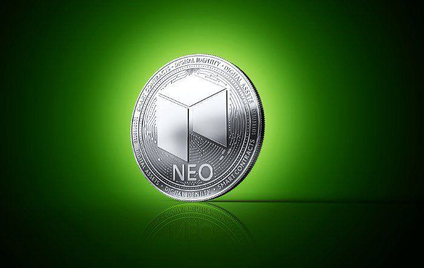

Blockchain technology has revolutionized the financial sector by introducing a decentralized, secure, and transparent method of recording transactions. Unlike traditional financial systems, which rely on centralized authorities, blockchain operates on a network of distributed ledgers, ensuring that transactions are immutable and resistant to tampering. This technology's innate ability to create trust in a trustless environment is reshaping how financial services are delivered globally, potentially reducing costs and increasing the speed of transactions across borders.

NEO, often referred to as the "Ethereum of China," is a prominent cryptocurrency that stands out for several unique features. It operates using a blockchain platform that supports smart contracts, allowing developers to create automated and self-executing contracts with the blockchain's security. NEO's infrastructure also embraces digital assets, enabling the digitization of physical assets and their secure management on its blockchain. Additionally, NEO’s vision of a "smart economy" encompasses digital identities, assets, and contracts, providing a comprehensive framework that could revolutionize interactions between businesses and consumers.



The emergence of algorithmic trading has brought substantial changes to the cryptocurrency market, offering rapid execution and systematic trading strategies unavailable to traditional traders. Algorithmic trading leverages complex algorithms, enabling traders to analyze vast datasets and execute orders within fractions of a second. This automated process not only increases the potential profitability of trades but also mitigates human error, thus optimizing investment strategies and risk management.

The purpose of this article is to explore the intersection of NEO cryptocurrency, blockchain technology, and algorithmic trading. We aim to examine how NEO leverages blockchain for enhanced functionality, assess the benefits and challenges of blockchain implementation in NEO, and delve into the role of algorithmic trading within this context. Additionally, we will analyze why NEO presents attractive prospects for algorithmic traders, explore tools and platforms for algorithmic trading with NEO, and present case studies of successful trading strategies.

This article will offer a detailed overview of NEO cryptocurrency, outline the role of blockchain in enhancing its security and efficiency, and elucidate the significance and methodologies of algorithmic trading in the crypto market. Finally, we will discuss challenges and future developments, the evolving role of blockchain, and predictions for the growth of algorithmic trading, concluding with insights into how these elements are reshaping cryptocurrency markets and inviting readers to stay informed in the continually evolving crypto landscape.

## Table of Contents

## Understanding NEO Cryptocurrency

NEO cryptocurrency, often referred to as the "Ethereum of China," is a blockchain-based platform that aims to provide a robust foundation for a "smart economy." At its core, NEO integrates digital assets, digital identity, and smart contracts to create a secure and scalable network. Unlike Bitcoin, which primarily functions as a decentralized digital currency, and Ethereum, which serves as a leading platform for decentralized applications (DApps), NEO encompasses a broader vision of integrating the blockchain with everyday economic activities.

The history of NEO dates back to 2014 when it was initially launched as AntShares by Da Hongfei and Erik Zhang in China. In 2017, it rebranded as NEO, aligning its vision with the goal of developing a smarter economy through blockchain technology. The NEO ecosystem is composed of two native tokens: NEO and GAS. The NEO token serves as an investment token that grants voting rights in network governance, whereas GAS is utilized to pay for transaction fees and services on the network.

NEO is distinctive for its use of smart contracts, which are self-executing contracts with the terms of agreement directly written into code. These smart contracts enable the automation of complex processes without the need for intermediaries, reducing costs and increasing efficiency. Moreover, NEO supports a range of programming languages, including C#, Python, and Java, which helps attract a wide community of developers.

One of NEO's distinguishing features is its focus on digital identity, which ensures that individuals, organizations, and entities are verifiably linked to digital identities within the NEO network. This feature not only enhances security but also integrates seamlessly with regulatory compliance frameworks.

In comparison with other major cryptocurrencies, NEO offers distinct advantages. Bitcoin remains primarily a store of value and a medium of exchange, whereas Ethereum is renowned for its pioneering role in smart contracts and DApps. NEO, however, differentiates itself by emphasizing technological interoperability and regulatory compliance, positioning itself as a more conducive platform for the larger corporate sector and government entities.

The long-term vision of NEO is to establish a "smart economy" by combining digital assets, smart contracts, and digital identities. This vision seeks to bridge the gap between the digital and real-world economies, promoting a sustainable ecosystem where digital assets can represent physical goods and be traded efficiently and securely on a decentralized network. This comprehensive approach aims to streamline various economic activities, from asset digitization to decentralized finance, thereby creating a new economic model for future prosperity. 

Overall, NEO's commitment to innovation, coupled with its strategic focus on integrating digital economies into the blockchain, positions it as a formidable entity within the [cryptocurrency](/wiki/cryptocurrency) landscape, promoting a future where blockchain technology is at the forefront of economic evolution.

## The Role of Blockchain in NEO

Blockchain technology forms the backbone of NEO, a cryptocurrency platform that seeks to create a "smart economy" by integrating digital assets, digital identity, and smart contracts. The core principles of blockchain—decentralization, transparency, and immutability—are fundamental in understanding the way NEO operates and its appeal in various applications, especially in the financial sector.

Blockchain operates as a distributed ledger system, where data is stored across multiple nodes. This decentralized system enhances the security and efficiency of NEO by ensuring that no central authority can manipulate the data. Each transaction recorded on the blockchain is timestamped and linked to the previous transaction, creating a chain that is virtually tamper-proof due to cryptographic techniques.

NEO leverages a unique consensus mechanism called delegated Byzantine Fault Tolerance (dBFT). Unlike proof-of-work used by Bitcoin and proof-of-stake deployed by Ethereum 2.0, dBFT achieves consensus through a process where network participants (also known as consensus nodes) are voted in by stakeholders (NEO token holders). This structure provides several benefits, including efficient fault tolerance and enhanced security against malicious attacks. Furthermore, the dBFT consensus mechanism helps in achieving faster transaction speeds and better scalability, which are critical for supporting a wide array of decentralized applications (dApps) and high-[volume](/wiki/volume-trading-strategy) financial transactions.

In terms of transaction speed and scalability, NEO's blockchain protocol can handle a significantly larger number of transactions per second (TPS) compared to traditional proof-of-work systems like Bitcoin. This capability makes NEO attractive for applications that demand high throughput, such as digital asset exchanges and complex smart contract operations.

However, implementing blockchain technology in NEO is not without challenges. One notable challenge is the balance between decentralization and efficiency. While dBFT offers high efficiency and supports a more scalable network, it is often criticized for being less decentralized than traditional blockchain consensus mechanisms. This trade-off between decentralization and scalability poses a continuous challenge for the platform as it strives to maintain security and trust among its users.

Despite the challenges, blockchain technology offers significant opportunities for NEO. With ongoing advancements in smart contracts and digital identity verification, NEO is well-positioned to expand its role in developing decentralized finance (DeFi) projects and other blockchain-based applications. The platform's continuous focus on technological innovation and partnerships with government and private entities could further propel its adoption and integration across various sectors.

In conclusion, NEO's implementation of blockchain technology through its consensus mechanism, transaction handling, and approach to decentralization illustrates both the strengths and complexities of building a smart economy on a blockchain platform.

 to Algorithmic Trading

Algorithmic trading, often referred to as algotrading, involves the use of complex algorithms to automate financial trading processes and execute trades at speeds and frequencies that are impossible for human traders. This method is prevalent in modern finance due to its ability to enhance precision, speed, and efficiency in executing trades. By leveraging preprogrammed instructions accounting for variables such as timing, price, and volume, [algorithmic trading](/wiki/algorithmic-trading) minimizes human intervention, thereby reducing the likelihood of errors.

In the cryptocurrency market, algorithmic trading offers significant benefits. Since digital currencies operate on decentralized platforms that function continuously, they are ideal for strategies that require rapid trade execution and round-the-clock market engagement. Algorithmic trading enables traders to capitalize on the high [volatility](/wiki/volatility-trading-strategies) of cryptocurrencies, implementing strategies that can react swiftly to market fluctuations and execute high-frequency trades more efficiently than manual methods.

The technological requirements for algorithmic trading are substantial. A fundamental aspect is the ability to process vast amounts of market data in real-time. Technical infrastructure includes reliable internet connectivity, powerful computational resources, and access to trading platforms that allow for the integration and deployment of trading algorithms. Specialized software environments, such as Python with libraries like Pandas and NumPy, are commonly used to develop and backtest trading models. Additionally, [machine learning](/wiki/machine-learning) tools are increasingly employed to enhance predictive accuracy in strategies.

Several popular strategies demonstrate the effectiveness of algotrading. Momentum trading exploits the tendency of prices to continue rising or falling in the short term. Mean reversion is based on the assumption that asset prices will return to their historical averages. Arbitrage strategies involve the simultaneous buying and selling of an asset in different markets to profit from price discrepancies. Market-making algorithms continuously provide buy and sell quotes to profit from the bid-ask spread, enhancing [liquidity](/wiki/liquidity-risk-premium).

Traders leverage algorithms to make rapid decisions by predefining criteria that trigger trade execution automatically. This automation allows for instantaneous reaction to market events, removing emotional biases and ensuring consistent adherence to trading strategies. For example, a Python script could continuously monitor market prices and execute a buy order when a cryptocurrency's price crosses a certain threshold above its moving average, indicating a potential upward trend.

In conclusion, algorithmic trading is instrumental in modern financial markets, particularly within the cryptocurrency sector, where speed and precision are paramount. It empowers traders to automate strategies that can effectively navigate high volatility, capitalizing on market opportunities with unparalleled efficiency. As technology evolves, the sophistication and scope of algorithmic trading are likely to expand, presenting new challenges and opportunities for traders.

## Algorithmic Trading with NEO

NEO is an appealing choice for algorithmic traders due to its robust technology and versatility in the cryptocurrency ecosystem. As a blockchain platform designed for the development of digital assets and smart contracts, NEO provides a fertile ground for algorithmic trading, characterized by automation and precision.

**Why NEO is an appealing choice for algorithmic traders**

NEO's appeal lies primarily in its dual-token system—the NEO token, which is indivisible, and the GAS token, used for paying transaction fees and running applications on the network. This system allows for efficient transaction processing and incentivization, appealing factors for algorithmic trading which thrives on efficiency and cost-effectiveness.

Moreover, NEO's consensus mechanism, Delegated Byzantine Fault Tolerance (dBFT), ensures a high throughput and short block time, facilitating faster transaction confirmations essential for executing algorithmic trading strategies. The smart contract functionality, known as NeoContract, enables the creation of complex trading bots that can operate with programmable logic.

**Tools and platforms available for trading NEO algorithmically**

Several tools and platforms support algorithmic trading of NEO. Exchanges like Binance and Huobi offer trading APIs that facilitate automated trading strategies. Additionally, platforms such as Coinigy and 3Commas provide trading bots with capabilities to trade NEO. These tools offer traders portfolio management, technical analysis, and automated execution of trades.

Python, with libraries such as CCXT for connecting to exchange APIs, Pandas for data analysis, and TA-Lib for technical analysis, stands out as a preferred language for developing custom trading algorithms. Here's a simple example of a Python script connecting to an exchange to fetch NEO price data:

```python
import ccxt

# Initialize the exchange
exchange = ccxt.binance()

# Fetch NEO market data
markets = exchange.fetch_ticker('NEO/USDT')

print(f"NEO Price: {markets['last']}")
```

**Examples of successful trading algorithms utilized for NEO**

Successful trading algorithms often employ strategies such as [arbitrage](/wiki/arbitrage), trend-following, and market-making. For instance, an arbitrage strategy might exploit price differences between NEO trading pairs across different exchanges. A trend-following strategy could use moving averages to identify and capitalize on upward or downward trends in NEO's price movements.

A basic moving average crossover strategy can be implemented to automate NEO trades:

```python
import pandas as pd
import numpy as np

# Assume df is a DataFrame containing NEO price data
# Example moving average crossover strategy
def moving_average_crossover(df):
    df['SMA50'] = df['Close'].rolling(window=50).mean()
    df['SMA200'] = df['Close'].rolling(window=200).mean()

    buy_signals = (df['SMA50'] > df['SMA200']) & (df['SMA50'].shift(1) <= df['SMA200'].shift(1))
    sell_signals = (df['SMA50'] < df['SMA200']) & (df['SMA50'].shift(1) >= df['SMA200'].shift(1))

    df['Signal'] = np.where(buy_signals, 'Buy', np.where(sell_signals, 'Sell', 'Hold'))
    return df

trades = moving_average_crossover(df)
```

**Risk management and backtesting strategies specific to NEO trading**

Risk management is crucial in algorithmic trading. For NEO, using stop-loss orders can protect against significant losses due to market volatility. Implementing position sizing strategies, such as the Kelly Criterion, assures prudent capital allocation based on the probability of trade success and potential returns.

Backtesting allows traders to test their strategies against historical NEO data to evaluate performance and refine tactics. Leveraging libraries like Backtrader in Python facilitates a comprehensive [backtesting](/wiki/backtesting) environment where traders can simulate strategies and validate their effectiveness under various market conditions.

**Case studies: Real-world applications and outcomes of NEO algorithmic trading**

Real-world applications of NEO algorithmic trading are evidenced by hedge funds and proprietary trading firms that deploy sophisticated algorithms to exploit market inefficiencies. An example includes firms using arbitrage algorithms across different trading platforms to earn consistent returns on their investments in NEO. Furthermore, traders who utilized [momentum](/wiki/momentum)-based strategies during NEO's price surge periods historically reported notable gains, illustrating the potential opportunities that algorithmic trading can unlock.

In conclusion, NEO's unique features such as smart contracts, efficient consensus mechanisms, and dual-token structure make it not just suitable but advantageous for algorithmic trading. By using advanced tools, leveraging successful algorithms, employing meticulous risk management, and utilizing rigorous backtesting, traders can effectively navigate the volatile cryptocurrency market landscape with NEO.

## Challenges and Future Prospects

Algorithmic traders using NEO face a number of challenges, primarily related to the inherent volatility of the cryptocurrency market, which can result in significant losses if not managed properly. Furthermore, the liquidity of NEO may not match that of more widely-traded cryptocurrencies such as Bitcoin and Ethereum, potentially affecting the execution of large trades. High-frequency trading strategies, which depend on the swift execution of trades, can be particularly affected by insufficient liquidity.

Regulatory considerations further complicate the landscape for NEO algorithmic traders. The regulatory environment for cryptocurrencies is still evolving, with significant variations across jurisdictions. Trading algorithms must be compliant with applicable regulations to avoid legal issues. For instance, regulatory bodies such as the U.S. Securities and Exchange Commission (SEC) have shown increasing interest in cryptocurrency trading activities, which might impact how algorithms are developed and deployed. Traders and developers need to stay informed about legal developments in the jurisdictions where they operate.

The future of NEO is promising, primarily due to its robust blockchain features, such as the ability to create smart contracts and digital assets. NEO's commitment to being a catalyst for a “smart economy” intersects well with the technological needs of algorithmic trading. Enhancements to the NEO blockchain, like improved scalability and transaction speeds, will likely increase its attractiveness to algorithmic traders. These developments are poised to enhance the execution speed and adaptability of trading algorithms, making NEO a more compelling option.

Predictions for the growth of algorithmic trading in the cryptocurrency space are optimistic. The integration of [artificial intelligence](/wiki/ai-artificial-intelligence) (AI) and machine learning (ML) in algorithm development is expected to advance, providing traders with more sophisticated tools for market analysis and decision-making. Given the rapid evolution of technology, algorithms will likely become more efficient at recognizing and exploiting market patterns, contributing to the growing use of algorithmic strategies in trading NEO.

In conclusion, the future of NEO, blockchain technology, and algorithmic trading is closely linked. While challenges such as market volatility, liquidity issues, and regulatory constraints exist, NEO's ongoing development efforts present numerous opportunities. The intersection of these areas holds the potential to innovate and reshape cryptocurrency markets through enhanced efficiency, speed, and reliability. To navigate this evolving landscape successfully, traders and developers should maintain an informed and strategic approach, harnessing the opportunities while managing the inherent risks.

## Conclusion

The intersection of blockchain technology and algorithmic trading presents a transformative potential for NEO cryptocurrency, offering numerous advantages that could redefine how digital assets are traded and managed. Blockchain's decentralized and secure nature aligns perfectly with the fast-paced requirements of algorithmic trading, providing a robust foundation for seamless and efficient transactions. As we've explored, NEO's unique features, such as its focus on smart contracts and a smart economy, position it as a compelling option for algorithmic traders seeking to leverage technological advancements for strategic trading.

For those interested in the dynamic field of cryptocurrency trading, NEO represents an intriguing option deserving of strategic exploration. Its capacity to support algorithmic trading through its efficient blockchain platform can empower traders with the tools necessary to optimize their trading strategies, minimize risks, and maximize returns. Understanding the specific tools and platforms available for NEO algorithmic trading can provide a significant competitive edge.

Blockchain technology and algorithmic trading hold the potential to reshape cryptocurrency markets substantially. The benefits of speed, security, and efficiency offered by these innovations create an environment where traders can operate with enhanced confidence and precision. As these technologies continue to evolve, they promise not only to redefine trading practices but also to stimulate the growth and development of cryptocurrencies like NEO, driving the next wave of market transformation.

To remain competitive and informed in this rapidly evolving landscape, traders must continually update their knowledge and adapt their strategies. Staying engaged with the latest advancements in blockchain technology, understanding regulatory considerations, and exploring new algorithmic strategies will be crucial for success. As the crypto market matures, those who embrace these innovations with a proactive approach are likely to find themselves at the forefront of a new era in digital trading.

## References & Further Reading

[1]: Zhang, Y., & Wen, J. (2015). ["An IoT Electric Business Model Based on the Protocol of Bitcoin."](https://ieeexplore.ieee.org/document/7073830) Proceedings of the 18th International Conference on Intelligence in Next Generation Networks.

[2]: Antonopoulos, A. M., & Wood, G. (2018). ["Mastering Ethereum: Building Smart Contracts and DApps."](https://www.amazon.com/Mastering-Ethereum-Building-Smart-Contracts/dp/1491971940) O'Reilly Media.

[3]: Lopez de Prado, M. (2018). ["Advances in Financial Machine Learning."](https://www.amazon.com/Advances-Financial-Machine-Learning-Marcos/dp/1119482089) John Wiley & Sons.

[4]: Chan, E. P. (2013). ["Algorithmic Trading: Winning Strategies and Their Rationale."](https://github.com/ftvision/quant_trading_echan_book) John Wiley & Sons.

[5]: Narayanan, A., Bonneau, J., Felten, E., Miller, A., & Goldfeder, S. (2016). ["Bitcoin and Cryptocurrency Technologies: A Comprehensive Introduction."](https://press.princeton.edu/books/hardcover/9780691171692/bitcoin-and-cryptocurrency-technologies) Princeton University Press.

[6]: Swan, M. (2015). ["Blockchain: Blueprint for a New Economy."](https://books.google.com/books/about/Blockchain.html?id=RHJmBgAAQBAJ) O'Reilly Media.

[7]: Jansen, S. (2020). ["Machine Learning for Algorithmic Trading: Predictive models to extract signals from market and alternative data for systematic trading strategies with Python."](https://github.com/stefan-jansen/machine-learning-for-trading) Packt Publishing.