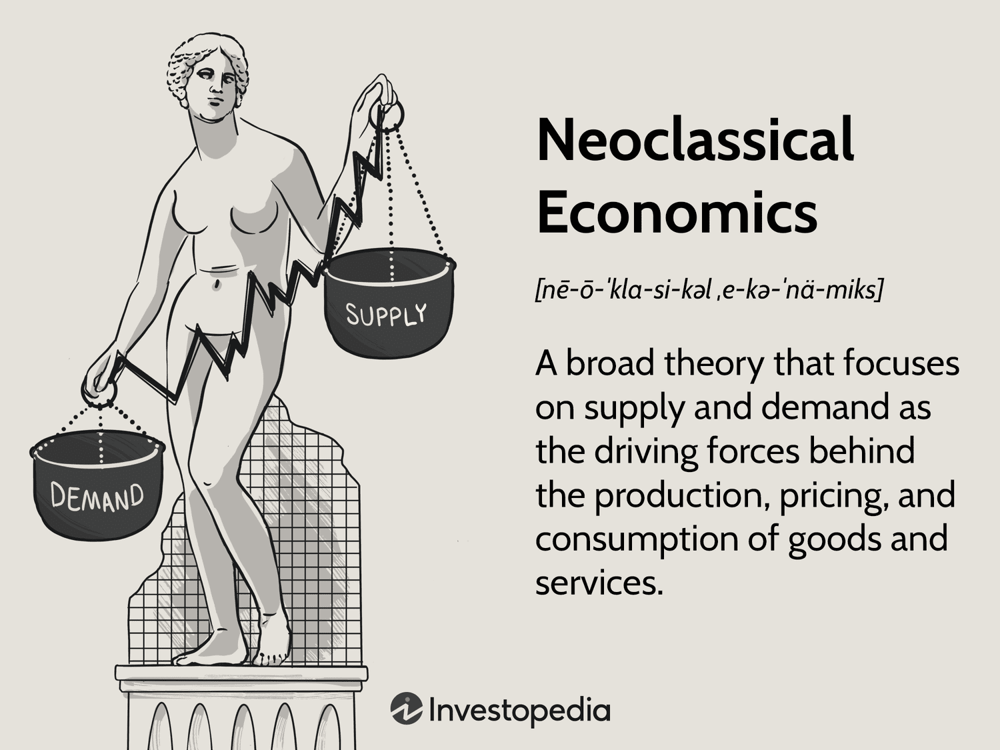

## Table of Contents

## What is neoclassical economics?

Neoclassical economics is a way of thinking about how the economy works. It focuses on how people make choices based on what they want and what they can afford. In this approach, people are seen as rational, meaning they make decisions that they think will make them happier or better off. The idea is that everyone is trying to get the most out of what they have, whether it's money, time, or resources. This leads to a balance where supply and demand meet, and prices help guide how resources are used.

A key part of neoclassical economics is the concept of equilibrium. This means that the economy naturally finds a point where everything is balanced. For example, if there's too much of a product, the price will go down until people want to buy it again. If there's not enough, the price will go up until people start making more of it. This balance is supposed to happen without anyone needing to control it, which is why neoclassical economists often believe in letting markets work on their own. They think that if people are free to make their own choices, the economy will run smoothly and efficiently.

## Who are the key figures in the development of neoclassical economics?

The development of neoclassical economics was shaped by several key figures. One of the most important was William Stanley Jevons. In the late 1800s, Jevons introduced the idea of marginal utility, which is about how much satisfaction people get from having one more unit of something. This idea was a big part of neoclassical economics because it helped explain how people make choices. Another key figure was Alfred Marshall. Marshall wrote a famous book called "Principles of Economics" in 1890. He helped combine the ideas of supply and demand into one clear theory, showing how they work together to set prices.

Leon Walras was also very important. He came up with the idea of general equilibrium, which is a way to understand how all parts of the economy fit together and balance out. Walras thought of the economy as a big system where everything affects everything else. Vilfredo Pareto added to these ideas with his concept of Pareto efficiency, which is about making changes that make some people better off without making anyone worse off. These thinkers laid the groundwork for neoclassical economics, focusing on how people make rational choices and how markets reach a balance on their own.

## What are the core assumptions of neoclassical economics?

Neoclassical economics is built on some key ideas that help explain how the economy works. One big assumption is that people are rational. This means they make choices that they think will make them happier or better off. They do this by weighing the costs and benefits of their options. For example, when deciding whether to buy a new phone, a person will think about the price and how much they want the phone. Another assumption is that people have complete information. This means they know everything they need to make good choices. In reality, this might not always be true, but neoclassical economics assumes it is.

Another core assumption is that markets are efficient. This means that prices will adjust until the amount people want to buy matches the amount that's available. If there's too much of something, the price will go down until people want to buy it. If there's not enough, the price will go up until more is made. Neoclassical economics also assumes that people are driven by self-interest. They make choices to get the most out of what they have, whether it's money, time, or resources. These assumptions help create a model where the economy naturally finds a balance, or equilibrium, without needing anyone to control it.

## How does neoclassical economics differ from classical economics?

Neoclassical economics and classical economics share some ideas, but they also have big differences. Classical economics was around before neoclassical economics. It focused on the big picture of the economy, like how countries grow and how money moves around. People like Adam Smith and David Ricardo thought a lot about things like labor and how countries trade with each other. They believed that the economy would grow if people worked hard and if the government didn't get in the way too much.

Neoclassical economics came later and added new ideas to classical economics. Instead of just looking at the big picture, neoclassical economists started to focus more on how individual people make choices. They introduced the idea of marginal utility, which is about how much happiness you get from having one more of something. They also used math a lot more to understand the economy. Neoclassical economists believe that if people are free to make their own choices, the economy will find a balance by itself. This is different from classical economics, which didn't focus as much on individual choices and used less math.

## What is the role of utility and marginalism in neoclassical economics?

In neoclassical economics, utility is a big idea that helps explain why people make the choices they do. Utility is just a fancy word for happiness or satisfaction. When people make decisions, they think about how much happiness or satisfaction they'll get from their choices. For example, if you're deciding between buying a new toy or saving your money, you'll think about which option will make you happier. Neoclassical economists believe that people always try to get the most utility they can from what they have. This means they'll choose the option that gives them the most happiness or satisfaction.

Marginalism is another important idea in neoclassical economics. It's about looking at the extra happiness or satisfaction you get from having one more of something. This is called marginal utility. For example, if you have one slice of pizza, you might get a lot of happiness from it. But if you eat a second slice, you might not get as much extra happiness as you did from the first one. Neoclassical economists use marginalism to explain how people make choices. They think that people compare the extra happiness they'll get from one more of something to the cost of getting it. This helps them decide whether it's worth it or not.

## How does neoclassical economics explain market equilibrium?

Neoclassical economics explains market equilibrium by saying that markets naturally find a balance where the amount people want to buy matches the amount that's available. This happens because prices change. If there's too much of something, the price goes down. When the price is lower, more people want to buy it, so the extra stuff gets sold. On the other hand, if there's not enough of something, the price goes up. When the price is higher, people who make the product want to make more of it because they can earn more money. This keeps going until the amount people want to buy is the same as the amount that's being made.

This idea of market equilibrium is based on the belief that people are rational and make choices to get the most out of what they have. They look at the extra happiness or satisfaction they'll get from having one more of something and compare it to the cost. If the extra happiness is worth the cost, they'll buy it. If not, they won't. This process of people making choices based on what they want and what they can afford helps the market find its balance. Neoclassical economists believe that if markets are left alone, they'll work efficiently and find this balance on their own.

## What is the significance of neoclassical economics in modern economic policy?

Neoclassical economics plays a big role in how governments and policymakers think about the economy today. It's important because it says that markets can work well on their own if people are free to make their own choices. This idea leads many policymakers to believe that the government should not control the economy too much. Instead, they think the government should let markets find their own balance. This way of thinking is behind many policies that try to make it easier for businesses to work and for people to trade with each other. For example, lowering taxes or making fewer rules for businesses are ideas that come from neoclassical economics.

Even though neoclassical economics is very influential, it's not the only way to think about the economy. Some people argue that it doesn't always explain everything that happens in real life. For example, it assumes that everyone has all the information they need to make good choices, which isn't always true. Still, the basic ideas of neoclassical economics, like people making rational choices and markets finding a balance, are used a lot in making economic policies. These ideas help guide decisions about things like how much the government should spend, what taxes should be like, and how to help the economy grow.

## How has neoclassical economics been critiqued and by whom?

Neoclassical economics has been criticized by many people for different reasons. One big criticism is that it assumes people always make rational choices and have all the information they need. But in real life, people often don't know everything and can make choices that aren't the best for them. For example, someone might buy a product they don't really need because of a good advertisement. Critics like Herbert Simon and Daniel Kahneman have pointed out these problems. They argue that people use shortcuts and can be influenced by emotions, which neoclassical economics doesn't consider enough.

Another criticism is that neoclassical economics focuses too much on how markets can fix themselves and doesn't pay enough attention to things like inequality and power. Critics like Karl Polanyi and Amartya Sen argue that markets don't always work well on their own and can lead to big differences between rich and poor people. They say the government should step in to help make things fairer. Also, some economists, like those from the Keynesian school, believe that the government should play a bigger role in the economy to help during tough times, like when there's a lot of unemployment. They think neoclassical economics doesn't give enough attention to these issues.

## What are the major schools of thought within neoclassical economics?

Within neoclassical economics, there are a few main schools of thought that help explain how the economy works. One of these is the Chicago School, which is known for believing strongly in free markets. Economists from this school, like Milton Friedman, think that markets should be left alone as much as possible. They believe that if people are free to make their own choices, the economy will work well on its own. The Chicago School also focuses a lot on how money and prices affect the economy.

Another school of thought is the Austrian School, which also believes in the power of free markets but in a different way. Economists like Ludwig von Mises and Friedrich Hayek from this school think that the economy is too complex for anyone to fully understand or control. They believe that markets are the best way to figure out what people want and need. The Austrian School puts a lot of emphasis on how people make decisions and how these decisions affect the economy over time. Both the Chicago and Austrian schools share the idea that markets should be free, but they look at things from slightly different angles.

## How does neoclassical economics address issues of income distribution?

Neoclassical economics looks at income distribution through the lens of how people make choices and how markets work. It says that income is based on what people can offer in the market, like their skills or the things they own. If someone has a skill that a lot of people need, like being a good doctor, they can earn more money. Neoclassical economists believe that if markets are free and working well, people will be paid according to what they contribute. This means that income differences are seen as a result of how useful people's skills or resources are to others.

However, neoclassical economics doesn't think that the government should step in too much to change how income is shared. It believes that markets are the best way to make sure people get paid fairly for what they do. If the government tries to change things too much, like by setting high taxes or making strict rules, it might mess up the market's natural balance. So, while neoclassical economics does see income differences, it trusts that markets will sort things out on their own over time.

## What are the limitations of neoclassical economic models in predicting real-world economic behaviors?

Neoclassical economic models have some big limits when it comes to predicting how people and the economy really act. One main problem is that these models assume people always make rational choices with all the information they need. But in real life, people often don't know everything and can make choices that aren't the best for them. For example, someone might buy something they don't really need because of a good ad. Also, people can be influenced by emotions or follow what others are doing, which neoclassical models don't take into account much. This means the models might not predict what people will do in real situations very well.

Another big limit is that neoclassical models focus a lot on how markets can fix themselves and don't pay enough attention to things like inequality and power. In the real world, markets don't always work well on their own and can lead to big differences between rich and poor people. For example, some people might have a lot of power and use it to keep others from getting ahead. Neoclassical models also don't consider how the government might need to step in to help during tough times, like when there's a lot of unemployment. So, while these models are good at explaining how markets should work in theory, they might not be as good at predicting what happens in the real world, where things are more complicated.

## How has neoclassical economics evolved to incorporate new economic theories and data?

Neoclassical economics has changed over time to include new ideas and information. One big change came from behavioral economics, which looks at how people really make choices. This field, started by people like Daniel Kahneman and Richard Thaler, showed that people don't always act rationally. They can be influenced by emotions or follow what others are doing. So, neoclassical economists started to think about these things more when making their models. They also started using more data to test their ideas. With computers and new ways to collect information, economists can now look at a lot more data to see if their theories hold up in the real world.

Another way neoclassical economics has evolved is by including ideas about how the economy grows and changes over time. This is called endogenous growth theory, and it was developed by economists like Paul Romer and Robert Lucas. They looked at things like technology and education to understand why some countries grow faster than others. Neoclassical economists have started to use these ideas to make their models better at explaining long-term changes in the economy. Overall, while neoclassical economics still focuses on markets and rational choices, it has become more flexible by including new theories and using more data to understand the world.

## What is Neoclassical Economics?

Neoclassical economics is a framework for understanding economic processes and decision-making that emerged in the late 19th century. It is characterized by a focus on supply and demand as the primary forces driving the distribution of resources and the allocation of goods and services within a market economy. This approach is built upon the notion that markets tend toward equilibrium, where supply equals demand, thus optimizing allocative efficiency.

A key assumption of neoclassical economics is that individuals act rationally, seeking to maximize their utility, which refers to the satisfaction or benefit derived from consuming goods and services. This assumption of rationality implies that individuals make decisions based on a set of preferences that remain consistent over time, allowing for predictable and quantifiable economic behaviors. The decision-making process can often be represented mathematically, leveraging utility functions such as:

$$
U(x_1, x_2, ..., x_n)
$$

where $U$ is the utility derived from the consumption of goods $x_1, x_2, ..., x_n$.

The theory postulates that consumers aim to maximize utility subject to their budget constraints, represented by:

$$
\sum_{i=1}^n p_i \cdot x_i = M
$$

where $p_i$ are the prices of goods, $x_i$ are the quantities consumed, and $M$ is the total budget.

Foundational works in neoclassical economics include the marginalist revolution, which introduced the concept of marginal utility, emphasizing that the value of goods is determined by their additional benefit. Key contributors to the development of neoclassical thought are William Stanley Jevons, Carl Menger, and Léon Walras. Jevons is known for his work in "The Theory of Political Economy," where he outlined the calculus of pleasure and pain (utility and disutility), while Menger’s "Principles of Economics" solidified the idea of marginal utility as central to economic theory. Walras contributed through his formulation of general equilibrium theory, proposing that markets reach equilibrium through the interaction of supply and demand across all markets simultaneously.

Neoclassical economics also assumes that firms aim to maximize profit, leading to market outcomes determined by the efficient allocation of resources. This profit maximization can be depicted as a firm's objective to maximize $\pi$, where:

$$
\pi = TR - TC
$$

with $TR$ representing total revenue and $TC$ total cost, dependent on quantities produced and factors of production.

Overall, neoclassical economics provides a foundational framework for understanding individual and firm behaviors, shaping economic models that emphasize equilibrium, efficiency, and the interplay between supply and demand.

## What is the Economic Significance of Neoclassical Theory?

Neoclassical economics has had a profound impact on shaping modern economic policies, business strategies, and market regulations. At its core, neoclassical economics focuses on the interaction of supply and demand within competitive markets to determine the allocation of resources efficiently. This theoretical framework assumes that individuals and firms seek to maximize utility and profit, respectively, guided by rational decision-making and full access to relevant information.

The theory's influence extends to contemporary economic policies, primarily through its endorsement of market efficiency and the promotion of free trade. Policymakers often rely on neoclassical ideas to advocate for minimal government intervention, allowing markets to self-regulate and achieve optimal resource distribution. One notable policy influenced by neoclassical thinking is the deregulation of industries, which is believed to foster competition and innovation. The concept of perfect competition, a pillar of neoclassical theory, underscores the importance of enabling multiple firms to operate freely in the market, thus promoting efficient outcomes.

In shaping business strategies, neoclassical economics emphasizes the role of price mechanisms in decision-making processes. Firms utilize price signals to assess consumer preferences and adjust their production and marketing strategies accordingly. The profit-maximizing condition, where marginal cost (MC) equals marginal revenue (MR), serves as a guideline for businesses to determine output levels:

$$
\text{Maximize} \, \pi = TR - TC \quad \text{where} \quad MR = MC
$$

Here, $\pi$ represents profit, $TR$ stands for total revenue, and $TC$ denotes total cost. Employing this framework, businesses aim to operate where additional units of output no longer contribute to increased profitability.

Market regulations have also been shaped by neoclassical economics, particularly concerning resource allocation and distribution. Antitrust laws, designed to prevent monopolistic practices, are rooted in the belief that competitive markets lead to the most efficient allocation of resources. By restricting artificial barriers to entry and preventing collusion, these regulations strive to maintain market conditions where prices reflect true supply and demand dynamics.

Critics, however, argue that real-world markets often deviate from neoclassical assumptions, noting imperfections such as information asymmetry and market power concentration. Despite these critiques, neoclassical economics remains influential in guiding economic thought and policy formulation, primarily through its advocacy for competitive markets and efficient resource allocation.

## References & Further Reading

[1]: Jevons, W. S. (1871). ["The Theory of Political Economy"](https://oll.libertyfund.org/titles/jevons-the-theory-of-political-economy) London: Macmillan and Co.

[2]: Menger, C. (1871). ["Principles of Economics"](https://archive.org/details/PrinciplesOfEconomicsCarlMenger) Ludwig von Mises Institute.

[3]: Walras, L. (1874). ["Elements of Pure Economics"](https://archive.org/details/elements-of-pure-economics_Leon-Walras) Routledge.

[4]: Akerlof, G. A. (1970). ["The Market for 'Lemons': Quality Uncertainty and the Market Mechanism"](https://www.jstor.org/stable/1879431) The Quarterly Journal of Economics.

[5]: Kahneman, D., & Tversky, A. (1979). ["Prospect Theory: An Analysis of Decision under Risk"](http://web.mit.edu/curhan/www/docs/Articles/15341_Readings/Behavioral_Decision_Theory/Kahneman_Tversky_1979_Prospect_theory.pdf) Econometrica.

[6]: Lopez de Prado, M. (2018). ["Advances in Financial Machine Learning"](https://www.amazon.com/Advances-Financial-Machine-Learning-Marcos/dp/1119482089) John Wiley & Sons.

[7]: Chan, E. P. (2008). ["Quantitative Trading: How to Build Your Own Algorithmic Trading Business"](https://github.com/ftvision/quant_trading_echan_book) John Wiley & Sons.

[8]: Jansen, S. (2018). ["Machine Learning for Algorithmic Trading"](https://github.com/stefan-jansen/machine-learning-for-trading) Packt Publishing.