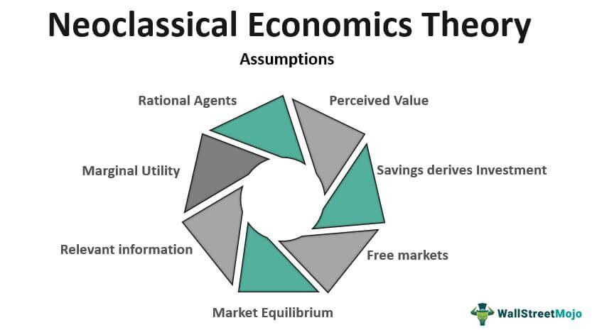

Neoclassical economics is a dominant school of thought that seeks to explain economic processes by focusing on how individuals maximize utility and firms maximize profit. This framework hinges on the concepts of supply and demand, as well as market equilibrium, with the assumption that all participants act rationally and have access to complete information. Neoclassical economics provides a robust foundation for understanding economic dynamics and has significantly influenced modern economic theory by formalizing the analysis of decision-making and resource allocation in competitive markets.

As financial markets have evolved, integrating traditional economic theories with advanced technological practices, such as algorithmic trading, has become increasingly relevant. Algorithmic trading employs computer algorithms to automate trading decisions based on quantitative criteria. By merging economic theory with computational advances, traders and economists can optimize trading strategies and improve market efficiency. This intersection presents new opportunities for enhancing both theoretical understanding and practical application.



This article aims to explore the connections between neoclassical economic theory and algorithmic trading. It will examine how the principles of neoclassical economics—particularly the focus on supply and demand models—are instrumental in developing algorithms that predict market movements and automate trade execution. Additionally, we will discuss the integration of economic propositions within trading systems, emphasizing the dynamic relationship between economic theories and financial technology. Through this exploration, the article seeks to underscore the importance of foundational economic principles in advancing modern trading methodologies.

## Table of Contents

## What is Neoclassical Economics?

Neoclassical economics is a framework for understanding economic processes and decision-making that emerged in the late 19th century. It is characterized by a focus on supply and demand as the primary forces driving the distribution of resources and the allocation of goods and services within a market economy. This approach is built upon the notion that markets tend toward equilibrium, where supply equals demand, thus optimizing allocative efficiency.

A key assumption of neoclassical economics is that individuals act rationally, seeking to maximize their utility, which refers to the satisfaction or benefit derived from consuming goods and services. This assumption of rationality implies that individuals make decisions based on a set of preferences that remain consistent over time, allowing for predictable and quantifiable economic behaviors. The decision-making process can often be represented mathematically, leveraging utility functions such as:

$$
U(x_1, x_2, ..., x_n)
$$

where $U$ is the utility derived from the consumption of goods $x_1, x_2, ..., x_n$.

The theory postulates that consumers aim to maximize utility subject to their budget constraints, represented by:

$$
\sum_{i=1}^n p_i \cdot x_i = M
$$

where $p_i$ are the prices of goods, $x_i$ are the quantities consumed, and $M$ is the total budget.

Foundational works in neoclassical economics include the marginalist revolution, which introduced the concept of marginal utility, emphasizing that the value of goods is determined by their additional benefit. Key contributors to the development of neoclassical thought are William Stanley Jevons, Carl Menger, and Léon Walras. Jevons is known for his work in "The Theory of Political Economy," where he outlined the calculus of pleasure and pain (utility and disutility), while Menger’s "Principles of Economics" solidified the idea of marginal utility as central to economic theory. Walras contributed through his formulation of general equilibrium theory, proposing that markets reach equilibrium through the interaction of supply and demand across all markets simultaneously.

Neoclassical economics also assumes that firms aim to maximize profit, leading to market outcomes determined by the efficient allocation of resources. This profit maximization can be depicted as a firm's objective to maximize $\pi$, where:

$$
\pi = TR - TC
$$

with $TR$ representing total revenue and $TC$ total cost, dependent on quantities produced and factors of production.

Overall, neoclassical economics provides a foundational framework for understanding individual and firm behaviors, shaping economic models that emphasize equilibrium, efficiency, and the interplay between supply and demand.

## Economic Significance of Neoclassical Theory

Neoclassical economics has had a profound impact on shaping modern economic policies, business strategies, and market regulations. At its core, neoclassical economics focuses on the interaction of supply and demand within competitive markets to determine the allocation of resources efficiently. This theoretical framework assumes that individuals and firms seek to maximize utility and profit, respectively, guided by rational decision-making and full access to relevant information.

The theory's influence extends to contemporary economic policies, primarily through its endorsement of market efficiency and the promotion of free trade. Policymakers often rely on neoclassical ideas to advocate for minimal government intervention, allowing markets to self-regulate and achieve optimal resource distribution. One notable policy influenced by neoclassical thinking is the deregulation of industries, which is believed to foster competition and innovation. The concept of perfect competition, a pillar of neoclassical theory, underscores the importance of enabling multiple firms to operate freely in the market, thus promoting efficient outcomes.

In shaping business strategies, neoclassical economics emphasizes the role of price mechanisms in decision-making processes. Firms utilize price signals to assess consumer preferences and adjust their production and marketing strategies accordingly. The profit-maximizing condition, where marginal cost (MC) equals marginal revenue (MR), serves as a guideline for businesses to determine output levels:

$$
\text{Maximize} \, \pi = TR - TC \quad \text{where} \quad MR = MC
$$

Here, $\pi$ represents profit, $TR$ stands for total revenue, and $TC$ denotes total cost. Employing this framework, businesses aim to operate where additional units of output no longer contribute to increased profitability.

Market regulations have also been shaped by neoclassical economics, particularly concerning resource allocation and distribution. Antitrust laws, designed to prevent monopolistic practices, are rooted in the belief that competitive markets lead to the most efficient allocation of resources. By restricting artificial barriers to entry and preventing collusion, these regulations strive to maintain market conditions where prices reflect true supply and demand dynamics.

Critics, however, argue that real-world markets often deviate from neoclassical assumptions, noting imperfections such as information asymmetry and market power concentration. Despite these critiques, neoclassical economics remains influential in guiding economic thought and policy formulation, primarily through its advocacy for competitive markets and efficient resource allocation.

## Criticisms of Neoclassical Economics

Neoclassical economics, a dominant framework in economic thought, is frequently critiqued for its simplifying assumptions, primarily the notions of rational behavior and perfect information. The assumption of rationality posits that [agents](/wiki/agents) make optimal decisions to maximize utility or profit, depending on whether they are consumers or firms. However, behavioral economists argue that human decision-making often deviates from this idealized rationality due to cognitive biases and emotions. Daniel Kahneman and Amos Tversky's groundbreaking work in this field reveals that individuals frequently rely on heuristics that lead to systematic errors in judgment and decision-making.

The assumption of perfect information suggests that all market participants have complete, accurate, and instant access to all relevant data. This premise is criticized for failing to account for information asymmetry, a condition often evident in real-world markets. George Akerlof's seminal paper "The Market for 'Lemons'" illustrates how information disparity between buyers and sellers can lead to market failure, particularly in markets for products with hidden attributes like used cars or financial products with complex risk profiles.

To address these limitations, several alternative economic models have been developed. Behavioral economics, as mentioned, incorporates psychological insights into economic models to better predict actual decision-making processes. It acknowledges that cognitive limitations, biases, and emotions significantly influence economic behavior. Additionally, institutional economics emphasizes the role of institutions and social norms in shaping economic outcomes, challenging the neoclassical focus on individual optimization.

Another significant critique of neoclassical economics arises from its inability to adequately explain phenomena such as bubbles and crashes. Neoclassical models typically assume equilibrium states, where supply and demand balance to determine price. Yet, financial markets frequently experience [volatility](/wiki/volatility-trading-strategies) characterized by sharp rises and subsequent crashes that cannot be easily reconciled with equilibrium theory. The Global Financial Crisis of 2007-2008 highlighted the inadequacy of traditional models to forecast or address systemic risks arising from interconnected financial entities and products.

Furthermore, neoclassical economics often overlooks externalities—costs or benefits incurred by third parties not involved in a transaction—resulting in suboptimal resource allocation. Climate change serves as a pertinent example; market prices do not typically [factor](/wiki/factor-investing) in the environmental costs of carbon emissions, leading to their overproduction and contributing to global warming.

Agent-based modeling (ABM) has emerged as a powerful tool to capture the complexities of economic interactions that neoclassical models may miss. By simulating the actions and interactions of individual agents within an economy, ABM allows for the exploration of how simple rules can lead to complex phenomena such as emergent behavior and disequilibrium dynamics.

In summary, while neoclassical economics provides a fundamental framework for understanding economic interactions, its assumptions of rationality and perfect information have been challenged by alternative models that account for behavioral nuances, information asymmetries, institutional influences, and systemic risks. These critiques highlight the need for a more nuanced and comprehensive approach to economic analysis that accommodates the complexities of real-world economic phenomena.

## Algorithmic Trading: An Overview

Algorithmic trading, a significant innovation in financial markets, refers to the use of computer programs to automate trading decisions. This practice has gained prominence due to the advancements in technology and the increasing availability of data, enabling traders to execute orders at speeds and frequencies beyond human capability. Unlike traditional trading methods, which rely heavily on the intuition and expertise of human traders, [algorithmic trading](/wiki/algorithmic-trading) leverages pre-defined rules and sophisticated algorithms to make trading decisions. These algorithms analyze a vast array of market data within milliseconds, execute trades based on predetermined criteria, and manage portfolios with precision.

The rise of algorithmic trading can be attributed to several technological developments. High-frequency trading ([HFT](/wiki/high-frequency-trading-strategies)), a subset of algorithmic trading, utilizes algorithms to conduct a high number of trades at extremely fast execution speeds—often in microseconds. This approach capitalizes on minute market inefficiencies and seeks to profit from small price discrepancies that exist for brief periods. The technological foundations of algorithmic trading include advanced computing power, low-latency data feeds, and efficient order execution systems.

Furthermore, algorithmic trading benefits from large data sets and sophisticated data analysis techniques. Machine learning and [artificial intelligence](/wiki/ai-artificial-intelligence) are increasingly integrated into algorithmic trading systems, allowing for pattern recognition and predictive analytics that enhance trading strategies. For instance, algorithms can be designed to recognize trends in historical price data, anticipate future price movements, and dynamically adjust trading strategies in real-time. A typical example might involve a statistical [arbitrage](/wiki/arbitrage) strategy, where algorithms identify and exploit statistical mispricings between related financial instruments.

In Python, a simple backtest of a moving average crossover strategy could be implemented using libraries like NumPy and pandas. For example:

```python
import pandas as pd
import numpy as np

# Assume df is a DataFrame with a 'Close' column for closing prices
short_window = 40
long_window = 100

# Generate moving averages
df['Short_MA'] = df['Close'].rolling(window=short_window, min_periods=1).mean()
df['Long_MA'] = df['Close'].rolling(window=long_window, min_periods=1).mean()

# Create signals
df['Signal'] = 0
df['Signal'][short_window:] = np.where(df['Short_MA'][short_window:] > df['Long_MA'][short_window:], 1, 0)

# Calculate returns
df['Position'] = df['Signal'].diff()
```

This code sets up a basic moving average crossover strategy, which is one of the simplest forms of algorithmic trading. The strategy generates buy signals when a short-term moving average crosses above a long-term moving average, signaling an upward trend.

In summary, the technological and data-driven nature of algorithmic trading significantly differentiates it from traditional methods. It offers increased efficiency, reduced transaction costs, and the ability to process large volumes of data, thereby profoundly influencing the dynamics of modern financial markets.

## Integration of Neoclassical Economics in Algorithmic Trading

Neoclassical economics, with its emphasis on supply and demand as determinants of price and resource allocation, plays a crucial role in the creation of algorithmic trading strategies. Algorithms built upon these economic principles assess market data to identify price discrepancies and optimize trading decisions.

The core of neoclassical economics revolves around the concepts of supply and demand equilibrium. In algorithmic trading, price equilibrium models are employed to predict market movements. By analyzing historical data and using statistical models, algorithms can determine the price at which supply meets demand. For instance, algorithms frequently incorporate autoregressive integrated moving average (ARIMA) models to forecast price levels based on past trends and seasonal effects. These models help traders anticipate market conditions and make informed decisions.

Mathematically, the law of supply and demand can be represented as Q_d = Q_s, where Q_d (quantity demanded) equals Q_s (quantity supplied). Algorithmic trading platforms utilize this principle by feeding real-time market data into algorithms that dynamically adjust buy and sell orders to achieve optimal execution prices.

In practical applications, high-frequency trading (HFT) platforms make use of neoclassical principles to capitalize on minute price fluctuations. These systems analyze incoming orders, historical pricing patterns, and real-time news feeds. For example, a trading algorithm might detect an oversupply situation by identifying a surge in sell orders relative to buy orders, prompting the system to short-sell in anticipation of a price drop.

Another example is market-making strategies, which also leverage neoclassical fundamentals. Market makers provide [liquidity](/wiki/liquidity-risk-premium) to the market by continuously buying and selling securities. They rely on algorithms to maintain a balanced [order book](/wiki/order-book-trading-strategies), adjusting bid and ask prices according to supply and demand dynamics, thereby ensuring profitability even in volatile markets.

Moreover, risk management strategies in algorithmic trading often borrow from neoclassical thought. Algorithms evaluate risk-return trade-offs using utility maximization principles, a cornerstone of neoclassical economics. By assigning utility values to different outcomes, algorithms optimize for the most efficient allocation of capital based on the expected returns and associated risks.

The integration of neoclassical economics in algorithmic trading exemplifies the fusion of traditional economic theories with cutting-edge technology, enabling traders to harness the predictive power of supply and demand models while maintaining a competitive edge in modern financial markets.

## Challenges and Future Prospects

Algorithmic traders face numerous challenges when trying to incorporate economic theories into trading algorithms. One core difficulty is translating theoretical models into practical, executable code that accurately captures market dynamics. Neoclassical economics, for example, relies heavily on assumptions of equilibrium, rational behavior, and perfect information. However, financial markets often display irrational behaviors, asymmetric information, and various market anomalies, causing a disconnect between theory and practice.

The complexity of financial data poses another challenge. Economic theories often assume simplified conditions that rarely exist in the real world. Thus, the task of encoding these theories in algorithms requires a robust understanding of econometrics and sophisticated data analysis techniques. Despite these obstacles, advancements in data analysis and econometric tools hold promise for enhancing algorithmic trading strategies.

Recent developments in [machine learning](/wiki/machine-learning) and artificial intelligence have provided new opportunities to improve the precision of trading algorithms. These technologies can analyze vast amounts of data at high speed, identifying patterns and correlations that might be overlooked with traditional methods. Machine learning models, for instance, can refine predictions by continuously learning from data inputs, potentially aligning more closely with market behavior than static economic models.

The integration of big data analytics is another significant advancement. By leveraging extensive data sets, algorithmic traders can potentially derive insights into supply and demand dynamics, reflecting more accurate market conditions. This capacity for real-time data processing could allow for more nuanced applications of neoclassical principles, particularly those related to price mechanisms and market equilibrium, within trading algorithms.

Looking forward, the interplay between economic theory and automated trading systems is likely to evolve further. Developments in econometrics, particularly in causal inference and predictive modeling, might enhance the capability to model economic relationships more accurately. The introduction of quantum computing could further revolutionize data processing speeds and capacities, allowing more complex models to be incorporated into trading algorithms.

Moreover, the increasing availability of [alternative data](/wiki/best-alternative-data) sources, such as social media sentiment and geopolitical events, could augment traditional economic indicators, offering a more comprehensive approach to predicting market movements. The future of algorithmic trading may well include a fusion of economic theory with behavioral finance and adaptive learning technologies, enabling traders to build more robust and adaptable trading systems.

In conclusion, while challenges abound, ongoing advancements in econometrics, data analysis, and technology offer promising prospects. The successful integration of economic theories into algorithmic trading processes will likely require a multi-disciplinary approach, blending economic insights with cutting-edge technology and innovative thinking.

## Conclusion

Neoclassical economics plays a crucial role in the framework of algorithmic trading, where its principles provide foundational models used to interpret and predict market behaviors. This economic theory, with its emphasis on supply and demand dynamics, rational behavior, and utility maximization, offers valuable insights that guide the construction of trading algorithms. These algorithms leverage supply and demand curves to forecast price movements, enabling traders to automate decision-making processes in financial markets.

An understanding of foundational economic theory is vital for developing sophisticated trading strategies. Neoclassical economics provides a structured approach to analyzing market equilibria and consumer behaviors, which are critical for designing algorithms that predict market trends accurately. As these algorithms increasingly rely on complex data analysis and machine learning techniques, a robust grounding in economic theory helps traders and analysts create more nuanced models that reflect real-world market conditions.

Future research at the intersection of economics and technology promises to drive innovation in trading strategies. As algorithmic trading continues to evolve, advances in econometrics and data analysis will likely enhance the precision and effectiveness of trading algorithms. Exploring new ways to integrate established economic theories with cutting-edge computational methods could lead to groundbreaking improvements in how financial markets are navigated and understood.

Encouraging research in this field will help bridge the gap between traditional economic models and modern technological practices, fostering a more comprehensive understanding of market operations. This alignment between economic theory and automated trading systems will not only refine existing strategies but also pave the way for new methodologies that could revolutionize financial markets.

## References & Further Reading

[1]: Jevons, W. S. (1871). ["The Theory of Political Economy"](https://oll.libertyfund.org/titles/jevons-the-theory-of-political-economy) London: Macmillan and Co.

[2]: Menger, C. (1871). ["Principles of Economics"](https://archive.org/details/PrinciplesOfEconomicsCarlMenger) Ludwig von Mises Institute.

[3]: Walras, L. (1874). ["Elements of Pure Economics"](https://archive.org/details/elements-of-pure-economics_Leon-Walras) Routledge.

[4]: Akerlof, G. A. (1970). ["The Market for 'Lemons': Quality Uncertainty and the Market Mechanism"](https://www.jstor.org/stable/1879431) The Quarterly Journal of Economics.

[5]: Kahneman, D., & Tversky, A. (1979). ["Prospect Theory: An Analysis of Decision under Risk"](http://web.mit.edu/curhan/www/docs/Articles/15341_Readings/Behavioral_Decision_Theory/Kahneman_Tversky_1979_Prospect_theory.pdf) Econometrica.

[6]: Lopez de Prado, M. (2018). ["Advances in Financial Machine Learning"](https://www.amazon.com/Advances-Financial-Machine-Learning-Marcos/dp/1119482089) John Wiley & Sons.

[7]: Chan, E. P. (2008). ["Quantitative Trading: How to Build Your Own Algorithmic Trading Business"](https://github.com/ftvision/quant_trading_echan_book) John Wiley & Sons.

[8]: Jansen, S. (2018). ["Machine Learning for Algorithmic Trading"](https://github.com/stefan-jansen/machine-learning-for-trading) Packt Publishing.