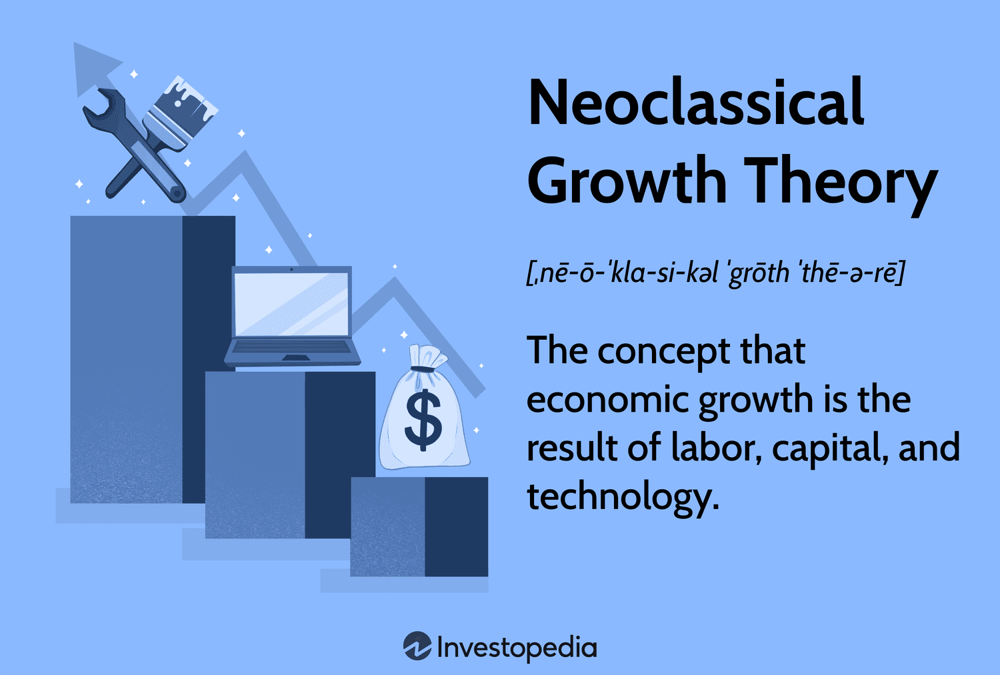

The interconnected realms of economic theories and technological advancements have profound implications for how we perceive growth and make predictions. Economic theories, particularly neoclassical growth theory, provide a quantitative framework to understand long-term economic expansion by focusing on the role of labor, capital, and technology. Meanwhile, technological advances in finance, such as algorithmic trading, leverage these theories to optimize market strategies and investment decisions in real-time.

In this article, we explore the synergy between neoclassical growth theory and algorithmic trading, examining the methodologies used to predict economic growth trends and their practical applications in the financial sector. Neoclassical growth models, introduced by Robert Solow and Trevor Swan in the 1950s, emphasize the importance of technological progress, differentiating it from other finite resources like labor and capital. This theory provides a structured approach to assess how various inputs contribute to economic output, often represented mathematically using production functions.



Understanding the foundational elements of neoclassical growth models enables economists and policymakers to utilize their predictive power effectively. However, these models also have limitations, particularly in assuming certain economic constants and potentially overlooking dynamic market changes. As economic landscapes evolve, integrating these theories with modern algorithmic trading techniques can enhance the accuracy of predictions and strategies.

Algorithmic trading relies on complex algorithms to analyze vast amounts of market data and make rapid investment decisions. By using economic predictions derived from neoclassical models, financial institutions and traders can refine these algorithms to adapt to various market behaviors, optimizing performance and maximizing returns.

This article progresses from examining the basic principles of neoclassical growth theories and their application in making economic predictions to understanding how these predictions are employed in algorithmic trading. By blending traditional economic perspectives with cutting-edge financial technology, we aim to provide a comprehensive overview of how these disciplines intersect to shape contemporary financial strategies.

## Table of Contents

## Understanding Neoclassical Growth Theory

Neoclassical growth theory is a framework for understanding the mechanisms driving long-term economic growth, focusing predominantly on the interplay between labor, capital, and technology. Developed during the mid-20th century by economists Robert Solow and Trevor Swan, this theory emphasizes the critical impact of technological innovations on economic output. The model utilizes a production function to encapsulate how these factors contribute to economic growth. A common representation in the neoclassical model is the Cobb-Douglas production function, which can be expressed as:

$$
Y = A \cdot K^\alpha \cdot L^\beta
$$

where $Y$ denotes the total economic output, $A$ represents the level of technology (also known as total factor productivity), $K$ signifies the input from capital, $L$ is the labor input, and $\alpha$ and $\beta$ are the output elasticities of capital and labor, respectively. These elasticities are constants that represent the percentage change in output resulting from a percentage change in inputs.

The crux of the neoclassical growth model lies in its depiction of technology as a key driver that propels economic growth beyond the limitations imposed by finite labor and capital resources. While the model assumes diminishing returns on additional inputs of labor and capital, technology serves as a means to shift and enhance the production function upwards, enabling sustained growth without being subjected to these diminishing returns. This delineates technology as an inexhaustible resource capable of facilitating indefinite economic expansion.

The role of technological advancement is underscored by the residual growth in output that is not accounted for by increases in labor or capital, a phenomenon often referred to as the "Solow residual." It implies that improvements in technological efficiency can vastly augment productivity, thus compensating for the inherent constraints of labor and capital under the neoclassical framework.

This theory carries vital implications for both policymakers and investors, encouraging the prioritization of technological development as a cornerstone for achieving sustained economic growth. As labor and capital face inherent limitations, fostering an environment conducive to technological innovation becomes paramount, enabling economies to continuously enhance output and improve living standards over time.

## Economic Predictions Within Neoclassical Models

Neoclassical growth models stand as essential tools for economic prediction, focusing on the interplay between labor, capital, and technological advancement. These models offer insights into how economies can achieve steady growth by emphasizing the contribution of each [factor](/wiki/factor-investing) to overall economic output. A typical representation uses the Cobb-Douglas production function:

$$
Y = A \cdot K^\alpha \cdot L^{1-\alpha}
$$

where $Y$ is the total output, $A$ represents technological progress, $K$ is capital, $L$ is labor, and $\alpha$ is the output elasticity of capital.

In these models, economic growth is driven primarily by technological progress, as both labor and capital face diminishing returns. Understanding this dynamic aids in crafting policy decisions that prioritize technological innovation and encourage capital investment.

Predictions derived from neoclassical models serve multiple purposes. They inform policy decisions by highlighting areas where investment in technology and education can stimulate growth. For instance, governments may allocate resources to research and development or education systems to foster a knowledgeable workforce capable of amplifying productivity and economic output.

Moreover, these models guide investment strategies by identifying industries or sectors poised for growth due to technological advancements. Investors leverage this information to make informed asset allocation decisions, optimizing returns based on anticipated economic conditions.

Educational priorities are also shaped by these predictions, as skills development aligned with technological advancements becomes crucial. Institutions may focus on STEM (Science, Technology, Engineering, Mathematics) disciplines to meet the evolving demands of a technology-driven economy.

Despite their utility, neoclassical growth models assume certain constants, such as steady technological progress and unchanged production function parameters. These assumptions can limit the models' accuracy in capturing real-world dynamics, particularly in volatile economic environments where sudden technological disruptions or shifts in labor markets occur.

For instance, during periods of rapid technological change, such as the advent of [artificial intelligence](/wiki/ai-artificial-intelligence) or significant policy reforms, the static nature of these models may fail to capture transitional impacts or non-linear growth patterns. This limitation suggests the need for models that adapt to evolving economic realities, integrating more complex variables and accommodating the unpredictability inherent in modern economies.

## The Role of Algorithmic Trading in Economic Predictions

Algorithmic trading has revolutionized the financial industry by enabling traders to execute orders at speeds and frequencies unachievable by human traders. This cutting-edge approach employs computer algorithms to automate trading decisions, essentially transforming economic predictions into precise and actionable trades. These algorithms analyze vast amounts of market data in real-time, identifying opportunities for buying or selling assets based on predefined criteria, which often include economic predictions derived from models like the neoclassical growth theory.

The implementation of [algorithmic trading](/wiki/algorithmic-trading) allows rapid processing of economic forecasts and market data, thereby enabling traders to capitalize on fleeting price discrepancies and market trends. The underlying algorithms are designed to leverage economic predictions, such as GDP growth rates or changes in labor productivity, to refine trading strategies. This is particularly important as algorithmic trading systems must quickly adapt to market conditions to maximize returns. Here, a simple Python script using a hypothetical dataset might illustrate how economic indicators are used to inform algorithmic trading decisions:

```python
import pandas as pd

# Load market data with economic indicators
data = pd.read_csv('market_data.csv')

# Example of an economic indicator - GDP growth rate
gdp_growth_rate = data['GDP_growth_rate']

# Simple trading logic based on GDP growth rate
def should_buy(gdp_growth_rate):
    # Buy if projected GDP growth rate exceeds 2%
    return gdp_growth_rate > 2.0

data['Buy_Signal'] = data['GDP_growth_rate'].apply(should_buy)

# Output potential buy signals
print(data[['Date', 'GDP_growth_rate', 'Buy_Signal']])
```

In the above example, the economic prediction about GDP growth informs the trading algorithm about when to consider buying an asset. The integration of neoclassical and other economic models into algorithmic trading not only enhances forecast accuracy but also optimizes the trading algorithm's efficacy across various market conditions.

Moreover, the agility of algorithmic trading platforms facilitates the continuous refinement of strategies, adapting to real-time changes in market dynamics. This adaptability is essential in an economic environment marked by [volatility](/wiki/volatility-trading-strategies) and rapid shifts. By leveraging historical data, [machine learning](/wiki/machine-learning), and pattern recognition, algorithmic trading evolves beyond static rule-based systems, capturing the complexities and nuances of modern financial markets.

In summary, algorithmic trading represents a formidable convergence of economic theory and technological advancement. Economic predictions from models, including those central to neoclassical growth theory, are crucial in shaping these algorithms, enhancing their ability to predict market movements and execute profitable trades effectively. This synergy continues to redefine the landscape of financial trading, underscoring the necessity for precise integration of economic insights into automated decision-making processes.

## Integrating Neoclassical Theory with Algorithmic Trading

The fusion of neoclassical growth theories with algorithmic trading revolves around aligning economic indicators with algorithm parameters, thereby enhancing the accuracy and efficiency of trading strategies. Neoclassical growth theory emphasizes productivity advancements as a primary driver of economic growth, a principle that can be translated into trading algorithms through the use of sophisticated models and data analytics.

A key aspect of this integration is the incorporation of economic indicators such as GDP growth rates, inflation, interest rates, and technological developments into the algorithms that guide trading decisions. For example, a trader might employ a model that uses changes in GDP as a signal for adjusting portfolio allocations. This involves setting algorithmic parameters that are sensitive to shifts in economic data, ensuring that trading strategies are responsive to real-time economic changes. 

Python, a programming language favored for its simplicity and robust libraries, is often utilized to implement these algorithms. Libraries like Pandas and NumPy facilitate data manipulation and mathematical operations required to build and refine models that predict market trends based on economic indicators. Here's an illustrative example of a basic Python script that could be used to adjust trading strategies based on GDP growth data:

```python
import pandas as pd
import numpy as np

# Sample GDP growth rate data
gdp_data = pd.DataFrame({
    'Year': [2020, 2021, 2022],
    'GrowthRate': [2.5, 3.0, 2.7]  # Hypothetical data
})

# Define thresholds for adjusting investment strategy
growth_threshold = 2.8

# Simple algorithm to decide investment actions
def investment_decision(growth_rate):
    if growth_rate > growth_threshold:
        return 'Increase investment in equities'
    else:
        return 'Shift towards bonds'

# Apply the investment decision function
gdp_data['Strategy'] = gdp_data['GrowthRate'].apply(investment_decision)

print(gdp_data)
```

This example illustrates how integrating economic predictions into algorithmic decision-making can provide actionable insights. In practice, such models are much more complex, utilizing real-time data feeds, machine learning algorithms, and a wider array of economic metrics.

Furthermore, aligning these insights with algorithm parameters enables traders to anticipate and respond to market movements effectively. By dynamically adjusting parameters, traders can optimize asset allocation, manage risks more effectively, and aim for higher returns. This alignment, achieved through continuous calibration of algorithms with economic data, not only strengthens the predictive power of traditional models but also enables more precise decision-making.

In conclusion, the synthesis of neoclassical growth theory with algorithmic trading embodies a significant advancement in financial strategy. By leveraging detailed economic insights, traders can enhance their strategic repertoire, leading to more informed and potentially profitable investment decisions.

## Challenges and Opportunities

Integrating economic models with algorithmic trading can be complex, as it involves several substantial challenges. One primary issue is data quality. High-quality, clean, and timely data is essential for accurate predictions and effective trading strategies. Inaccurate or delayed data can lead to erroneous predictions and suboptimal trading decisions, resulting in financial losses.

Model accuracy also presents a significant challenge. Neoclassical economic models are built upon assumptions that may not hold under all market conditions. These models may fail to capture the dynamic and sometimes chaotic nature of real-world economic environments. Consequently, algorithmic systems relying on such models might exhibit reduced performance during periods of market instability or unforeseen economic events.

Market unpredictability is another hurdle. Financial markets are influenced by a plethora of factors, such as geopolitical events, regulatory changes, and shifts in investor sentiment, which can be difficult to forecast using traditional economic models alone. This unpredictability necessitates continuous adjustment and refinement of trading algorithms to sustain their effectiveness.

Opportunities lie in the advancement of technology, primarily through artificial intelligence (AI) and machine learning. These technologies have the potential to significantly enhance model adaptability. Machine learning algorithms can process vast datasets to identify patterns and correlations that human analysts might overlook. By incorporating AI, economic models can dynamically adjust to new data, improving the accuracy of predictions and responsiveness to market changes.

Moreover, investing in AI research can lead to the development of more robust algorithms capable of handling anomalies and extrapolating trends beyond the scope of traditional economies models. Such innovations can foster more resilient financial systems. When complemented by machine learning techniques, traditional economic theories can be leveraged to achieve enhanced economic outcomes, optimizing risk management and improving asset allocation.

Embracing these technological innovations can therefore forge a pathway to more sophisticated and adaptive financial systems, aligning the predictive insights of classical economic theories with the precision and speed of modern algorithmic trading.

## Conclusion

The advancement of technology continues to bridge gaps between classical economic theories and modern financial applications. This synthesis highlights the enduring relevance of neoclassical growth theory. Its foundation in capital, labor, and technology provides a robust framework for understanding economic development. As we incorporate this historical perspective into the dynamic environment of algorithmic trading, we gain access to both established principles and innovative strategies for financial markets.

Integrating neoclassical growth theory with algorithmic trading creates a symbiotic relationship that enhances financial forecasting and decision-making. By applying the fundamental insights of the neoclassical model, algorithmic trading systems become refined with predictive abilities that align closely with real-world economic conditions. This fusion is enabling traders and financial analysts to craft strategies that optimize asset allocation, manage risks effectively, and maximize returns efficiently.

As technology evolves, the integration of these disciplines promises increasingly sophisticated tools for economic forecasting and trading. Advances in data analytics, artificial intelligence, and machine learning further enhance the adaptability and accuracy of algorithm-driven strategies. This collaborative progress between economic theory and technological innovation is setting new standards for financial efficiency, offering promising prospects for global economic growth.

The continuous improvement and meticulous application of these methodologies ensure that our understanding of both economics and finance will grow, fostering resilience and adaptability in an ever-complex global market landscape. Ultimately, this will contribute to stronger economic systems and a more reliable framework for tackling future financial challenges.

## References & Further Reading

[1]: Solow, R. M. (1956). ["A Contribution to the Theory of Economic Growth."](https://pages.nyu.edu/debraj/Courses/Readings/Solow.pdf) The Quarterly Journal of Economics, 70(1), 65-94.

[2]: Swan, T. W. (1956). ["Economic Growth and Capital Accumulation."](https://onlinelibrary.wiley.com/doi/abs/10.1111/j.1475-4932.1956.tb00434.x) Economic Record, 32(2), 334-361.

[3]: Romer, P. M. (1986). ["Increasing Returns and Long-Run Growth."](https://www.journals.uchicago.edu/doi/10.1086/261420) Journal of Political Economy, 94(5), 1002-1037.

[4]: Malkiel, B. G., & Fama, E. (1970). ["Efficient Capital Markets: A Review of Theory and Empirical Work."](https://www.jstor.org/stable/2325486) The Journal of Finance, 25(2), 383-417.

[5]: Landau, R. & Taylor, T. (1998). ["Economics"](https://www.semanticscholar.org/paper/The-Mosaic-Of-Economic-Growth-Wright-co-editor/f57824f8a6287ccd94fb719daed3f054c338c6d4) by Richard C. Levin, David S. C. Colander, Thomas C. Leppert

[6]: Piketty, T. (2014). ["Capital in the Twenty-First Century."](https://www.jstor.org/stable/j.ctt6wpqbc) Harvard University Press.

[7]: Chan, E. (2013). ["Algorithmic Trading: Winning Strategies and Their Rationale."](https://github.com/ftvision/quant_trading_echan_book) Wiley Trading.

[8]: De Prado, M. L. (2018). ["Advances in Financial Machine Learning."](https://www.amazon.com/Advances-Financial-Machine-Learning-Marcos/dp/1119482089) Wiley.

[9]: Jansen, S. (2020). ["Machine Learning for Algorithmic Trading."](https://github.com/stefan-jansen/machine-learning-for-trading) Packt Publishing.

[10]: Chan, E. (2009). ["Quantitative Trading: How to Build Your Own Algorithmic Trading Business."](https://github.com/ftvision/quant_trading_echan_book) Wiley.