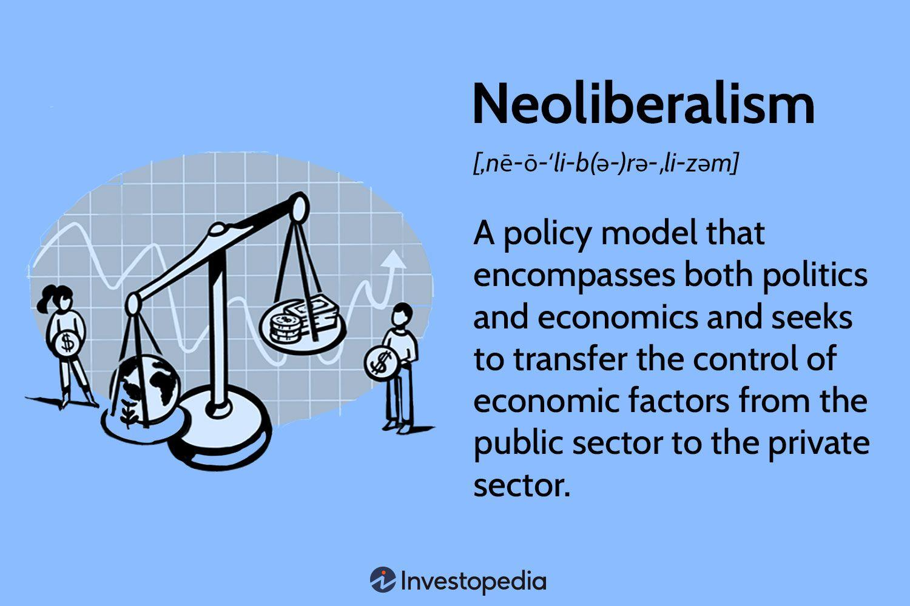

## Table of Contents

## What is neoliberalism?

Neoliberalism is an economic and political philosophy that became popular in the late 20th century. It believes in free markets, less government control, and more individual freedom. People who support neoliberalism think that if businesses can operate without too many rules, the economy will grow and everyone will benefit. They also believe that competition is good because it makes companies work harder and offer better products and services.

However, not everyone agrees with neoliberalism. Some people think it makes the rich richer and the poor poorer. They argue that when the government steps back, big companies can take advantage of workers and the environment. Critics also say that neoliberal policies can lead to problems like unemployment and inequality. Because of these concerns, neoliberalism is a controversial idea that people often debate about.

## What are the key principles of neoliberalism?

Neoliberalism is based on the idea that free markets are the best way to make an economy grow and help people. It says that the government should not control the economy too much. Instead, it should let businesses and people make their own choices. This means fewer rules and taxes for companies, so they can compete and do well. Neoliberalism also believes in trade between countries without too many restrictions, which they think will make everyone richer.

Another important part of neoliberalism is privatization. This means selling things that the government owns, like utilities or public services, to private companies. Neoliberals think that private companies will run these services better and more efficiently. They also support deregulation, which means getting rid of rules that they think slow down businesses. The goal is to create a world where people can freely buy, sell, and invest without the government getting in the way too much.

## How did neoliberalism emerge historically?

Neoliberalism started to become popular in the late 1970s and early 1980s. Before that, many countries had economies where the government played a big role. But in the 1970s, there were big economic problems like high inflation and unemployment. People started to think that maybe the government was not helping the economy as much as they thought. Leaders like Margaret Thatcher in the UK and Ronald Reagan in the US came to power and started to push for less government control and more free markets. They believed that if businesses were free to compete, the economy would get better.

As neoliberal ideas spread, more countries started to follow them. International groups like the World Bank and the International Monetary Fund (IMF) also started to support neoliberal policies. They would give loans to countries, but only if those countries agreed to make their economies more free. This meant cutting government spending, privatizing state-owned businesses, and opening up to trade with other countries. Over time, neoliberalism became a big influence around the world, shaping how many countries ran their economies.

## What are some common policies associated with neoliberalism?

Neoliberalism leads to certain policies that countries often use. One big policy is deregulation, which means getting rid of rules that businesses have to follow. Neoliberals think that if companies don't have to follow so many rules, they can work better and make more money. Another policy is privatization, where the government sells things it owns, like water companies or schools, to private businesses. Neoliberals believe that private companies will run these services better than the government can.

Another common policy is cutting taxes, especially for businesses and rich people. Neoliberals think that if people and companies keep more of their money, they will spend and invest more, which will help the economy grow. They also support free trade, which means countries can buy and sell things from each other without many restrictions. Neoliberals believe that free trade will make everyone richer because countries can focus on what they're good at making.

These policies often come with conditions from international groups like the World Bank and the IMF. If a country wants a loan, it might have to agree to these neoliberal policies. This has led to many countries around the world trying out neoliberal ideas, even if they don't always work out the way people hoped.

## Can you provide examples of countries that have adopted neoliberal policies?

Many countries have tried neoliberal policies over the years. One big example is the United States. In the 1980s, President Ronald Reagan started to cut taxes and reduce government rules on businesses. He believed this would make the economy grow. Another example is the United Kingdom, where Prime Minister Margaret Thatcher did similar things. She privatized many state-owned companies, like British Telecom and British Gas, and made it easier for businesses to operate without government control.

In Latin America, countries like Chile and Mexico also adopted neoliberal policies. In Chile, after a military coup in 1973, the government started to follow neoliberal ideas. They privatized many services and opened up the economy to foreign trade. Mexico did the same in the 1980s and 1990s, especially after joining the North American Free Trade Agreement (NAFTA) in 1994. These policies were meant to help their economies grow by making them more open and competitive.

In Eastern Europe, after the fall of communism, many countries like Poland and Hungary also turned to neoliberal policies. They wanted to move away from state-controlled economies to free market systems. This meant privatizing a lot of industries and opening up to trade with other countries. While these policies helped some parts of their economies grow, they also led to problems like higher inequality and unemployment in some places.

## What are the economic impacts of neoliberalism?

Neoliberalism has had a big impact on economies around the world. It often leads to economic growth because it encourages businesses to compete and invest. When companies can work without too many rules, they can grow faster and create more jobs. Countries that have followed neoliberal policies, like the United States and the United Kingdom, have seen their economies get bigger. Free trade, which is a big part of neoliberalism, can also help countries by letting them sell more of what they're good at making to other countries.

But neoliberalism also has some downsides. It can make the rich richer and the poor poorer, leading to more inequality. When the government steps back, big companies might not treat workers or the environment well. This can lead to problems like low wages and pollution. Also, when countries cut spending on things like schools and hospitals to follow neoliberal policies, it can hurt people who need these services. Critics say that while neoliberalism can help the economy grow, it doesn't always help everyone in the same way.

## How does neoliberalism affect social inequality?

Neoliberalism can make social inequality worse. When governments follow neoliberal policies, they often cut taxes for rich people and big companies. This means the rich keep more of their money, while the poor might not get as much help from the government. Also, when businesses are free to do what they want, they might pay workers less to make more profit. This can make the gap between rich and poor even bigger. In many countries that have used neoliberal policies, like the United States and the United Kingdom, the rich have gotten richer while the poor have struggled more.

Neoliberalism also affects things like education and health care. When governments privatize these services, people who can afford to pay for them get better quality, while those who can't are left with less. This can make it harder for poor people to get good education or health care, which can keep them stuck in poverty. Critics of neoliberalism say that while it might help the economy grow, it often does so in a way that leaves many people behind. This can lead to a society where the rich get richer and the poor get poorer, making social inequality a big problem.

## What are the criticisms of neoliberalism from an economic perspective?

Critics of neoliberalism say it can make the rich richer and the poor poorer. When governments cut taxes for rich people and big companies, the rich keep more of their money. But the poor might not get as much help from the government. This can make the gap between rich and poor even bigger. Also, when businesses are free to do what they want, they might pay workers less to make more profit. This can hurt workers and make inequality worse. In many countries that have used neoliberal policies, like the United States and the United Kingdom, the rich have gotten richer while the poor have struggled more.

Another big criticism is that neoliberalism can lead to problems like unemployment and economic instability. When governments cut spending on things like schools and hospitals, it can hurt people who need these services. Also, when countries open up to free trade, it can be hard for local businesses to compete with big companies from other countries. This can lead to job losses and make the economy less stable. Critics say that while neoliberalism might help the economy grow in some ways, it can also cause big problems that hurt a lot of people.

## How has neoliberalism influenced global trade and international relations?

Neoliberalism has had a big impact on global trade by pushing for fewer rules and more free trade between countries. It says that if countries can buy and sell things from each other without many restrictions, everyone will get richer. This idea has led to big trade agreements like NAFTA and the World Trade Organization. These agreements help countries trade more easily, but they can also make it hard for local businesses to compete with big companies from other countries. Neoliberalism has made the world more connected, but it has also caused some problems, like job losses in places where local businesses can't keep up.

Neoliberalism also affects how countries work together. International groups like the World Bank and the IMF support neoliberal ideas and often make countries follow these policies to get loans. This means countries have to cut spending, privatize services, and open up to trade. While this can help some countries grow their economies, it can also lead to more inequality and problems like unemployment. Neoliberalism has made countries more connected, but it has also created tensions because not everyone benefits in the same way.

## What are the environmental implications of neoliberal policies?

Neoliberal policies can hurt the environment. When governments follow neoliberal ideas, they often let businesses do what they want with less rules. This can lead to more pollution because companies might not care about the environment if it costs them money. For example, if a factory can make more profit by dumping waste into a river, they might do it. Also, when countries open up to free trade, they might cut down forests or use more resources to make things to sell to other countries. This can harm nature and make climate change worse.

But neoliberalism can also help the environment in some ways. When businesses are free to compete, they might come up with new ideas to be more efficient and use less energy. This can be good for the environment. Also, some people think that if we let markets work freely, they will find the best ways to use resources and protect the environment. But this only works if there are rules to make sure companies care about the environment. Without these rules, neoliberal policies can lead to more harm than good for nature.

## How do different political ideologies view neoliberalism?

Different political ideologies have different views on neoliberalism. People on the right, like conservatives and libertarians, often like neoliberalism. They think that free markets and less government control are good for the economy. They believe that if businesses can compete without too many rules, everyone will benefit. They also think that cutting taxes and privatizing services will help the economy grow. But they might disagree on how far to go with these policies.

On the other hand, people on the left, like socialists and progressives, often don't like neoliberalism. They think it makes the rich richer and the poor poorer. They worry that when the government steps back, big companies can take advantage of workers and the environment. They believe that the government should help people by providing services like health care and education, instead of leaving it to private companies. They also think that neoliberal policies can lead to problems like unemployment and inequality, which they want to fix.

## What are the future prospects and potential evolutions of neoliberalism?

Neoliberalism might change in the future because people have different ideas about how to make economies work better. Some people think that neoliberalism has helped economies grow, but it has also made inequality worse. They want to keep some parts of neoliberalism, like free trade, but also want the government to do more to help people who are left behind. This could mean having rules to make sure companies treat workers and the environment well, and spending more on things like schools and hospitals. These changes could make neoliberalism more fair and help more people benefit from economic growth.

Other people think that neoliberalism has too many problems and want to move away from it completely. They believe that the government should play a bigger role in the economy, like by owning important services and making sure everyone has what they need. This could mean going back to ideas like socialism or social democracy, where the government helps to make sure everyone has a good life. As people keep talking about these ideas, neoliberalism might change or even be replaced by something new that tries to fix its problems and make the world a better place for everyone.

## References & Further Reading

[1]: Harvey, D. (2007). ["A Brief History of Neoliberalism."](https://academic.oup.com/book/40603) Oxford University Press.

[2]: MacKenzie, D. (2008). ["An Engine, Not a Camera: How Financial Models Shape Markets."](https://academic.oup.com/mit-press-scholarship-online/book/20588) MIT Press.

[3]: Perez, C. (2003). ["Technological Revolutions and Financial Capital: The Dynamics of Bubbles and Golden Ages."](https://www.tandfonline.com/doi/abs/10.1080/00213624.2003.11506628) Edward Elgar Publishing.

[4]: Aronson, D. R. (2006). ["Evidence-Based Technical Analysis: Applying the Scientific Method and Statistical Inference to Trading Signals."](https://www.amazon.com/Evidence-Based-Technical-Analysis-Scientific-Statistical/dp/0470008741) Wiley.

[5]: Jansen, S. (2018). ["Machine Learning for Algorithmic Trading."](https://books.google.com/books/about/Hands_On_Machine_Learning_for_Algorithmi.html?id=tx2CDwAAQBAJ) Packt Publishing.

[6]: Chan, E. P. (2009). ["Quantitative Trading: How to Build Your Own Algorithmic Trading Business."](https://github.com/ftvision/quant_trading_echan_book) Wiley.

[7]: ["Neoliberalism: Oversold?"](https://www.imf.org/external/pubs/ft/fandd/2016/06/ostry.htm) by Jonathan D. Ostry, Prakash Loungani, and Davide Furceri in Finance & Development (2016).

[8]: Hendershott, T., Jones, C. M., & Menkveld, A. J. (2011). ["Does Algorithmic Trading Improve Liquidity?"](https://onlinelibrary.wiley.com/doi/full/10.1111/j.1540-6261.2010.01624.x) The Journal of Finance, 66(1), 1-33.

[9]: Lopez de Prado, M. (2018). ["Advances in Financial Machine Learning."](https://www.wiley.com/en-us/Advances+in+Financial+Machine+Learning-p-9781119482086) Wiley.