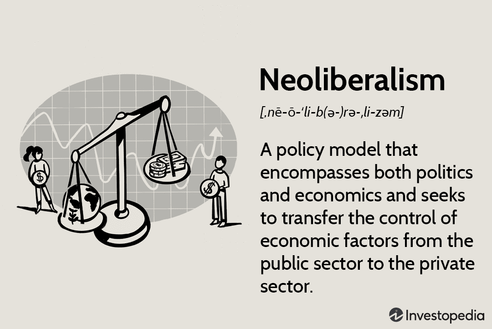

In the ever-evolving landscape of global finance, economic policies are pivotal in shaping market dynamics. One of the most influential frameworks over recent decades has been neoliberalism, which promotes deregulation, privatization, and the primacy of free-market principles. Neoliberalism supports the idea that minimizing government intervention leads to more efficient markets and optimal resource allocations. This economic ideology has substantially impacted policy-making worldwide, influencing financial markets and investment strategies.

Simultaneously, the finance industry has witnessed a technological revolution through the adoption of algorithmic trading. Unlike traditional trading, which relies on human decision-making, algorithmic trading leverages complex mathematical models and high-speed computational techniques to execute trades automatically. These algorithms can rapidly analyze vast datasets, enabling them to make informed decisions more quickly and efficiently than humans.

This combination of neoliberal economic policies and algorithmic trading has reshaped financial markets. Neoliberalism's encouragement of deregulation has fostered an environment conducive to the rise of algorithmic trading. The advantages of this interaction include enhanced liquidity and market efficiency. However, this transformation is not without drawbacks; issues like increased market volatility and systemic risks are critical concerns.

This article aims to provide a comprehensive understanding of how neoliberal economic policies and algorithmic trading impact the economy and financial markets. By exploring their combined effects, the discussion will shed light on both the potential benefits and inherent challenges posed by these influential forces in modern finance.

## Table of Contents

## Understanding Neoliberal Economic Policy

Neoliberalism is an economic policy framework that emphasizes the reduction of state involvement in economic affairs, positing that the free market serves as the optimal allocator of resources. At its core, neoliberalism promotes several key principles: deregulation, the reduction of trade barriers, and the privatization of state-owned enterprises. 

Deregulation involves the removal of governmental rules and restrictions on businesses, thereby allowing market forces to dictate outcomes. Proponents argue that this leads to increased economic efficiency as companies are free to innovate and respond more dynamically to consumer demands without bureaucratic constraints. 

Another pillar of neoliberal policy is the reduction of trade barriers such as tariffs and quotas, which encourages international trade by making it easier and cheaper for countries to exchange goods and services. The idea is that by fostering a more competitive global market, countries can specialize in industries where they have a comparative advantage, leading to higher growth rates.

Privatization, the process of transferring ownership of a business from the public sector to private individuals or organizations, is seen as another pathway to boost productivity and efficiency. The argument here is that privatized entities are more motivated by profit to optimize operations, thus contributing to improved global competitiveness.

However, neoliberalism is not without criticism. Opponents suggest that these policies can exacerbate income inequality, as the benefits of increased efficiency and growth are not distributed evenly across society. They argue that while corporations and shareholders may see substantial gains, workers may face job insecurity and wage stagnation. Additionally, the reduction of social welfare programs as part of a neoliberal agenda can lead to diminished support for vulnerable populations.

Environmental degradation is another concern, as the prioritization of economic growth can often sideline environmental considerations. By reducing regulatory oversight, businesses may engage in practices that harm the ecosystem, thereby creating long-term sustainability issues.

Understanding the core tenets and implications of neoliberalism is crucial for comprehending its broader impact on economic systems. While it has catalyzed global economic integration and technological advancement, its tendency to prioritize market-driven outcomes over social welfare warrants careful consideration and potential recalibration to address its inherent drawbacks.

## The Rise of Algorithmic Trading

Algorithmic trading, often referred to as algo trading, represents a significant evolution in the execution of trades within financial markets. It involves the use of computer algorithms to make trading decisions based on a series of pre-defined parameters. These algorithms can analyze complex datasets at remarkable speeds, handling vast volumes of information—a task that would be inconceivable for human traders.

One of the primary benefits of [algorithmic trading](/wiki/algorithmic-trading) is its capacity to enhance market efficiency and [liquidity](/wiki/liquidity-risk-premium). Algorithms are capable of executing numerous trades instantaneously and simultaneously, which reduces the time required to complete transactions. This rapid execution minimizes the bid-ask spread and facilitates a more fluid market environment. Consequently, markets become more efficient as price discovery processes are refined.

However, the rise of algorithmic trading is not without its challenges. A significant concern is market [volatility](/wiki/volatility-trading-strategies), which can be exacerbated by the fast-paced nature of automated trading systems. For instance, flash crashes—sudden, drastic drops in market prices—have been linked to algorithmic trading, raising questions about the stability and resilience of financial markets.

Moreover, the reliance on complex algorithms means reduced human oversight, which can lead to potential systemic risks. These risks are further compounded by the fact that algorithms operate based on historical data and predefined criteria, which may not always account for unexpected market conditions or black swan events. As a result, unforeseen circumstances could lead to large-scale, rapid sell-offs or other destabilizing movements in the market.

Understanding the dual aspects of algorithmic trading—its capabilities and limitations—is crucial for comprehending its impact on modern finance. The advantages, such as increased efficiency and improved liquidity, must be balanced against the challenges of volatility and systemic risk. This balance is essential for leveraging the benefits of algo trading while mitigating its potential downsides.

## The Pros of Neoliberal Economic Policies in the Context of Algo Trading

Neoliberal economic policies, particularly deregulation, have significantly influenced the expansion and evolution of algorithmic trading. The relaxation and removal of regulatory constraints lower the barriers to entry, fostering a more competitive and innovative trading environment. This has enabled market participants to develop and implement sophisticated algorithmic trading strategies that can operate with increased speed and efficiency.

A critical advantage of such deregulation is the increase in market efficiency, which translates into lower transaction costs for traders. In a less regulated and more competitive market, tighter bid-ask spreads become prevalent, meaning the difference between the buying price and the selling price of an asset is reduced. Lower spreads benefit traders by minimizing the costs incurred during buying and selling, leading to potential increases in profit margins. Moreover, these efficiencies are passed on to consumers who can experience more favorable pricing and better access to financial products.

The principles of neoliberalism also emphasize the importance of free-market dynamics and access to capital, which have been instrumental in supporting technological advancements within financial markets. In a deregulated environment, firms are more likely to invest in cutting-edge technologies and algorithmic trading platforms, knowing that they can capitalize on the benefits without facing prohibitive regulatory hurdles. This fosters an ecosystem where innovation in trading algorithms and related technologies accelerates, further enhancing market operations.

Furthermore, the influx of capital incentivized by neoliberal policies facilitates the scaling and refinement of algorithmic trading strategies. Large investments in technology and infrastructure support the deployment of high-frequency trading systems capable of executing millions of trades per second, analyzing vast datasets to identify profitable trading opportunities almost instantaneously.

In sum, neoliberal economic policies, by promoting deregulation and free-market principles, have been vital in the proliferation of algorithmic trading, yielding benefits such as increased market competitiveness, reduced transaction costs, and technological innovation. These elements contribute significantly to enhanced market functionality and broadened opportunities for participants within the financial ecosystem.

## The Cons of Neoliberal Economic Policies in the Context of Algo Trading

Neoliberal economic policies, characterized by deregulation and an emphasis on competitive markets, have facilitated the expansion of algorithmic trading. However, these policies also present significant challenges and risks within the context of modern financial markets.

One of the primary concerns is the inadequate oversight of algorithmic trading practices due to aggressive deregulation. This lack of supervision can heighten systemic risks, as the rapid execution and sheer [volume](/wiki/volume-trading-strategy) of algorithmic trades have the potential to destabilize financial markets. Instances such as the "Flash Crash" of 2010 highlight how unchecked algorithmic activities can lead to sudden and extreme market fluctuations.

Neoliberal policies often emphasize short-term economic gains at the potential cost of long-term market stability. This focus on immediate outcomes aligns with the operations of many algorithmic trading strategies that are designed to capitalize on short-term price movements. Such prioritization may inadvertently contribute to financial crises by ignoring the cumulative impact of these trading strategies on market stability.

Moreover, the rapid and frequent transactions associated with algorithmic trading can increase market volatility. Traditional investors, who typically rely on longer-term strategies and may not have the technological infrastructure to compete, face new challenges. Regulators are also struggling to keep pace with the speed and complexity of these transactions, which complicates efforts to maintain market order and protect investors.

Finally, neoliberalism's emphasis on competitive markets can exacerbate economic inequalities. Access to high-frequency trading technologies and sophisticated algorithms is often limited to large financial institutions with significant resources. Smaller market participants, lacking similar capabilities, may find themselves at a disadvantage, which further entrenches existing economic disparities.

In summary, while neoliberal policies support technological advancements like algorithmic trading, they also necessitate careful regulatory consideration to mitigate the associated risks and ensure a fair and stable financial marketplace.

## Balancing the Benefits and Risks

To harness the benefits of both neoliberal policies and algorithmic trading, it is essential to develop balanced regulatory frameworks that can address the inherent challenges while fostering financial innovation. Policymakers must navigate the fine line between promoting technological advancement and ensuring that adequate oversight mechanisms are in place to prevent systemic risks.

One fundamental strategy involves the implementation of safeguards and contingency measures designed to mitigate market disruptions caused by rapid and automated algorithmic trading activities. These measures could include circuit breakers to halt trading during extreme volatility, rigorous testing of algorithms before deployment, and real-time monitoring systems. For example, introducing a combination of pre-trade and post-trade risk controls can prevent unintended trading behaviors and ensure compliance with market regulations.

Moreover, ongoing dialogue between regulators, traders, and policymakers is vital to achieving sustainable economic growth. Such communication facilitates the exchange of perspectives and expertise, helping to align regulatory measures with the dynamic nature of financial markets. This continuous interaction also fosters an environment where innovation is not stifled by excessive regulation, yet systemic risks are adequately managed.

Encouraging the development and adoption of advanced technologies in financial markets, like [machine learning](/wiki/machine-learning) in trading algorithms, necessitates robust frameworks that understand and incorporate the limitations and behaviors of these algorithms. Algorithms can process vast amounts of data and identify patterns more swiftly than human traders, presenting opportunities for efficiency gains and price discovery. However, without appropriate oversight, they can also contribute to unintended phenomena such as "flash crashes."

Finding the optimal balance between innovation and regulation involves adaptive policy-making that can respond to technological changes without compromising market stability. Policies should be developed that allow flexibility in the face of rapid technological advancements, enabling a financial ecosystem that is both resilient and conducive to innovation.

Ultimately, the successful integration of neoliberal economic policies with algorithmic trading requires a nuanced approach that values both growth and stability. By fostering an environment where innovation thrives within a stable regulatory framework, financial markets can effectively support the broader goals of economic development.

## Conclusion

The intersection of neoliberal economic policies and algorithmic trading presents both challenges and opportunities for contemporary economies. Neoliberalism, with its emphasis on minimal state intervention and deregulation, creates an environment conducive to technological advancements like algorithmic trading. This policy framework encourages innovation by reducing barriers, thus allowing algorithmic trading technologies to thrive and develop rapidly.

However, this same environment can exacerbate market risks and inequalities. The absence of sufficient regulatory oversight can lead to situations where algorithmic trading contributes to systemic risks and market instability. The high-frequency nature of such trading can increase market volatility, which poses significant risks, particularly to less technologically advanced market participants. Furthermore, the focus on competition and efficiency can widen the gap between those with access to cutting-edge technology and those without, increasing economic disparities.

To mitigate these risks while maintaining the benefits of innovation, a balanced regulatory approach is essential. Careful regulatory consideration is necessary to prevent adverse market effects associated with algorithmic trading. This involves implementing frameworks that foster technological advancement while ensuring systemic stability and fairness among market participants.

Ultimately, the success of global financial markets in the future hinges on finding an optimal balance between encouraging innovation and imposing necessary regulations. This balance will ensure that the efficiencies offered by algorithmic trading are realized without compromising market stability and equity. As such, ongoing dialogue and cooperation among policymakers, technologists, and market stakeholders are crucial for shaping a sustainable economic landscape.

## References & Further Reading

[1]: Harvey, D. (2007). ["A Brief History of Neoliberalism."](https://academic.oup.com/book/40603) Oxford University Press.

[2]: MacKenzie, D. (2008). ["An Engine, Not a Camera: How Financial Models Shape Markets."](https://academic.oup.com/mit-press-scholarship-online/book/20588) MIT Press.

[3]: Perez, C. (2003). ["Technological Revolutions and Financial Capital: The Dynamics of Bubbles and Golden Ages."](https://www.tandfonline.com/doi/abs/10.1080/00213624.2003.11506628) Edward Elgar Publishing.

[4]: Aronson, D. R. (2006). ["Evidence-Based Technical Analysis: Applying the Scientific Method and Statistical Inference to Trading Signals."](https://www.amazon.com/Evidence-Based-Technical-Analysis-Scientific-Statistical/dp/0470008741) Wiley.

[5]: Jansen, S. (2018). ["Machine Learning for Algorithmic Trading."](https://books.google.com/books/about/Hands_On_Machine_Learning_for_Algorithmi.html?id=tx2CDwAAQBAJ) Packt Publishing.

[6]: Chan, E. P. (2009). ["Quantitative Trading: How to Build Your Own Algorithmic Trading Business."](https://github.com/ftvision/quant_trading_echan_book) Wiley.

[7]: ["Neoliberalism: Oversold?"](https://www.imf.org/external/pubs/ft/fandd/2016/06/ostry.htm) by Jonathan D. Ostry, Prakash Loungani, and Davide Furceri in Finance & Development (2016).

[8]: Hendershott, T., Jones, C. M., & Menkveld, A. J. (2011). ["Does Algorithmic Trading Improve Liquidity?"](https://onlinelibrary.wiley.com/doi/full/10.1111/j.1540-6261.2010.01624.x) The Journal of Finance, 66(1), 1-33.

[9]: Lopez de Prado, M. (2018). ["Advances in Financial Machine Learning."](https://www.wiley.com/en-us/Advances+in+Financial+Machine+Learning-p-9781119482086) Wiley.