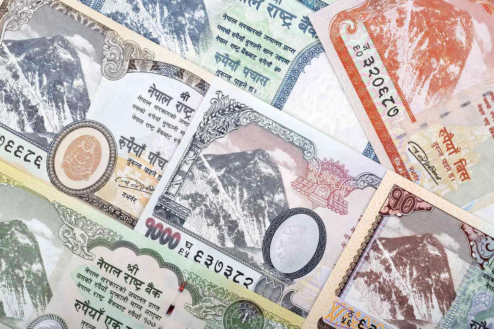

## Table of Contents

## What is the Nepalese Rupee?

The Nepalese Rupee is the official money used in Nepal. It is also called NPR or Rs. People in Nepal use it to buy things like food, clothes, and other stuff they need. The Nepalese Rupee has different coins and paper money, each with different values.

The symbol for the Nepalese Rupee looks like this: रू. The government of Nepal controls how much money is made and used. The value of the Nepalese Rupee can change compared to other countries' money, like the US Dollar or the Indian Rupee. This can affect how much things cost for people in Nepal when they buy things from other countries.

## When was the Nepalese Rupee first introduced?

The Nepalese Rupee was first introduced a long time ago, in the year 1932. Before that, Nepal used different kinds of money, like coins made from metals like silver and copper. But in 1932, the government decided to make a new kind of money that would be used all over the country.

This new money was called the Nepalese Rupee, and it helped make buying and selling things easier for people in Nepal. Over the years, the Nepalese Rupee has changed a bit, with new designs on the coins and paper money. But it has always been an important part of everyday life in Nepal.

## What is the currency symbol for the Nepalese Rupee?

The currency symbol for the Nepalese Rupee is रू. This symbol is used to show prices and amounts of money in Nepal.

It is important because it helps people know they are dealing with Nepalese Rupees. When you see रू before a number, you know it means that amount in Nepalese Rupees.

## How has the design of the Nepalese Rupee changed over time?

The design of the Nepalese Rupee has changed a lot since it was first introduced in 1932. At the beginning, the coins and paper money had simple designs with pictures of important people and symbols from Nepal. Over the years, the government decided to update the designs to make them more modern and secure. They added new colors, patterns, and special features to make it harder for people to make fake money.

In the 1980s and 1990s, the Nepalese Rupee got new designs that showed more about Nepal's culture and history. The paper money started to have pictures of famous places in Nepal, like mountains and temples. The coins also changed to show different animals and plants that are important to Nepal. These changes helped people feel more connected to their country when they used the money.

Today, the Nepalese Rupee continues to change. The government keeps updating the designs to make them even more secure and to show new important things about Nepal. The latest designs include advanced security features like holograms and special inks, which help keep the money safe from being copied. These changes show how the Nepalese Rupee has grown and adapted over time to meet the needs of the people of Nepal.

## What are the different denominations of the Nepalese Rupee?

The Nepalese Rupee has different coins and paper money, each with its own value. The coins come in 1, 2, 5, and 10 rupees. These are small and handy for everyday use, like buying snacks or bus tickets. The paper money, which people also call banknotes, comes in bigger amounts. You can find banknotes of 5, 10, 20, 50, 100, 500, and 1000 rupees. These are used for bigger purchases, like buying groceries or paying bills.

Each type of money has its own special design. The coins usually show pictures of animals or plants that are important to Nepal. For example, you might see a cow or a flower on a coin. The banknotes show famous places and important people from Nepal's history. They also have different colors and sizes to make them easy to tell apart. This way, people can quickly see how much money they have and use the right amount when they need to buy something.

## How is the Nepalese Rupee managed by the central bank?

The Nepalese Rupee is managed by Nepal's central bank, called the Nepal Rastra Bank. This bank is in charge of making sure there is enough money in the country and that it stays valuable. They do this by controlling how much money is printed and by setting rules for banks and other places that use money. The Nepal Rastra Bank also keeps an eye on the economy to make sure the Nepalese Rupee stays strong and people can trust it.

One important job of the Nepal Rastra Bank is to control inflation, which means they try to stop prices from going up too fast. They do this by changing interest rates and by buying or selling government bonds. These actions help keep the value of the Nepalese Rupee stable. The central bank also works with other countries' banks to make sure the Nepalese Rupee can be used easily when people in Nepal need to buy things from other places.

## What historical events have significantly impacted the Nepalese Rupee?

Several historical events have affected the Nepalese Rupee over time. One big event was the political change in Nepal during the 1950s. Before that, Nepal was a kingdom ruled by a king, and the money was tightly controlled. But when democracy came, the government changed, and so did the way the Nepalese Rupee was managed. This made the money more stable and helped the economy grow.

Another important event was the economic reforms in the 1990s. Nepal started to open up its economy and trade more with other countries. This meant the Nepalese Rupee had to be more flexible to keep up with the world's money. The central bank made changes to help the Nepalese Rupee stay strong even when the economy was changing a lot. These reforms helped Nepal's money be used more easily around the world.

The global financial crisis in 2008 also had an effect on the Nepalese Rupee. Even though Nepal was not as affected as some other countries, the crisis made the value of the Nepalese Rupee go up and down more than usual. The Nepal Rastra Bank had to work hard to keep the money stable during this time. This event showed how important it is for Nepal to keep a close eye on what is happening in the world's economy.

## How does the Nepalese Rupee compare to other South Asian currencies?

The Nepalese Rupee is one of many currencies used in South Asia. It is often compared to the Indian Rupee, which is used in India, and the Pakistani Rupee, used in Pakistan. The Nepalese Rupee usually has a lower value than the Indian Rupee but a higher value than the Pakistani Rupee. This means that if you have 100 Nepalese Rupees, you might get fewer Indian Rupees but more Pakistani Rupees when you exchange them. The value of the Nepalese Rupee can change because of things like trade, how much money people from other countries send back home, and what is happening in the world's economy.

Another important currency in South Asia is the Bangladeshi Taka, used in Bangladesh. The Nepalese Rupee and the Bangladeshi Taka are often close in value, but it can change depending on the economy of each country. For example, if Bangladesh is doing well, the Taka might be worth more than the Nepalese Rupee. The Sri Lankan Rupee, used in Sri Lanka, is another currency that people compare to the Nepalese Rupee. The Sri Lankan Rupee can sometimes be worth more or less than the Nepalese Rupee, depending on things like tourism and trade between the two countries. Overall, the value of the Nepalese Rupee compared to other South Asian currencies can change a lot, but it is always important for the people of Nepal.

## What are the current exchange rates for the Nepalese Rupee against major world currencies?

The exchange rate of the Nepalese Rupee (NPR) compared to major world currencies changes every day. As of now, 1 US Dollar (USD) is equal to about 133 NPR. This means if you have 1 US Dollar, you can get around 133 Nepalese Rupees. For the Euro (EUR), 1 Euro is worth around 143 NPR. So, if you have 1 Euro, you can exchange it for about 143 Nepalese Rupees. The British Pound (GBP) is currently valued at around 168 NPR. This means 1 British Pound can be exchanged for about 168 Nepalese Rupees.

These exchange rates are important because they affect how much things cost when people in Nepal buy things from other countries or when tourists come to Nepal. If the Nepalese Rupee gets stronger compared to other currencies, it means Nepalese people can buy more things from abroad for less money. But if the Nepalese Rupee gets weaker, things from other countries will cost more. Exchange rates can change because of many things, like how much people want to buy or sell the Nepalese Rupee, what is happening in the world's economy, and how much money people send back to Nepal from other countries.

## What economic factors influence the value of the Nepalese Rupee?

The value of the Nepalese Rupee is affected by many things in the economy. One big [factor](/wiki/factor-investing) is how much Nepal trades with other countries. If Nepal exports more things like clothes or tea, it can make the Nepalese Rupee stronger because other countries need to buy Nepalese Rupees to pay for these goods. On the other hand, if Nepal imports a lot of things like oil or electronics, it can make the Nepalese Rupee weaker because Nepal needs to use its own money to buy things from other countries. Another important factor is how much money people from Nepal who live and work in other countries send back home. This money, called remittances, can help make the Nepalese Rupee stronger because it brings more money into the country.

The world's economy also plays a big role in the value of the Nepalese Rupee. If big countries like the United States or China are doing well, it can help the Nepalese Rupee because more people might want to buy things from Nepal. But if there is a big problem in the world's economy, like a financial crisis, it can make the Nepalese Rupee weaker because people might not want to buy as much from Nepal. The Nepal Rastra Bank, which is like Nepal's central bank, also tries to keep the Nepalese Rupee stable by changing interest rates and controlling how much money is in the country. All these things together help decide how strong or weak the Nepalese Rupee is compared to other countries' money.

## How has the digitalization of currency affected the use of the Nepalese Rupee?

The digitalization of currency has changed how people in Nepal use the Nepalese Rupee. Now, instead of always using coins and paper money, people can use their phones or computers to pay for things. This is called digital payment, and it makes buying things easier and faster. For example, people can pay their bills or buy things online without needing to go to a store or use cash. Banks and the government have made apps and systems that let people send and receive money quickly, even if they are far away from each other.

Digitalization has also made it easier for the Nepal Rastra Bank to keep track of how much money is being used and to stop people from making fake money. With digital payments, it's harder for someone to use fake money because everything is recorded in a computer system. This helps keep the Nepalese Rupee safe and trusted. But, not everyone in Nepal has a phone or computer, so some people still use the old way of paying with cash. The government is trying to help more people use digital payments by making them easier to use and teaching people how to do it.

## What are the future prospects and challenges for the Nepalese Rupee?

The future of the Nepalese Rupee looks promising as Nepal continues to grow its economy and trade with other countries. More people using digital payments and the government working to make the economy stronger can help the Nepalese Rupee stay stable. If Nepal can export more things like clothes and tea, and if more money comes back from Nepalese people working abroad, the Nepalese Rupee could become stronger. This would make it easier for people in Nepal to buy things from other countries without spending too much.

However, there are also challenges that could affect the Nepalese Rupee. One big challenge is that Nepal depends a lot on imports, like oil and electronics, which can make the Nepalese Rupee weaker if the price of these things goes up. Another challenge is that not everyone in Nepal uses digital payments yet, so the country needs to help more people learn how to use them. Also, if there are big problems in the world's economy, like a financial crisis, it could make the Nepalese Rupee go up and down a lot. The Nepal Rastra Bank will need to keep working hard to manage these challenges and keep the Nepalese Rupee strong and trusted.

## References & Further Reading

[1]: Shrestha, A. and Subedi, R. (2014). ["Nepal Rastra Bank: Seven Decades of Central Banking."](https://link.springer.com/article/10.1007/s10661-024-13253-2) Nepal Rastra Bank.

[2]: Tarkowski, R., & Goedhuys, D. (2013). ["Managing Inflation in the Context of Liberalization and Globalization"](https://journals.sagepub.com/doi/full/10.1177/23409444211008904) in the context of South Asian economies, including Nepal, published by the Nepal Rastra Bank.

[3]: Poudel, P. C. (2014). ["Technological Challenges and Opportunities of Algorithmic Trading: A Study on the Nepal Stock Exchange."](https://www.researchgate.net/publication/355580474_Technology_in_the_Workplace_Opportunities_and_Challenges) Economic Journal of Nepal, Volume 37, Issue 3.

[4]: Buddha Basnyat, MD, and Sushil Koirala, MSc. (2013). ["Nepal: Identity, History, and Development"](https://www.oucru.org/people/associate-professor-buddha-basnyat/) covers various aspects of Nepal’s socio-economic context as reflected in Socio-Economic Development, published in the International Area Studies Review. 

[5]: Ghosh, A. C. (1998). ["Exchange Rate Regimes: Choices and Consequences"](https://direct.mit.edu/books/monograph/2536/Exchange-Rate-RegimesChoices-and-Consequences) published by the World Bank, provides insights on exchange rate mechanisms similar to the NPR-INR peg.

[6]: ["Algorithmic and High-Frequency Trading"](https://assets.cambridge.org/97811070/91146/frontmatter/9781107091146_frontmatter.pdf) by Álvaro Cartea, Sebastian Jaimungal, and José Penalva

[7]: ["Currency and Exchange System Reform in Globalized World"](https://www.weforum.org/agenda/2019/04/is-it-time-for-a-true-global-currency/) by Masahiro Kawai, Eswar S. Prasad, Deeper insights into pegged exchange systems such as NPR-INR.
