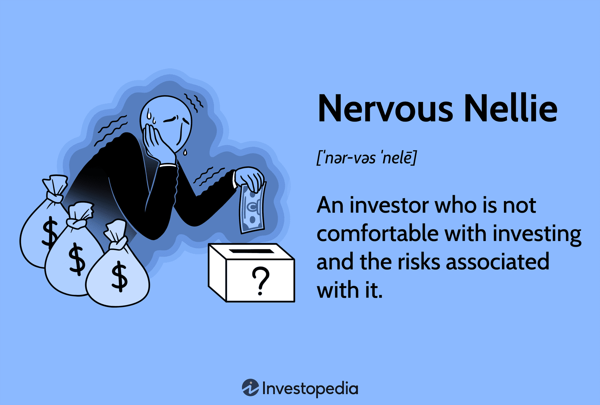

Algorithmic trading, a method harnessing computer algorithms to automate investment decisions, holds remarkable potential for generating profit. However, it also brings forth a unique set of challenges that can particularly impact those prone to anxiety, often referred to as 'Nervous Nellies.' Characterized by a low risk tolerance, these individuals often struggle to cope with market volatility and may feel overwhelmed by the fast-paced and intricate nature of algorithmic trading.

This article aims to identify who a Nervous Nellie is and examine why algorithmic trading becomes a source of stress for them. We also provide coping strategies designed to manage the anxiety and stress linked to this modern investment approach. Understanding the traits of a Nervous Nellie, along with the psychological landscape of algorithmic trading, can offer valuable insights and practical advice to ease the trading process.



By engaging with this article, readers will gain essential knowledge to navigate the complexities of algorithmic trading calmly and strategically. Whether you're embarking on your trading journey or possess years of experience, the insights presented here aim to facilitate a more mindful and less stressful trading experience.

## Table of Contents

## Understanding the Nervous Nellie

A "Nervous Nellie" in the investing sector refers to individuals characterized by low risk tolerance, making them particularly sensitive to the fluctuations and inherent uncertainties in the market. These individuals often gravitate towards investments deemed safer, such as government bonds or fixed deposits, which promise stability and minimal risk of loss. This behavior is a direct reflection of their comfort with predictable returns, even if it means settling for lower yields.

Nervous Nellies frequently exhibit a reactive approach to market dynamics. Their decision-making is often swayed by fear rather than strategic analysis, manifesting in the common pitfall of buying high during market exuberance and selling low amid panic. This pattern is understandable given their risk-averse nature, but it can significantly impair their investment performance.

Moreover, Nervous Nellies tend to accumulate cash reserves, prioritizing [liquidity](/wiki/liquidity-risk-premium) and security over potential growth. This cautious stance, while mitigating immediate risk, typically results in missed opportunities for capital appreciation. As markets evolve and inflation erodes cash value, the reluctance to engage with riskier, albeit potentially more rewarding, investment avenues can have detrimental long-term financial implications.

By understanding the psychological profile of a Nervous Nellie, strategies can be tailored to help them navigate the market more confidently and possibly embrace a more balanced approach to risk and reward.

## The Pressure of Algorithmic Trading

Algorithmic trading transforms the financial markets by employing computer algorithms to execute trading strategies with speed and precision. This approach can be intimidating for individuals prone to anxiety, particularly those with characteristics of a Nervous Nellie. One primary source of stress is the sheer speed at which these algorithms operate. Automated systems are capable of analyzing and acting on vast amounts of data in fractions of a second, a pace that is impossible for human traders to match manually. This rapid decision-making process can heighten feelings of being overwhelmed, especially for those who prefer a more deliberate and controlled approach to investments.

The complexity of algorithms also contributes significantly to stress levels. These programs can include intricate mathematical models and decision trees, utilizing various indicators such as moving averages, Bollinger Bands, or the Relative Strength Index (RSI) to make trading decisions. For those unfamiliar with such technical constructs, the fear of the unknown and the perception of complexity can exacerbate anxiety. Here's a simple example of a moving average calculation using Python for clarity:

```python
def moving_average(data, window_size):
    return [sum(data[i:i+window_size])/window_size for i in range(len(data)-window_size+1)]

data = [1, 2, 3, 4, 5, 6, 7, 8, 9, 10]
window_size = 3
print(moving_average(data, window_size))
```

In addition to speed and complexity, the automated nature of [algorithmic trading](/wiki/algorithmic-trading) can lead to a sense of loss of control. Unlike traditional trading, where human intuition and judgment guide decision-making, algorithmic trading relies on pre-set rules and models. For Nervous Nellies, who may value the reassurance of manual intervention, this automation can trigger heightened fear and anxiety due to the perceived lack of influence over trading actions.

To mitigate these feelings, it is beneficial to understand how algorithms function and the rationale behind specific trading strategies. Grasping the basics of algorithmic trading, such as how prices, historical data, and market signals are analyzed, can provide a clearer picture and reduce apprehensions. Additionally, learning how risk management strategies are integrated into algorithms can help Nervous Nellies feel more secure. Creating stop-loss orders and setting thresholds within the algorithm can offer a layer of protection and control, even in an automated trading environment.

By gaining a deeper understanding of algorithmic processes and strategies, individuals characterized as Nervous Nellies can approach algorithmic trading with more confidence and less anxiety, transforming overwhelming complexity into a manageable and potentially profitable enterprise.

## Coping Strategies for Anxiety in Algo Trading

Coping with the anxiety associated with algorithmic trading requires a multifaceted approach. One effective strategy is enhancing one's education and knowledge. Familiarizing oneself with the intricacies of the market and the nature of algorithmic trading can substantially boost confidence. Understanding the algorithms' underlying logic and how they interact with market dynamics demystifies the trading process, thereby reducing fear of the unknown.

In addition to intellectual preparedness, mindfulness techniques can play a crucial role in managing stress. Practices such as meditation, deep breathing, and yoga are effective at maintaining calmness and focus. These techniques promote a balanced mental state, allowing traders to make clearer decisions even amidst market [volatility](/wiki/volatility-trading-strategies).

Implementing robust risk management strategies is another essential coping mechanism. Establishing clear risk parameters and employing stop-loss orders can provide a safety net for investors, effectively controlling potential losses. This approach eases anxiety by offering a predetermined action plan during market downturns, allowing Nervous Nellies to protect their investments and maintain emotional equilibrium.

Gradual exposure to the trading environment also helps in stress management. Beginning with smaller investments and gradually increasing exposure as comfort grows is beneficial. This method allows traders to acclimatize to the market's fluctuations progressively, improving resilience over time and minimizing emotional distress.

Lastly, seeking professional guidance can be advantageous. Collaborating with a financial advisor skilled in addressing the concerns of a Nervous Nellie ensures that investment strategies align with the trader's risk tolerance. Such professionals provide tailored advice and reassurance, which can significantly alleviate anxiety by ensuring informed decision-making.

These comprehensive strategies, when integrated, equip Nervous Nellies with the tools needed to transform trading anxiety into more confident and strategic engagements with algorithmic trading.

## The Role of Psychological Support

Cognitive Behavioral Therapy (CBT) has been recognized as an effective therapeutic approach for managing anxiety associated with trading activities, including algorithmic trading. The primary function of CBT in this context is to help individuals recognize and alter negative thought patterns and beliefs that can trigger anxiety. By fostering a more rational and balanced perspective towards trading, CBT aids Nervous Nellies in developing resilience against market fluctuations and their psychological impacts. CBT techniques often involve restructuring cognitive distortions and gradually exposing individuals to anxieties to diminish their power.

Moreover, the value of support groups or trader communities cannot be underestimated. These platforms offer individuals the opportunity to share experiences, challenges, and coping strategies in a supportive environment. Engaging with fellow traders who may share similar apprehensions can significantly reduce feelings of isolation and provide reassurance, which is essential for a Nervous Nellie's trading experience.

Participation in stress management workshops is another strategy that can benefit those struggling with trading anxiety. Such workshops typically teach practical skills to manage stress, including time management, relaxation techniques, and the importance of maintaining a balanced lifestyle. These tools are invaluable in equipping Nervous Nellies with the necessary skills to navigate stressful periods in trading calmly.

Additionally, tracking emotional responses to trading can serve as an effective method to identify triggers of anxiety. By maintaining a trading journal, individuals can document their feelings, thoughts, and reactions to market events. This practice not only aids in the recognition of patterns and triggers but also assists in developing healthier coping mechanisms. Through analyzing the emotional data gathered, traders can implement strategies to mitigate these triggers in future scenarios.

Incorporating psychological support systems like CBT, communal support, and stress management workshops, along with personal tracking of emotional responses, can transform the trading experience for Nervous Nellies. These interventions help foster a more mindful and less stressful engagement with algorithmic trading, ultimately empowering traders to manage their emotions and develop confident trading strategies.

## Conclusion

Algorithmic trading serves as an advanced mechanism for executing financial strategies, but its complexity and rapid execution often present a challenge for those identified as Nervous Nellies. This complexity may contribute to anxiety, but it does not preclude participation. By utilizing a blend of coping strategies, involving education, mindfulness techniques, and professional guidance, individuals with a lower risk tolerance can convert anxiety into effective trading strategies. 

The educational aspect plays a pivotal role, as understanding the market dynamics and mechanics of algorithmic trading builds confidence and mitigates fear. Mindfulness practices, such as meditation and yoga, can offer tranquility, aiding in stress management. Furthermore, a structured psychological approach, incorporating techniques like Cognitive Behavioral Therapy (CBT), can effectively alter detrimental thought patterns associated with trading anxiety.

Strategically, the integration of comprehensive risk management strategies, including the deployment of stop-loss orders, ensures capital protection and brings peace of mind. Engaging with financial advisors, who are attuned to the apprehensions of Nervous Nellies, can provide tailored guidance that aligns with their risk appetite.

Therefore, a holistic approach, intertwining both psychological resilience and strategic measures, is essential to transforming the stressful aspects of algorithmic trading into a manageable endeavor. Armed with an appropriate mindset and robust tools, even those with heightened anxiety can participate in algorithmic trading, navigating its challenges with increased confidence and composure.

## References & Further Reading

[1]: Bergstra, J., Bardenet, R., Bengio, Y., & Kégl, B. (2011). ["Algorithms for Hyper-Parameter Optimization."](https://dl.acm.org/doi/10.5555/2986459.2986743) Advances in Neural Information Processing Systems 24.

[2]: ["Advances in Financial Machine Learning"](https://www.amazon.com/Advances-Financial-Machine-Learning-Marcos/dp/1119482089) by Marcos Lopez de Prado

[3]: ["Evidence-Based Technical Analysis: Applying the Scientific Method and Statistical Inference to Trading Signals"](https://www.amazon.com/Evidence-Based-Technical-Analysis-Scientific-Statistical/dp/0470008741) by David Aronson

[4]: ["Machine Learning for Algorithmic Trading"](https://github.com/stefan-jansen/machine-learning-for-trading) by Stefan Jansen

[5]: ["Quantitative Trading: How to Build Your Own Algorithmic Trading Business"](https://www.amazon.com/Quantitative-Trading-Build-Algorithmic-Business/dp/1119800064) by Ernest P. Chan