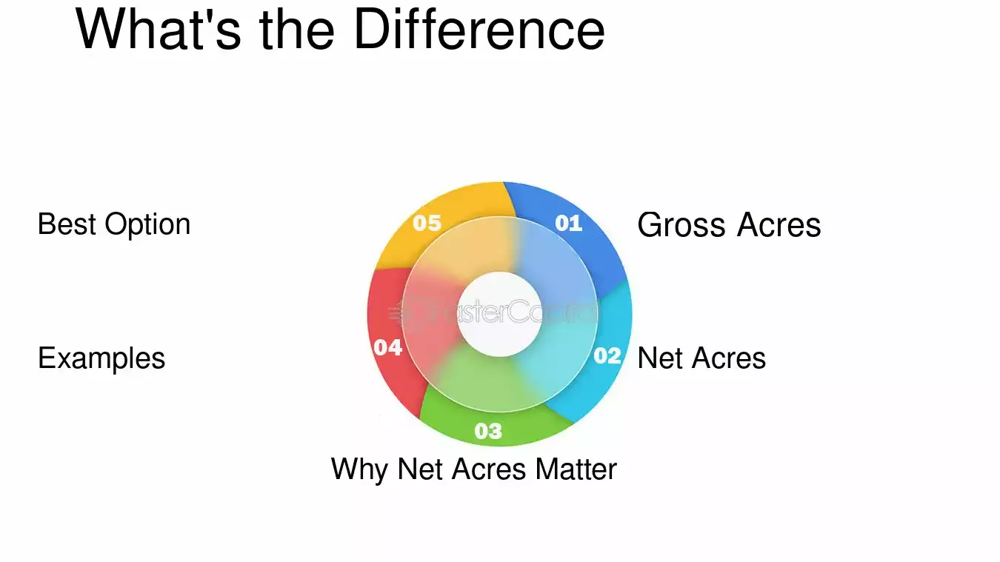

## Table of Contents

## What are Net Acres?

Net acres are a way to measure how much of a piece of land someone really owns or controls. When people own land together, like in oil and gas projects, they use net acres to figure out each person's share. For example, if four people own a 1,000-acre piece of land equally, each person would have 250 net acres because they each own a quarter of the total land.

This concept is important in industries like oil and gas because it helps companies understand their rights and responsibilities on a property. If a company has 100 net acres in a larger field, it means they can use and benefit from those 100 acres, even if the total field is much bigger. This makes it easier to plan projects and share profits fairly among all the owners.

## How are Net Acres different from Gross Acres?

Net acres and gross acres are two ways to measure land, but they show different things. Gross acres are the total size of a piece of land, no matter how many people own it. For example, if you have a farm that is 1,000 acres big, that's 1,000 gross acres. It's the whole area, simple as that.

Net acres, on the other hand, tell you how much of that land you actually own or control. If you own half of that 1,000-acre farm with someone else, you would have 500 net acres. Net acres are important because they help you know your share when the land is owned by more than one person. So, while gross acres give you the big picture of the land's size, net acres show your personal piece of that land.

## Why is the concept of Net Acres important in real estate?

The concept of Net Acres is important in real estate because it helps people understand how much of a property they really own. When a piece of land is owned by more than one person, like in a partnership or a company, Net Acres show each owner's share. For example, if four people own a 100-acre farm together, each person might own 25 Net Acres. This is helpful because it makes it clear who gets what part of the land and its benefits.

In industries like oil and gas, where land is often shared among many owners, knowing your Net Acres is key. It helps companies figure out how much they can use the land for drilling or other projects. If a company has 50 Net Acres in a big field, they know they can work on those 50 acres, even if the whole field is much larger. This makes planning easier and helps everyone understand their rights and responsibilities on the property.

## How do you calculate Net Acres?

To calculate Net Acres, you need to know the total size of the land, which is called Gross Acres, and your ownership percentage. If you own a piece of land all by yourself, your Net Acres are the same as the Gross Acres. But if you share the land with others, you need to figure out your share. For example, if you own half of a 100-acre farm, you multiply 100 acres by your 50% ownership to get 50 Net Acres.

This calculation is important because it shows how much of the land you can use and benefit from. In industries like oil and gas, where many people might own parts of the same land, knowing your Net Acres helps you plan what you can do on your part of the land. If you have 20 Net Acres in a big field, you know you can work on those 20 acres, even if the whole field is much bigger. This makes it easier to share the land and its profits fairly among all the owners.

## What factors can affect the Net Acres of a property?

Net Acres can change because of different things. One big reason is if the ownership of the land changes. If someone buys or sells part of the land, the Net Acres for each owner will be different. For example, if you own half of a 100-acre farm and you sell a quarter of your share to someone else, your Net Acres will go down from 50 to 25.

Another thing that can affect Net Acres is if the total size of the land changes. This might happen if part of the land is taken away for a road or if more land is added to the property. If a 100-acre farm loses 10 acres because of a new road, and you own half of it, your Net Acres will go from 50 to 45. Understanding these changes is important because it helps you know how much land you can use and benefit from.

## Can Net Acres change over time? If so, how?

Yes, Net Acres can change over time. One way this can happen is if the ownership of the land changes. If you own part of a piece of land and you sell some of your share to someone else, your Net Acres will go down. For example, if you own half of a 100-acre farm and you sell a quarter of your share, your Net Acres will drop from 50 to 25. On the other hand, if you buy more shares from other owners, your Net Acres will go up.

Another way Net Acres can change is if the total size of the land changes. This might happen if part of the land is taken away for something like a new road or if more land is added to the property. If a 100-acre farm loses 10 acres because of a new road, and you own half of it, your Net Acres will go from 50 to 45. Understanding these changes is important because it helps you know how much land you can use and benefit from.

## How do Net Acres impact property valuation?

Net Acres play a big role in figuring out how much a piece of land is worth. When you know how many Net Acres you own, you can understand your share of the property's value. For example, if a 100-acre farm is worth $1 million and you own half of it, your 50 Net Acres are worth $500,000. This helps when you want to sell your part of the land or use it to get a loan because it shows exactly what your share is worth.

Changes in Net Acres can also change how much your property is worth. If you sell some of your share, your Net Acres go down, and so does the value of your part of the land. On the other hand, if you buy more shares from other owners, your Net Acres go up, and the value of your part of the land goes up too. Knowing how Net Acres work helps you keep track of your property's value over time, especially in industries like oil and gas where land is often shared among many owners.

## What are some common uses of Net Acres in real estate transactions?

Net Acres are really helpful when people are buying, selling, or sharing land. In real estate deals, knowing how many Net Acres you own helps you figure out how much your part of the land is worth. For example, if you want to sell your share of a farm, knowing your Net Acres tells you how much money you should ask for. It also helps when you're buying land with other people because it shows exactly how much land you're getting.

Net Acres are also important when people want to use their land to get a loan. Banks want to know how much land you really own before they lend you money. If you have 50 Net Acres in a big field, the bank can see that you own a good chunk of land and might be more willing to give you a loan. This makes it easier to use your land as a way to get money for other things you need.

## How do zoning laws influence Net Acres?

Zoning laws can change how many Net Acres you can use. If a piece of land is zoned for a certain use, like farming or building houses, it might limit how much of the land you can actually use for that purpose. For example, if part of your land is zoned for a park, you can't build houses on that part, even if you own it. This means your Net Acres for building houses would be less than the total land you own.

These zoning changes can affect the value of your land too. If new zoning laws make it so you can use less of your land for what you want, your Net Acres for that use go down, and so might the value of your property. It's important to know about zoning laws because they can change what you can do with your land and how much it's worth.

## What are the legal considerations when dealing with Net Acres?

When dealing with Net Acres, it's important to understand the legal paperwork that shows who owns what part of the land. This paperwork, called deeds or contracts, tells you how much of the land you own and what you can do with it. If you're buying or selling land, make sure the legal documents clearly say how many Net Acres you're dealing with. This helps avoid confusion and fights later on. Also, if you're sharing land with other people, having a clear agreement about who owns how many Net Acres can help everyone know their rights and responsibilities.

Legal rules like zoning laws can also affect how many Net Acres you can use. For example, if part of your land is zoned for a park, you can't use those acres for building houses, even if you own them. This means your Net Acres for building houses would be less than the total land you own. It's a good idea to check with local government about zoning rules before you buy or sell land, so you know exactly how you can use your Net Acres. Understanding these legal considerations helps you make smart choices about your land and avoid legal problems.

## How do environmental regulations affect the calculation of Net Acres?

Environmental regulations can change how many Net Acres you can use. If a law says you can't build on part of your land because it's a protected area, like a wetland, then those acres don't count as Net Acres for building. This means you have fewer Net Acres to use for what you want. For example, if you own 100 acres but 20 acres are protected, you only have 80 Net Acres for building.

These regulations can also affect the value of your land. If new rules make it so you can use less of your land, the value of your Net Acres might go down. It's important to know about these rules because they can change what you can do with your land and how much it's worth. Checking with local environmental agencies can help you understand how these regulations might affect your Net Acres.

## What advanced techniques can be used to maximize the Net Acres of a property?

One way to maximize the Net Acres of a property is by working with other owners to buy out their shares. If you own part of a big piece of land with other people, you can try to buy their parts. This will increase your Net Acres because you'll own a bigger piece of the land. Another way is to look at the zoning laws and see if you can change them. Sometimes, you can talk to the local government and get them to let you use more of your land for what you want. This can turn land that you couldn't use before into Net Acres you can use now.

Another technique is to use the land in smart ways. For example, if part of your land is protected because of environmental rules, you might be able to use other parts of the land more efficiently. You can also look for ways to combine different uses of the land, like farming and building, to make the most of your Net Acres. Talking to experts like lawyers or land use planners can help you find ways to use your land better and increase your Net Acres.

## What is the meaning of Net Acres in Real Estate?

Net acres represent the portion of a land parcel that is usable for development or agriculture after subtracting areas unsuitable for these activities, such as bodies of water, steep slopes, or protected environmental zones. This metric is essential for accurate real estate assessments, as it provides a clear picture of the land's actual utility for prospective developments.

Understanding the distinction between net acres and gross acres is crucial for investors and developers. Gross acres encompass the total area of a land parcel, including both usable and unusable segments. However, only net acres provide an accurate gauge of a property's potential, as they consider the restricted areas that cannot contribute to development or economic productivity. For example, a 100-acre plot with 20 acres of protected wetlands would have 80 net acres available for development.

The difference between net and gross acres significantly impacts property valuation. Investors often calculate net acres to forecast the possible return on investment and to make informed decisions. For instance, if a developer is presenting plans for a residential project, the land's value will largely depend on the net acres since only this part will generate revenue through sales or leases. The calculation can be expressed in a simplified formula:

$$
\text{Net Acres} = \text{Gross Acres} - \text{Unusable Acres}
$$

Consider a practical illustration: suppose a given real estate market values land at $10,000 per net acre. A developer evaluating a 150-acre site with 30 acres of unusable topography would consider 120 net acres in their financial projections, amounting to a potential valuation of approximately $1.2 million.

Net acres are also pivotal in urban planning and development, influencing both economic and environmental strategies. City planners use net acre measurements to allocate resources efficiently and maximize land usage. By focusing on net acres, policymakers can implement development plans that align with sustainability goals while also meeting the community's needs for housing, recreation, and commerce.

In summary, net acres serve as a foundational component in real estate decision-making, affecting everything from valuation to planning and investment strategy. Understanding this metric allows stakeholders in the real estate sector to evaluate land more accurately, leading to more informed and profitable decisions.

## References & Further Reading

[1]: ["Algorithmic Trading: Winning Strategies and Their Rationale"](https://books.google.com/books/about/Algorithmic_Trading.html?id=WAlFDwAAQBAJ) by Ernest P. Chan

[2]: ["Advances in Financial Machine Learning"](https://www.amazon.com/Advances-Financial-Machine-Learning-Marcos/dp/1119482089) by Marcos Lopez de Prado

[3]: Babcock, W. (2018). ["The Intersection of Real Estate and Technology in the Digital Era."](https://www.forbes.com/councils/forbesbusinesscouncil/2024/03/06/the-digital-real-estate-revolution-how-tech-is-transforming-the-industry/) Journal of Property Management

[4]: ["Machine Learning for Algorithmic Trading"](https://github.com/stefan-jansen/machine-learning-for-trading) by Stefan Jansen

[5]: Ricciardi, V., & Simon, H. K. (2000). ["What is Behavioral Finance?"](https://papers.ssrn.com/sol3/Papers.cfm?abstract_id=256754) Business, Education & Technology Journal

[6]: Monahan, A. (2015). ["Blockchain: A New Framework for Real Estate Transactions."](https://link.springer.com/chapter/10.1007/978-981-19-3035-5_44) Innovating Real Estate Transactions

[7]: ["The Real Estate Wholesaling Bible: The Fastest, Easiest Way to Get Started in Real Estate Investing"](https://www.amazon.com/Real-Estate-Wholesaling-Bible-Investing-ebook/dp/B00JJVLIPC) by Than Merrill

[8]: Flinn, P. (2018). ["The Importance of Accurate Land Measurements in Real Estate Planning."](https://www.creb.com/News/CREBNow/2018/October/sponsored_the_importance_of_accurate_real_estate_measurements/) NAIOP Development Magazine