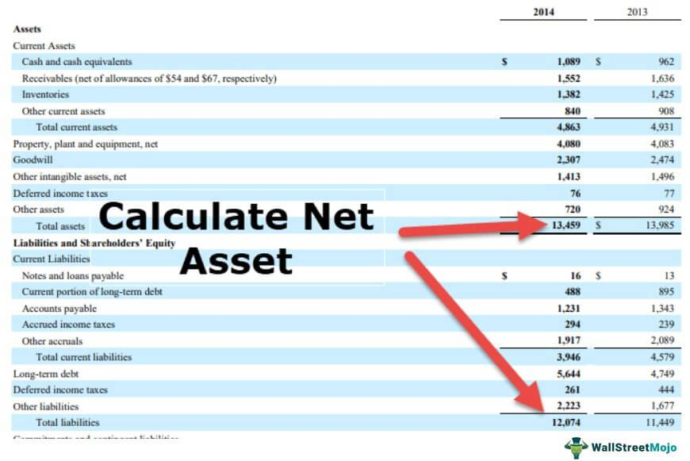

In today's rapidly evolving financial and real estate markets, the intersection of land measurement, real estate investment, and algorithmic trading is becoming increasingly significant. This confluence is driven by the need for precise land evaluation methods, such as net acres, and the technological advancements offered by algorithmic trading systems. By understanding these connections, investors can better navigate the complex landscape of modern real estate trading.

Land measurement techniques, particularly the concept of net acres, are fundamental in determining the usable portions of a property. This metric becomes essential as it directly influences property valuations by pinpointing the areas available for development. Unlike gross acres, which might include non-usable land, net acres provide a more accurate representation of a property's value, enabling investors and developers to make informed decisions. Accurate land measurement thus forms the backbone of real estate assessments and investment strategies.



Simultaneously, the advent of algorithmic trading in real estate marks a transformative shift in how properties are bought and sold. These systems utilize advanced mathematical models and sophisticated software to perform transactions at speeds unattainable by human traders. Algorithmic trading not only streamlines the process but also offers predictive insights into market trends, optimizing investment strategies and potentially boosting returns.

The integration of technology within real estate transactions has further enhanced this landscape by promoting efficiency and transparency. From digital platforms that simplify property management to AI-driven systems that automate property searches, modern technology is continuously reshaping real estate dynamics. Blockchain technology, for instance, ensures secure and transparent transactions, paving the way for more reliable and fraud-resistant deals.

By exploring the intersection of land measurement, algorithmic trading, and technological advancements, investors can harness these tools to effectively capitalize on opportunities in the real estate market. Adapting to these innovations is crucial for success in the digital age, promising a future where real estate transactions are more efficient and insightful.

## Table of Contents

## Understanding Net Acres in Real Estate

Net acres represent the portion of a land parcel that is usable for development or agriculture after subtracting areas unsuitable for these activities, such as bodies of water, steep slopes, or protected environmental zones. This metric is essential for accurate real estate assessments, as it provides a clear picture of the land's actual utility for prospective developments.

Understanding the distinction between net acres and gross acres is crucial for investors and developers. Gross acres encompass the total area of a land parcel, including both usable and unusable segments. However, only net acres provide an accurate gauge of a property's potential, as they consider the restricted areas that cannot contribute to development or economic productivity. For example, a 100-acre plot with 20 acres of protected wetlands would have 80 net acres available for development.

The difference between net and gross acres significantly impacts property valuation. Investors often calculate net acres to forecast the possible return on investment and to make informed decisions. For instance, if a developer is presenting plans for a residential project, the land's value will largely depend on the net acres since only this part will generate revenue through sales or leases. The calculation can be expressed in a simplified formula:

$$
\text{Net Acres} = \text{Gross Acres} - \text{Unusable Acres}
$$

Consider a practical illustration: suppose a given real estate market values land at $10,000 per net acre. A developer evaluating a 150-acre site with 30 acres of unusable topography would consider 120 net acres in their financial projections, amounting to a potential valuation of approximately $1.2 million.

Net acres are also pivotal in urban planning and development, influencing both economic and environmental strategies. City planners use net acre measurements to allocate resources efficiently and maximize land usage. By focusing on net acres, policymakers can implement development plans that align with sustainability goals while also meeting the community's needs for housing, recreation, and commerce.

In summary, net acres serve as a foundational component in real estate decision-making, affecting everything from valuation to planning and investment strategy. Understanding this metric allows stakeholders in the real estate sector to evaluate land more accurately, leading to more informed and profitable decisions.

## Algorithmic Trading in Real Estate

Algorithmic trading employs advanced mathematical models and sophisticated software to execute trading decisions at speeds significantly surpassing those of human traders. In real estate, this technology streamlines the buying and selling process by automating tasks that were traditionally manual and time-consuming. Through [algorithmic trading](/wiki/algorithmic-trading), real estate transactions can be executed faster, with increased precision and reduced costs. This technological application is transforming how investors engage with the real estate market.

One of the primary advantages of algorithmic trading in real estate is its capacity to predict market trends and optimize investment strategies. By analyzing vast datasets, these algorithms identify patterns and forecast market movements, enabling more informed decision-making. For instance, [machine learning](/wiki/machine-learning) models can process historical property prices, interest rates, and economic indicators to predict price movements, allowing investors to strategize accordingly.

Despite its benefits, implementing algorithmic trading in real estate presents unique challenges. The complexity of real estate markets, characterized by diverse properties and regulatory environments, requires algorithms to adapt dynamically to changing conditions. Developing robust models that account for localized factors such as zoning laws and construction regulations is essential but difficult.

Data analytics and machine learning play crucial roles in enhancing the effectiveness of real estate algorithmic trading. Through [deep learning](/wiki/deep-learning) techniques, algorithms can classify properties, evaluate risks, and optimize portfolios with more accuracy. Programs written in Python, such as the following, demonstrate how data science techniques could be applied:

```python
import pandas as pd
from sklearn.model_selection import train_test_split
from sklearn.ensemble import RandomForestRegressor

# Load dataset of historical real estate transactions
data = pd.read_csv('real_estate_data.csv')
X = data.drop(['property_value'], axis=1)
y = data['property_value']

# Split data into training and testing sets
X_train, X_test, y_train, y_test = train_test_split(X, y, test_size=0.2, random_state=42)

# Initialize Random Forest Regressor
model = RandomForestRegressor(n_estimators=100, random_state=42)

# Fit model on training data
model.fit(X_train, y_train)

# Predict on test data
predictions = model.predict(X_test)

# Output predicted property values
print(predictions)
```

This code snippet illustrates how a Random Forest model can predict property values based on historical data. Such predictive models are vital for developing strategies in algorithmic trading systems tailored to real estate.

Algorithmic trading in real estate also benefits from the integration of [artificial intelligence](/wiki/ai-artificial-intelligence), which continues to evolve and offer new insights into market dynamics. As these technologies advance, they promise to further innovate the strategies through which real estate investments are conducted, making markets more accessible and transparent for all stakeholders.

## The Impact of Technology on Real Estate Transactions

Technology has revolutionized the way real estate transactions are conducted, making them more efficient and transparent. Digital platforms have significantly contributed to this transformation by facilitating easier land management and property assessments. These platforms aggregate large datasets, which provide investors and developers with better insights into market trends and property valuations. They allow for streamlined processes where previously manual and time-consuming tasks, such as documentation and verification, are automated, resulting in reduced transaction times and enhanced accuracy.

AI and machine learning have emerged as game-changers in automating the property search and evaluation process. Through algorithms capable of analyzing vast amounts of data, AI systems can identify patterns and predict market trends with high precision. This allows investors to make informed decisions quickly and with greater confidence. Machine learning models can also provide personalized property recommendations based on individual preferences and historical data, enhancing the user experience.

Blockchain technology plays a crucial role in ensuring secure and transparent property transactions. By using a decentralized ledger system, blockchain ensures that transaction records are immutable and verifiable by all parties involved. This reduces the likelihood of fraud and errors, building trust among buyers, sellers, and intermediaries. Smart contracts within blockchain can automate and enforce transaction terms, further streamlining the process by eliminating the need for intermediaries and reducing associated costs.

Looking to the future, virtual reality (VR) holds significant potential in transforming property viewings and client interactions. VR technology allows potential buyers to experience immersive 3D tours of properties from anywhere in the world, saving time and resources. This capability not only enhances the buyer's understanding of the property but also broadens the market reach for sellers by attracting international clients. As this technology matures, it could become an integral tool in real estate marketing, offering clients a more interactive and engaging experience.

In conclusion, the integration of advanced technologies, including digital platforms, AI, blockchain, and virtual reality, is reshaping how real estate transactions are conducted. These technologies enhance efficiency, transparency, and security, providing substantial benefits to all stakeholders involved in the real estate market.

## Conclusion

Innovative technologies and precise measurement techniques, such as net acres, are significantly transforming the real estate landscape. These advancements are refining how properties are assessed, valued, and developed, resulting in more accurate appraisal standards and enhanced investment strategies. By utilizing algorithmic trading, investors can access real estate market data with unprecedented speed and precision. This enables them to make more informed decisions by analyzing substantial datasets in real-time, facilitating timely market analyses and the identification of lucrative opportunities.

As technology continues to evolve, staying informed about these developments becomes crucial for investors seeking to capitalize on emerging opportunities within real estate investment. A deep understanding of both net acres and algorithmic trading is critical for navigating this modern terrain effectively. Net acres, for instance, provide a true representation of usable land, which is vital for accurate property valuation and development planning. On the other hand, algorithmic trading offers significant advantages in predicting market trends and optimizing investment portfolios through intelligent data processing.

Integrating these elements—precise land measurement and algorithmic trading technology—promises a future where real estate transactions are not only more efficient but also more insightful. This synergy enhances transparency, reduces transaction times, and minimizes human error, ultimately leading to more successful real estate ventures. As the landscape continues to advance, harnessing these tools will become essential for stakeholders aiming to achieve sustained success in the ever-evolving real estate market.

## References & Further Reading

[1]: ["Algorithmic Trading: Winning Strategies and Their Rationale"](https://books.google.com/books/about/Algorithmic_Trading.html?id=WAlFDwAAQBAJ) by Ernest P. Chan

[2]: ["Advances in Financial Machine Learning"](https://www.amazon.com/Advances-Financial-Machine-Learning-Marcos/dp/1119482089) by Marcos Lopez de Prado

[3]: Babcock, W. (2018). ["The Intersection of Real Estate and Technology in the Digital Era."](https://www.forbes.com/councils/forbesbusinesscouncil/2024/03/06/the-digital-real-estate-revolution-how-tech-is-transforming-the-industry/) Journal of Property Management

[4]: ["Machine Learning for Algorithmic Trading"](https://github.com/stefan-jansen/machine-learning-for-trading) by Stefan Jansen

[5]: Ricciardi, V., & Simon, H. K. (2000). ["What is Behavioral Finance?"](https://papers.ssrn.com/sol3/Papers.cfm?abstract_id=256754) Business, Education & Technology Journal

[6]: Monahan, A. (2015). ["Blockchain: A New Framework for Real Estate Transactions."](https://link.springer.com/chapter/10.1007/978-981-19-3035-5_44) Innovating Real Estate Transactions

[7]: ["The Real Estate Wholesaling Bible: The Fastest, Easiest Way to Get Started in Real Estate Investing"](https://www.amazon.com/Real-Estate-Wholesaling-Bible-Investing-ebook/dp/B00JJVLIPC) by Than Merrill

[8]: Flinn, P. (2018). ["The Importance of Accurate Land Measurements in Real Estate Planning."](https://www.creb.com/News/CREBNow/2018/October/sponsored_the_importance_of_accurate_real_estate_measurements/) NAIOP Development Magazine