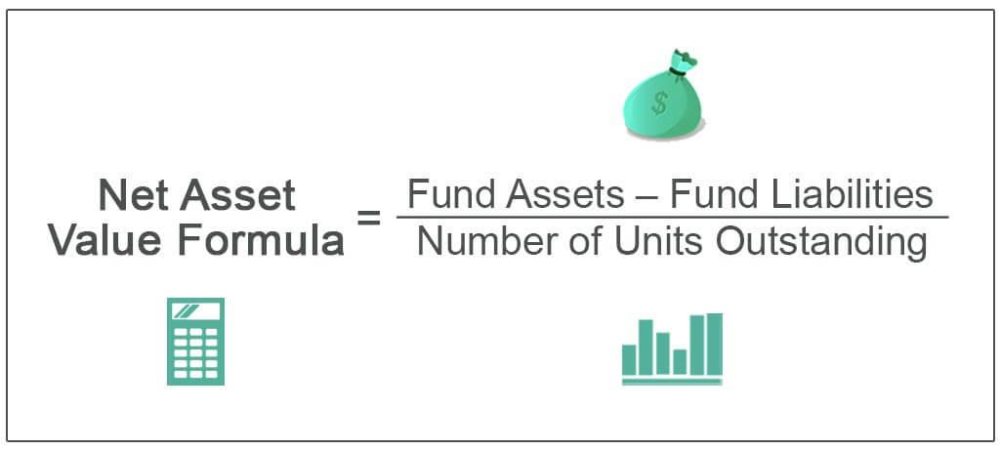

Mutual funds are an integral part of investment portfolios, serving as a means for investors to diversify their assets and gain access to a wide array of securities without the need for direct, individual investments. These funds pool money from multiple investors to purchase a collection of stocks, bonds, or other securities, managed by a professional fund manager. This setup allows investors to benefit from the manager's expertise and the funds' collective buying power, while also spreading risk across a broad range of assets.

Central to the functioning and evaluation of mutual funds is the concept of Net Asset Value (NAV). NAV represents the per-share value of a mutual fund, calculated by dividing the total value of all the assets in the portfolio, minus liabilities, by the total number of outstanding shares. Mathematically, it is expressed as:



$$
\text{NAV} = \frac{\text{Total Assets} - \text{Total Liabilities}}{\text{Outstanding Shares}}
$$

NAV is crucial for investors as it provides a snapshot of the fund's value and serves as the basis for pricing transactions like buying or selling fund shares. Unlike stock prices that fluctuate throughout the trading day, NAV is typically calculated once at the end of each trading day, reflecting the funds' closing prices.

Algorithmic trading, or algo trading, has seen a rapid rise in influence within the financial sector, reshaping how assets are traded and how market dynamics are understood. By utilizing computer algorithms to execute trades at optimal times, based on predefined criteria, algo trading offers unparalleled speed, precision, and efficiency. It enables traders to make decisions based on sophisticated mathematical models and large datasets, often reducing human error and emotion-driven decisions in the trading process.

This article aims to explore the intersection of NAV calculation and algorithmic trading—a domain where financial technology and traditional investment principles converge. Understanding the intricacies of NAV is vital for investors, especially those engaging with mutual funds and considering the implications of algorithmic trading in today's fast-paced markets. By grasping how NAV is calculated and influenced by modern trading strategies, investors can better navigate the complexities of mutual fund investments and enhance their portfolio management strategies in an era increasingly dominated by technology.

## Table of Contents

## Understanding Net Asset Value (NAV)

Net Asset Value (NAV) is a fundamental concept in mutual fund investment, representing the value per share of the fund on a specific date or time. It's calculated using a straightforward formula: 

$$
\text{NAV} = \frac{\text{Total Assets} - \text{Total Liabilities}}{\text{Number of Outstanding Shares}}
$$

**Components of NAV**

1. **Assets**: This encompasses all holdings and cash equivalents that a mutual fund possesses. These might include stocks, bonds, cash reserves, and receivables. The value of these assets is usually determined by the market value.

2. **Liabilities**: These are obligations the fund must settle, such as pending payments or expenses. Liabilities might include management fees, operational expenses, or pending dividends.

3. **Outstanding Shares**: Refers to the total number of shares that investors currently hold. As funds accommodate new investments or fulfill redemptions, the number of outstanding shares can fluctuate.

**Role of NAV in Determining Mutual Fund Share Value**

NAV indicates the worth of each mutual fund share. Since the NAV reflects the per-share value based on the fund's total assets minus liabilities, it offers a vital gauge to investors of what their share in the fund is intrinsically worth. Unlike stocks traded on an exchange where prices can fluctuate intraday, mutual funds are usually bought or sold at their end-of-day NAV.

**NAV vs. Stock Price: Differences and Similarities**

NAV differs from stock prices primarily because it reflects the fund's per-share value based on its assets and liabilities. In contrast, stock prices are influenced by market demand and supply dynamics. While stock prices can exhibit significant [volatility](/wiki/volatility-trading-strategies) throughout a trading day, NAV remains constant over the day and is recalculated at the close of each trading day. However, both NAV and stock prices offer insights into the value of securities, whether they are shares in a mutual fund or in a company.

**Publication and Impact on Investor Decisions**

Mutual funds typically publish their NAV daily after markets close. This transparency allows investors to make informed decisions about adding to or withdrawing from their investments. By reviewing NAVs, investors can assess the performance of a fund over time. An increasing NAV generally indicates an appreciation in the value of the fund's holdings, whereas a declining NAV might suggest the opposite. Therefore, understanding NAV shifts enables investors to evaluate the health and performance of their mutual fund investments effectively.

## NAV Calculation Methods in Mutual Funds

Net Asset Value (NAV) is a critical metric in assessing the value of mutual fund shares. It provides investors with insights into the per-unit value of the fund, aiding in informed decision-making. To calculate NAV accurately, several steps and pieces of data are required, alongside the expert oversight of fund managers and financial analysts. 

The typical NAV calculation process entails determining the total assets of the mutual fund, which includes the market value of all securities held, cash, accrued income, and any other liquid assets. From this, total liabilities, such as expenses, fees, and debts owed by the fund, are subtracted. The formula for NAV is:

$$
\text{NAV} = \frac{\text{Total Assets} - \text{Total Liabilities}}{\text{Outstanding Shares}}
$$

**Data Requirements**

Accurate NAV calculation relies on precise data:

1. **Asset Prices**: Current market prices of the assets held by the fund. These can fluctuate significantly, especially in volatile markets.
2. **Total Assets**: Sum of the market value of the fund's holdings and other liquid assets.
3. **Total Liabilities**: Includes all financial obligations of the fund, such as accrued expenses and debts.
4. **Outstanding Shares**: Number of shares currently held by all shareholders.

**Role of Fund Managers and Financial Analysts**

Fund managers and financial analysts play a pivotal role. Their responsibilities include monitoring asset prices, ensuring data accuracy, and overseeing the calculation process. They also make decisions about trading and investment strategies that affect the fund's holdings and, consequently, its NAV.

**Frequency of NAV Updates**

NAV is typically calculated at the end of each trading day. This frequency provides investors with daily updates on the fund's per-share value. However, exceptions can occur:

- Funds with diverse portfolios or those investing in less liquid assets may not update NAVs daily.
- Exceptional circumstances, such as market disruptions, can delay updates.

**Challenges in NAV Calculation**

Market volatility is a primary challenge in NAV calculation. Rapid price shifts can occur between the decision-making process and the official calculation of NAV. Accurately capturing real-time prices in these situations demands robust infrastructure and precise algorithms to ensure the data reflects true market conditions.

NAV's reliability as a metric depends on the timely and accurate calculation of the fund's market position. Understanding this process is crucial for investors who rely on NAV as an indicator of a mutual fund's performance.

## The Role of Algorithmic Trading in Financial Markets

Algorithmic trading refers to the use of computer algorithms to automate trading processes, making decisions regarding the timing, price, and quantity of financial instrument trades with minimal human intervention. These algorithms analyze a complex array of market variables to execute trades at speeds and efficiencies unattainable by human traders alone. The growing influence of [algorithmic trading](/wiki/algorithmic-trading) in financial markets is attributable to advances in computing power, big data analytics, and high-frequency trading platforms.

Several types of algorithms serve different trading purposes. Execution algorithms, for instance, are designed to execute large orders without significantly impacting the market price. They do this by slicing a large order into numerous smaller ones, executing them at varying times to achieve the desired result. Common types of execution algorithms include Volume Weighted Average Price (VWAP) and Time Weighted Average Price (TWAP).

Another variant is [arbitrage](/wiki/arbitrage) algorithms, which exploit price discrepancies of the same asset across different markets or related securities within the same market for profit. These algorithms are designed to act swiftly, as such opportunities can be fleeting. Market-making algorithms, which provide [liquidity](/wiki/liquidity-risk-premium) by continuously quoting buy and sell prices, are also essential, as are trend-following algorithms, which try to capitalize on market [momentum](/wiki/momentum) by identifying ongoing trends.

The adoption of algorithmic trading is primarily driven by its benefits, which include speed, precision, and efficiency. Algorithms can process vast amounts of data and execute trades in microseconds, well beyond the capacity of human reaction time. This speed is crucial in high-frequency trading, where the competitiveness of a strategy often relies on the ability to execute transactions in milliseconds. Precision is another advantage, as algorithms execute trades with accuracy, reducing errors that are more likely in manual trading. Efficiency implies significant cost reductions and portfolio diversification, achieved by streamlining the trading process.

Despite its benefits, algorithmic trading poses certain risks and challenges. Flash crashes are a prominent concern, where extensive selling or buying initiated by algorithms can lead to rapid market crashes followed by swift recoveries. These events expose the market to volatility and potential systemic risks, as seen in the U.S. flash crash of 2010. Another concern is market manipulation, where algorithms might be used to engage in practices such as spoofing—placing orders with the intent to cancel, misleading other market participants about supply and demand dynamics.

The regulatory environment for algorithmic trading has evolved to address such challenges. Regulatory agencies worldwide, such as the U.S. Securities and Exchange Commission (SEC) and the European Securities and Markets Authority (ESMA), have implemented compliance measures to curtail risks associated with algorithmic trading. These include the requirement of pre-trade risk controls, algorithm testing and certification, and enhanced surveillance to prevent manipulative behaviors. In the European Union, the Markets in Financial Instruments Directive II (MiFID II) mandates stricter scrutiny of algorithmic trading activities to promote market integrity and transparency.

In conclusion, algorithmic trading plays a vital role in modern financial markets, enhancing trading efficiency, speed, and precision. While the benefits are substantial, the associated risks necessitate regulatory oversight and technological safeguards to ensure market stability. As technology continues to evolve, the refinement and regulation of algorithmic trading will remain a cornerstone of contemporary financial markets.

## Interlinking NAV Calculation and Algo Trading

Algorithmic trading has become an integral part of modern financial markets, offering innovative ways to impact and potentially optimize the Net Asset Value (NAV) of mutual funds. At its core, algorithmic trading employs complex algorithms to execute trades with speed and precision, which can directly affect the components of NAV through rapid buying and selling activities.

Algorithmic trading strategies can influence the NAV of mutual funds by targeting specific market inefficiencies or trends. For instance, if an algorithm identifies an undervalued asset within a mutual fund's holdings, it can execute trades that capitalize on this valuation discrepancy, potentially improving the fund's overall asset position. Conversely, algorithms that detect overvalued assets might initiate selling strategies, impacting the NAV through realized gains or losses.

In terms of optimizing NAV calculation, algorithms play a crucial role in enhancing both accuracy and timeliness. NAV is recalculated based on the current market value of assets minus liabilities, divided by the total outstanding shares. Algorithms streamline this calculation process by efficiently aggregating real-time data on asset prices and market trends. Python, with its robust libraries such as Pandas for data manipulation and NumPy for numerical operations, can effectively handle complex NAV calculations. As an example:

```python
import pandas as pd
import numpy as np

# Sample data
asset_prices = pd.Series([100, 200, 300, 150])
liabilities = 50
outstanding_shares = 1000

# NAV calculation
total_asset_value = np.sum(asset_prices)
nav = (total_asset_value - liabilities) / outstanding_shares
```

Algorithms also enable mutual funds to respond quickly to market volatility, which can be crucial for keeping the NAV up-to-date amidst rapid market movements.

Examples of algo trading based on NAV values can be observed in volatility-driven strategies where algorithms might adjust a mutual fund's exposure to certain assets depending on fluctuations in NAV. Such algorithms are designed to maintain a balanced portfolio that aligns with the fund's investment objectives while protecting against undesired variations in NAV.

There are notable case studies where NAV-driven algorithms have succeeded or faced challenges. For instance, some algorithms designed to capitalize on short-term NAV discrepancies have outperformed expectations by quickly adjusting fund positions to benefit from momentary market inefficiencies. On the other hand, failures can occur when algorithms rely too heavily on historical data without accounting for unprecedented market conditions, leading to erroneous trades that negatively impact NAV.

The collaboration between mutual fund managers and algo traders presents a promising prospect for enhancing mutual fund performance. Fund managers bring expertise in investment strategy and market analysis, while algo traders provide technological prowess and efficient execution capabilities. This synergy can potentially result in mutual funds that leverage algorithmic insights to optimize resource allocation, risk management, and ultimately, NAV maintenance. As algorithmic trading continues to evolve, its integration with mutual fund management could offer new avenues for both innovation and efficiency in the computation and application of Net Asset Value.

## Future Trends: Technology and NAV Calculation

Emerging technologies are reshaping the landscape of Net Asset Value (NAV) calculation and fund management, offering enhanced accuracy, transparency, and efficiency. Among these technologies, [artificial intelligence](/wiki/ai-artificial-intelligence) (AI) and [machine learning](/wiki/machine-learning) (ML) stand at the forefront, offering significant improvements in refining NAV processes. AI and ML algorithms can process vast datasets at unparalleled speeds, identifying patterns and anomalies that may not be easily detected through traditional methods. By employing these technologies, financial analysts can more accurately value assets, forecast market trends, and optimize portfolio management strategies.

The integration of blockchain technology and distributed ledgers offers promising advancements in NAV transparency. Blockchain provides a decentralized and immutable ledger, which could ensure that NAV calculations are transparent and easily verifiable by all stakeholders. Each transaction related to a mutual fund's assets could be recorded on a blockchain, providing a clear and unalterable audit trail. This transparency could alleviate concerns about data integrity and manipulation, thus bolstering investor confidence.

As mutual funds operate in an increasingly algorithm-driven world, several predictions for their future emerge. The automation of fund management processes is expected to increase, with algorithms playing a critical role in asset selection and risk management. The adoption of AI and blockchain technology could lead to real-time NAV updates, allowing investors to make decisions based on the most current and accurate data available. Furthermore, the expansion of algorithmic trading strategies, which leverage NAV data, may lead to more dynamic and responsive investment products tailored to market conditions.

For investors and fund managers, staying informed about technological advancements is crucial. The rapid evolution of AI, blockchain, and other digital tools necessitates a continual learning approach to remain competitive and ensure optimal decision-making. Understanding how these technologies influence NAV calculation and fund management can provide a strategic advantage, enabling stakeholders to capitalize on innovations that enhance investment performance.

As these technologies evolve, they promise to revolutionize NAV calculation processes and the broader scope of asset management, suggesting a future where technology collaboration becomes essential to success in financial markets.

## Conclusion

Understanding the Net Asset Value (NAV) within mutual funds holds critical importance for both seasoned and novice investors. The NAV serves as a cornerstone for measuring a mutual fund's market value, calculated by subtracting the fund's liabilities from its total assets, divided by the outstanding shares. This evaluation allows investors to gauge the precise worth of their holdings and make informed decisions regarding buying, selling, or holding their fund shares. As such, an accurate comprehension of NAV enhances an investor's ability to effectively navigate mutual fund investments.

Algorithmic trading has introduced a profound impact on NAV calculation, bridging the traditional methods of NAV determination with the growing influence of technology in financial markets. Algorithms enhance the accuracy and timeliness of NAV calculations by automating complex processes and analyzing substantial datasets, thus generating reliable outputs swiftly. Nonetheless, the integration of algorithmic trading into NAV calculations necessitates careful monitoring to mitigate associated risks such as flash crashes and potential market manipulation. Understanding these dynamics empowers investors to leverage algorithmic strategies backed by concrete data insights.

As investing landscapes evolve rapidly through technological advancements, knowledge becomes an indispensable asset. Investors and fund managers are encouraged to continuously expand their understanding of both NAV and algorithmic trading strategies, as these elements represent the keystones of modern portfolio management. By doing so, they position themselves to judiciously harness technology's potential, adapting to and thriving within the new digital paradigms shaping investment tactics today.

The landscape of asset management and financial technology is undoubtedly evolving. Innovations such as artificial intelligence and blockchain portend significant transformations in fund management and transparency. The future hints at a more interconnected and technologically-savvy world, where actively engaging with advancements becomes essential for staying ahead. Investors are urged to remain vigilant, embracing educational opportunities and technological tools that streamline investment processes and foster greater financial acumen.

## References & Further Reading

[1]: Gitman, L. J., & Joehnk, M. D. (2008). ["Fundamentals of Investing"](https://www.semanticscholar.org/paper/Fundamentals-of-Investing-Gitman-Joehnk/cd0cfc746a163228cbf76725ee991e3fba3be569). Pearson Education.

[2]: Fabozzi, F. J., & Markowitz, H. M. (2011). ["The Theory and Practice of Investment Management: Asset Allocation, Valuation, Portfolio Construction, and Strategies"](https://onlinelibrary.wiley.com/doi/book/10.1002/9781118267028). John Wiley & Sons.

[3]: Lopez de Prado, M. (2018). ["Advances in Financial Machine Learning"](https://www.amazon.com/Advances-Financial-Machine-Learning-Marcos/dp/1119482089). Wiley.

[4]: Tsang, A. (2010). ["Algorithmic Trading & DMA: An Introduction to Direct Access Trading Strategies"](https://archive.org/details/algorithmictradi0000john). 4Myeloma Press.

[5]: Chan, E. (2008). ["Quantitative Trading: How to Build Your Own Algorithmic Trading Business"](https://github.com/ftvision/quant_trading_echan_book). John Wiley & Sons.