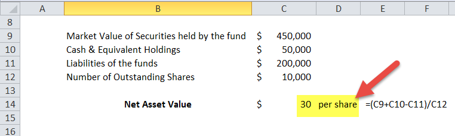

Investment finance has experienced profound transformations with the integration of technological advancements, revolutionizing traditional methodologies and enabling new practices. One key area where technology has made a significant impact is the calculation of Net Asset Value Per Share (NAVPS) and the execution of trades through algorithmic trading.

NAVPS serves as a critical metric in evaluating the value of mutual funds, exchange-traded funds (ETFs), and closed-end funds. It is computed by dividing a fund's net asset value (NAV) by the number of shares outstanding. This metric gives investors insight into the efficiency of a fund's asset management and its overall financial health. With the aid of enhanced computational tools, the calculation of NAVPS has become more accurate and accessible, allowing investors to make well-informed decisions.



Algorithmic trading, on the other hand, has redefined trading strategies by utilizing automated processes to execute trades based on pre-specified criteria, such as price, timing, and volume. Its roots lie in advanced mathematical and statistical models that analyze market conditions at remarkable speeds, thereby facilitating high-frequency trading. This has reduced transaction costs and errors, making trading operations more efficient. Institutional investors and hedge funds extensively employ algorithmic trading to optimize trade executions.

Together, NAVPS and algorithmic trading provide investors with powerful tools for optimizing their investment strategies. Understanding these concepts equips investors to take advantage of technological innovations in the financial sector, enhancing their ability to allocate assets efficiently and achieve superior investment outcomes. As technology continues to evolve, staying informed about these developments will be indispensable for maintaining a competitive edge in investment finance.

## Table of Contents

## Understanding NAVPS

Net Asset Value Per Share (NAVPS) stands as a critical indicator for evaluating the worth of investment vehicles such as mutual funds, exchange-traded funds (ETFs), and closed-end funds. The metric provides a transparent view of a fund’s value on a per-share basis, calculated through a straightforward division of the fund's net asset value (NAV) by the number of shares outstanding. Mathematically, this is expressed as:

$$
\text{NAVPS} = \frac{\text{Net Asset Value}}{\text{Shares Outstanding}}
$$

The net asset value is determined by subtracting the total liabilities of the fund from its total assets. The final result gives investors a snapshot of what each share of the fund represents in terms of underlying asset value. 

The NAVPS is not merely a valuation tool; it offers valuable insights into a fund's asset management efficiency. A consistently increasing NAVPS can signify effective management and growth in the underlying assets, whereas a declining NAVPS may prompt questions about the fund’s performance and strategic direction. In this way, NAVPS serves as an indirect indicator of financial health and management acumen.

For open-end mutual funds, the role of NAVPS is particularly pivotal. These funds trade at their net asset value, which is recalculated at the end of each trading day. Investors purchase and redeem shares directly from the fund manager at this calculated price. As a result, a precise understanding of NAVPS can greatly impact investment strategies by allowing investors to gauge whether a fund is priced fairly relative to its intrinsic asset value.

Furthermore, NAVPS assists in comparing different funds, enabling investors to evaluate potential investments based on their financial underpinnings rather than merely market trends or speculative pricing. This level of analysis can be instrumental in identifying undervalued or overvalued investment opportunities, thus optimizing portfolio performance.

In summary, NAVPS is a quintessential metric for investors seeking to make informed decisions about their investment portfolios in mutual funds, ETFs, and closed-end funds. Its significance extends beyond simple valuation, influencing investment decisions and strategic asset management.

## Algorithmic Trading: An Overview

Algorithmic trading involves the utilization of computer algorithms to conduct trading decisions and executions in financial markets. These algorithms are characterized by their ability to autonomously [carry](/wiki/carry-trading) out transactions based on pre-established criteria, such as price thresholds, timing, or complex mathematical models. By leveraging these automated processes, [algorithmic trading](/wiki/algorithmic-trading) aims to enhance the speed and efficiency with which trades are executed, often outperforming human capabilities in both aspects.

At the core of algorithmic trading lies the application of sophisticated mathematical and statistical models. These models analyze vast sets of historical and real-time data to identify patterns and forecast market movements. A common approach within these systems is the use of statistical [arbitrage](/wiki/arbitrage), where quantitative methods are employed to detect and capitalize on mispricings within correlated securities. The precision of these models is crucial, as they direct the algorithm to execute trades with minimal human intervention.

The advent of algorithmic trading has revolutionized trading operations across global financial markets. A significant impact of this transformation is the facilitation of high-frequency trading ([HFT](/wiki/high-frequency-trading-strategies)). HFT exploits the capabilities of advanced technology and high-speed connectivity to execute numerous trades in fractions of a second. This rapid trade execution capability drastically reduces transaction costs by optimizing the execution timing and minimizing the bid-ask spread.

Algorithmic trading is prominently utilized by institutional investors and hedge funds, who rely on its efficiency for trade execution across diverse portfolios. The size and complexity of these portfolios necessitate swift and accurate trading activities, which algorithms provide. Their ability to process large volumes of data instantaneously enables these institutions to maintain competitive edges in markets known for their dynamic and fast-changing environments.

Python, among other programming languages, is widely used for developing algorithmic trading strategies. Below is a simple example of using Python's libraries to initiate a basic trading algorithm:

```python
import pandas as pd
import numpy as np

# Load market data
data = pd.read_csv('market_data.csv')
prices = data['Close']

# Simple moving average strategy
short_window = 40
long_window = 100

# Compute moving averages
signals = pd.DataFrame(index=data.index)
signals['signal'] = 0.0
signals['short_mavg'] = prices.rolling(window=short_window, min_periods=1).mean()
signals['long_mavg'] = prices.rolling(window=long_window, min_periods=1).mean()

# Generate signals: 1 for buy, 0 for sell
signals['signal'][short_window:] = np.where(signals['short_mavg'][short_window:] > signals['long_mavg'][short_window:], 1.0, 0.0)
signals['positions'] = signals['signal'].diff()

print(signals)
```

This example demonstrates a moving average crossover strategy, a basic algorithmic trading strategy. It generates buy signals when the short-term moving average crosses above the long-term moving average.

In conclusion, algorithmic trading has become an essential component in the contemporary financial landscape, providing traders and institutions with tools to execute trades with unparalleled speed and accuracy. Its continuous evolution, driven by advancements in technology and quantitative analysis, ensures its pivotal role in shaping the future of financial markets.

## Comparing NAVPS and Market Price

Net Asset Value Per Share (NAVPS) and market price often diverge, especially in closed-end funds and exchange-traded funds (ETFs). This divergence arises from various factors, chiefly market demand and trading volumes. Understanding the distinction between NAVPS and market price is crucial for investors aiming to make informed decisions regarding asset allocation.

The NAVPS, a measure of a fund's value, is computed by dividing the fund's net assets by the number of outstanding shares:
$$
\text{NAVPS} = \frac{\text{Net Asset Value}}{\text{Number of Outstanding Shares}}
$$

The market price, on the other hand, is the price at which the fund shares are traded on the stock market. While the NAVPS reflects the intrinsic value of the fund, the market price is influenced by investor sentiment and external market conditions. This discrepancy is most evident in closed-end funds because they do not issue new shares or redeem existing ones based on market demand. Therefore, their prices are subject to supply and demand dynamics in the market.

For instance, a closed-end fund may trade at a premium if its market price exceeds its NAVPS, suggesting that investors are willing to pay more than the intrinsic value due to anticipated future gains or a highly sought-after fund management team. Conversely, a fund trading at a discount, where the market price is less than the NAVPS, might indicate market skepticism about the fund's future performance or a lack of investor interest.

ETFs typically strive to keep their market prices close to their NAVPS through a mechanism involving authorized participants who create and redeem [ETF](/wiki/etf-trading-strategies) shares to exploit price differences. However, trading volumes and [liquidity](/wiki/liquidity-risk-premium) can still cause temporary deviations, leading to opportunities for investors to capitalize on these spread differences.

For investors, recognizing the divergence between NAVPS and market price is essential. A comprehensive analysis of both values provides a more accurate picture of the fund's performance and potential investment opportunities. It allows investors to identify when a fund may be undervalued or overvalued, facilitating better-informed allocation decisions that align with their financial objectives and risk tolerance.

In conclusion, while NAVPS represents an essential valuation metric, the market price conveys the real-time sentiments of investors and market dynamics. Balancing these two values can lead to more strategic portfolio management and optimized investment outcomes.

## Benefits and Challenges of Algorithmic Trading

Algorithmic trading is a cornerstone of modern financial markets, marked by its ability to execute trades with remarkable speed, precision, and efficiency. This method leverages computational algorithms to make trading decisions, often executing thousands of trades in fractions of a second, a feat unattainable by human traders. The advantages are evident: reduced transaction costs, increased trading [volume](/wiki/volume-trading-strategy), and minimized human errors.

One of the primary benefits of algorithmic trading is speed. Given that algorithms can parse through vast datasets, identify trading opportunities, and execute trades in microseconds, they significantly outpace human traders. This rapid trading capability is particularly advantageous in markets where prices can change within moments, allowing traders to capitalize on even the smallest price discrepancies.

Precision is another critical advantage. Algorithms follow strict pre-defined criteria and are devoid of emotional biases that often impact human decisions. This ensures consistent execution of trade strategies, aligning with the trader’s objectives without deviation.

Efficiency in algorithmic trading is primarily observable through its ability to handle large volumes of trades seamlessly. Algorithms can be programmed to make complex calculations instantaneously, taking into account multiple market variables and complex factors that human traders might overlook. 

Yet, alongside these benefits, algorithmic trading presents notable challenges. System failures represent a significant risk, as unexpected glitches or bugs can lead to unintended trades or missed opportunities. For instance, a technical malfunction could lead to "flash crashes," where stock prices plummet and recover in a very short timeframe, potentially leading to significant market disruptions.

Furthermore, adhering to regulations is crucial and can be challenging, given the rapid pace of technological advancements and evolving regulatory frameworks. Traders using algorithms must ensure that their strategies comply with existing regulations, a task that requires constant updates and monitoring of both technological implementations and regulatory landscapes.

Market [volatility](/wiki/volatility-trading-strategies) also poses a challenge. While algorithmic trading can exploit market volatility for potential gains, unexpected or extreme market conditions can lead to substantial losses. Volatile conditions may cause algorithms to execute trades that are profitable under normal circumstances but detrimental when markets behave unpredictably.

Understanding these trade-offs is essential for traders and firms that depend on algorithmic trading strategies. While the benefits of speed, precision, and efficiency can substantially improve trade outcomes, the risks associated with system failures, regulatory compliance, and market volatility must be carefully managed. As algorithmic trading continues to evolve, staying informed and adaptable is crucial for capitalizing on its advantages while mitigating its inherent risks.

## Implications of NAVPS in Investment Strategies

Net Asset Value Per Share (NAVPS) plays a crucial role in evaluating the intrinsic value of investment funds, serving as a barometer for portfolio valuation. NAVPS is calculated by dividing the net asset value (NAV) of a fund by the total number of shares outstanding. This measurement essentially offers a snapshot of the per-share worth of all assets within the fund, accounting for liabilities. This valuation metric is foundational in identifying both undervalued and overvalued funds, aiding investors in making informed decisions about their portfolios.

The effectiveness of NAVPS as an analytical tool is particularly pronounced in open-end mutual funds, where shares are bought and sold at the NAV. Here, NAVPS allows investors to ascertain the fund’s operational efficiency and financial health. By comparing the NAVPS with the fund’s market price, investors can identify discrepancies, leading to potential investment opportunities. An NAVPS lower than the market price might suggest an overvalued fund, whereas a higher NAVPS might indicate undervaluation, representing a prospective avenue for investment.

Incorporating NAVPS analysis into portfolio management can significantly influence long-term investment growth. By evaluating NAVPS regularly, investors can rebalance their asset allocations, mitigate risk, and optimize returns. For instance, a consistent decline in NAVPS could signal potential issues in a fund’s investment strategy or market conditions necessitating prudent adjustments in the portfolio. Conversely, a steady increase in NAVPS might affirm the current investment strategy’s effectiveness, promoting confidence in maintaining or increasing holdings.

The strategic integration of NAVPS data allows for enhanced asset management and informed decision-making. Fund managers and individual investors alike can leverage NAVPS to fine-tune their strategies, ensuring alignment with financial goals and market dynamics. As fluctuations in NAVPS can reflect broader economic trends and internal fund performance, monitoring this metric becomes instrumental in safeguarding and growing investments over time.

Thus, NAVPS is not just a metric; it is an integral component of comprehensive investment strategies, enabling investors to unlock value and achieve sustainable growth.

## The Future of Investment Finance

Technology continues to significantly influence investment finance, introducing advanced methodologies and elevating traditional investment practices. One area undergoing transformation is the calculation of Net Asset Value Per Share (NAVPS). Innovations in computational finance, such as enhanced real-time data analytics and blockchain technology, are promising to revolutionize NAVPS assessments. Real-time data analytics enable fund managers to process vast datasets instantaneously, providing more accurate and timely NAVPS values, which align closely with market realities. Furthermore, blockchain offers a decentralized, transparent framework that ensures data integrity and enhances investor confidence.

Simultaneously, algorithmic trading is evolving rapidly. Algorithmic trading encompasses executing trades through automated systems to capitalize on market efficiencies. These systems have become increasingly sophisticated, employing [artificial intelligence](/wiki/ai-artificial-intelligence) and [machine learning](/wiki/machine-learning) to predict market trends and execute trades at optimal moments. This evolution in algorithmic trading facilitates swift decision-making, enhances liquidity, and minimizes human error in trading. Algorithms can analyze patterns and execute orders in milliseconds, a feat unattainable by human traders, thus reshaping trading dynamics across global markets.

Investors and firms must adapt to these technological advancements to maintain competitiveness and maximize portfolio returns. This adaptation involves integrating advanced data analytics tools and trading platforms to optimize strategy and execution. Moreover, firms need to focus on continuously upgrading their technological infrastructure and investing in talent capable of leveraging these technologies effectively.

As investment finance ventures into a technology-driven future, the ability to harness these innovations will be pivotal. Investors and institutions that proactively embrace these changes are likely to see enhanced efficiency and superior performance, setting them apart in an increasingly competitive landscape. The continuous evolution of technology in investment finance underscores the importance of remaining informed and adaptive, a requisite for success in this dynamic environment.

## Conclusion

Net Asset Value Per Share (NAVPS) and algorithmic trading are essential elements that significantly shape the landscape of contemporary investment finance. Their comprehensive understanding provides investors with enhanced capabilities to optimize their financial strategies. NAVPS offers a clear quantification of a fund’s market value on a per-share basis, enabling investors to assess the intrinsic value of mutual funds, ETFs, and closed-end funds. This metric is crucial for identifying potential undervaluation or overvaluation in investment portfolios, directly influencing investment decisions and strategies.

On the other hand, algorithmic trading leverages technology to automate transaction processes, resulting in increased speed, precision, and a reduction in transaction costs. The use of sophisticated algorithms allows for executing trades under predefined conditions, which is especially valuable in high-frequency trading environments. However, this method also requires a nuanced understanding of technology, regulatory frameworks, and market dynamics to manage inherent risks effectively.

As technology continues to evolve, these investment tools will undoubtedly undergo further transformations. The ongoing development in algorithmic models and data analytics will likely continue to refine how NAVPS is calculated and interpreted. Consequently, investment organizations and individual investors must remain vigilant in adopting and adapting to these advancements. Keeping abreast of technological changes is critical to leveraging NAVPS and algorithmic trading effectively, thereby yielding better investment outcomes.

Continued education and adaptation to technological progress will be imperative for stakeholders who wish to maintain a competitive edge in the rapidly changing financial markets. Integrating new technological advancements into investment strategies will be a key determinant of success and sustainability in future financial ventures.

## References & Further Reading

[1]: ["Advances in Financial Machine Learning"](https://www.amazon.com/Advances-Financial-Machine-Learning-Marcos/dp/1119482089) by Marcos Lopez de Prado

[2]: ["Machine Learning for Algorithmic Trading"](https://www.amazon.com/Machine-Learning-Algorithmic-Trading-alternative/dp/1839217715) by Stefan Jansen

[3]: Bergstra, J., Bardenet, R., Bengio, Y., & Kégl, B. (2011). ["Algorithms for Hyper-Parameter Optimization."](https://proceedings.neurips.cc/paper/2011/file/86e8f7ab32cfd12577bc2619bc635690-Paper.pdf) Advances in Neural Information Processing Systems 24.

[4]: Domowitz, I., & Yegerman, H. (2005). ["The Cost of Algorithmic Trading: A First Look at Comparative Performance."](https://www.pm-research.com/content/iijtrade/1/1/33.full.pdf) Journal of Trading, 1(1), 53-62.

[5]: Hasbrouck, J., & Saar, G. (2013). ["Low-latency trading."](https://www.sciencedirect.com/science/article/abs/pii/S1386418113000165) Journal of Financial Markets, 16(4), 646-679.

[6]: ["Quantitative Trading: How to Build Your Own Algorithmic Trading Business"](https://books.google.com/books/about/Quantitative_Trading.html?id=j70yEAAAQBAJ) by Ernest P. Chan

[7]: Chaboud, A. P., Chiquoine, B., Hjalmarsson, E., & Vega, C. (2009). ["Rise of the Machines: Algorithmic Trading in the Foreign Exchange Market."](https://www.jstor.org/stable/43612951) Finance and Economics Discussion Series, Divisions of Research & Statistics and Monetary Affairs, Federal Reserve Board.