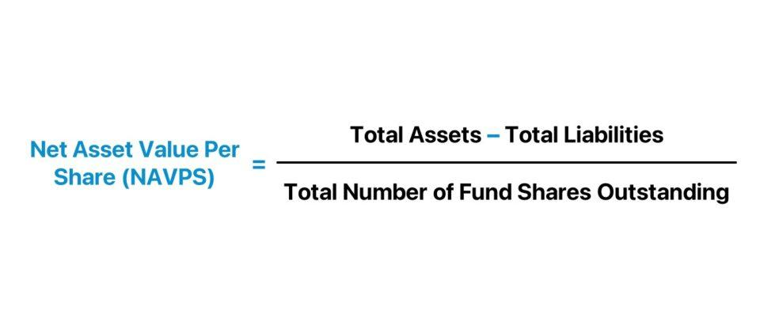

## Table of Contents

## What is Net Asset Value Per Share (NAVPS)?

Net Asset Value Per Share (NAVPS) is a way to figure out how much each share of a mutual fund or an investment company is worth. It's calculated by taking the total value of all the assets the fund owns, subtracting any debts or liabilities, and then dividing that number by the total number of shares that are out there. This gives investors a clear idea of what their investment is worth at any given time.

Think of NAVPS like the price tag on a single piece of a big pie. If the pie grows bigger because the investments do well, or if it shrinks because they don't, the price tag (NAVPS) changes to show that. It's a useful tool for investors who want to keep track of their investments and see if they're doing well or not.

## How is NAVPS calculated?

To find the Net Asset Value Per Share (NAVPS), you start by adding up everything the fund owns, like stocks, bonds, and cash. This total is called the fund's assets. Then, you subtract any money the fund owes, like loans or fees. This gives you the net asset value (NAV), which is what's left after paying off all the debts.

Next, you take this net asset value and divide it by the total number of shares that people own in the fund. This division gives you the NAVPS. It tells you how much each share is worth at that moment. If the fund's investments go up in value, the NAVPS goes up too. If they go down, so does the NAVPS. It's a simple way to see how much your investment is worth.

## Why is NAVPS important for investors?

NAVPS is important for investors because it tells them how much their investment in a mutual fund or investment company is worth at any given time. By looking at the NAVPS, investors can see if their investment is growing or shrinking. This helps them make smart choices about whether to keep their money in the fund, take it out, or maybe even put more in. It's like checking the price tag on something you own to see if it's worth more or less than when you bought it.

Also, NAVPS helps investors compare different funds. If two funds have similar goals but different NAVPS, an investor can use this information to decide which one might be a better choice. It's a clear and simple way to understand the value of their investment without having to dig into all the details of what the fund owns. By keeping an eye on the NAVPS, investors can stay informed and make better decisions about their money.

## Can you explain the difference between NAVPS and stock price?

NAVPS, or Net Asset Value Per Share, is the value of one share in a mutual fund or investment company. It's calculated by taking the total value of all the things the fund owns, subtracting any debts, and then dividing that by the total number of shares. This gives investors a clear idea of how much their share in the fund is worth at any time. It's like a price tag that changes every day based on how well the fund's investments are doing.

On the other hand, a stock price is the price at which a single share of a company's stock is bought or sold on the stock market. This price can change throughout the day as people buy and sell the stock. It's influenced by many things like how well the company is doing, news about the company, and what investors think about its future. Unlike NAVPS, which is calculated once a day after the market closes, stock prices can be seen in real-time during trading hours.

Both NAVPS and stock prices tell investors how much their investments are worth, but they work in different ways. NAVPS gives a snapshot of the value of a mutual fund's shares, while stock prices show the current market value of a company's shares. Understanding the difference can help investors make better choices about where to put their money.

## How often is NAVPS typically calculated and reported?

NAVPS is usually calculated and reported once every day. This happens after the stock market closes, so it gives investors a clear picture of what their mutual fund shares are worth at the end of each trading day. It's like checking the price tag on your investment to see if it went up or down.

The reason NAVPS is calculated daily is to keep investors informed about the value of their investment. If you own shares in a mutual fund, you can look at the NAVPS to see how your investment is doing. It's a simple and clear way to stay updated, and it helps you make decisions about whether to keep your money in the fund or take it out.

## What factors can affect the NAVPS of a mutual fund or ETF?

The NAVPS of a mutual fund or [ETF](/wiki/etf-trading-strategies) can change because of many things. One big reason is the performance of the investments that the fund holds. If the stocks, bonds, or other assets in the fund go up in value, the NAVPS will go up too. On the other hand, if those investments lose value, the NAVPS will go down. It's like if you own a bunch of toys and their value changes, the price tag on your collection changes too.

Another [factor](/wiki/factor-investing) that can affect NAVPS is the flow of money into and out of the fund. When new investors buy shares, the fund might need to buy more investments, which can change the NAVPS. If a lot of people want to take their money out, the fund might have to sell some of its investments, which can also change the NAVPS. It's like adding or removing toys from your collection, which changes what it's worth.

Lastly, fees and expenses can also impact the NAVPS. Mutual funds and ETFs have costs like management fees and operating expenses, which are taken out of the fund's assets. When these costs are subtracted, it can make the NAVPS go down a bit. It's like if you had to pay a small fee to keep your toy collection, which would make the total value of your toys a little less.

## How does NAVPS relate to the performance of a fund?

NAVPS, or Net Asset Value Per Share, shows how much each share of a mutual fund or ETF is worth. It's like a daily report card for the fund. If the NAVPS goes up, it means the fund's investments are doing well, and the value of your share in the fund is higher. If the NAVPS goes down, it means the investments aren't doing as well, and your share is worth less. By watching the NAVPS, you can see if your fund is growing or shrinking over time.

The performance of a fund's investments directly affects the NAVPS. If the stocks, bonds, or other assets in the fund go up in value, the NAVPS will increase too. But if those investments lose value, the NAVPS will drop. Also, when people put money into the fund or take it out, it can change the NAVPS because the fund might need to buy or sell investments. And don't forget about fees and expenses; they're taken out of the fund's assets, which can make the NAVPS a bit lower. So, NAVPS is a simple way to keep track of how well your fund is doing.

## What are the implications of a high or low NAVPS for investment decisions?

A high NAVPS can mean that the fund's investments are doing well. It's like the price tag on your investment going up, which is good news. If you see a high NAVPS, it might make you feel confident about keeping your money in the fund or even putting more in. But remember, a high NAVPS doesn't always mean the fund is better than others. You should look at how much the NAVPS has grown over time and compare it to other funds to make a smart choice.

On the other hand, a low NAVPS might show that the fund's investments aren't doing so well. It's like the price tag on your investment going down, which can be worrying. If you see a low NAVPS, you might think about taking your money out of the fund and putting it somewhere else. But a low NAVPS isn't always bad news. Sometimes, a fund might start with a low NAVPS and grow a lot over time. So, it's important to look at the bigger picture and not just the current NAVPS when making investment decisions.

## How can investors use NAVPS to compare different funds?

Investors can use NAVPS to compare different funds by looking at how much the NAVPS has changed over time. If one fund's NAVPS has grown a lot more than another fund's, it might be a better choice. But it's not just about the current NAVPS; it's about how much it has gone up or down. For example, if Fund A started with a NAVPS of $10 and now it's $15, and Fund B started at $20 and is now $22, Fund A might be the better pick because it grew more.

Another thing to think about is the fees and expenses of the funds. Some funds might have a higher NAVPS but also higher fees, which can eat into your returns. So, it's important to compare the NAVPS growth after taking out the fees. If Fund C has a NAVPS of $30 but high fees, and Fund D has a NAVPS of $25 with low fees, Fund D might be a better choice if its NAVPS growth is good after fees. By looking at these things, investors can make smarter choices about where to put their money.

## What are the limitations of using NAVPS as a sole metric for investment analysis?

Using NAVPS as the only way to look at an investment can be tricky because it doesn't tell the whole story. NAVPS is just a snapshot of what each share in a fund is worth at the end of the day. It doesn't show you why the value went up or down, like if the fund's investments did well or if the market had a good day. Also, NAVPS doesn't take into account the fees and expenses that the fund charges, which can make a big difference in what you actually earn from your investment.

Another problem with relying only on NAVPS is that it doesn't help you compare funds that have different goals or strategies. Two funds might have the same NAVPS, but one might be trying to grow quickly while the other is focused on keeping your money safe. Without looking at other things like the fund's past performance, how much risk it takes, and what it's trying to achieve, you might pick a fund that doesn't fit with what you want from your investment. So, while NAVPS is a useful number, it's best to use it along with other information to make smart investment choices.

## How does the calculation of NAVPS differ for closed-end funds versus open-end funds?

The way NAVPS is calculated is pretty much the same for both closed-end funds and open-end funds. For both types of funds, you start by adding up everything the fund owns, like stocks and bonds, and then you subtract any money the fund owes, like loans or fees. After that, you divide what's left, which is called the net asset value (NAV), by the total number of shares that people own in the fund. This gives you the NAVPS, which tells you how much each share is worth.

The big difference between closed-end funds and open-end funds is how their shares work. In an open-end fund, the number of shares can go up or down every day because people can buy new shares or sell their old ones. This means the NAVPS is the price you pay to buy or sell shares. But in a closed-end fund, the number of shares stays the same after the fund starts. People can still buy and sell shares, but they do it on the stock market, and the price can be different from the NAVPS. So, while the calculation of NAVPS is the same, how it's used can be different for these two types of funds.

## Can you discuss any advanced strategies that use NAVPS for portfolio management?

One advanced strategy that uses NAVPS for portfolio management is called dollar-cost averaging. This means you put a fixed amount of money into a fund at regular times, no matter what the NAVPS is. Over time, this can help you buy more shares when the NAVPS is low and fewer shares when it's high, which can lower the average price you pay for each share. By keeping an eye on the NAVPS, you can see if it's a good time to put more money in or if you should wait a bit.

Another strategy is to use NAVPS to rebalance your portfolio. This means you check the NAVPS of your funds regularly to see how they're doing. If one fund's NAVPS has grown a lot more than the others, you might have too much money in that one fund. To fix this, you can sell some shares of the fund with the high NAVPS and use the money to buy shares in other funds that haven't done as well. This helps keep your investments spread out and can lower your risk. By using NAVPS to guide your rebalancing, you can make sure your portfolio stays balanced and works towards your investment goals.

## What is NAVPS and how can it be understood?

Net Asset Value Per Share (NAVPS) stands as a critical indicator for evaluating the worth of investment vehicles such as mutual funds, exchange-traded funds (ETFs), and closed-end funds. The metric provides a transparent view of a fund’s value on a per-share basis, calculated through a straightforward division of the fund's net asset value (NAV) by the number of shares outstanding. Mathematically, this is expressed as:

$$
\text{NAVPS} = \frac{\text{Net Asset Value}}{\text{Shares Outstanding}}
$$

The net asset value is determined by subtracting the total liabilities of the fund from its total assets. The final result gives investors a snapshot of what each share of the fund represents in terms of underlying asset value. 

The NAVPS is not merely a valuation tool; it offers valuable insights into a fund's asset management efficiency. A consistently increasing NAVPS can signify effective management and growth in the underlying assets, whereas a declining NAVPS may prompt questions about the fund’s performance and strategic direction. In this way, NAVPS serves as an indirect indicator of financial health and management acumen.

For open-end mutual funds, the role of NAVPS is particularly pivotal. These funds trade at their net asset value, which is recalculated at the end of each trading day. Investors purchase and redeem shares directly from the fund manager at this calculated price. As a result, a precise understanding of NAVPS can greatly impact investment strategies by allowing investors to gauge whether a fund is priced fairly relative to its intrinsic asset value.

Furthermore, NAVPS assists in comparing different funds, enabling investors to evaluate potential investments based on their financial underpinnings rather than merely market trends or speculative pricing. This level of analysis can be instrumental in identifying undervalued or overvalued investment opportunities, thus optimizing portfolio performance.

In summary, NAVPS is a quintessential metric for investors seeking to make informed decisions about their investment portfolios in mutual funds, ETFs, and closed-end funds. Its significance extends beyond simple valuation, influencing investment decisions and strategic asset management.

## References & Further Reading

[1]: ["Advances in Financial Machine Learning"](https://www.amazon.com/Advances-Financial-Machine-Learning-Marcos/dp/1119482089) by Marcos Lopez de Prado

[2]: ["Machine Learning for Algorithmic Trading"](https://www.amazon.com/Machine-Learning-Algorithmic-Trading-alternative/dp/1839217715) by Stefan Jansen

[3]: Bergstra, J., Bardenet, R., Bengio, Y., & Kégl, B. (2011). ["Algorithms for Hyper-Parameter Optimization."](https://proceedings.neurips.cc/paper/2011/file/86e8f7ab32cfd12577bc2619bc635690-Paper.pdf) Advances in Neural Information Processing Systems 24.

[4]: Domowitz, I., & Yegerman, H. (2005). ["The Cost of Algorithmic Trading: A First Look at Comparative Performance."](https://www.pm-research.com/content/iijtrade/1/1/33.full.pdf) Journal of Trading, 1(1), 53-62.

[5]: Hasbrouck, J., & Saar, G. (2013). ["Low-latency trading."](https://www.sciencedirect.com/science/article/abs/pii/S1386418113000165) Journal of Financial Markets, 16(4), 646-679.

[6]: ["Quantitative Trading: How to Build Your Own Algorithmic Trading Business"](https://books.google.com/books/about/Quantitative_Trading.html?id=j70yEAAAQBAJ) by Ernest P. Chan

[7]: Chaboud, A. P., Chiquoine, B., Hjalmarsson, E., & Vega, C. (2009). ["Rise of the Machines: Algorithmic Trading in the Foreign Exchange Market."](https://www.jstor.org/stable/43612951) Finance and Economics Discussion Series, Divisions of Research & Statistics and Monetary Affairs, Federal Reserve Board.