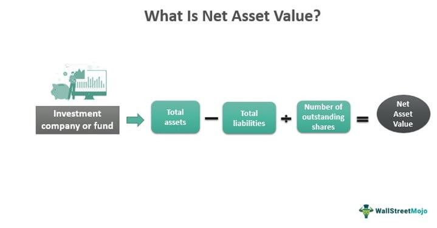

In the rapidly evolving world of finance, investors are continually seeking methods to gauge the value of their investments effectively. Among various tools and metrics available, the Net Asset Value (NAV) holds a pivotal place in assessing the worth of investment funds such as mutual funds and exchange-traded funds (ETFs). The accuracy and reliability of NAV as a metric offer investors a comprehensive understanding of a fund's financial health and performance. 

Investment valuation is a multi-faceted process involving various financial measures, with NAV being one of the key metrics. Calculating NAV involves determining the total market value of a fund's assets and subtracting its total liabilities. This calculation provides the NAV, which when divided by the number of outstanding shares, gives the NAV per share—a crucial figure for investors assessing fund value on a per-share basis. 



Algorithmic trading, a rapidly growing field within finance, leverages these valuation metrics to optimize trading strategies. By integrating real-time NAV data, algorithms can improve decision-making processes, identify arbitrage opportunities, and ensure efficient portfolio management. This article explores the various facets of investment valuation and highlights the role of NAV. Then, it investigates into the intricacies of its calculation and elucidates how algorithmic trading adopts NAV to enhance trading strategies and performance.

## Table of Contents

## Understanding Net Asset Value (NAV)

Net Asset Value (NAV) is a critical metric that assesses the overall value of an investment fund. It is derived by subtracting the fund’s liabilities from its total assets. Mathematically, the formula for calculating NAV is:

$$
\text{NAV} = \text{Total Assets} - \text{Total Liabilities}
$$

For individual investors, NAV per share is a more relevant figure as it represents the value on a per-share basis. This is determined by dividing the total NAV by the number of outstanding shares:

$$
\text{NAV per Share} = \frac{\text{Total NAV}}{\text{Number of Outstanding Shares}}
$$

Mutual funds and exchange-traded funds (ETFs) commonly use NAV as a pricing resource, providing investors with a daily valuation snapshot of the fund's worth. This daily calculation helps investors monitor the performance and value of their investments with transparency and precision. Essential for both buying and selling decisions, NAV assists in tracking the changes in fund value over time, reflecting the effects of market activity and management decisions on the fund's holdings.

## The Importance of NAV in Investment Valuation

Net Asset Value (NAV) is a crucial metric that empowers investors by providing transparency into the overall value of a fund's portfolio. This transparency is achieved by NAV's ability to offer insight into the detailed valuation of a fund's holdings, allowing investors to make well-informed decisions regarding their investments. NAV reflects the intrinsic worth of a fund by accounting for its total assets minus its liabilities, thereby giving investors an accurate picture of the fund's current financial standing.

Additionally, NAV serves as a benchmark for evaluating the performance of funds over time. By comparing the NAV of a fund at different points, investors can effectively track changes in the fund's value and assess the returns generated. This comparative analysis is useful for understanding growth trends and underlying asset performance, thus helping investors to evaluate whether the fund has met their investment objectives or if adjustments are necessary.

Furthermore, NAV brings clarity to the cost structure and efficiency of a fund by encapsulating the impact of management fees and associated expenses. As NAV is computed after deducting all relevant expenses, it reflects the net earnings attributable to investors. By examining fluctuations in NAV, investors can infer how expenses affect overall fund performance and evaluate whether the management practices are aligned with their financial goals. This aspect is crucial for ensuring that the costs remain justified in light of the returns delivered.

In conclusion, NAV's role in investment valuation is multifaceted, offering a comprehensive view of fund value, performance benchmarking, and cost analysis, all essential for prudent investment decision-making.

## Calculating NAV: A Step-by-Step Guide

Calculating the Net Asset Value (NAV) of a fund is an essential process for understanding its current worth. This step-by-step guide outlines how to compute the NAV accurately:

**Step 1: Determine Total Assets**  
To calculate the total assets of a fund, you must aggregate the market values of all securities within the portfolio, including stocks, bonds, and other financial instruments. Additionally, include cash holdings and any accrued income, such as dividends expected but not yet received. For example, if a fund holds stock worth $500,000, bonds valued at $200,000, cash of $50,000, and accrued income of $10,000, the total assets are computed as follows:

$$
\text{Total Assets} = \$500,000 + \$200,000 + \$50,000 + \$10,000 = \$760,000
$$

**Step 2: Calculate Total Liabilities**  
Total liabilities encompass all obligations or debts the fund must settle. This includes management fees, operational expenses, and any other payable amounts. Assume the payable fees are $15,000, operational expenses are $5,000, and other obligations total $10,000. The calculation is:

$$
\text{Total Liabilities} = \$15,000 + \$5,000 + \$10,000 = \$30,000
$$

**Step 3: Compute NAV**  
To obtain the NAV, deduct the total liabilities from the total assets to determine the net assets. Then, divide the net assets by the number of outstanding shares to get the NAV per share. Let's assume the fund has 1,000 shares outstanding:

1. Calculate Net Assets:

$$
\text{Net Assets} = \text{Total Assets} - \text{Total Liabilities} = \$760,000 - \$30,000 = \$730,000
$$

2. Compute NAV per Share:

$$
\text{NAV per Share} = \frac{\text{Net Assets}}{\text{Shares Outstanding}} = \frac{\$730,000}{1,000} = \$730
$$

This step-by-step calculation provides a clear understanding of how the NAV is determined, offering investors insight into the fund's valuation and facilitating informed financial decision-making.

## NAV in Algorithmic Trading

Algorithmic trading, which employs complex mathematical models and algorithms to execute trades, utilizes Net Asset Value (NAV) as a critical component for real-time decision-making. NAV, a measure determining a fund's per-share value, provides a reference point against which the market price of exchange-traded funds (ETFs) is compared.

One significant application of NAV in [algorithmic trading](/wiki/algorithmic-trading) is the identification of [arbitrage](/wiki/arbitrage) opportunities. These opportunities arise when there are discrepancies between an [ETF](/wiki/etf-trading-strategies)'s market price and its NAV. For instance, if an ETF is trading below its NAV, algorithmic traders might buy the ETF and simultaneously sell the equivalent basket of underlying securities to capitalize on the difference. Conversely, if the ETF is trading above its NAV, traders might sell the ETF and buy the underlying securities, locking in profits as the prices converge. This strategy hinges on the efficient execution of trades, supported by high-frequency trading algorithms.

Furthermore, algorithmically calculated NAV data facilitates efficient portfolio management and risk assessment. By providing a precise and instantaneous snapshot of fund values, algorithms can dynamically adjust portfolios in response to market conditions. This real-time assessment enables the implementation of risk management strategies, such as rebalancing portfolios or triggering stop-loss orders, thereby optimizing returns while mitigating potential losses.

Python, a prominent language in algorithmic trading, can be employed to calculate and act on NAV-related data. An example code snippet for calculating NAV is as follows:

```python
def calculate_nav(total_assets, total_liabilities, outstanding_shares):
    net_assets = total_assets - total_liabilities
    nav_per_share = net_assets / outstanding_shares
    return nav_per_share

# Example values
total_assets = 1000000  # Total market value of securities and cash
total_liabilities = 50000  # Total liabilities
outstanding_shares = 10000  # Total shares outstanding

nav = calculate_nav(total_assets, total_liabilities, outstanding_shares)
print(f"NAV per share: {nav}")
```

Incorporating NAV into algorithmic trading offers a systematic approach to identifying market inefficiencies and enhancing trading strategies, significantly benefiting traders seeking to maximize profits through data-driven methodologies.

## Challenges in NAV Analysis and Calculation

Accurate valuation of assets within the calculation of Net Asset Value (NAV) presents several challenges, particularly in accounting for illiquid or volatile market securities. Illiquid assets, such as real estate or infrequently traded stocks, lack frequent market pricing, making it difficult to ascertain their current value. This requires reliance on estimated valuations, which can introduce bias or inaccuracy in the NAV calculations. Moreover, market securities that are highly volatile can fluctuate widely between valuation points, necessitating sophisticated prediction and smoothing techniques to ensure NAV reflects true market conditions.

Continuous and rapid calculations of NAV are essential, particularly for exchange-traded funds (ETFs) that operate in real-time trading environments. Such calculations demand advanced technological solutions, including automated systems and algorithms capable of handling vast datasets efficiently. Utilizing high-frequency trading systems and financial software, these calculations ensure that NAV remains up-to-date with the latest market movements. Python, with libraries like NumPy and Pandas, is often used for these computational tasks. A basic example of NAV calculation using Python could look like this:

```python
import pandas as pd

# Assume we have a DataFrame with asset prices and quantities
data = {'Asset_Price': [100, 200, 50], 'Quantity': [10, 5, 20]}
df = pd.DataFrame(data)

# Calculate total assets
total_assets = (df['Asset_Price'] * df['Quantity']).sum()

# Assume total liabilities are from another source
total_liabilities = 500

# Calculate NAV
nav = total_assets - total_liabilities
nav_per_share = nav / 100  # Assume 100 outstanding shares

print(f"Total NAV: {nav}, NAV per Share: {nav_per_share}")
```

Fluctuations in currency exchange rates add another layer of complexity when valuing international assets. Exchange rates can alter the value of foreign investments, impacting the overall NAV. Funds with significant cross-border holdings must adopt dynamic currency conversion strategies, often employing hedging techniques to manage this risk. The use of real-time foreign exchange data and integration with NAV calculations is crucial to mitigate the effects of currency [volatility](/wiki/volatility-trading-strategies).

These challenges necessitate a robust framework within asset management firms to ensure NAV remains an accurate and reliable measure of fund value. Furthermore, as financial markets continue to evolve in complexity and speed, the methodologies used in NAV calculations must also adapt, balancing accuracy with the need for rapid computation.

## Real-World Applications and Examples

Fund management companies such as Vanguard and BlackRock are prominent examples of organizations that effectively use Net Asset Value (NAV) for transparent and efficient fund management. NAV is a key metric in their mutual funds and ETFs for accurate pricing and reporting.

Vanguard, one of the largest investment management firms globally, uses NAV calculations extensively in its vast array of investment products. The company offers both mutual funds and ETFs, each relying on precise NAV evaluations to determine their daily share prices. For example, Vanguard’s Total Stock Market Index Fund, which aims to provide investment results corresponding to the performance of the CRSP US Total Market Index, calculates NAV daily. This process involves assessing the market value of the fund's holdings, subtracting liabilities, and dividing by the number of outstanding fund shares, thus offering investors a transparent view of their investments' worth and performance.

Similarly, BlackRock, which manages a diverse range of investment funds, also bases its operations on NAV computations. With its iShares ETF product line, BlackRock provides investors an efficient way to access the market with prices closely aligned to the market value of their underlying assets. BlackRock employs algorithmic trading strategies that utilize NAV to identify arbitrage opportunities where discrepancies between market prices and NAV occur. This practice helps maintain pricing efficiency and [liquidity](/wiki/liquidity-risk-premium) in the market.

Both companies demonstrate NAV's utility in traditional trading, where investors buy or sell mutual fund shares directly with the fund at end-of-day NAV. In algorithmic trading, accurate and continuous NAV assessments enable automated processes that ensure that fund shares are fairly priced relative to the securities they hold. The adoption of sophisticated technology aids these firms in maintaining rapid and reliable NAV calculations, thus supporting an ever-evolving investment landscape.

These practical applications underscore NAV's importance, illustrating how Vanguard and BlackRock maintain high standards of integrity and performance transparency, fostering investor confidence through precise fund valuation.

## Conclusion

Net Asset Value (NAV) is a crucial metric in the sphere of investment valuation, providing a clear and quantifiable measure of a fund's performance and pricing strategy. By serving as a daily snapshot of a fund’s worth, NAV offers a transparent view of the value of a fund's holdings, making it an invaluable tool for investors. NAV contributes significantly to informed decision-making by reflecting the impact of factors such as management fees and market fluctuations.

Modern traders, especially those utilizing algorithmic trading strategies, rely heavily on NAV to optimize their trading decisions and manage portfolios effectively. The ability to accurately calculate and interpret NAV allows algorithmic traders to identify arbitrage opportunities and align their investment strategies with real-time market data. This aids in executing trades that are both timely and informed, which can lead to enhanced portfolio performance.

Moreover, a firm grasp of NAV’s calculations and implications enhances an investor's ability to make strategic decisions in both traditional and automated trading settings. By considering NAV, investors can better evaluate fund performance, compare it against benchmarks, and assess the overall cost-effectiveness of their investments. Understanding these dynamics ultimately equips investors with a more comprehensive view of market conditions and potential investment outcomes, thus improving their ability to navigate the financial landscape effectively.

## References & Further Reading

[1]: ["Exchange-Traded Funds and the New Dynamics of Investing"](https://academic.oup.com/book/3366) by Ananth N. Madhavan

[2]: ["The Economics of Algorithmic Trading"](https://www.semanticscholar.org/paper/The-Economics-of-Algorithmic-Trading-Riordan/33693384fd0d3a3e8e341f50cea2d25fde20fd6a) by Terrence Hendershott, Charles M. Jones, and Albert J. Menkveld (Journal of Economic Surveys, Vol 35, Issue 5, 2021)

[3]: ["Introduction to Algorithmic Trading Strategies"](https://onlinelibrary.wiley.com/doi/epdf/10.1002/9781119206033.fmatter) by Stefan Jansen (ResearchGate)

[4]: ["Investment Valuation: Tools and Techniques for Determining the Value of Any Asset"](https://archive.org/details/investmentvaluat0000damo_n6k9) by Aswath Damodaran

[5]: ["Evaluation of Mutual Funds Performance and Analysis of the Monthly Net Asset Value"](https://www.tandfonline.com/doi/full/10.1080/0015198X.2020.1738126) by Dimitrios I. Maditinos, Željko Šević, and Nikolaos Theriou (Scientific journal reference)