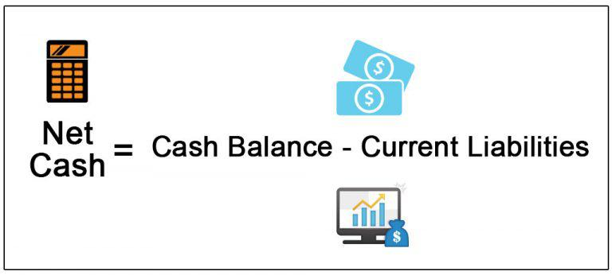

In today's fast-paced financial markets, comprehending cash flow and automated trading strategies has become integral to successful investing. The evolution of algorithmic trading has transformed the financial landscape, enabling traders to execute strategies with precision and speed. These strategies heavily rely on robust financial calculations, particularly those pertaining to net cash and cash flow. This article examines the relationship between financial calculations, net cash, cash flow, and their impact on algorithmic trading. By leveraging these financial metrics, traders can create automated strategies that adapt to real-time market changes, optimizing their investment decisions.

Understanding net cash and cash flow calculations is crucial for evaluating the liquidity and viability of trading strategies. Net cash, calculated by subtracting total liabilities from total cash, provides a clear picture of a firm's liquidity status. Meanwhile, cash flow calculations illustrate the movement of cash into and out of trading portfolios, offering vital insights into financial resource management. These calculations serve as strategic tools that inform algorithmic trading decisions, enhancing their effectiveness and resilience in dynamic market environments.



This article aims to equip readers with a thorough understanding of these concepts, empowering them to make informed decisions and ensuring the viability of their investments in algorithmic settings. Through precise integration of financial metrics into trading algorithms, traders can significantly elevate their decision-making processes and financial performance, achieving better investment outcomes.

## Table of Contents

## Understanding Financial Calculations in Trading

Understanding financial calculations is fundamental to developing effective trading strategies, especially within algorithmic trading environments. These calculations provide the quantitative metrics necessary to assess the liquidity and viability of trading strategies.

**Cash Flow and Net Cash Figures**

Cash flow and net cash figures are essential components that traders analyze to make informed decisions. Cash flow refers to the movement of money into and out of a trading portfolio, providing insight into the portfolio's liquidity and operational viability. It is typically categorized into three types: operating, investing, and financing cash flows. By examining these components, traders can gain a comprehensive understanding of how efficiently their trading portfolio is generating and utilizing cash.

Net cash, on the other hand, is a straightforward measure of [liquidity](/wiki/liquidity-risk-premium). It is calculated by subtracting total liabilities from total cash:

$$
\text{Net Cash} = \text{Total Cash} - \text{Total Liabilities}
$$

This calculation provides an immediate overview of whether a portfolio or a firm has a surplus of cash after accounting for all obligations, which is critical for assessing financial health. A positive net cash position indicates a cushion of liquidity, enhancing the ability to seize trading opportunities or absorb potential losses.

**Role in Trading Strategies**

In [algorithmic trading](/wiki/algorithmic-trading), these financial calculations allow for a robust assessment of trading strategies' feasibility and risk. Positive cash flow and net cash figures enable the deployment of capital into new trades or the expansion of existing positions without needing additional financing. Conversely, a negative cash flow or net cash position may signal the need for strategic adjustments, such as divesting underperforming assets or reducing exposure to certain market segments.

Moreover, algorithmic trading systems often incorporate cash flow and net cash analyses to automate decision-making processes. By integrating these financial metrics, traders can develop algorithms that adapt to continually changing market conditions, enhancing the potential for profitable outcomes.

Incorporating accurate financial calculations into trading systems not only provides a precise measure of liquidity but also supports the development of strategies that are sustainable and adaptable to market fluctuations. Through the diligent application of these calculations, traders can improve the viability of their strategies and enhance overall trading performance.

## Net Cash and Its Importance in Financial Health

Net cash is a vital financial metric that serves as a key indicator of a company’s liquidity and overall financial health. It is calculated by subtracting total liabilities from total cash. A higher net cash value typically suggests that a company has sufficient resources to meet its short-term financial obligations without relying on external funding sources. This financial flexibility is crucial for maintaining operational stability and enabling strategic growth initiatives.

In the context of investment analysis, net cash is an essential [factor](/wiki/factor-investing) for evaluating a company's balance sheet. Investors and analysts scrutinize this metric to gauge whether a company can sustain itself during economic downturns or periods of market [volatility](/wiki/volatility-trading-strategies). Companies that maintain a positive net cash balance are generally viewed as being in a strong financial position. This not only facilitates growth and expansion but also provides a cushion against unexpected financial setbacks.

A positive net cash position implies that a company has more cash at its disposal than its outstanding debt, suggesting prudent financial management and a capability to capitalize on new opportunities. In contrast, a negative net cash figure may signal potential liquidity issues and an increased reliance on debt financing, which could be risky in volatile market conditions.

The significance of net cash is further amplified when considering market dynamics and economic cycles. During periods of financial uncertainty, companies with robust net cash reserves are better equipped to handle challenges, buffer against adverse conditions, and potentially take advantage of market opportunities that arise. Therefore, net cash not only reflects a company’s immediate financial standing but also its potential for sustainable growth and stability over the long term.

## Cash Flow: The Lifeblood of Trading Strategies

Cash flow statements are vital tools in trading strategies, offering essential insights into a business's management of cash resources. These statements, which include cash flow from operating, investing, and financing activities, provide traders with a comprehensive overview of how cash is generated and utilized within an organization. By understanding these components, traders can anticipate future financial stability and make informed decisions regarding their trading strategies.

Operating activities constitute the primary source of cash inflows and outflows, derived from a company’s core business operations. This involves adjusting net income for non-cash items and working capital changes, allowing traders to assess the sustainability of a company’s operational cash flow. For example, a consistent positive cash flow from operations indicates that a company can effectively maintain and grow its business activities.

Investing activities capture cash transactions for the acquisition and disposal of long-term assets, such as property, plant, equipment, and investments in other businesses. A net cash outflow in this area may suggest that a firm is investing in future growth, while inflows might indicate asset liquidation to bolster liquidity. Understanding these cash flows enables traders to evaluate a company’s strategic decisions regarding its capital assets.

Financing activities reflect inflows and outflows related to funding a business, including transactions with creditors and investors. Cash dividends, debt repayments, and the issuance of stocks fall under this category. Traders rely on this information to assess how a company finances its operations and expansion efforts, influencing their perceptions of financial health and risk.

Effectively managing cash flow enhances the sustainability and profitability of trading strategies by ensuring that adequate liquidity is maintained to cover obligations and invest in opportunities. Traders and firms must adopt robust cash flow management practices that forecast potential cash shortfalls and surpluses, enabling proactive decision-making. These predictions are pivotal in devising trading strategies that respond swiftly to changing market conditions.

In automated trading environments, integrating cash flow analyses within algorithmic systems optimizes trading outcomes by adjusting strategies based on projected liquidity scenarios. By continuously monitoring cash flow metrics, algorithms can automatically alter trading positions or execute transactions that align with a firm’s financial goals, thereby maximizing returns and minimizing risk.

In summary, cash flow statements are indispensable in providing insights into a company's financial health and guiding effective trading strategies. They offer a clear picture of cash dynamics within a business, equipping traders with the knowledge to enhance the sustainability and profitability of their investments.

## Algorithmic Trading and Financial Metrics Integration

Algorithmic trading, a facet of modern finance, relies extensively on integrating financial metrics to enhance the precision and profitability of trading strategies. By automating decision-making processes, algorithmic trading systems enable traders to operate based on predefined parameters and real-time data analysis. Key among these financial metrics are net cash and cash flow analyses, which offer critical insights into a firm's financial status and liquidity.

Net cash, calculated by subtracting total liabilities from total cash and cash equivalents, provides an immediate snapshot of a company's liquidity. This metric is vital for algorithmic traders, who incorporate it within their models to gauge the financial health of entities they are trading. This consideration helps in making informed decisions when entering or exiting trades. Cash flow analyses, on the other hand, detail the inflow and outflow of cash, providing a clearer picture of the operational efficiency and sustainability of a potential investment. 

For integrating these metrics into algorithmic systems, algorithms are devised to use real-time data to forecast market trends and adjust trading strategies accordingly. For example, a simple Python snippet could be designed to calculate and react to cash flow changes:

```python
def calculate_net_cash(total_cash, total_liabilities):
    return total_cash - total_liabilities

def adjust_trading_strategy(net_cash, cash_flow_forecast):
    if net_cash > threshold and cash_flow_forecast > projection:
        execute_buy_order()
    else:
        execute_sell_order()

# Example usage
total_cash = 1500000
total_liabilities = 500000
cash_flow_forecast = 200000
threshold = 1000000
projection = 150000

net_cash = calculate_net_cash(total_cash, total_liabilities)
adjust_trading_strategy(net_cash, cash_flow_forecast)
```

This example illustrates how integrating financial metrics such as net cash and cash flow into algorithmic models enables traders to make real-time adjustments, optimizing outcomes based on financial forecasts. Advanced algorithms can further analyze data trends, refine models with [machine learning](/wiki/machine-learning), and utilize sophisticated statistical methods to predict future states of financial markets.

By seamlessly integrating these financial metrics, algorithmic trading systems can adapt quickly to market fluctuations, enhancing decision-making efficacy and optimizing trading outcomes. This integration is not only beneficial for forecasting but is imperative for maintaining a competitive edge in today's fast-paced financial markets.

## Calculating Net Cash and Cash Flow in Algo Trading

In algorithmic trading, the accurate calculation of net cash and cash flow is pivotal for informed decision-making and strategic adjustments. Traders leverage advanced tools and programming languages like Python and Excel to perform these calculations effectively.

### Calculating Net Cash

Net cash is derived by subtracting total liabilities from total cash on hand. It's a straightforward calculation but critical for determining a firm's liquidity. In an algorithmic trading context, this can be dynamically monitored using Python scripts or Excel spreadsheets that continuously update as financial data is received.

Python, with its robust libraries such as NumPy and pandas, makes the management of financial data efficient. Here's a simple example using Python to calculate net cash:

```python
import pandas as pd

# Example balance sheet data
data = {'Cash': [500000],
        'Liabilities': [300000]}

df = pd.DataFrame(data)

# Calculating Net Cash
df['Net Cash'] = df['Cash'] - df['Liabilities']
print(df['Net Cash'].values[0])
```

This script takes balance sheet data and computes the net cash, which can be continuously fed with real-time data in a trading environment.

### Assessing Cash Flow

Cash flow analysis in algorithmic trading involves scrutinizing cash inflow and outflow trends to fine-tune trading strategies. Excel remains a popular tool due to its advanced financial functions and user-friendly interface. However, Python offers greater flexibility, especially in [backtesting](/wiki/backtesting) and automating repetitive tasks.

Calculating cash flows can be integrated into Python-based trading systems through the discounting of future cash flows to their present value using Net Present Value (NPV):

```python
import numpy as np

# Example cash flow data
cash_flows = [-500, 200, 300, 400]
discount_rate = 0.1

# Calculating NPV
npv = np.npv(discount_rate, cash_flows)
print(npv)
```

Backtesting with historical data is essential to validate these calculations. Historical data allows traders to simulate the performance of their strategies over past market conditions, confirm the reliability of cash flow and net cash calculations, and adjust algorithms accordingly.

Backtesting platforms and APIs provide interfaces to backtest these calculations effectively. Integrating this testing phase ensures that the algorithms handling net cash and cash flow calculations respond well to real-world market scenarios.

Overall, combining programmatic calculations with historical analysis forms the backbone of effective financial strategy development in algorithmic trading.

## Challenges and Solutions in Financial Calculations for Trading

Challenges in financial calculations for trading primarily revolve around the accuracy of cash flow projections and selecting the appropriate discount rate for these calculations. Accurate cash flow projections are pivotal in predicting future liquidity and ensuring that trading strategies remain viable. However, due to market volatility and unpredictable economic conditions, achieving precise projections can be difficult.

Selecting an appropriate discount rate is also critical, as this rate influences the present value of projected cash flows. The discount rate must accurately reflect the risk associated with the cash flows; otherwise, the entire valuation process can be skewed, leading to suboptimal decision-making.

To overcome these challenges, best practices suggest cross-verifying calculations with multiple data sources. Utilizing reliable and up-to-date market data is essential for producing accurate financial analyses. Adjusting financial models to reflect current market conditions also enhances the credibility of cash flow projections. This may involve recalibrating discount rates to account for changes in interest rates or perceived market risks.

Continuous refinement of algorithms used in trading is necessary to maintain efficiency. Algorithms should be updated regularly to incorporate new data and reflect changes in market dynamics. This could involve developing machine learning models that adapt based on recent trading data, improving both prediction accuracy and trade execution.

In Python, for example, an algorithm can be refined using libraries such as NumPy for numerical calculations and pandas for data manipulation. A simple implementation of calculating the present value of future cash flows might look like this:

```python
import numpy as np

def present_value(cash_flows, discount_rate):
    return np.sum([cf / (1 + discount_rate) ** i for i, cf in enumerate(cash_flows)])

cash_flows = [1000, 1500, 2000]  # Example cash flows
discount_rate = 0.05  # Example discount rate

pv = present_value(cash_flows, discount_rate)
print("Present Value of Cash Flows:", pv)
```

Ultimately, traders must continually adapt their strategies and financial models to ensure that they remain aligned with their objectives and responsive to market changes. Regularly validating these models through backtesting with historical data can serve as a check and balance for ensuring the robustness of trading strategies.

## Conclusion

Net cash and cash flow analyses are essential tools for enhancing the effectiveness of algorithmic trading strategies. These financial metrics provide critical insights into the liquidity and financial health of trading portfolios, enabling traders to make informed decisions. Integrating these analyses into algorithmic systems can significantly improve both decision-making and financial performance by allowing traders to predict and respond efficiently to market changes.

In practice, the use of net cash and cash flow indicators helps delineate a firm's capacity to manage its cash without resorting to external funding, an aspect that is invaluable when crafting robust trading algorithms. By considering variables such as operating, investing, and financing cash flows, traders can develop algorithms that adjust strategies dynamically in response to predicted cash flow patterns. For instance, Python scripts can be employed to automate calculations and backtest these strategies, ensuring their viability and effectiveness over historical data.

To maximize returns, traders are encouraged to adopt a comprehensive approach that combines precise financial analysis with robust algorithmic integration. This includes continuously refining algorithms to incorporate reliable data and adjust to market conditions, which can mitigate the challenges associated with the accuracy of cash flow projections and the selection of appropriate financial metrics. Leveraging these integrated strategies elevates a trader's ability to capitalize on market opportunities, thereby optimizing portfolio performance over time.

## References & Further Reading

For further exploration of net cash and cash flow calculations integral to algorithmic trading, several resources offer in-depth knowledge and practical applications. Investopedia provides comprehensive guides and articles on financial concepts including Net Present Value (NPV), which is crucial for assessing the viability of trading strategies over time. Their detailed descriptions and examples can solidify your understanding of these calculations.

Utilizing Excel for financial calculations is another practical approach for traders. Excel tutorials often encompass key functions and formulas for calculating NPV, Internal Rate of Return (IRR), and other cash flow metrics. Learning to effectively apply Excel in financial modeling can enhance your ability to manage trading portfolios.

For those interested in advanced strategies and quantitative methodologies, exploring quantitative financial publications such as the Journal of Financial Economics or the Quantitative Finance journal can be beneficial. These publications often present research on innovative trading strategies and financial models that can inform your algorithmic trading practices.

Additionally, joining algorithmic trading forums like QuantConnect Community or Stack Exchange's Quantitative Finance section can provide insights into the latest trends and practical advice. Engaging with these communities allows you to exchange ideas with professionals and enthusiasts, helping you stay updated on new techniques and tools in algorithmic trading.

By utilizing these resources, traders and analysts can deepen their expertise in integrating financial metrics with algorithmic strategies, thus enhancing performance and decision-making in the ever-evolving financial markets.

