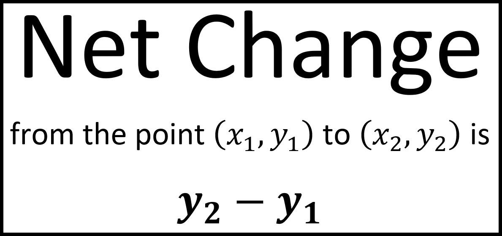

In the rapidly evolving world of finance, understanding market trends and conducting financial analysis are crucial for any investor or trader. Market trends provide essential insights into the general direction of the financial market over time, serving as a critical component for making informed trading decisions. Identifying these trends allows traders to optimize their entry and exit points to maximize profitability.

Financial analysis further strengthens trading decisions by evaluating the performance and potential of various financial entities. It involves the methodical examination of businesses, projects, and budgets to comprehend their viability and growth prospects. Various techniques, such as ratio analysis and financial modeling, are employed to produce these insights, which guide investors in making educated choices about market opportunities.



Amidst these foundational elements of trading, algorithmic trading, or algo trading, stands as a pivotal advancement in the financial sector. Algo trading leverages complex algorithms to scrutinize market data and execute trades at high speed and volume. The precision and speed of these algorithms help traders capitalize on market movements with enhanced efficiency. With the ability to incorporate diverse trading strategies—ranging from trend following to statistical arbitrage—algo trading serves as a valuable tool for investors seeking to optimize their strategies.

This article explores key aspects of market trends, financial analysis, and the role of net change and algorithmic trading in modern financial markets. By examining these components, insights are provided into how they interact and influence trading strategies. Understanding these elements empowers traders to navigate the dynamic financial landscape effectively, achieving a decisive edge in their investment endeavors.

## Table of Contents

## Understanding Market Trends

Market trends represent the prevailing direction of market movements over a particular timeframe. Recognizing these trends is essential for investors and traders as they provide actionable insights that aid in making informed decisions about entering or exiting markets, thereby maximizing potential profits.

### Types of Market Trends

Market trends can be broadly categorized into three types:

1. **Uptrend:** An uptrend is identified when the price of an asset forms a series of higher highs and higher lows. It indicates bullish market sentiment, suggesting that prices are likely to continue rising. 

2. **Downtrend:** Conversely, a downtrend occurs when prices exhibit a pattern of lower highs and lower lows, reflecting bearish sentiment and the probability of declining prices.

3. **Sideways or Horizontal Trend:** In this scenario, prices oscillate within a particular range, indicating a period of consolidation where the market neither shows significant upward nor downward movement.

### Identifying Market Trends

To identify these trends, traders commonly use technical analysis tools and indicators:

- **Moving Averages:** Moving averages smooth out price data, creating a single trend line that traders can use to identify the direction of the trend. The simple moving average (SMA) and exponential moving average (EMA) are popular choices.

  Python code example to calculate SMA:
  ```python
  import pandas as pd

  def calculate_sma(data, window):
      return data.rolling(window=window).mean()

  # Example usage
  data = pd.Series([1, 2, 3, 4, 5, 6, 7, 8, 9])
  sma_3 = calculate_sma(data, 3)
  ```

- **Trendlines:** Drawing lines that connect successive highs or lows can visually represent trends and potential reversal points.

- **Relative Strength Index (RSI):** This momentum oscillator helps evaluate whether an asset is overbought or oversold, potentially signaling a trend reversal.

### Significance in Trading Strategies

Understanding market trends is vital for developing effective trading strategies. By accurately identifying trends, traders can align their strategies to exploit market movements efficiently. 

- **Trend-Following Strategies:** These strategies involve entering trades in the direction of the current trend. For instance, in an uptrend, traders might buy on pullbacks to support levels intending to profit from continued upwards movement.

- **Contrarian Strategies:** Contrary to trend-following, these strategies anticipate reversals and involve trading against the prevailing trend at key market points.

Market trends can also determine the timing and duration of trades. For example, shorter-term traders, such as day traders, might focus on intraday trends, while long-term investors might look at broader market trends spanning months or even years.

Overall, identifying and utilizing market trends effectively enables traders to make timely and profitable trading decisions, enhancing their capacity to navigate the financial markets.

## Importance of Financial Analysis

Financial analysis is a cornerstone in evaluating the performance and viability of businesses, projects, and other financial entities. It provides investors and analysts with critical insights necessary for making informed decisions. This section aims to explore several key methods of financial analysis, including ratio analysis, financial modeling, and projections, highlighting their significance in evaluating market opportunities and making judicious investment choices.

### Ratio Analysis

Ratio analysis is a quantitative method used to gain insight into a company's [liquidity](/wiki/liquidity-risk-premium), operational efficiency, and profitability by examining its financial statements. This involves calculating various financial ratios that serve as indicators of performance. Common financial ratios include:

1. **Liquidity Ratios**: These assess a company's ability to meet its short-term obligations. For example, the current ratio is defined as:
$$
   \text{Current Ratio} = \frac{\text{Current Assets}}{\text{Current Liabilities}}

$$

2. **Profitability Ratios**: These measure a company's ability to generate profit relative to revenue, assets, equity, and other financial metrics. One such ratio is the return on equity (ROE):
$$
   \text{ROE} = \frac{\text{Net Income}}{\text{Shareholder's Equity}}

$$

3. **Efficiency Ratios**: These help gauge how well a company uses its assets and manages its liabilities. An example is the asset turnover ratio:
$$
   \text{Asset Turnover} = \frac{\text{Net Sales}}{\text{Average Total Assets}}

$$

4. **Leverage Ratios**: These examine the degree of a firm’s fixed financing obligations and its ability to meet these obligations. The debt to equity ratio is a commonly used metric:
$$
   \text{Debt to Equity Ratio} = \frac{\text{Total Liabilities}}{\text{Shareholder's Equity}}

$$

### Financial Modeling

Financial modeling involves creating a summary of a company's expenses and earnings, often using spreadsheets, to forecast future financial performance. Models are built using historical data and assumptions about future trends. Commonly, financial models emphasize various scenarios, enhancing analysts' comprehension of potential risks and opportunities associated with an investment. They may utilize complex algorithms or advanced statistical techniques, programmed using languages such as Python, to simulate and project companies' financial trajectories. For instance:

```python
import numpy as np

# Sample code to forecast future cash flows
historical_cash_flows = np.array([10000, 12000, 14000])
growth_rate = 0.05  # 5% growth rate

# Project cash flows for next 5 years
future_cash_flows = [historical_cash_flows[-1] * ((1 + growth_rate) ** i) for i in range(1, 6)]
```

### Projections

Projections use historical data and assumptions to estimate future financial performance, incorporating factors such as expected revenue growth, operating costs, and market conditions. These estimates are essential for budgetary planning, risk management, and strategic decision-making. Financial projections typically involve creating detailed forecasts for revenues, expenses, and cash flows over the short and long term. A solid foundation in projections aids in understanding potential outcomes and aligning investment strategies accordingly.

Understanding these methods is crucial for investors seeking to navigate the complexities of financial markets effectively. By assessing various financial parameters, analysts can discern market opportunities and make educated investment decisions. These tools combined offer a comprehensive framework for evaluating the performance potential and risks inherent in financial entities, ensuring more robust investment strategies.

## The Concept of Net Change

Net change is a core metric in financial markets, denoting the variance in the trading price of an asset from one period to another. It serves as an immediate indicator of price movement, helping market participants understand whether the market's trajectory is upward or downward. Calculating net change is straightforward: it is the price difference between the closing price of the current period and the closing price of the previous period. Mathematically, this can be expressed as:

$$
\text{Net Change} = \text{Closing Price}_{\text{current}} - \text{Closing Price}_{\text{previous}}
$$

For instance, if a stock closed at $150 on one day and $145 the next day, the net change would be $-5$, indicating a decrease in the stock's value.

Net change is vital for traders as it provides a concise view of market sentiment. Positive net change suggests bullish trends, whereas negative net change indicates bearish trends. This information is crucial for traders looking to gain insights into market [momentum](/wiki/momentum) and adjust their strategies accordingly. 

For automated trading systems and technical analysis, net change acts as an input in various trading strategies and algorithms. Traders and analysts often use net change along with other metrics such as average daily trading [volume](/wiki/volume-trading-strategy) or moving averages to build a comprehensive market analysis framework. In such systems, securities with significant net changes might trigger buy or sell signals, guiding investment strategies.

Additionally, net change also facilitates comparison across different securities or indices, allowing investors to evaluate performance over identical periods. For example, comparing net changes between different stocks or indices can highlight potential investment opportunities or risks. This approach aids in portfolio adjustment and in making informed decisions geared towards achieving higher returns or mitigating risks.

In conclusion, net change is not just a simple measure of price difference; it's integral to understanding and reacting to market dynamics. By effectively incorporating net change into trading analyses, traders can better forecast market shifts and optimize their investment strategies.

## Algorithmic Trading: An Overview

Algorithmic trading involves the use of computer programs to execute a large volume of trading orders at speeds and frequencies that would be impossible for human traders. These systems make decisions to buy or sell financial instruments based on pre-set instructions known as algorithms. These algorithms can be based on a variety of inputs such as timing, price, quantity, or any mathematical model.

### Mechanics of Algorithmic Trading

The core mechanism of [algorithmic trading](/wiki/algorithmic-trading) is the creation of algorithms that can process and analyze data rapidly and execute trades based on that analysis. This includes parsing data feeds, identifying trade opportunities, and placing orders across a variety of platforms. The basic steps involved in algorithmic trading include:

1. **Data Acquisition**: Collecting data from exchanges, news sources, and financial reports.
2. **Signal Generation**: Analyzing data to identify trading opportunities based on predefined criteria.
3. **Execution**: Automatically placing trades in the market according to the signal generation outcomes.
4. **Risk Management**: Continuously monitoring positions and adjusting them to manage risk effectively.

### Benefits of Algorithmic Trading

Algorithmic trading offers several benefits:

- **Speed and Efficiency**: Algorithms can process a large amount of information and execute trades faster than human traders.
- **Accuracy**: Automated trading reduces human errors related to manual trading.
- **Backtesting**: Strategies can be backtested using historical data to ensure their viability before being applied in live markets.
- **Scalability**: Algorithms can manage multiple trades simultaneously, which is typically unfeasible for human traders.

### Potential Risks

However, algorithmic trading also carries potential risks:

- **Technical Failures**: System malfunctions or network issues could lead to significant financial losses.
- **Overfitting**: Designing algorithms that are too complex and tailored to historical data may not perform well in live markets.
- **Market Impact**: Large orders executed by algorithms can impact market prices, increasing transaction costs.

### Algorithmic Trading Strategies

There are several types of algorithmic trading strategies utilized by traders:

- **Trend Following**: This strategy relies on technical indicators to capture trends in asset prices. It does not predict price levels but identifies market trends, and trades are executed based on the assumption that the trend will continue.
- **Arbitrage**: This strategy takes advantage of price discrepancies between different markets or instruments. For example, an algorithm could simultaneously buy a stock in one market and sell it in another where the price is higher.
- **Market Making**: Algorithms provide liquidity to markets by quoting buy and sell prices and profiting from the spread between them.
- **Statistical Arbitrage**: This strategy involves complex statistical and mathematical models to trade short-term and predict fair value relationships between financial instruments.

Python is the preferred language for implementing algorithmic trading systems due to its extensive libraries like NumPy, pandas, and libraries specifically for algorithmic trading like Zipline and PyAlgoTrade. Here's a simple Python example demonstrating a moving average crossover strategy:

```python
import pandas as pd
import numpy as np

# Assume 'data' is a DataFrame containing stock prices with a column 'Close'
short_window = 40
long_window = 100

# Create signals
signals = pd.DataFrame(index=data.index)
signals['signal'] = 0.0

# Short moving average
signals['short_mavg'] = data['Close'].rolling(window=short_window, min_periods=1, center=False).mean()

# Long moving average
signals['long_mavg'] = data['Close'].rolling(window=long_window, min_periods=1, center=False).mean()

# Generate signals
signals['signal'][short_window:] = np.where(signals['short_mavg'][short_window:] > signals['long_mavg'][short_window:], 1.0, 0.0)	

# Create trading orders
signals['positions'] = signals['signal'].diff()

print(signals)
```

This simple strategy calculates short and long-term moving averages of a stock's closing price to generate buy and sell signals, illustrating the fundamental principle of automation and rule-based trading in algorithmic trading.

## Integrating Market Trends, Financial Analysis, and Algo Trading

To effectively integrate market trends, financial analysis, and algorithmic trading, it is crucial to understand how each component contributes to the overall trading strategy. Market trends provide a macro perspective, signaling the general direction in which the market is moving. This information is essential for setting the context within which individual financial instruments are analyzed and traded. Identifying trends allows traders to align their positions with the broader market movements, thereby increasing the likelihood of successful trades.

Financial analysis adds a micro-level scrutiny that focuses on evaluating specific financial instruments, businesses, or projects. Through techniques such as ratio analysis, financial modeling, and projections, traders can assess the intrinsic value of a security and predict future performance. This detailed analysis is invaluable in identifying undervalued assets or potential growth opportunities that might be overlooked when only considering market trends.

Algorithmic trading serves as a bridge that connects market trends and financial analysis, allowing traders to execute strategies based on these insights with precision and efficiency. For instance, algorithms can be programmed to monitor specific market indicators and automatically execute trades when certain conditions are met, such as when a stock's price moves in line with a predicted trend or financial ratio reaches a particular threshold.

Consider a real-world example in which a trader wishes to implement a momentum-based strategy. By analyzing historical price data, the trader can identify securities exhibiting strong upward trends. Concurrently, financial analysis might reveal that these securities have favorable growth metrics, such as increasing earnings per share or a low debt-to-equity ratio. The trader can then design an algorithm to buy these securities when their prices cross a certain moving average, enhancing the strategy with precise entry and [exit](/wiki/exit-strategy) points determined by financial indicators.

Moreover, integrating these components enhances risk management. For example, an algorithm can be designed to adjust trading positions based on shifts in market sentiment or changes in financial metrics. By constantly analyzing live market data and reassessing financial projections, the algorithm can dynamically manage risk exposure, reducing potential losses during volatile market conditions.

Successful integration requires an understanding of Python or other programming languages to develop complex algorithms capable of processing large datasets. Consider the following simplified Python code snippet that demonstrates a basic integration of market trends and financial analysis for a trading strategy:

```python
import pandas as pd
import numpy as np

# Load historical market data
data = pd.read_csv('market_data.csv')

# Calculate moving averages to identify market trends
data['Short_MA'] = data['Close'].rolling(window=40).mean()
data['Long_MA'] = data['Close'].rolling(window=100).mean()

# Determine buy/sell signals
data['Signal'] = np.where(data['Short_MA'] > data['Long_MA'], 1, 0)

# Perform financial analysis to filter securities
financial_metrics = pd.read_csv('financial_data.csv')
filtered_data = financial_metrics[financial_metrics['PE_Ratio'] < 15]  # Example financial filter

# Merge and select securities with positive signals and favorable financial metrics
final_signals = data.merge(filtered_data, on='Security')
final_signals = final_signals[final_signals['Signal'] == 1]

# Output the final trading decisions
print(final_signals[['Security', 'Signal']])
```

This code outlines a basic approach where market trends are identified using moving averages and financial analysis filters securities with low price-to-earnings ratios. Algorithmic trading enables executing trades on these selected securities, leveraging both macro and micro insights effectively.

## Challenges and Considerations in Algo Trading

Algorithmic trading, while offering numerous advantages, also presents several challenges that traders must carefully navigate to achieve consistent success. Among the most significant issues are overfitting and market [volatility](/wiki/volatility-trading-strategies), both of which can greatly impact the effectiveness of trading strategies.

Overfitting occurs when a trading algorithm is excessively tailored to historical data, capturing noise instead of genuine market signals. This results in a model that performs exceptionally well on past data but poorly on new, unseen market conditions. To mitigate this risk, algorithm developers often use techniques such as cross-validation and regularization. Cross-validation involves dividing the dataset into subsets and ensuring that the model is tested on different portions of the data, preventing it from memorizing the training set. Regularization methods like L1 (Lasso) and L2 (Ridge) add a penalty to the loss function, discouraging overly complex models and thus reducing the risk of overfitting:

$$
\text{Lasso: } \text{minimize } \left\{ \sum (y - X\beta)^2 + \lambda \sum |\beta| \right\}
$$

$$
\text{Ridge: } \text{minimize } \left\{ \sum (y - X\beta)^2 + \lambda \sum \beta^2 \right\}
$$

where $y$ represents the observed values, $X$ the predictor variables, $\beta$ the coefficients, and $\lambda$ the regularization parameter.

Another considerable challenge is market volatility, which can introduce significant unpredictability and affect the performance of algorithmic strategies. Volatile markets may cause sudden price movements, leading to slippage and execution risks. Traders often use risk management techniques, such as setting stop-loss orders and maintaining diversified portfolios, to mitigate the impacts of volatility. Additionally, stress testing algorithms under simulated volatile conditions can help identify potential weaknesses and enhance system resilience.

Maintaining robust and adaptable trading systems involves several key practices. Continuous monitoring and updating algorithms are essential to ensure they remain effective under changing market conditions. Machine learning models, for instance, may require periodic retraining with fresh data to maintain predictive accuracy. Incorporating feedback loops, where the system learns and adapts from its trading outcomes, can further improve algorithm performance over time.

In conclusion, addressing the challenges of overfitting and market volatility is crucial for the success of algorithmic trading strategies. Employing methods like regularization, cross-validation, risk management, and continuous system enhancement can help traders build resilient and adaptable trading systems, capable of navigating the complexities of modern financial markets.

## Conclusion

Understanding market trends, conducting thorough financial analysis, and leveraging algorithmic trading are indispensable tools in modern finance. These elements collectively form the backbone of sophisticated trading strategies that can respond dynamically to the ever-changing financial landscape. 

Market trends provide a directional framework, indicating potential future movements of securities. Accurately identifying and interpreting these trends allows traders to make strategic entry and exit points, optimizing profit potential. Meanwhile, financial analysis imparts a comprehensive understanding of market conditions, enabling traders to make informed decisions based on quantitative data and financial indicators. This dual approach of assessing prevailing trends and in-depth analysis enriches a trader's ability to evaluate market opportunities critically.

Algorithmic trading injects this framework with efficiency and precision. By employing advanced algorithms, traders can execute trades at speeds and volumes unattainable by human capability alone. Algorithmic trading not only enhances the execution process but also mitigates emotional biases, which often undermine traditional trading approaches. However, to truly capitalize on its advantages, traders must seamlessly integrate insights from market trends and financial analysis into their algorithms, ensuring a robust and adaptable trading strategy.

Traders who master this integration gain a significant edge, capable of executing strategies that are both data-driven and agile. As financial markets continue to evolve with advancements in technology and data science, staying informed and adaptable becomes paramount. The ability to swiftly incorporate new information and adjust strategies accordingly is the hallmark of successful trading in today's complex financial environment. 

In summary, the synthesis of market trends, financial analysis, and algorithmic trading offers a competitive advantage, equipping traders to navigate the financial markets' intricacies with greater precision and effectiveness.

## References & Further Reading

[1]: ["Technical Analysis of the Financial Markets: A Comprehensive Guide to Trading Methods and Applications"](https://books.google.com/books/about/Technical_Analysis_of_the_Financial_Mark.html?id=teitAAAAQBAJ) by John J. Murphy

[2]: Lo, A. W., & MacKinlay, A. C. (2001). ["A Non-Random Walk Down Wall Street."](https://www.jstor.org/stable/j.ctt7tccx) Princeton University Press.

[3]: ["Algorithmic Trading and DMA: An Introduction to Direct Access Trading Strategies"](https://www.amazon.com/Algorithmic-Trading-DMA-introduction-strategies/dp/0956399207) by Barry Johnson

[4]: [Bouchaud, J.P., & Potters, M. (2003). ["Theory of Financial Risk and Derivative Pricing: From Statistical Physics to Risk Management."](https://www.cambridge.org/core/books/theory-of-financial-risk-and-derivative-pricing/5BBBA04CE72ED9E5E7C1C028D9A94FCB)] Cambridge University Press.

[5]: ["Machine Learning in Finance: From Theory to Practice"](https://link.springer.com/book/10.1007/978-3-030-41068-1) by Matthew F. Dixon, Igor Halperin, and Paul Bilokon