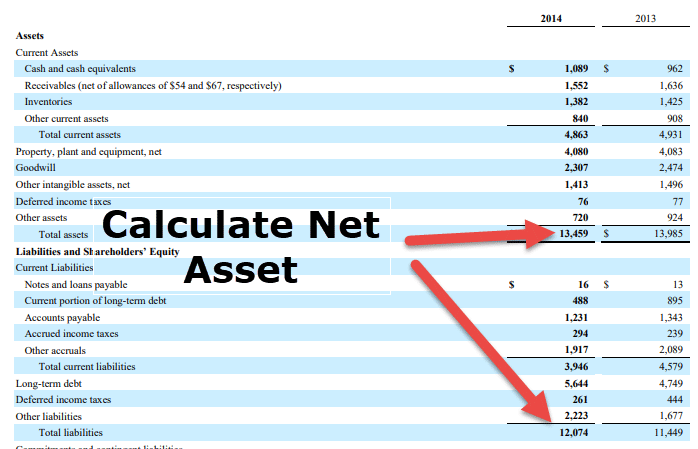

Understanding key financial metrics is essential for both seasoned traders and budding investors in the finance and investment sectors. One financial metric that provides significant insight is the Net Current Asset Value Per Share (NCAVPS). This metric was introduced by Benjamin Graham, a renowned value investor, who emphasized the importance of identifying undervalued stocks. 

NCAVPS serves as a powerful tool for assessing the liquidating value of a company's stock by focusing on the net worth of a company's current assets after accounting for its liabilities. The calculation for NCAVPS is straightforward: 



$$
\text{NCAVPS} = \frac{\text{Current Assets} - (\text{Total Liabilities} + \text{Preferred Stock})}{\text{Shares Outstanding}}
$$

This formula helps investors pinpoint stocks that are trading below their liquidation value, revealing potential undervaluation and investment opportunities.

This article will address how NCAVPS and financial ratios play a vital role in financial analysis and decision-making processes. By evaluating various financial ratios, investors can gain quick insights into aspects such as a company's profitability, liquidity, and solvency, thereby making more informed decisions. 

Additionally, we will discuss the integration of NCAVPS in algorithmic trading, a modern approach that leverages technology for executing trades. Algorithmic trading enables the analysis of extensive financial data, whereby defined criteria—such as identifying stocks trading below their NCAVPS—are applied to make data-driven investment decisions. This approach can enhance trading strategies by eliminating human emotions and biases, which often impede traditional trading methods.

## Table of Contents

## Understanding Financial Ratios and NCAVPS

Financial ratios are crucial analytical tools that help evaluate a company's financial health and operational performance. They offer quick insights into various aspects of a company's economic reality, enhancing the understanding of its profitability, [liquidity](/wiki/liquidity-risk-premium), and solvency. By measuring these parameters, financial ratios facilitate informed decisions for investors, analysts, and other stakeholders.

Net Current Asset Value Per Share (NCAVPS) is a specialized financial ratio introduced by Benjamin Graham, often regarded as the father of value investing. NCAVPS is designed to assess the liquidating value of a company's stock, focusing on determining the net worth of a company’s current assets after deducting its total liabilities and preferred stock. This metric offers an insight into a company’s financial standing from a conservative valuation standpoint.

The formula for calculating NCAVPS is:

$$
\text{NCAVPS} = \frac{\text{Current Assets} - (\text{Total Liabilities} + \text{Preferred Stock})}{\text{Shares Outstanding}}
$$

This formula highlights the difference between current assets and the sum of total liabilities and preferred stock, divided by the total number of shares outstanding. The resulting figure represents the net value of assets per share that could potentially be realized in a liquidation scenario.

Investors use NCAVPS as a tool to identify stocks trading below their liquidation value, which may indicate that these stocks are undervalued by the market. It signifies investment opportunities as the market price of these stocks might not fully reflect the underlying value of the company’s assets. When the market price of a stock is lesser than its NCAVPS, investors might see it as a potential buy due to a margin of safety—that is, purchasing the company’s assets at a significant discount.

NCAVPS stands as a testament to Benjamin Graham’s investment philosophy, focusing on finding value through assets’ liquidation consideration rather than speculative gains or growth potential. It encourages investors to look beyond market perceptions and align their strategies with fundamental valuation principles, making it an enduring tool in the value investing toolkit.

## The Role of NCAVPS in Value Investing

Value investing is an investment strategy focused on selecting stocks that trade for less than their intrinsic or book value, presenting potential for capital appreciation once the market corrects these discrepancies. Benjamin Graham, often referred to as the "Father of Value Investing," is renowned for pioneering this approach and for incorporating the Net Current Asset Value Per Share (NCAVPS) as a critical tool in evaluating investment opportunities.

Graham introduced the NCAVPS metric to pinpoint undervalued stocks by assessing their liquidation value. NCAVPS is calculated using the formula:
$$
\text{NCAVPS} = \frac{\text{Current Assets} - (\text{Total Liabilities} + \text{Preferred Stock})}{\text{Shares Outstanding}}
$$

The principle behind this calculation is that it reflects a company's net liquid asset value on a per-share basis after all liabilities and preferred equity are covered. By comparing a stock's market price to its NCAVPS, investors can ascertain if the market is undervaluing the company's tangible assets.

When a stock's market price falls below its NCAVPS, it suggests the potential for undervaluation, as the market does not fully reflect the firm's net liquid assets. For value investors, this situation indicates a buying opportunity with a possible margin of safety. A margin of safety, a fundamental concept in value investing, is the difference between a stock's intrinsic value and its current market price. This cushion provides protection against errors in judgment or unforeseen market downturns, allowing investors to acquire assets at a discount and reducing the risk of capital loss.

The use of NCAVPS aligns with Graham's conservative investment approach, which emphasizes minimizing risk and focusing on financial fundamentals. By investing in stocks with market prices significantly below their NCAVPS, investors can potentially achieve high returns when the market corrects itself and the company's true asset value is recognized.

In conclusion, while NCAVPS may not offer a comprehensive view of a company's potential performance, it remains a valuable metric within the value investing framework for identifying mispriced opportunities, ensuring that the investor pays a price reflective of the company's liquidation value rather than speculative future growth not yet realized by the market.

## Algorithmic Trading and Financial Ratios

Algorithmic trading employs sophisticated computer algorithms to perform trades with remarkable speed and frequency. This approach allows traders to capitalize on market fluctuations more efficiently than traditional methods. These algorithms can process and analyze vast quantities of financial data, using predefined rules to make investment decisions quickly and accurately. One important set of tools in this analysis is financial ratios, such as the Net Current Asset Value Per Share (NCAVPS). 

NCAVPS plays a crucial role in identifying undervalued stocks, which algorithms can target effectively. By incorporating NCAVPS into their criteria, algorithms can pinpoint stocks whose market prices fall below their liquidation value, indicating potential buying opportunities. The formula for NCAVPS, $\text{NCAVPS} = \frac{\text{Current Assets} - (\text{Total Liabilities} + \text{Preferred Stock})}{\text{Shares Outstanding}}$, helps in quantifying a baseline value for a company's stock based on its net current asset position. 

Automated trading systems are advantageous because they exclude the emotional and psychological biases that can influence human traders. By employing algorithms that execute trades based purely on data and logical criteria, investors can maintain consistent and disciplined trading strategies. This objective approach is particularly useful in volatile markets where quick decisions are needed to capitalize on fleeting opportunities.

Moreover, as the field of [algorithmic trading](/wiki/algorithmic-trading) evolves, programmers and traders continue to refine these algorithms to improve accuracy and response times. The integration of [machine learning](/wiki/machine-learning) and AI techniques into these systems can further enhance their ability to adapt to different market conditions. Python, with its extensive libraries like NumPy and pandas for data manipulation, and machine learning frameworks like TensorFlow and scikit-learn, is often utilized to develop and back-test such algorithms. An example of a basic algorithm might involve scanning a database of stocks, applying the NCAVPS calculation, and executing trades on stocks trading at a discount to their NCAVPS:

```python
import pandas as pd

# Sample data of companies
data = {'Company': ['A', 'B', 'C'],
        'Current Assets': [200000, 350000, 180000],
        'Total Liabilities': [150000, 280000, 160000],
        'Preferred Stock': [5000, 10000, 2000],
        'Shares Outstanding': [10000, 20000, 12000],
        'Market Price': [10, 12, 8]}

df = pd.DataFrame(data)

# Calculate NCAVPS
df['NCAVPS'] = (df['Current Assets'] - (df['Total Liabilities'] + df['Preferred Stock'])) / df['Shares Outstanding']

# Identify undervalued stocks
undervalued_stocks = df[df['Market Price'] < df['NCAVPS']]

print("Undervalued Stocks:")
print(undervalued_stocks[['Company', 'NCAVPS', 'Market Price']])
```

This Python script represents a basic model for evaluating stocks based on their NCAVPS, forming a core component in a more extensive algorithmic trading system. By continuously refining these systems, traders can achieve more reliable results and adapt to ever-changing financial landscapes.

## Case Studies and Examples

Examining real-world examples where the Net Current Asset Value Per Share (NCAVPS) approach has successfully pinpointed undervalued stocks can illustrate the practical application of this financial metric. Here, we look at two case studies where the NCAVPS method was instrumental in identifying investment opportunities.

In the first case, we consider a retail company, aptly identified due to its substantial current assets juxtaposed against its low trading prices. During a period where the market value of the company’s shares was significantly below its NCAVPS, investors noted a potential undervaluation. This was evident as the company's balance sheet reflected a strong position in liquid assets, suggesting that its intrinsic value was not fully recognized by the market. Consequently, value investors viewed this as an opportunity to invest in the company at a price lower than its liquidation value, offering a margin of safety. Over time, as the market adjusted and recognized the company's true asset value, the stock price eventually corrected, unlocking value for early investors.

A second example involves a manufacturing firm experiencing temporary market challenges. Here, the NCAVPS method showcased its utility by revealing that, despite short-term market [volatility](/wiki/volatility-trading-strategies), the company possessed substantial net current assets. The firm's NCAVPS was calculated as:

$$
\text{NCAVPS} = \frac{\text{Current Assets} - (\text{Total Liabilities} + \text{Preferred Stock})}{\text{Shares Outstanding}}
$$

Applying this calculation revealed an NCAVPS significantly higher than its prevailing stock price. Analysts noticed that once the market conditions stabilized, the gap between the NCAVPS and the market price was likely to close, providing scope for substantial gains. This case underscores the importance of considering NCAVPS in sectors where asset-valuation temporarily lags behind due to extraneous market factors.

These examples emphasize that while NCAVPS can be a compelling indicator of undervaluation, investors must also consider broader market conditions and company-specific factors when employing this metric in their investment strategies.

## Challenges and Limitations

Despite its benefits, relying solely on Net Current Asset Value Per Share (NCAVPS) for investment decisions presents several challenges and limitations. One primary limitation is that NCAVPS does not account for a company's growth prospects or intangible assets. Intangible assets, such as patents, trademarks, and brand value, often hold significant value and can contribute to a company's long-term success. NCAVPS relies mainly on current assets and tangible book values, potentially overlooking the future earnings potential driven by these intangibles, leading investors to potentially miss out on high-growth opportunities.

Furthermore, stocks identified as undervalued using NCAVPS might belong to companies experiencing financial distress. While a stock trading below its NCAVPS might seem like a bargain, it doesn't necessarily imply that the company is financially healthy. Companies in distress may trade at low prices due to substantial risks, including poor management, unsustainable business models, or adverse market conditions. These risks can result in further declines in stock value, making them unwise investments without additional due diligence.

For algorithmic traders, integrating NCAVPS into trading strategies requires careful programming and robust back-testing. Algorithmic strategies based on NCAVPS must be meticulously designed to identify undervalued stocks accurately while accounting for dynamic market conditions that could affect asset values. Effective algorithms need to incorporate criteria allowing them to differentiate between genuinely undervalued stocks and those discounted due to underlying financial distress. Python can be an effective tool for this, offering libraries like pandas and numpy for manipulating large datasets and performing calculations required for NCAVPS.

```python
import pandas as pd
import numpy as np

# Sample data frame for a company
data = {'Current_Assets': [100000],
        'Total_Liabilities': [75000],
        'Preferred_Stock': [5000],
        'Shares_Outstanding': [10000]}

# Create a DataFrame
df = pd.DataFrame(data)

# Calculate NCAVPS
df['NCAVPS'] = (df['Current_Assets'] - (df['Total_Liabilities'] + df['Preferred_Stock'])) / df['Shares_Outstanding']

print(df[['NCAVPS']])
```

An automated approach needs careful design and continuous back-testing to ensure its effectiveness across different market cycles. The assumptions underpinning these strategies must be scrutinized and adjusted in response to evolving market conditions and the emergence of unexpected events that could impact asset valuations.

In conclusion, while NCAVPS serves as a valuable tool for assessing stock value, investors must be cautious of its limitations. Comprehensive analysis incorporating additional financial metrics, qualitative assessments, and broader market considerations is essential for mitigating risks and making informed investment decisions.

## Conclusion

Net Current Asset Value Per Share (NCAVPS) remains a highly effective tool for value investors seeking to identify investment opportunities within undervalued markets. By highlighting stocks trading below their liquidation value, NCAVPS allows investors to spot potential undervaluations, offering a foundation for strategic decision-making.

Incorporating NCAVPS into algorithmic trading strategies can significantly enhance decision-making processes and potentially yield profitable outcomes. The automation of trade execution allows algorithms to analyze vast datasets efficiently, applying criteria like NCAVPS to identify investment opportunities without human emotional bias.

However, successful investing requires more than a sole reliance on NCAVPS. Investors and traders should employ comprehensive analyses and a variety of strategies to mitigate risks. A single metric or strategy, while insightful, could expose investors to heightened risks, especially if companies face financial distress despite seemingly favorable NCAVPS values.

The essence of effective investing lies in a thorough understanding of financial metrics, openness to innovative strategies, and a commitment to continuous learning. Adapting to evolving market conditions and leveraging a broad spectrum of analytical tools can empower investors to navigate complex financial landscapes with greater precision and confidence.

## References & Further Reading

[1]: Graham, B. (1949). ["The Intelligent Investor."](https://en.wikipedia.org/wiki/The_Intelligent_Investor) Harper & Brothers.

[2]: Graham, B., & Dodd, D. (1934). ["Security Analysis."](https://books.google.com/books/about/Security_Analysis_The_Classic_1934_Editi.html?id=wXlrnZ1uqK0C) McGraw-Hill Education.

[3]: Lopez de Prado, M. (2018). ["Advances in Financial Machine Learning."](https://www.amazon.com/Advances-Financial-Machine-Learning-Marcos/dp/1119482089) Wiley.

[4]: Jansen, S. (2020). ["Machine Learning for Algorithmic Trading."](https://github.com/stefan-jansen/machine-learning-for-trading) Packt Publishing.

[5]: Chan, E. P. (2008). ["Quantitative Trading: How to Build Your Own Algorithmic Trading Business."](https://github.com/ftvision/quant_trading_echan_book) Wiley Trading.