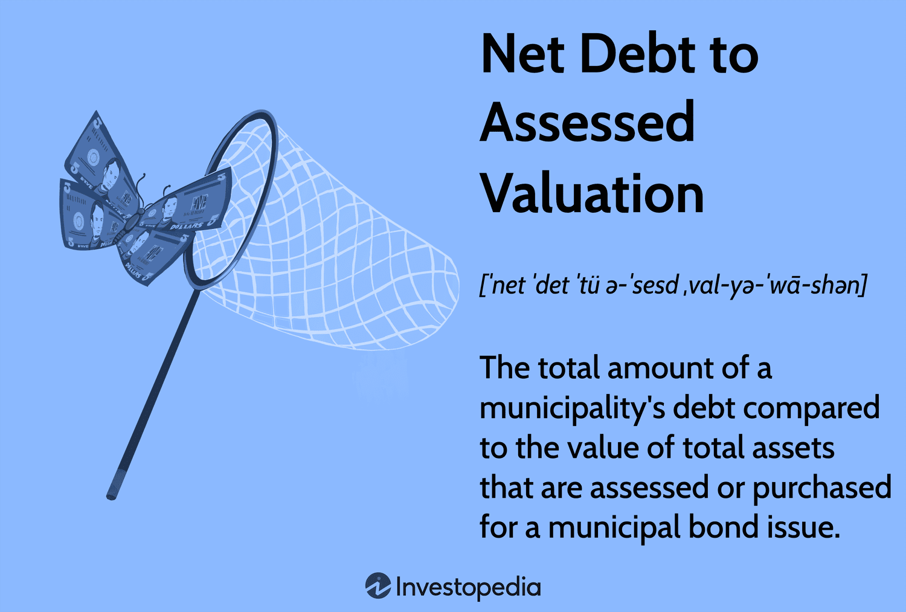

## Table of Contents

## What is net debt?

Net debt is a way to measure how much debt a company has after taking away its cash and cash equivalents. It's like figuring out how much money a company would still owe if it used all its available cash to pay off its debts. This number helps investors and analysts understand a company's financial health. If a company has a lot of cash, its net debt might be low or even negative, which is a good sign. But if a company has little cash and a lot of debt, its net debt will be high, which could be a warning sign.

To calculate net debt, you start with the total debt of the company. This includes things like loans, bonds, and any other money the company owes. Then, you subtract the company's cash and cash equivalents. Cash equivalents are things that can be quickly turned into cash, like money market funds. The formula is simple: Net Debt = Total Debt - Cash and Cash Equivalents. This gives a clearer picture of the company's debt situation because it shows what the company would owe if it used all its available cash to pay down its debts.

## What is assessed valuation?

Assessed valuation is the value that a government places on a property for the purpose of calculating taxes. It's like the government's estimate of what a house or building is worth. This value is used to figure out how much property tax the owner has to pay. The assessed value is usually less than what the property could sell for on the open market, because governments often apply a percentage, called an assessment rate, to the market value to get the assessed value.

Different places have different ways of figuring out the assessed valuation. Some places reassess properties every year, while others do it less often. The process can involve looking at recent sales of similar properties, the property's size and condition, and other factors. The assessed valuation is important because it directly affects how much property tax someone has to pay. If the assessed value goes up, the property tax might go up too, unless the tax rate changes.

## How is net debt calculated?

Net debt is a way to figure out how much debt a company has after taking away its cash. Imagine you have a piggy bank full of money and some bills to pay. Net debt is like seeing how much you'd still owe if you used all the money in your piggy bank to pay those bills. To find net debt, you start with all the money a company owes, like loans and bonds. Then, you subtract the cash the company has, plus any other things that can be quickly turned into cash, like money market funds.

This number is important because it shows if a company is in good shape financially. If a company has a lot of cash, its net debt might be low or even negative, which is a good sign. It means the company could pay off its debts if it needed to. But if a company has little cash and a lot of debt, its net debt will be high. This could be a warning sign that the company might struggle to pay its bills. So, net debt helps investors and analysts understand a company's financial health better.

## How is assessed valuation determined?

Assessed valuation is how the government figures out how much a house or building is worth for tax purposes. It's like the government's guess of what your property could sell for, but usually, it's a bit less than the actual selling price. They do this by taking the market value of the property and then applying an assessment rate, which is a percentage that can be different depending on where you live. This assessed value is important because it's used to calculate how much property tax you have to pay.

The process of determining assessed valuation can vary from place to place. Some areas might reassess properties every year, while others might do it less often, like every few years. To come up with the assessed value, the government looks at things like recent sales of similar properties nearby, the size and condition of the property, and other factors that might affect its value. If the assessed value goes up, it could mean your property taxes will go up too, unless the tax rate changes.

## Why are net debt and assessed valuation important in finance?

Net debt is important in finance because it helps people understand how much money a company really owes after using all its cash. Think of it like this: if a company has a lot of cash, it can pay off more of its debts, so its net debt will be low. This is a good sign that the company is in good financial shape. But if a company has little cash and a lot of debt, its net debt will be high, which could be a warning sign. Investors and analysts use net debt to see if a company can handle its debts and to compare it with other companies.

Assessed valuation is important because it helps governments figure out how much property tax people should pay. It's like the government's estimate of what a house or building is worth, but usually a bit less than what it could sell for. They use this value to calculate taxes, and it can change based on things like recent sales of similar properties and the condition of the property. If the assessed value goes up, it might mean higher property taxes, unless the tax rate changes. This makes assessed valuation a key part of understanding your tax bill and how it might change over time.

## What is the relationship between net debt and assessed valuation?

Net debt and assessed valuation are two different financial concepts that don't have a direct relationship. Net debt is about how much money a company owes after using all its cash. It's like figuring out if a company can pay its bills if it uses all the money it has. Assessed valuation, on the other hand, is about how much a house or building is worth for tax purposes. It's the government's way of deciding how much property tax someone should pay.

Even though they are different, both concepts are important for understanding financial health. Net debt helps investors see if a company is in good shape or if it might struggle with its debts. Assessed valuation helps property owners know how much they will have to pay in taxes. While net debt focuses on a company's financial situation, assessed valuation focuses on property value and taxes. They both give important information but in different areas of finance.

## How does net debt affect a company's financial health?

Net debt is like a report card for a company's money situation. It shows how much money a company still owes after using all its cash. If a company has a low net debt or even a negative one, it means they have enough cash to pay off their debts. This is a good sign because it shows the company is in good financial health. It's like having money left over after paying all your bills, which means you're in a strong position.

On the other hand, if a company has a high net debt, it could be a warning sign. It means the company doesn't have enough cash to cover all its debts. This can make it hard for the company to pay its bills and might scare away investors. High net debt can also make it harder for the company to borrow more money because lenders might see it as risky. So, keeping an eye on net debt helps everyone understand if a company is doing well financially or if it might be in trouble.

## How does assessed valuation impact property taxes?

Assessed valuation is how the government figures out how much a house or building is worth for tax purposes. It's like the government's guess of what your property could sell for, but usually, it's a bit less than the actual selling price. They do this by taking the market value of the property and then applying an assessment rate, which is a percentage that can be different depending on where you live. This assessed value is important because it's used to calculate how much property tax you have to pay.

If the assessed valuation of your property goes up, it could mean your property taxes will go up too, unless the tax rate changes. The government looks at things like recent sales of similar properties nearby, the size and condition of the property, and other factors that might affect its value. So, understanding the assessed valuation helps you know why you're paying a certain amount in property taxes and how it might change over time.

## What are the common methods used to assess valuation?

There are a few common ways to figure out the assessed valuation of a property. One way is the sales comparison approach. This method looks at recent sales of similar properties in the same area. By comparing these sales, the government can estimate what your property might be worth. Another way is the cost approach, which figures out how much it would cost to rebuild the property from scratch, minus any wear and tear. This method is often used for unique properties where there aren't many similar sales to compare.

The income approach is another method, mainly used for rental properties. It looks at how much money the property can make from rent and then uses that to guess its value. This approach is helpful because it shows how much money the property can bring in. Lastly, some places use a mass appraisal method, where they use computers to quickly assess many properties at once. This method looks at a lot of data to come up with assessed values for a whole area. Each method has its own way of figuring out what a property is worth, and the best one depends on the type of property and where it is located.

## How can changes in assessed valuation affect net debt?

Changes in assessed valuation don't directly affect a company's net debt because net debt is about how much money a company owes after using all its cash, while assessed valuation is about how much a house or building is worth for tax purposes. Net debt is a financial measure for companies, showing if they have enough cash to pay off their debts. Assessed valuation, on the other hand, is used by governments to figure out property taxes, which doesn't relate to a company's cash and debt situation.

However, if a company owns property, a change in the assessed valuation could indirectly impact its finances. If the assessed valuation goes up, the company might have to pay more in property taxes. This could reduce the company's cash, which might increase its net debt because net debt is calculated by subtracting cash from total debt. So, while assessed valuation and net debt are separate concepts, changes in assessed valuation could affect a company's cash flow and, in turn, its net debt.

## What are the implications of high net debt relative to assessed valuation?

High net debt and assessed valuation are two different things, but they can both tell us something about a company's money situation. Net debt is how much money a company still owes after using all its cash. If a company has high net debt, it means they might not have enough cash to pay off their debts. This can be a warning sign for investors because it shows the company might be in financial trouble. It could make it harder for the company to borrow more money because lenders might see it as risky.

Assessed valuation is about how much a house or building is worth for tax purposes. It's what the government thinks a property is worth, but usually a bit less than what it could sell for. If a company owns property, a high assessed valuation might mean they have to pay more in property taxes. This could take away from the company's cash, which might make their net debt even higher because net debt is calculated by subtracting cash from total debt. So, while high net debt and high assessed valuation are different, they can both affect a company's money situation in their own ways.

## How do analysts use net debt and assessed valuation in financial modeling?

Analysts use net debt to figure out how much money a company really owes after using all its cash. It's like checking if a company can pay its bills if it uses all the money it has. If a company has low net debt or even a negative one, it's a good sign because it means they have enough cash to cover their debts. This helps analysts see if a company is in good financial health. When they make financial models, they use net debt to compare companies and see how well they can handle their debts. It's an important part of understanding if a company is a good investment.

Assessed valuation is used by analysts to understand how much property tax a company might have to pay. It's the government's guess of what a house or building is worth, but usually less than what it could sell for. If a company owns property, a high assessed valuation could mean they have to pay more in taxes, which could take away from their cash. Analysts use this information in financial models to predict how much money the company will have after paying taxes. While assessed valuation doesn't directly affect net debt, it can change a company's cash flow, which might make their net debt higher. So, both net debt and assessed valuation help analysts get a full picture of a company's financial situation.

## What is Net Debt and How Can We Understand It?

Net debt is a key financial metric that offers a snapshot of a company's financial leverage by calculating the difference between its total outstanding debt and the cash and cash equivalents it holds. This balance helps in assessing the company’s ability to meet its financial commitments and plays a critical role in financial analysis and strategic planning.

**Calculation of Net Debt:**

Net debt is calculated using the following formula:

$$
\text{Net Debt} = \text{Total Debt} - \text{Cash and Cash Equivalents}
$$

Where:
- **Total Debt** encompasses short-term and long-term debt obligations, including bonds, loans, and lines of credit.
- **Cash and Cash Equivalents** refer to liquid assets that can be readily converted into cash, such as cash on hand, money market funds, and treasury bills.

For example, if a company has a total debt of $500 million and holds cash and cash equivalents amounting to $100 million, its net debt would be:

$$
\text{Net Debt} = 500\, \text{million} - 100\, \text{million} = 400\, \text{million}
$$

**Significance in Financial Analysis:**

Net debt provides crucial insights into a company's financial health and leverage. A higher net debt can indicate a larger financial burden, suggesting potential challenges in meeting debt obligations, especially if the company's revenue streams are inconsistent or declining. Conversely, a low or negative net debt (where cash and equivalents exceed total debt) suggests a strong [liquidity](/wiki/liquidity-risk-premium) position, offering reassurance about the company’s ability to weather financial uncertainties and capitalize on investment opportunities without the immediate need for external financing.

**Strategic Implications:**

In corporate strategy, understanding net debt is essential for making informed decisions regarding mergers and acquisitions, capital investment, and restructuring. Companies strive to optimize their capital structure, balancing debt and equity to minimize the cost of capital while maximizing investor returns. Monitoring net debt levels can also influence dividend policies and share buyback programs, as firms work to maintain financial flexibility and shareholder value. 

Furthermore, net debt is frequently used by credit rating agencies to assign creditworthiness, impacting a company's ability to raise capital and negotiate terms with creditors. Thus, managing net debt is not only a reflection of current financial operations but also a component of long-term strategic planning aimed at sustaining growth and competitiveness in the market.

## What is the relationship between Net Debt in Municipal Bonds and Assessed Valuation?

Net debt to assessed valuation is a significant metric for evaluating the quality and risk associated with a municipal bond issue. This ratio compares the total net debt of a municipality to the total assessed value of its taxable property, offering investors a perspective on the fiscal responsibility and potential financial strain a municipality may face. The formula for calculating the net debt to assessed valuation ratio is as follows:

$$
\text{Net Debt to Assessed Valuation Ratio} = \left( \frac{\text{Net Debt}}{\text{Assessed Valuation}} \right) \times 100
$$

Here, net debt is defined as the difference between the total outstanding debt and any funds that have been set aside to pay down that debt. Assessed valuation represents the total value of all assessable property within the municipality, as determined by its local government for taxation purposes.

This ratio is instrumental in assessing the risk of default on municipal bonds. A high net debt to assessed valuation ratio can indicate potential financial challenges, suggesting that the municipality might struggle to meet its debt obligations if economic conditions worsen or tax revenues decline. Conversely, a low ratio suggests a more manageable debt load relative to the municipality's asset base, which typically reflects lower default risk.

Investors evaluate this metric to determine the creditworthiness of municipal bonds, which are often sold to fund public projects such as schools, roads, and infrastructure developments. By understanding this ratio, investors can make more informed decisions, weighing the potential risks against the expected yields. Historically, regions with prudent fiscal policies maintain a healthy net debt to assessed valuation ratio to satisfy both their financial obligations and the expectations of their bondholders.

## What are the financial metrics used in algorithmic trading?

Algorithmic trading employs complex mathematical models and computational algorithms to execute trading orders with speed and precision. At its core, it relies heavily on financial metrics to inform decision-making processes. Among these metrics, net debt plays a critical role in assessing a company's fiscal condition and influencing trading strategies.

Incorporating net debt into [algorithmic trading](/wiki/algorithmic-trading) models allows traders to evaluate a company's financial leverage, providing a quantifiable measure of its debt relative to its cash reserves. This insight is crucial in determining the risk associated with investing in a particular asset. Net debt can be calculated using the formula:

$$
\text{Net Debt} = \text{Total Debt} - (\text{Cash} + \text{Cash Equivalents})
$$

Understanding net debt facilitates assessing a company’s ability to meet its debt obligations, which is fundamental in analyzing financial health. High net debt may signal potential liquidity issues, whereas low or negative net debt (indicating more cash than debt) typically reflects financial stability.

Algorithmic traders utilize such metrics to develop sophisticated models that predict stock performance and market trends. By integrating net debt data with other financial indicators like earnings, revenue growth, and market [volatility](/wiki/volatility-trading-strategies), these models can assess leverage and associated risks, thus identifying trading opportunities.

Python, a common programming tool in this domain, provides libraries such as pandas and numpy to analyze and manipulate financial data. For instance, traders can script algorithms to filter stocks by specific net debt thresholds or incorporate [machine learning](/wiki/machine-learning) techniques to enhance predictive accuracy. Below is an example of a simple Python code snippet that filters a list of stocks based on a low net debt criterion:

```python
import pandas as pd

# Sample data: a DataFrame of stocks with total debt and cash equivalents
data = {
    'Stock': ['Company A', 'Company B', 'Company C'],
    'Total Debt': [500, 200, 1000],
    'Cash': [300, 300, 200],
    'Cash Equivalents': [100, 150, 50]
}

df = pd.DataFrame(data)

# Calculate net debt
df['Net Debt'] = df['Total Debt'] - (df['Cash'] + df['Cash Equivalents'])

# Filter stocks with Net Debt less than a threshold, e.g., 100
filtered_stocks = df[df['Net Debt'] < 100]
print(filtered_stocks)
```

In more advanced strategies, algorithmic models incorporate net debt analysis to optimize portfolio allocations, hedge risks, and execute trades that capitalize on market inefficiencies. The integration of net debt into these automated systems ensures that the decision-making process aligns with the underlying financial realities, thus enhancing the potential for successful trading outcomes.

As the financial markets continue to evolve with technological advancements, the role of quantitative metrics like net debt in algorithmic trading strategies is expected to grow, further aligning trading actions with a comprehensive analysis of fiscal conditions.

## References & Further Reading

#