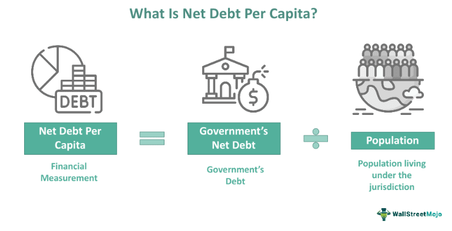

In today's fast-paced financial world, understanding complex financial metrics is crucial for investors and analysts alike. This article explores three important concepts that play a significant role in financial analysis: net debt, debt per capita, and their implications on economic understanding and strategic financial decisions. Moreover, the integration of these metrics into algorithmic trading strategies can significantly enhance financial decision-making.

Net debt, defined as total debt minus cash and cash equivalents, is a vital measure of a company's financial health. It provides insight into the company's leverage levels and its ability to meet financial obligations. An understanding of net debt is crucial for evaluating risk and making informed investment decisions. Additionally, the concept of debt per capita sheds light on the financial burden faced by individuals within an economy. It is a useful tool for policymakers and economists to assess the sustainability of national debt levels and to inform fiscal policy.



Algorithmic trading, which involves executing trades based on pre-defined criteria, has revolutionized modern finance. By effectively incorporating metrics like net debt and debt per capita, algorithmic trading systems can optimize financial strategies and potentially improve trading outcomes. Our goal is to provide a comprehensive overview of how these financial elements interact and influence market dynamics, offering valuable insights to both seasoned traders and financial novices. This guide will help you navigate the complexities of modern finance with enhanced precision and confidence, emphasizing the importance of continuous learning and adaptation in an increasingly data-driven financial landscape.

## Table of Contents

## Understanding Net Debt

Net debt is crucial in assessing a company's financial health as it offers insights into its level of leverage and overall financial stability. By understanding net debt, investors and analysts can better evaluate a company's ability to manage and repay its obligations.

Net debt is calculated by taking the total debt of a company and subtracting its cash and cash equivalents. The formula for net debt is as follows:

$$
\text{Net Debt} = \text{Total Debt} - \text{Cash and Cash Equivalents}
$$

This metric provides a clearer picture of a company's financial obligations by considering the [liquidity](/wiki/liquidity-risk-premium) available to offset its debt. Companies with high net debt levels might face challenges in settling their liabilities, which can impact their credit rating and valuation. In contrast, a low or negative net debt level indicates that a company has sufficient reserves to handle its debt load, often viewed positively by investors.

The importance of net debt in risk assessment cannot be overstated. High net debt levels may signal potential liquidity issues, affecting a firm's ability to invest in growth opportunities or navigate economic downturns. Conversely, companies with manageable net debt are generally considered more financially secure, potentially attracting more investment.

Investors utilize net debt to evaluate an organization's capacity to fulfill its financial commitments. By examining net debt, stakeholders can assess the company's fiscal prudence, its approach to leveraging, and its strategic positioning. This metric helps investors identify companies that might offer stable returns while avoiding those at risk of financial distress.

Net debt can significantly influence strategic decisions across various industries. For example, in capital-intensive sectors like telecommunications and utilities, managing net debt is integral to financing large infrastructure projects without compromising financial stability. Meanwhile, technology firms may prioritize maintaining low net debt levels to preserve flexibility for research and development investments or mergers and acquisitions.

By factoring in net debt, companies can make informed strategic decisions that align with long-term objectives and ensure sustained profitability. Understanding a company's net debt position enables investors, analysts, and decision-makers to make more educated assessments and devise effective strategies for navigating the financial landscape.

## Exploring Debt Per Capita

Debt per capita is a key metric that provides insight into the average debt burden carried by individuals within an economy. It serves as a barometer for understanding the financial obligations placed on citizens by their respective governments. Debt per capita is calculated by taking the total national debt of a country and dividing it by the country's population size:

$$
\text{Debt per Capita} = \frac{\text{Total National Debt}}{\text{Population}}
$$

This metric underscores the extent to which national debt translates into a per-person liability, offering a clear picture of how government borrowing impacts individual citizens.

Economically, debt per capita plays a crucial role in shaping analysis of a nation's fiscal health. By examining this figure, policymakers can gauge the sustainability of current debt levels. It acts as a reflection of fiscal policies, providing insights into whether a country is over-leveraged and how such debt might affect future economic policies. High debt per capita often signals potential risk areas, prompting governments to reconsider fiscal strategies to avoid exacerbating national debt.

Case studies have shown that countries with elevated debt per capita frequently face economic reforms aimed at addressing unsustainable debt burdens. For example, in the aftermath of the European debt crisis, countries such as Greece and Italy undertook significant fiscal reforms influenced by their high debt per capita figures. These reforms typically involve budgetary adjustments, austerity measures, or policy shifts aimed at restoring financial stability and reducing debt levels to more manageable standards.

Globally, comparing debt per capita among countries reveals diverse economic patterns and debt management strategies. According to data from the International Monetary Fund (IMF), nations with vast economic resources and robust GDPs, such as the United States and Japan, may have high absolute debt levels but manage higher debt per capita due to their significant economic output. Conversely, smaller or developing economies may display lower absolute debt but can still experience high debt per capita relative to their economic size, resulting in increased financial pressure on their populations.

Understanding these international comparisons highlights disparities and informs cross-country analyses of economic stability, fiscal sustainability, and potential vulnerabilities. Debt per capita remains a critical tool for evaluating the financial burden on populations and guiding the strategic direction of fiscal policy both nationally and globally.

## Financial Analysis Through Metrics

Financial analysis involves evaluating a company's performance using specific financial indicators. Two fundamental metrics, net debt and debt per capita, play crucial roles in this evaluation. These metrics provide insights into a company's financial health and economic conditions, facilitating informed decision-making.

Net debt, calculated as total debt minus cash and cash equivalents, offers a snapshot of a company's leverage. Companies with high net debt levels may face challenges in meeting financial obligations, while those with low net debt may have more financial flexibility. Investors utilize net debt to gauge a company's ability to repay its debts. For example, a company with a net debt-to-EBITDA (Earnings Before Interest, Taxes, Depreciation, and Amortization) ratio of less than 3 is often considered financially healthy.

Debt per capita, on the other hand, provides an overview of the financial burden on individuals within an economy. It is calculated by dividing the total public debt by the population size. Policymakers use debt per capita to assess the sustainability of national debt levels, influencing economic reforms and fiscal policies. High debt per capita can signal potential economic distress, prompting governments to implement corrective measures.

Incorporating net debt and debt per capita into financial analyses involves utilizing various models and frameworks. One common approach is the use of financial ratios. Ratios such as the net debt ratio and leverage ratio help assess corporate strategy by comparing financial metrics across industry standards. For instance, the net debt-to-equity ratio is pivotal in understanding the proportion of debt relative to shareholders' equity, affecting a firm's capital structure decisions.

Moreover, debt metrics significantly influence investor confidence and market stability. Investors often monitor these metrics to anticipate a company's future financial performance or the economic health of a nation. A stable or improving net debt position typically boosts investor confidence, potentially leading to higher stock prices and lower borrowing costs. Conversely, deteriorating debt metrics may trigger negative investor sentiment, affecting market dynamics and a company's ability to raise capital.

In summary, integrating net debt and debt per capita into comprehensive financial analyses enriches the understanding of a company's or economy’s financial posture. These metrics not only assist in corporate strategy formulation but also play a pivotal role in shaping market perceptions and investor behavior.

## Algorithmic Trading in Modern Finance

Algorithmic trading utilizes advanced technology and quantitative models to execute trades based on pre-defined criteria. This approach has gained substantial traction in modern financial markets due to its ability to enhance trading efficiency and precision. By analyzing large datasets and incorporating various financial metrics, including net debt and debt per capita, quantitative models enable traders to make informed decisions rapidly. 

One way net debt is used in [algorithmic trading](/wiki/algorithmic-trading) involves its integration into financial stability assessments of companies. Traders can leverage data on a company's debt levels relative to its cash reserves to optimize investment decisions. For example, a model could trigger a sell order if a company's net debt surpasses a specific threshold, indicating elevated financial risk. Debt per capita, while more commonly associated with national economic health, can also influence market sentiment and, subsequently, trading algorithms that consider macroeconomic indicators.

The advantages of algorithmic trading are pronounced in highly volatile and liquid markets. Algorithms can process information and execute trades at speeds unattainable by human traders, thereby capitalizing on fleeting market opportunities. This speed and efficiency can lead to increased market liquidity and reduced transaction costs. However, there are inherent risks. The reliance on historical data can sometimes lead to erroneous predictions in unprecedented market conditions. Additionally, the high-frequency nature of algorithmic trading can contribute to market instability, as seen in instances of flash crashes.

Data-driven insights are a cornerstone of algorithmic trading, facilitating improved trading strategies and outcomes. By applying [machine learning](/wiki/machine-learning) and [artificial intelligence](/wiki/ai-artificial-intelligence), algorithms can identify patterns and trends that may not be immediately apparent. The use of such insights allows traders to adapt to changing market conditions with greater flexibility and precision.

Looking forward, the potential of algorithmic trading to revolutionize financial markets is significant. As computational power and data availability continue to grow, algorithms are expected to become more sophisticated, enabling even more nuanced analysis and decision-making. The integration of more complex models, potentially incorporating alternative datasets like social media sentiment or environmental, social, and governance ([ESG](/wiki/esg-investing)) factors, could further enhance the predictive power of trading algorithms.

In summary, algorithmic trading stands as a pivotal innovation in modern finance, offering enhanced analytical capabilities through quantitative models and data-driven insights. Its continuing evolution promises to redefine trading strategies, providing opportunities for more precise and efficient market participation.

## Integrating Financial Indicators with Algo Trading

Combining financial analysis with algorithmic trading requires integrating complex financial indicators like net debt and debt per capita into trading algorithms. These metrics enable traders to gain a competitive edge by offering a nuanced understanding of a company's financial standing and the economic environment.

### Creating Responsive Algorithms

To create algorithms that respond to changes in financial metrics such as net debt and debt per capita, traders must first encode these indicators effectively. For instance, an algorithm may use the net debt-to-equity ratio as a parameter for assessing a company's leverage. This involves calculating net debt using the formula:

$$
\text{Net Debt} = \text{Total Debt} - \text{Cash and Cash Equivalents}
$$

Incorporating such ratios allows algorithms to trigger trading decisions based on predetermined thresholds. For example, if a company's net debt to equity significantly exceeds industry norms, the algorithm might flag it for closer scrutiny, potentially advising a sell if leverage appears unsustainable.

### Case Studies of Successful Strategies

Some algorithmic trading strategies have successfully leveraged financial metrics. For example, [quantitative trading](/wiki/quantitative-trading) firms may utilize debt per capita as a macroeconomic indicator. By examining changes in debt distribution across populations, algorithms can predict alterations in consumer spending patterns, thus informing stock or bond market decisions. A practical case could involve adjusting portfolio allocations in countries undergoing economic reforms directly impacting debt per capita.

### Technical and Analytical Prerequisites

Integrating these indicators into algorithmic systems demands robust technical and analytical expertise. Coders must proficiently handle programming languages like Python to manipulate large datasets. Here’s a simple Python snippet illustrating how net debt might be incorporated into an algorithm:

```python
def calculate_net_debt(total_debt, cash_equivalents):
    return total_debt - cash_equivalents

def trading_strategy(net_debt, equity, industry_benchmark):
    net_debt_equity_ratio = net_debt / equity
    if net_debt_equity_ratio > industry_benchmark:
        return "Review Portfolio"
    else:
        return "Maintain"

total_debt = 5000000
cash_equivalents = 1500000
equity = 3000000
industry_benchmark = 1.5

print(trading_strategy(calculate_net_debt(total_debt, cash_equivalents), equity, industry_benchmark))
```

Analytically, integrating such metrics requires a deep understanding of financial statements and economic indicators, ensuring algorithms identify genuine patterns rather than noise.

### Future Prospects

Looking forward, the integration of financial analysis metrics in algorithmic systems is poised to advance. As machine learning and artificial intelligence continue to evolve, algorithms may increasingly interpret complex datasets autonomously. This progression could lead to enhanced predictive accuracy, offering traders even more refined insights for decision-making. Additionally, as global markets become more intertwined, the ability to manage and analyze disparate financial indicators in real-time will provide traders with unprecedented strategic advantages, allowing for more adaptive and resilient investment approaches.

## Conclusion

In the dynamic financial landscape, net debt and debt per capita stand out as essential metrics for dissecting economic health and corporate stability. Net debt, which is calculated as total debt minus cash and cash equivalents, offers investors a clear picture of a company's leverage and its ability to meet financial obligations. This measure directly influences perceptions of risk and company valuation, making it indispensable for investment analysis.

Debt per capita, on the other hand, provides a snapshot of the financial burden shared by individuals within an economy. By dividing a nation's total debt by its population, this metric helps policymakers assess the sustainability of fiscal practices and devise informed economic policies. These analytics reveal disparities across different nations and offer insights into the effectiveness of their fiscal policies.

Incorporating these metrics into algorithmic trading amplifies their utility, allowing for enhanced, data-driven financial strategies. Algorithmic systems, which thrive on quantifiable data, can utilize trends in net debt and debt per capita to execute more informed and timely trades, potentially increasing market efficiency and investor returns.

As the financial industry evolves, the importance of continuous learning and adaptation cannot be understated. The reliance on technological advancements to analyze vast amounts of complex financial data is growing, necessitating an embrace of these innovations to maintain competitive advantage. By leveraging these insights, financiers are better equipped to navigate the complexities of financial markets with precision and confidence, securing success in an ever-changing economic environment.

## Additional Resources

### Recommended Books and Online Courses

1. **Books**:
   - *"Financial Analysis: A Comprehensive Introduction"* by John T. Smith - This book provides an in-depth look at financial analysis, covering key metrics such as net debt and debt per capita.
   - *"Algorithmic Trading and DMA" by Barry Johnson* - An essential read for understanding the intricacies and strategies involved in algorithmic trading.
   - *"Principles of Corporate Finance" by Richard A. Brealey, Stewart C. Myers, and Franklin Allen* - Offers insights into corporate finance principles, including valuation and financial strategy.

2. **Online Courses**:
   - **Coursera**: "Financial Markets" by Yale University - A comprehensive course covering the basics of financial markets and instruments.
   - **edX**: "Algorithmic Trading and Finance Models with Python, R, and Stata" by EPFL - A course focusing on building trading strategies using coding and quantitative models.
   - **Udacity**: "AI for Trading" - A nanodegree program that covers the application of machine learning algorithms to trading.

### Links to Financial Data Platforms and Analytical Tools

- **Bloomberg Terminal**: Offers real-time financial data and analytics, essential for tracking net debt and debt per capita among other metrics.
- **Yahoo Finance**: Provides free access to financial news, data, and analysis tools.
- **Morningstar Direct**: A platform that offers in-depth financial data and research tools.
- **Python Libraries**: Utilize libraries such as `pandas` and `numpy` for data manipulation, and `matplotlib` and `seaborn` for data visualization.

### Directories of Online Communities and Forums

- **r/finance on Reddit**: A community where professionals discuss financial trends, theories, and news.
- **Quant Net**: A forum dedicated to quantitative finance discussions and networking.
- **Stack Exchange (Quantitative Finance)**: A Q&A platform where traders and analysts share ideas and solutions.

### Access to Webinars and Seminars

- **CME Group Education Series**: Provides free webinars covering futures and options trading strategies.
- **Trading Show Event Series**: Offers insights from leading trading firms and hedge funds.
- **Algorithmic Traders Association**: Regularly conducts webinars focusing on algorithmic trading advancements.

### Compilation of Academic Papers and Articles

- "The Role of Leverage in Financial Crises" - Provides a detailed analysis of leverage’s impact, crucial for understanding net debt.
- "Debt Per Capita and Economic Growth" - An exploration of how debt per capita affects national economic policies.
- "Quantitative Trading: A Guide" - Focuses on the application of quantitative methods in trading strategies.
- Access to platforms like *JSTOR* and *Google Scholar* for academic papers that cover specialized topics in financial analysis and algorithmic trading strategies.

## References & Further Reading

[1]: ["Advances in Financial Machine Learning"](https://www.amazon.com/Advances-Financial-Machine-Learning-Marcos/dp/1119482089) by Marcos Lopez de Prado

[2]: ["Quantitative Trading: How to Build Your Own Algorithmic Trading Business"](https://www.amazon.com/Quantitative-Trading-Build-Algorithmic-Business/dp/1119800064) by Ernest P. Chan

[3]: ["Principles of Corporate Finance"](https://en.wikipedia.org/wiki/Principles_of_Corporate_Finance) by Richard A. Brealey, Stewart C. Myers, and Franklin Allen

[4]: ["Debt and Macroeconomic Stability: A Role for Rules?"](https://www.oecd-ilibrary.org/economics/debt-and-macroeconomic-stability_5k8xb76rhstl-en) by Giovanni Dell'Ariccia, Etienne Yehoue, and Paolo Mauro, International Monetary Fund

[5]: ["Algorithmic Trading and DMA: An Introduction to Direct Access Trading Strategies"](https://archive.org/details/algorithmictradi0000john) by Barry Johnson

[6]: ["Experiments with High-Frequency Data: Analyzing Strategy Performance"](https://jfin-swufe.springeropen.com/counter/pdf/10.1186/s40854-022-00431-9.pdf) by David J. Leinweber, The Journal of Portfolio Management