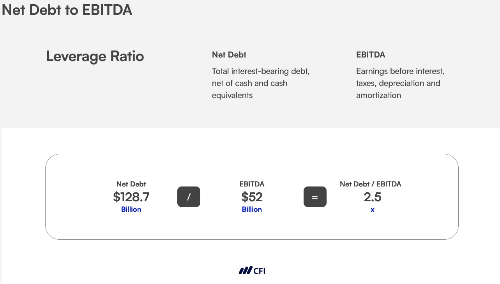

## Table of Contents

## What is the Net Debt-to-EBITDA ratio?

The Net Debt-to-EBITDA ratio is a financial metric that shows how many years it would take for a company to pay off its debt if it used all its earnings before interest, taxes, depreciation, and amortization (EBITDA) to do so. It helps investors and analysts understand how much debt a company has compared to its earnings. A lower ratio means the company has less debt relative to its earnings, which is generally seen as a good thing.

This ratio is important because it gives a quick snapshot of a company's financial health. If the ratio is high, it might mean the company is struggling with a lot of debt and might have trouble paying it back. On the other hand, a low ratio suggests the company is in a better position to manage its debt. It's a useful tool for comparing companies in the same industry, but it's also important to look at other financial metrics to get a full picture of a company's situation.

## Why is the Net Debt-to-EBITDA ratio important in financial analysis?

The Net Debt-to-EBITDA ratio is important in financial analysis because it helps people understand how much debt a company has compared to its earnings. This ratio tells us how many years it would take for a company to pay off its debt if it used all its earnings before interest, taxes, depreciation, and amortization (EBITDA). A lower ratio means the company has less debt compared to its earnings, which is usually a good sign. It shows that the company is in a better position to handle its debt and is less risky for investors.

This ratio is also useful for comparing companies within the same industry. It gives a quick snapshot of a company's financial health, making it easier to see which companies are managing their debt better. However, it's important to remember that this ratio is just one piece of the puzzle. To get a full understanding of a company's financial situation, analysts should look at other financial metrics as well. But as a starting point, the Net Debt-to-EBITDA ratio is a valuable tool for making quick and informed decisions.

## How is the Net Debt-to-EBITDA ratio calculated?

To calculate the Net Debt-to-EBITDA ratio, you first need to figure out the company's net debt. This is done by taking the total debt of the company and subtracting any cash and cash equivalents it has. Total debt includes things like loans, bonds, and other borrowings. Cash and cash equivalents are the money the company has on hand or in short-term investments that can be quickly turned into cash. Once you have the net debt, you then divide it by the company's EBITDA. EBITDA stands for Earnings Before Interest, Taxes, Depreciation, and Amortization, which is a measure of the company's operating performance.

For example, if a company has a total debt of $100 million and cash and cash equivalents of $20 million, its net debt would be $80 million. If the company's EBITDA for the same period is $40 million, you would divide the net debt of $80 million by the EBITDA of $40 million. This gives you a Net Debt-to-EBITDA ratio of 2. This means it would take the company 2 years to pay off its net debt if it used all its EBITDA to do so.

## What does a high Net Debt-to-EBITDA ratio indicate about a company?

A high Net Debt-to-EBITDA ratio means that a company has a lot of debt compared to its earnings. It shows that it would take many years for the company to pay off its debt using its current earnings. This can be a warning sign for investors and analysts because it suggests that the company might have trouble managing its debt. If the company's earnings drop or if interest rates go up, it could struggle even more to pay back what it owes.

This ratio is important for comparing companies in the same industry. A high ratio might mean the company is riskier than others. It's not always bad news, though. Sometimes, a company might have a high ratio because it's borrowing money to grow or invest in new projects. But overall, a high Net Debt-to-EBITDA ratio usually means the company is in a weaker financial position and could face challenges in the future.

## What does a low Net Debt-to-EBITDA ratio suggest about a company's financial health?

A low Net Debt-to-EBITDA ratio means that a company has less debt compared to its earnings. This is good because it shows that the company can pay off its debt quickly if it uses all its earnings before interest, taxes, depreciation, and amortization (EBITDA). A low ratio suggests that the company is in a strong financial position and is less risky for investors. It means the company is managing its debt well and has more flexibility to handle any financial challenges that might come up.

This ratio is useful for comparing companies within the same industry. A company with a low Net Debt-to-EBITDA ratio is usually seen as healthier and more stable than one with a high ratio. However, it's important to look at other financial metrics too, because the ratio alone doesn't tell the whole story. But overall, a low Net Debt-to-EBITDA ratio is a positive sign that the company is doing well financially.

## How can the Net Debt-to-EBITDA ratio be used to compare companies within the same industry?

The Net Debt-to-EBITDA ratio is a helpful tool for comparing companies within the same industry because it shows how much debt each company has compared to its earnings. When you look at this ratio for different companies, you can see which ones have less debt relative to their earnings. A company with a lower ratio is generally in a better financial position because it can pay off its debt faster. This makes it easier for investors and analysts to decide which companies are managing their debt well and might be less risky to invest in.

However, it's important to remember that this ratio is just one piece of information. It's useful for a quick comparison, but to really understand a company's financial health, you need to look at other things too. Different industries might have different normal levels for this ratio, so it's good to know what's typical for the industry you're looking at. Even though the Net Debt-to-EBITDA ratio gives a good snapshot, always consider it along with other financial metrics to get the full picture.

## What are the limitations of using the Net Debt-to-EBITDA ratio as a financial metric?

The Net Debt-to-EBITDA ratio is a helpful tool, but it has some limitations. One big problem is that it doesn't consider the quality of a company's earnings. EBITDA looks at earnings before interest, taxes, depreciation, and amortization, but it doesn't show if those earnings are coming from good business practices or just one-time gains. This can make a company look healthier than it really is. Also, the ratio doesn't take into account the timing of when debts need to be paid back. Some debts might be due soon, while others might not be due for a long time, but the ratio treats them all the same.

Another limitation is that the Net Debt-to-EBITDA ratio can be different from one industry to another. What's considered a good ratio in one industry might be bad in another. This makes it hard to compare companies across different industries. Also, companies can change their EBITDA by making certain accounting choices, which can make the ratio less reliable. It's important to use the Net Debt-to-EBITDA ratio along with other financial metrics to get a full picture of a company's financial health.

## How does the Net Debt-to-EBITDA ratio vary across different industries?

The Net Debt-to-EBITDA ratio can be very different from one industry to another because each industry has its own way of doing business and managing money. For example, industries like utilities and telecommunications often have high Net Debt-to-EBITDA ratios because they need a lot of money to build and maintain big projects like power plants or phone networks. These industries might have ratios around 4 or 5, which is considered normal for them. On the other hand, industries like technology or consumer goods might have lower ratios, often around 1 or 2, because they don't need as much money for big projects and can manage their debt better.

It's important to know what's normal for each industry when you're looking at the Net Debt-to-EBITDA ratio. A ratio that might seem high in one industry could be perfectly fine in another. For example, a ratio of 3 might be worrying for a tech company but could be seen as good for a utility company. This is why it's helpful to compare companies within the same industry rather than across different ones. By understanding these differences, you can get a better idea of a company's financial health and make smarter decisions about investing or lending money.

## Can the Net Debt-to-EBITDA ratio be used to predict financial distress?

The Net Debt-to-EBITDA ratio can give clues about a company's financial health and help predict if it might run into money problems. If the ratio is high, it means the company has a lot of debt compared to what it earns. This could mean the company might struggle to pay back its debts, especially if things like interest rates go up or if the company's earnings drop. A high ratio is a warning sign that the company could be heading towards financial distress.

However, the Net Debt-to-EBITDA ratio is just one piece of the puzzle. It doesn't tell the whole story by itself. Other things like how the company is doing compared to others in its industry, its cash flow, and other financial metrics also matter. So while a high Net Debt-to-EBITDA ratio might suggest a company is at risk of financial trouble, it's important to look at everything together to really understand the situation.

## How does the Net Debt-to-EBITDA ratio impact a company's ability to secure financing?

The Net Debt-to-EBITDA ratio can affect how easy it is for a company to get loans or other kinds of financing. If a company has a low ratio, it means they have less debt compared to their earnings. This makes them look safer to banks and investors. They might be able to get better loan terms, like lower interest rates, because lenders see them as less risky. A low ratio shows that the company can handle its debt well and is likely to pay back what it borrows.

On the other hand, a high Net Debt-to-EBITDA ratio can make it harder for a company to get financing. A high ratio means the company has a lot of debt compared to its earnings, which can make lenders and investors worried. They might think the company could struggle to pay back its debts. This could lead to higher interest rates or even a refusal to lend money at all. So, the Net Debt-to-EBITDA ratio is important because it helps lenders decide if a company is a good bet for financing.

## What are some strategies a company can use to improve its Net Debt-to-EBITDA ratio?

A company can improve its Net Debt-to-EBITDA ratio by focusing on reducing its net debt or increasing its EBITDA. One way to reduce net debt is by paying down loans and other borrowings. This can be done by using extra cash the company has or by selling off assets that aren't needed. Another way is to increase the amount of cash the company has on hand, which can be done by holding onto more of its earnings instead of paying them out as dividends. By lowering the total debt or increasing cash, the company can bring down its net debt, which helps improve the ratio.

Another strategy is to increase the company's EBITDA. This can be done by finding ways to make more money or by cutting costs. For example, the company might try to sell more products or services, or it might find new markets to enter. On the cost side, the company could look for ways to spend less on things like materials, labor, or overhead. By increasing earnings or reducing expenses, the company can boost its EBITDA, which in turn helps lower the Net Debt-to-EBITDA ratio. Both of these approaches—reducing net debt and increasing EBITDA—can help a company show lenders and investors that it's in a better financial position.

## How should the Net Debt-to-EBITDA ratio be interpreted in the context of other financial ratios?

The Net Debt-to-EBITDA ratio is just one piece of the puzzle when looking at a company's financial health. It's important to look at it alongside other financial ratios to get the full picture. For example, the Interest Coverage Ratio shows how well a company can pay the interest on its debts with its earnings. If a company has a high Net Debt-to-EBITDA ratio but also a high Interest Coverage Ratio, it might mean the company can handle its debt better than the Net Debt-to-EBITDA ratio alone suggests. Another useful ratio is the Current Ratio, which shows if a company can pay its short-term debts with its short-term assets. If a company's Net Debt-to-EBITDA ratio is high but its Current Ratio is also high, it might not be in as much trouble as you might think just from looking at the Net Debt-to-EBITDA ratio.

Another important ratio to consider is the Debt-to-Equity Ratio, which shows how much a company is using debt compared to its own money (equity). If a company has a high Net Debt-to-EBITDA ratio and also a high Debt-to-Equity Ratio, it might be a sign that the company is using a lot of debt to grow, which could be risky. On the other hand, if the Debt-to-Equity Ratio is low, it might mean the company is using less debt and might be in a better position even with a high Net Debt-to-EBITDA ratio. By looking at these other ratios together with the Net Debt-to-EBITDA ratio, you can get a clearer idea of how well a company is managing its money and whether it's a good investment or not.

## What is the Net Debt-to-EBITDA Ratio and how can it be understood?

The Net Debt-to-EBITDA ratio is a fundamental metric used to evaluate a company's financial leverage and its ability to repay debt. To understand this ratio, it is essential to first comprehend the components that constitute it: Net Debt and EBITDA.

Net Debt is a measure of a company's total debt (including short and long-term obligations) minus its cash and cash equivalents. This measure provides insights into how much debt a company would theoretically need to settle if it utilized all its available liquid assets. Mathematically, Net Debt is expressed as:

$$
\text{Net Debt} = \text{Total Debt} - \text{Cash and Cash Equivalents}
$$

EBITDA, which stands for Earnings Before Interest, Taxes, Depreciation, and Amortization, represents a company’s earnings from its core business operations without considering the effects of capital structure, taxation, and non-cash accounting items like depreciation and amortization. EBITDA is often used as a proxy for operating performance and cash flow potential.

The Net Debt-to-EBITDA ratio is calculated using the following formula:

$$
\text{Net Debt-to-EBITDA Ratio} = \frac{\text{Net Debt}}{\text{EBITDA}}
$$

This ratio interprets the financial leverage of a company by quantifying the number of years it would take for a company to pay back its net debt using its EBITDA, assuming constant earnings. A lower ratio indicates lower financial leverage and suggests that a company has stronger financial health, whereas a higher ratio may imply potential solvency issues or higher financial risk.

In assessing a company's financial health and operational efficiency, the Net Debt-to-EBITDA ratio holds significant importance. It serves as an indicator of a company’s ability to manage and repay its debt obligations from operational earnings. Analysts and investors frequently use this ratio to compare the leverage levels of similar companies within an industry and assess their relative risk profiles. Additionally, this ratio aids in evaluating whether a company is over-leveraged or operating with an optimal capital structure, thus influencing investment decisions and corporate finance strategies.

## How do you calculate and interpret the Net Debt-to-EBITDA Ratio?

The Net Debt-to-EBITDA ratio is a widely used metric in financial analysis, providing insights into a company's leverage and ability to service its debt. This section outlines a systematic approach to calculating this ratio and interpreting the results within industry contexts, significantly impacting creditworthiness and risk evaluations.

### Calculation Process

#### Step 1: Understanding Components

1. **Net Debt**: This is calculated as the total debt of the company minus its cash and cash equivalents. Total debt typically includes short-term borrowings, long-term debt, and other financial obligations.
$$
   \text{Net Debt} = \text{Total Debt} - \text{Cash and Cash Equivalents}

$$

2. **EBITDA (Earnings Before Interest, Taxes, Depreciation, and Amortization)**: This figure represents the company’s operational profitability before accounting for non-operating expenses.

#### Step 2: Calculation Formula

Once you have both components, the Net Debt-to-EBITDA ratio is calculated by dividing Net Debt by EBITDA.

$$
\text{Net Debt-to-EBITDA Ratio} = \frac{\text{Net Debt}}{\text{EBITDA}}
$$

### Example Calculation

Consider a hypothetical company with the following financial information:
- Total Debt: $500 million
- Cash and Cash Equivalents: $100 million
- EBITDA: $150 million

Using the formula:
1. Calculate Net Debt = $500 million - $100 million = $400 million
2. Compute the ratio = $400 million ÷ $150 million = 2.67

### Interpretation of Results

The Net Debt-to-EBITDA ratio is a measure of a company’s ability to pay off its debt with its earnings from operations. Generally, a lower ratio indicates better financial health, while a higher ratio could signal potential solvency issues.

- **Industry Benchmarks**: Different industries have different average ratios. For instance, a technology firm might operate efficiently with a ratio of around 1 to 2, whereas a utility company might have a typical ratio ranging from 3 to 4 due to stable cash flows.

- **Creditworthiness and Risk Profile**:
  - **High Ratios**: Suggest higher leverage, meaning the company might struggle to meet its debt obligations without improving operational performance or altering capital structure. This could lead to a higher risk perception among investors.
  - **Low Ratios**: Indicate lower leverage and typically more room for debt servicing, enhancing the company’s appeal from a credit perspective.

### Practical Considerations

When analyzing a company's Net Debt-to-EBITDA ratio, it is crucial to compare it against industry peers and historical performance. Additionally, this ratio should be used in conjunction with other financial metrics to holistically assess a company's financial condition.

```python
def calculate_net_debt_to_ebitda(total_debt, cash_equivalents, ebitda):
    net_debt = total_debt - cash_equivalents
    return net_debt / ebitda

# Example Data
total_debt = 500e6  # $500 million
cash_equivalents = 100e6  # $100 million
ebitda = 150e6  # $150 million

ratio = calculate_net_debt_to_ebitda(total_debt, cash_equivalents, ebitda)
print(f"Net Debt-to-EBITDA Ratio: {ratio:.2f}")
```

This calculation and analysis help in making informed decisions regarding investments, potential credit risks, and strategizing debt management plans. It is a key [factor](/wiki/factor-investing) in making strategic trading decisions, especially in [algorithmic trading](/wiki/algorithmic-trading) platforms that rely heavily on quantitative metrics.

## References & Further Reading

[1]: ["Debt, Taxes and Leverage: Evidence from Stock Returns"](https://www.tandfonline.com/doi/full/10.1080/1331677X.2016.1160792) by Ilya A. Strebulaev

[2]: ["Applied Corporate Finance"](https://www.amazon.com/Applied-Corporate-Finance-Aswath-Damodaran/dp/1118808932) by Aswath Damodaran

[3]: ["Corporate Finance: Theory and Practice"](https://www.amazon.com/Corporate-Finance-Practice-Steve-Lumby/dp/1473758386) by Aswath Damodaran

[4]: ["Algorithmic Trading and DMA: An Introduction to Direct Access Trading Strategies"](https://archive.org/details/algorithmictradi0000john) by Barry Johnson

[5]: ["Quantitative Equity Portfolio Management: An Active Approach to Portfolio Construction and Management"](https://www.amazon.com/Quantitative-Equity-Portfolio-Management-Construction/dp/0071459391) by Ludwig B. Chincarini and Daehwan Kim

[6]: Damodaran, Aswath, "Valuation Approaches and Metrics: A Survey of the Theory and Evidence," Foundations and Trends in Finance 1.8 (2007): 693-784