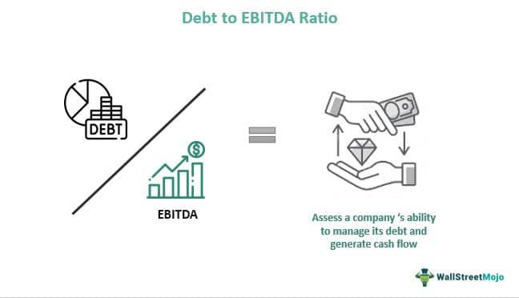

Financial ratios are indispensable tools in trading, serving as quantitative measures to evaluate a company's performance and financial health. Among these, the Net Debt-to-EBITDA ratio holds particular significance in trading, notably in algorithmic trading, where decisions are increasingly driven by data and quantitative analysis.

The Net Debt-to-EBITDA ratio is a key financial metric that evaluates a company's leverage by comparing its net debt to its earnings before interest, taxes, depreciation, and amortization (EBITDA). This ratio provides insight into a company's ability to repay its debt, highlighting its financial stability and operational efficiency. A lower ratio typically indicates a stronger financial position, whereas a higher ratio may suggest potential financial stress and higher risk for investors.



In algorithmic trading, the Net Debt-to-EBITDA ratio is utilized not just for assessing corporate health but also as a critical component in formulating trading strategies. Trading algorithms leverage this ratio to make informed, data-driven decisions, optimizing portfolio management and enhancing risk assessment. By integrating the Net Debt-to-EBITDA ratio into their analytical frameworks, traders can identify promising investment opportunities while mitigating potential risks. This article explores how the Net Debt-to-EBITDA ratio is effectively used within algorithmic trading strategies, demonstrating its value as both a standalone metric and as part of a broader set of financial tools.

## Table of Contents

## Understanding the Net Debt-to-EBITDA Ratio

The Net Debt-to-EBITDA ratio is a fundamental metric used to evaluate a company's financial leverage and its ability to repay debt. To understand this ratio, it is essential to first comprehend the components that constitute it: Net Debt and EBITDA.

Net Debt is a measure of a company's total debt (including short and long-term obligations) minus its cash and cash equivalents. This measure provides insights into how much debt a company would theoretically need to settle if it utilized all its available liquid assets. Mathematically, Net Debt is expressed as:

$$
\text{Net Debt} = \text{Total Debt} - \text{Cash and Cash Equivalents}
$$

EBITDA, which stands for Earnings Before Interest, Taxes, Depreciation, and Amortization, represents a company’s earnings from its core business operations without considering the effects of capital structure, taxation, and non-cash accounting items like depreciation and amortization. EBITDA is often used as a proxy for operating performance and cash flow potential.

The Net Debt-to-EBITDA ratio is calculated using the following formula:

$$
\text{Net Debt-to-EBITDA Ratio} = \frac{\text{Net Debt}}{\text{EBITDA}}
$$

This ratio interprets the financial leverage of a company by quantifying the number of years it would take for a company to pay back its net debt using its EBITDA, assuming constant earnings. A lower ratio indicates lower financial leverage and suggests that a company has stronger financial health, whereas a higher ratio may imply potential solvency issues or higher financial risk.

In assessing a company's financial health and operational efficiency, the Net Debt-to-EBITDA ratio holds significant importance. It serves as an indicator of a company’s ability to manage and repay its debt obligations from operational earnings. Analysts and investors frequently use this ratio to compare the leverage levels of similar companies within an industry and assess their relative risk profiles. Additionally, this ratio aids in evaluating whether a company is over-leveraged or operating with an optimal capital structure, thus influencing investment decisions and corporate finance strategies.

## The Role of Financial Ratios in Algorithmic Trading

Algorithmic trading, a form of trading that leverages computer algorithms to execute trades, relies heavily on quantitative metrics. These algorithms are designed to make rapid decisions that would be impossible for human traders to achieve, capitalizing on market inefficiencies and trends. A critical aspect of these algorithms is their use of financial ratios, which serve as cornerstone metrics for making informed trading decisions.

Financial ratios like the Net Debt-to-EBITDA ratio are essential for evaluating a company's financial stability and operational efficiency. This particular ratio measures a company's ability to manage its debt with its earnings before interest, taxes, depreciation, and amortization (EBITDA). In the context of [algorithmic trading](/wiki/algorithmic-trading), it provides insights into a company’s leverage level and potential risks associated with its debt structure.

Incorporating financial ratios into trading algorithms enables traders to automate the evaluation process of a company’s financial health. These ratios guide decision-making by setting quantitative parameters within algorithms, which filter and analyze vast amounts of market data rapidly. For example, a trading algorithm might be programmed to trigger buy signals for companies with a Net Debt-to-EBITDA ratio below a certain threshold, indicating lower financial risk and more robust operational performance.

The benefits of integrating these financial ratios into automated trading systems are manifold. Firstly, it allows for a systematic and unbiased analysis of financial metrics, removing emotional biases that can affect human traders. Secondly, it enhances the ability to process and analyze large datasets efficiently, identifying patterns and opportunities that might be missed by manual analysis. Moreover, automation facilitates the [backtesting](/wiki/backtesting) of trading strategies, allowing for adjustments and improvements based on historical data.

In Python, traders can seamlessly integrate financial ratios into trading algorithms using libraries like Pandas for data analysis, NumPy for numerical operations, and tools such as TA-Lib for technical analysis. Here's a simple Python example to calculate the Net Debt-to-EBITDA ratio:

```python
import pandas as pd

# Example financial data
company_data = {'Net Debt': [500, 300, 400], 'EBITDA': [200, 150, 180]}

# Create DataFrame
df = pd.DataFrame(company_data)

# Calculate Net Debt-to-EBITDA ratio
df['Net Debt-to-EBITDA'] = df['Net Debt'] / df['EBITDA']

print(df)
```

This script calculates the Net Debt-to-EBITDA ratio for a list of companies, allowing traders to incorporate this metric into their algorithmic strategies systematically.

In summary, financial ratios are indispensable tools in algorithmic trading, providing the quantitative backbone for decision-making processes. Their integration not only sharpens trade execution and precision but also enhances overall strategic planning and risk management in the trading environment.

## Calculating and Interpreting the Net Debt-to-EBITDA Ratio

The Net Debt-to-EBITDA ratio is a widely used metric in financial analysis, providing insights into a company's leverage and ability to service its debt. This section outlines a systematic approach to calculating this ratio and interpreting the results within industry contexts, significantly impacting creditworthiness and risk evaluations.

### Calculation Process

#### Step 1: Understanding Components

1. **Net Debt**: This is calculated as the total debt of the company minus its cash and cash equivalents. Total debt typically includes short-term borrowings, long-term debt, and other financial obligations.
$$
   \text{Net Debt} = \text{Total Debt} - \text{Cash and Cash Equivalents}

$$

2. **EBITDA (Earnings Before Interest, Taxes, Depreciation, and Amortization)**: This figure represents the company’s operational profitability before accounting for non-operating expenses.

#### Step 2: Calculation Formula

Once you have both components, the Net Debt-to-EBITDA ratio is calculated by dividing Net Debt by EBITDA.

$$
\text{Net Debt-to-EBITDA Ratio} = \frac{\text{Net Debt}}{\text{EBITDA}}
$$

### Example Calculation

Consider a hypothetical company with the following financial information:
- Total Debt: $500 million
- Cash and Cash Equivalents: $100 million
- EBITDA: $150 million

Using the formula:
1. Calculate Net Debt = $500 million - $100 million = $400 million
2. Compute the ratio = $400 million ÷ $150 million = 2.67

### Interpretation of Results

The Net Debt-to-EBITDA ratio is a measure of a company’s ability to pay off its debt with its earnings from operations. Generally, a lower ratio indicates better financial health, while a higher ratio could signal potential solvency issues.

- **Industry Benchmarks**: Different industries have different average ratios. For instance, a technology firm might operate efficiently with a ratio of around 1 to 2, whereas a utility company might have a typical ratio ranging from 3 to 4 due to stable cash flows.

- **Creditworthiness and Risk Profile**:
  - **High Ratios**: Suggest higher leverage, meaning the company might struggle to meet its debt obligations without improving operational performance or altering capital structure. This could lead to a higher risk perception among investors.
  - **Low Ratios**: Indicate lower leverage and typically more room for debt servicing, enhancing the company’s appeal from a credit perspective.

### Practical Considerations

When analyzing a company's Net Debt-to-EBITDA ratio, it is crucial to compare it against industry peers and historical performance. Additionally, this ratio should be used in conjunction with other financial metrics to holistically assess a company's financial condition.

```python
def calculate_net_debt_to_ebitda(total_debt, cash_equivalents, ebitda):
    net_debt = total_debt - cash_equivalents
    return net_debt / ebitda

# Example Data
total_debt = 500e6  # $500 million
cash_equivalents = 100e6  # $100 million
ebitda = 150e6  # $150 million

ratio = calculate_net_debt_to_ebitda(total_debt, cash_equivalents, ebitda)
print(f"Net Debt-to-EBITDA Ratio: {ratio:.2f}")
```

This calculation and analysis help in making informed decisions regarding investments, potential credit risks, and strategizing debt management plans. It is a key [factor](/wiki/factor-investing) in making strategic trading decisions, especially in algorithmic trading platforms that rely heavily on quantitative metrics.

## Applications of Net Debt-to-EBITDA in Trading Strategies

Traders utilize the Net Debt-to-EBITDA ratio in market analysis as it offers insights into a company's financial health and its ability to handle debt. A low ratio might suggest that a company is less leveraged, indicating potential stability and a lower risk of default. Consequently, investors may view such companies as safer investment opportunities, particularly in volatile market conditions. Conversely, a high ratio could signify excessive debt, signaling potential financial distress and prompting traders to re-evaluate or avoid investing.

The use of the Net Debt-to-EBITDA ratio is strategic for identifying investment opportunities and managing risk. For instance, during an economic downturn, companies with lower Net Debt-to-EBITDA ratios are often preferred as they are deemed more resilient to economic pressures. Traders can effectively use this ratio to manage portfolios by investing in companies with desirable ratios while shorting those with ratios indicating financial struggles.

Integrating financial ratios such as Net Debt-to-EBITDA into trading algorithms can enhance market analysis and decision-making processes. Python, commonly used for algorithmic trading, allows for robust data analysis and integration of financial metrics. An example code snippet to calculate and use the Net Debt-to-EBITDA ratio in Python could look like this:

```python
import pandas as pd

# Sample data
data = {'Company': ['A', 'B', 'C'],
        'Net_Debt': [500, 1200, 800],
        'EBITDA': [250, 400, 600]}

df = pd.DataFrame(data)

# Calculate Net Debt-to-EBITDA ratio
df['Net_Debt_to_EBITDA'] = df['Net_Debt'] / df['EBITDA']

# Filter companies with a desirable ratio
investment_opportunities = df[df['Net_Debt_to_EBITDA'] < 3]
print(investment_opportunities)
```

This code calculates the Net Debt-to-EBITDA ratio for a set of companies and filters those with a ratio below 3, potentially highlighting safer investment choices. Further, algorithmic trading systems can incorporate similar calculations to dynamically adjust trading strategies based on real-time data and evolving market conditions. By leveraging such quantitative metrics, traders can automate the identification of lucrative investments and better manage risk exposure in diversified portfolios.

## Advantages and Limitations of the Net Debt-to-EBITDA Ratio

The Net Debt-to-EBITDA ratio offers several advantages and limitations when used as a financial metric in analyzing a company's leverage and crafting trading strategies. Understanding these aspects is crucial for traders seeking to harness the full potential of this ratio.

**Advantages:**

1. **Simplicity of Calculation:** The Net Debt-to-EBITDA ratio is straightforward to compute. By dividing a company’s net debt by its EBITDA (Earnings Before Interest, Taxes, Depreciation, and Amortization), this ratio gives a clear insight into the leverage position of the company. This straightforward formula allows for easy comparisons and quick assessments of financial health.

2. **Usefulness in Comparing Financial Health Across Companies:** The ratio serves as a robust benchmarking tool. It enables traders and analysts to compare the financial leverage of companies within the same industry. By standardizing the measurement of leverage, the Net Debt-to-EBITDA ratio simplifies cross-company comparisons, assisting traders in making informed investment decisions.

**Limitations:**

1. **Industry Variations:** Different industries have varying capital structures and leverage norms. A Net Debt-to-EBITDA ratio that is considered high in one industry might be average in another. For instance, utility companies often have higher acceptable leverage due to stable cash flows, unlike tech firms. Hence, traders must contextualize the ratio within industry standards.

2. **Exclusion of Capital Expenditures:** The ratio does not account for capital expenditures, which are significant for companies with substantial investment in infrastructure or technology. This exclusion can give an incomplete picture of a company’s financial outlook, especially for entities with large future capital requirements.

3. **Cash Flow Fluctuations:** EBITDA, which approximates cash flow, can be volatile. Factors affecting cash flow, such as cyclicality and economic conditions, can lead to misleading interpretations of the Net Debt-to-EBITDA ratio. Consequently, traders should be cautious of making investment decisions based solely on this metric.

**Combination with Other Metrics:**

To achieve a more comprehensive analysis, traders should not rely exclusively on the Net Debt-to-EBITDA ratio. Integrating it with additional financial metrics such as the interest coverage ratio, free cash flow analysis, and debt service coverage ratio can provide a more balanced view of a company's financial condition. This holistic approach mitigates the risks associated with the limitations of a singular metric and enhances the robustness of trading strategies.

Incorporating other metrics allows for a broader perspective on financial strength and operational capabilities, thus fostering more informed and strategic decision-making in trading environments.

## Conclusion

The Net Debt-to-EBITDA ratio serves as a crucial indicator in evaluating a company's financial leverage and stability, playing a significant role in shaping informed trading strategies. Its importance lies in its ability to provide insights into a company’s capacity to manage its debt relative to its earnings before interest, taxes, depreciation, and amortization. This metric is particularly valuable for traders looking to assess a company's creditworthiness and operational efficiency.

Integrating the Net Debt-to-EBITDA ratio into algorithmic trading systems can significantly enhance decision-making processes and risk management strategies. By quantifying a company's financial health, traders can develop algorithms that react to changes in this ratio, offering a systematic approach to portfolio management. Such integration allows for a nuanced understanding of potential investments and assists in identifying companies that may become over-leveraged, thereby helping traders avoid risky positions.

As trading technologies continue to evolve, the use of financial ratios like Net Debt-to-EBITDA is expected to become increasingly sophisticated. Future advancements may include enhanced data analytics capabilities and [machine learning](/wiki/machine-learning) algorithms that better predict market movements by analyzing various financial ratios in tandem. This progression suggests a promising outlook for the utilization of financial metrics in creating more robust and adaptive trading strategies in the financial markets, cementing the importance of tools like the Net Debt-to-EBITDA ratio in modern investment analysis.

## References & Further Reading

[1]: ["Debt, Taxes and Leverage: Evidence from Stock Returns"](https://www.tandfonline.com/doi/full/10.1080/1331677X.2016.1160792) by Ilya A. Strebulaev

[2]: ["Applied Corporate Finance"](https://www.amazon.com/Applied-Corporate-Finance-Aswath-Damodaran/dp/1118808932) by Aswath Damodaran

[3]: ["Corporate Finance: Theory and Practice"](https://www.amazon.com/Corporate-Finance-Practice-Steve-Lumby/dp/1473758386) by Aswath Damodaran

[4]: ["Algorithmic Trading and DMA: An Introduction to Direct Access Trading Strategies"](https://archive.org/details/algorithmictradi0000john) by Barry Johnson

[5]: ["Quantitative Equity Portfolio Management: An Active Approach to Portfolio Construction and Management"](https://www.amazon.com/Quantitative-Equity-Portfolio-Management-Construction/dp/0071459391) by Ludwig B. Chincarini and Daehwan Kim

[6]: Damodaran, Aswath, "Valuation Approaches and Metrics: A Survey of the Theory and Evidence," Foundations and Trends in Finance 1.8 (2007): 693-784