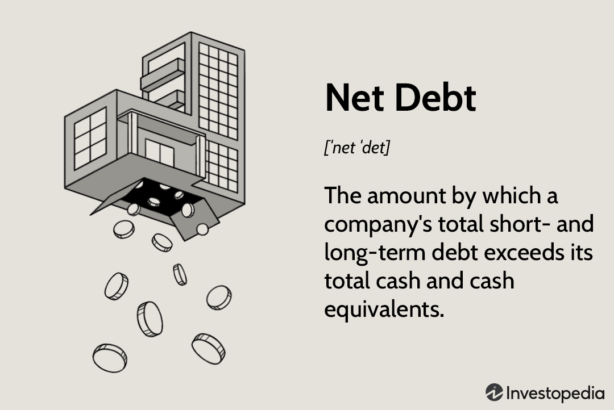

Net debt and gross debt are critical financial metrics widely used in evaluating a company's financial health and performance. Gross debt represents the total financial liabilities of a company, encompassing all loans, bonds, and other forms of debt obligations. It provides an overarching view of a company's liabilities without considering the liquidity position. On the other hand, net debt is a more refined metric, calculated by subtracting cash and cash equivalents from gross debt. This calculation can be expressed mathematically as:

$$
\text{Net Debt} = \text{Gross Debt} - (\text{Cash} + \text{Cash Equivalents})
$$



Net debt offers a clearer picture of a company’s leverage by accounting for its liquid assets, thus providing a more accurate measure of its capacity to service its debt. Both metrics hold substantial importance in financial analysis as they help investors and analysts assess a company's solvency and risk profile.

Algorithmic trading, a prominent feature of modern financial markets, leverages computer algorithms to execute trades at speeds and efficiencies that traditional human trading cannot match. The increasing sophistication and data-processing capabilities of these algorithms highlight their growing significance. As these algorithms become more integrated into trading strategies, understanding key financial metrics like net and gross debt becomes crucial in making informed trading decisions.

The integration of financial analysis, specifically debt metrics, plays a vital role in the development of successful trading algorithms. By incorporating these insights, trading algorithms can better evaluate the financial health of companies, leading to more informed predictions and trading strategies. This convergence of financial analysis and technology requires a meticulous approach to ensure that trading decisions are not only profitable but also aligned with the latest financial data.

In this article, we will explore all aspects of debt metrics and their implications for algorithm trading. We'll start by delving into the fundamentals of net and gross debt to understand their implications for assessing financial health. Subsequently, we'll discuss the critical role of financial analysis in formulating algorithmic trading strategies, shedding light on how debt metrics can influence trading decisions. Moreover, we will examine methods to integrate debt metrics into algorithms and consider challenges and potential advancements in the field. This exploration will provide valuable insights into the future intersection of financial analysis and algorithmic trading.

## Table of Contents

## Understanding Net Debt and Gross Debt

Gross debt refers to the total financial obligations of a company, encompassing all debts and liabilities that the company is required to repay. These obligations typically include long-term debt, short-term debt, bonds, loans, and other similar liabilities. Gross debt is essential for understanding the total leverage and risk exposure a company faces, as it represents the aggregate of the company's borrowing activities without considering any offsetting assets.

Net debt, by contrast, provides a more nuanced perspective on a company's financial health. It is calculated by subtracting cash and cash equivalents from the gross debt. The formula for net debt can be expressed as:

$$
\text{Net Debt} = \text{Gross Debt} - (\text{Cash} + \text{Cash Equivalents})
$$

This metric is significant as it reflects the actual debt a company holds after accounting for liquid assets that could be used to pay off some of this debt. Net debt offers a clearer picture of a company's ability to manage and repay its obligations than gross debt alone, because it considers the cushion provided by cash reserves.

These metrics are fundamental in assessing a company's financial health. Gross debt provides insight into the total obligations, which can indicate potential risk, particularly if the company is heavily leveraged compared to its earnings or cash flow generation. In contrast, net debt highlights the company’s immediate leverage after accounting for [liquidity](/wiki/liquidity-risk-premium), thus offering a more realistic view of the company’s leverage and its capacity to fulfill debt obligations.

Consider a hypothetical example where Company A has a gross debt of $500 million with cash and cash equivalents amounting to $150 million. The net debt, in this case, would be:

$$
\text{Net Debt} = \$500 \text{ million} - \$150 \text{ million} = \$350 \text{ million}
$$

This indicates that the company effectively has $350 million in debt when factoring in readily available resources to offset debt obligations. If Company B has the same gross debt of $500 million but only $50 million in cash equivalents, its net debt would be:

$$
\text{Net Debt} = \$500 \text{ million} - \$50 \text{ million} = \$450 \text{ million}
$$

This comparison illustrates how net debt provides better insight into the relative leverage of different companies with similar gross debts but differing capacities to mitigate these obligations with cash assets.

For investors and financial analysts, understanding both gross and net debt is crucial. Gross debt informs about the total obligations and helps gauge overall leverage. However, net debt is often a preferred metric for evaluating a company's financial readiness and potential risk since it includes the consideration of liquidity. Net debt's ability to highlight a company's ability to sustain and service its debt levels makes it an invaluable tool in investment decision-making and financial strategy formulation. By analyzing these metrics, stakeholders can make more informed assessments about a company's fiscal stability and potential to manage future financial challenges.

## Financial Analysis for Trading Algorithms

Financial analysis plays a pivotal role in constructing successful [algorithmic trading](/wiki/algorithmic-trading) strategies, influencing decision-making and performance optimization. A deep understanding of balance sheet components, including net and gross debt, is essential in assessing a company's financial position and crafting effective trading algorithms. Net debt, calculated as total liabilities minus cash and cash equivalents, indicates a company's ability to discharge its obligations using readily available resources. This metric provides insights into the company's leverage and liquidity, which can significantly influence trading decisions.

Incorporating detailed financial metrics into algorithmic models has several benefits. For instance, assessing a company's leverage through net debt versus gross debt offers a nuanced understanding of its financial health, affecting trading strategies that target leverage-related securities or debt instruments. By leveraging such data, algorithms can be programmed to detect patterns and execute trades based on a company's financial soundness, thus enhancing profitability and minimizing risks. 

However, integrating financial analysis into algorithmic trading is not without challenges. One typical issue is the complexity of translating financial data into actionable insights within algorithms. This requires sophisticated data processing and a robust understanding of financial reporting standards. Additionally, the temporal nature of financial statements can lead to lagged data, impacting the algorithm's accuracy and timeliness. Ensuring data integrity and real-time processing is crucial for reliable algorithmic outcomes.

Examples of financial insights guiding algorithmic trade setups include the use of financial ratio thresholds as signals for buy or sell decisions. For instance, a significant reduction in net debt over consecutive periods may trigger a buy signal, indicating improved financial stability and growth potential. Conversely, an increasing gross debt ratio without corresponding asset growth might suggest a sell action due to escalating risk.

Incorporating financial metrics into trading algorithms demands a comprehensive approach, merging technical expertise with financial acumen. Successful integration ensures that algorithms not only perform trades efficiently but also strategically align with the underlying financial realities of the assets, ultimately driving better investment outcomes.

## Integrating Debt Metrics in Algo Trading

Integrating net debt and gross debt metrics into algorithmic trading frameworks involves leveraging financial analytics to optimize trading decisions by assessing a company's leverage and financial stability. Traders and developers utilize these metrics by embedding them into their algorithmic models.

One effective method to automate the analysis of debt metrics is through the deployment of financial software and real-time data feeds. Platforms like Bloomberg Terminal and Reuters Eikon offer APIs that provide timely access to financial statements, including debt-related metrics. By using Python libraries such as Pandas for data manipulation and NumPy for numerical analysis, traders can continuously monitor shifts in a company's debt profile and respond accordingly through automated trading systems. For instance, a Python script can ingest financial reports to calculate net debt using:

```python
import pandas as pd

def calculate_net_debt(total_debt, cash_and_equivalents):
    return total_debt - cash_and_equivalents

# Example usage
financial_data = pd.DataFrame({
    'Total Debt': [5000000, 5500000],
    'Cash and Equivalents': [1500000, 2000000]
})

financial_data['Net Debt'] = financial_data.apply(
    lambda row: calculate_net_debt(row['Total Debt'], row['Cash and Equivalents']), axis=1
)

print(financial_data)
```

Macroeconomic conditions such as [interest rate](/wiki/interest-rate-trading-strategies) changes and economic growth can significantly impact these debt metrics and, consequently, trading algorithms. A rise in interest rates can increase the cost of servicing debt, thereby affecting net debt levels. Algorithms can be programmed to [factor](/wiki/factor-investing) in these variations by factoring macroeconomic indicators fetched from sources like the Federal Reserve Economic Data (FRED) into their decision-making processes.

Case studies exemplify the successful integration of debt analysis in algorithmic trading. For example, investment firms might deploy strategies that alter stock allocations based on quarterly financial health assessments that include net and gross debt metrics. An illustrative strategy could adhere to thresholds where increased net debt beyond a specific point prompts reduced exposure to that entity's equities.

To maintain effective algorithms, continual monitoring and adjustments are crucial when there is any significant fluctuation in net and gross debt. Developers should establish alert systems for real-time notification of critical threshold breaches, prompting immediate algo recalibration. Here’s an example code snippet to set an alert for net debt level:

```python
def check_threshold(net_debt, threshold=4000000):
    if net_debt > threshold:
        print("Alert: Net debt exceeds threshold!")

# Example usage
check_threshold(financial_data['Net Debt'].iloc[0])
```

In summary, incorporating debt metrics into trading algorithms necessitates a systematic approach that includes real-time data processing, responsiveness to macroeconomic factors, and adaptive mechanisms for algorithm updating. This integration enables traders to refine trading strategies and potentially enhance returns through more informed leverage assessments.

## Challenges and Considerations

Algorithmic trading, which involves using computer algorithms to execute trades at high speed and frequency, increasingly incorporates financial metrics to enhance decision-making processes. Net debt and gross debt are crucial metrics in evaluating a company's financial leverage and health. However, integrating these metrics into trading algorithms involves certain challenges and considerations.

One of the primary challenges is ensuring data accuracy and timeliness. In algorithmic trading, decisions are often made in milliseconds, so it is essential to have access to real-time data. Inaccurate or outdated financial data, particularly regarding net and gross debt, can lead to erroneous trading decisions. Data discrepancies, such as different accounting practices across nations or industries, can also result in widely varying debt figures. Therefore, sourcing data from reliable vendors and utilizing efficient data feeds is critical. Using robust data validation techniques can ensure that the data inputs are accurate and consistent.

Regulatory considerations and compliance issues are also paramount when using financial data in trading algorithms. Financial regulations vary by jurisdiction and can affect how certain debt metrics are calculated and reported. For instance, companies adhering to different accounting standards might report debt differently. Understanding these variations and ensuring compliance with the relevant regulations is mandatory to avoid legal ramifications. Traders and developers should consult with compliance experts and possibly employ automated systems to ensure adherence to laws governing financial data usage.

Another limitation concerns the risks of relying solely on debt metrics for trading decisions. Debt figures provide insight into a company's leverage but may not capture other critical financial aspects such as cash flow, profitability, or market trends. Over-reliance on these metrics could lead to a skewed perception of a company's financial health. A prudent strategy combines debt analysis with other financial indicators for a more comprehensive analysis.

To mitigate these challenges, traders and developers can adopt several strategies. Diversifying the financial metrics used in algorithmic models can enhance the robustness of trading strategies. Incorporating [machine learning](/wiki/machine-learning) techniques can help in analyzing complex datasets, identifying patterns, and predicting future trends, thus complementing traditional debt analysis. Furthermore, implementing continuous monitoring and periodic recalibration of algorithms based on updated financial data ensures that trading strategies remain relevant and effective.

In summary, while integrating net and gross debt metrics into algorithmic trading offers significant advantages, it also poses challenges related to data accuracy, regulatory compliance, and over-reliance on specific financial metrics. By employing strategic approaches, such as diversifying data inputs and utilizing advanced technologies, traders can effectively enhance their trading performance while mitigating potential risks.

## Future Trends in Financial Analysis and Algorithm Trading

Predicting future trends in financial analysis and algorithmic trading requires identifying how emerging technologies and economic shifts influence trading strategies. Advancements are significantly affecting the landscape, particularly regarding the integration and utilization of debt metrics in algorithmic trading.

Advancements in technology, especially [artificial intelligence](/wiki/ai-artificial-intelligence) (AI) and machine learning (ML), are particularly promising. AI and ML hold the potential to process vast data troves at unprecedented speeds, enhancing the accuracy and efficiency of financial analysis. These technologies can analyze complex patterns and correlations between financial metrics like net and gross debt and trading signals, producing more reliable forecasts and trading strategies.

The inclusion of AI in algorithmic trading could revolutionize the processing of debt metrics. Algorithms can be trained to recognize historical debt performance patterns and predict future trends, integrating these insights into trading decisions. Python, a frequently used language in such applications, can allow the development of machine learning models. Here is a basic example of how Python might be employed to analyze net debt metrics using a [neural network](/wiki/neural-network) architecture:

```python
from sklearn.model_selection import train_test_split
from sklearn.preprocessing import StandardScaler
from tensorflow.keras.models import Sequential
from tensorflow.keras.layers import Dense
import pandas as pd

# Load and preprocess data
data = pd.read_csv('financial_data.csv')

# Assuming 'net_debt' and relevant features are in columns named accordingly
features = data[['net_debt', 'other_feature1', 'other_feature2']].values
target = data['price_direction'].values  # Binary target variable indicating price movement

X_train, X_test, y_train, y_test = train_test_split(features, target, test_size=0.2)

scaler = StandardScaler()
X_train = scaler.fit_transform(X_train)
X_test = scaler.transform(X_test)

# Define a simple neural network model
model = Sequential([
    Dense(units=8, activation='relu', input_dim=X_train.shape[1]),
    Dense(units=4, activation='relu'),
    Dense(units=1, activation='sigmoid')
])

model.compile(optimizer='adam', loss='binary_crossentropy', metrics=['accuracy'])
model.fit(X_train, y_train, epochs=50, batch_size=10, validation_split=0.1)

test_loss, test_accuracy = model.evaluate(X_test, y_test)
print(f'Test Accuracy: {test_accuracy}')
```

Future research could focus on how changes in macroeconomic conditions, such as interest rate fluctuations and fiscal policy shifts, impact the relevance and predictive power of debt metrics within algorithmic trading systems. For instance, periods of economic [volatility](/wiki/volatility-trading-strategies) may alter the weighting of net versus gross debt in an algorithm, prompting developers to continuously adapt algorithms for maximal effectiveness.

There is substantial potential for further development at the intersection of financial analysis and algorithmic trading. As economic conditions evolve, the relevance of debt metrics in trading may shift. For example, during expansive monetary policy periods with low interest rates, companies may increase leverage, thereby affecting debt evaluation metrics' significance in trading models. Conversely, stricter credit conditions might make these metrics more crucial for risk assessment.

Overall, the convergence of AI technology and financial analysis advancements with algorithmic trading represents a significant opportunity for enhancing trading strategy precision and adaptability. As we continue to witness rapid technological advancements and fluctuating economic environments, ongoing research and innovation are essential for traders and analysts seeking to fully harness these trends.

## Conclusion

The article has delineated the critical role that net and gross debt metrics play in the development of algorithmic trading strategies. Understanding these financial metrics is essential for assessing a company's financial health and leveraging these insights for more informed trading decisions. Gross debt, representing the total financial obligations of a company, and net debt, which adjusts this figure by subtracting cash and cash equivalents, provide a nuanced view of a company’s leverage. The insights gained from analyzing these metrics allow traders to fine-tune their algorithms for better predicting market movements and identifying trading opportunities.

As financial markets continue to evolve, so too must the strategies employed within them. It is imperative for traders and developers to engage in continuous learning and adaptation, incorporating technological advancements and emerging trends into their trading frameworks. The integration of comprehensive financial analysis, including net and gross debt assessments, enhances the sophistication and precision of algorithmic trading processes. By doing so, traders can achieve improved outcomes and maintain a competitive edge in increasingly complex financial markets.

The article encourages readers to explore further resources and tools that can aid in the enhancement of their trading strategies. By staying informed and adaptable, traders and developers can effectively integrate nuanced financial analyses, such as debt metrics, to drive success in their algorithmic trading endeavors.

## References & Further Reading

[1]: [Brealey, R. A., Myers, S. C., & Allen, F. (2020). "Principles of Corporate Finance"](https://www.mheducation.com/highered/product/Principles-of-Corporate-Finance-Brealey.html). McGraw Hill Education.

[2]: ["Algorithmic Trading and DMA: An introduction to direct access trading strategies"](https://archive.org/details/algorithmictradi0000john) by Barry Johnson

[3]: Hull, J. C. (2017). [Options, Futures, and Other Derivatives](https://www.pearson.com/nl/en_NL/higher-education/subject-catalogue/finance/Options-Futures-and-Other-Derivatives-Hull.html) (9th ed.). Pearson.

[4]: ["Corporate Finance: Theory and Practice"](https://www.amazon.com/Corporate-Finance-Practice-Pascal-Quiry/dp/1119841623) by Aswath Damodaran

[5]: ["Financial Modeling"](https://en.wikipedia.org/wiki/Financial_modeling) by Simon Benninga

[6]: ["Algorithmic Trading: Winning Strategies and Their Rationale"](https://onlinelibrary.wiley.com/doi/pdf/10.1002/9781118676998.fmatter) by Ernie Chan