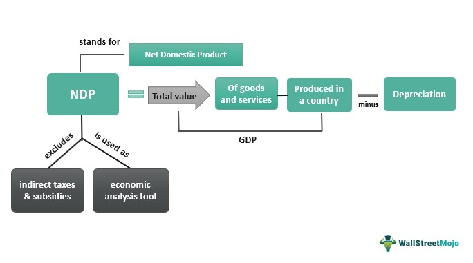

In the ever-evolving world of finance, understanding key terminologies and metrics is crucial for making informed decisions. Net Domestic Product (NDP) stands out as a vital economic indicator, offering a more accurate gauge of economic performance than Gross Domestic Product (GDP) by accounting for depreciation. While GDP provides a broad measure of a country's economic activity by calculating the total value of goods and services produced within its borders, it fails to account for the depreciation of assets over time. This omission can lead to an overestimation of a nation's economic health. NDP addresses this gap by incorporating depreciation, thus providing a clearer picture of the actual economic output.

The calculation of NDP is straightforward: 



$$

\text{NDP} = \text{GDP} - \text{Depreciation} 
$$

This adjustment highlights the importance of considering asset wear and tear, as it underscores the replacement investments necessary to sustain economic growth. Understanding the dynamics of NDP not only enhances economic analysis but also delivers deeper insights into the sustainability of economic activities.

In parallel with traditional economic analysis, algotrading, or algorithmic trading, is emerging as a pivotal investment strategy. By utilizing computer algorithms to execute trades under specific conditions, algotrading relies heavily on data analysis and economic indicators like NDP. Integration of such economic data enables traders to design algorithms capable of predicting market movements and optimizing transaction timing. The confluence of algotrading and economic indicators exemplifies the transformation of the financial landscape, where data-driven strategies increasingly dominate investment decisions.

The interplay between economic indicators and algotrading underscores the critical need for comprehensive understanding and application of these metrics. This intricate relationship forms the crux of today's financial ecosystem, where leveraging accurate economic data is essential for navigating the complexities of global markets.

## Table of Contents

## Understanding Net Domestic Product (NDP)

Net Domestic Product (NDP) is an economic metric that captures the value of goods and services produced within a nation over a specified period, typically a year, after accounting for depreciation. Depreciation refers to the reduction in value of an economy's capital stock over time due to wear and tear, obsolescence, or other factors detracting from the utility of physical assets. By subtracting depreciation from the Gross Domestic Product (GDP), NDP provides a more realistic view of an economy's productive capabilities and sustainability.

The formula for calculating NDP is straightforward:

$$
\text{NDP} = \text{GDP} - \text{Depreciation}
$$

This computation adjusts the GDP, which simply measures total economic output, by recognizing that some of that output merely replaces depreciated capital rather than contributing to new economic growth. In doing so, NDP offers insights into the actual economic contribution of production activities minus the economic cost of maintaining capital assets over time. This is crucial for examining the economy's inherent strength without the distortion caused by depreciation.

Furthermore, considering the wear and tear on physical capital can delineate robust economic performance from superficial growth. Such granularity allows policymakers and economists to assess how much of a nation's production resources are being used to maintain existing levels versus expanding and genuinely growing the economy. Investments in replacing depreciated assets are vital to preserving the productive capacity, thereby underscoring the need for continuous investment to sustain economic growth.

NDP consequently serves as a vital indicator of economic health, signaling whether a country's economic policies and production activities are leading to genuine progress or merely managing to balance out depreciation. This understanding aids in strategizing for future investments and policy directions aimed at fostering sustainable economic growth and development. Through this lens, NDP functions as both a barometer of economic vitality and a guidepost for long-term strategic planning.

## The Role of Economic Indicators

Economic indicators such as Net Domestic Product (NDP), Gross Domestic Product (GDP), and Gross National Income (GNI) are pivotal tools for both policymakers and investors. These indicators serve as essential yardsticks to gauge a country's economic health and to anticipate future economic trends. 

GDP represents the total market value of all finished goods and services produced within a country in a specific period, providing a broad picture of economic activity. In contrast, GNI measures the total domestic and foreign output claimed by residents of a country, encompassing GDP plus net income from abroad. Meanwhile, NDP refines the GDP by subtracting the depreciation of capital assets, offering a more sustainable view of economic growth.

These indicators can be categorized into three primary types: leading, lagging, and coincident indicators. Leading indicators, such as stock market returns or new business orders, typically change before the economy as a whole, providing foresight into future economic conditions. Conversely, coincident indicators, such as employment rates or wholesale trade, move in tandem with the overall economy, reflecting the current state of economic affairs. Lagging indicators, like NDP, adjust after the economy has begun to follow a particular trend and offer insight into the economic activity of the recent past.

Although NDP is a lagging indicator, it is crucial for assessing the sustainability of economic performance. By providing precise details on past economic activities, it helps forecast future economic scenarios. Policymakers leverage these indicators to tailor economic policies, while investors use them to formulate investment strategies aligned with expected economic conditions.

In summary, understanding the intricate relationship between leading, lagging, and coincident indicators is vital for developing sound economic strategies. NDP, through its focus on sustainability and historical performance, is a key component in the suite of indicators that help illuminate the economic landscape.

## Algotrading: A Technology-Driven Approach to Investment

Algotrading, or [algorithmic trading](/wiki/algorithmic-trading), utilizes sophisticated computer algorithms to execute trades under optimal conditions. These algorithms are designed to make swift data-driven decisions by analyzing extensive datasets. The foundation of algotrading lies in its capacity to leverage economic indicators, such as Net Domestic Product (NDP), to forecast market movements and automate transaction processes.

This technology-driven strategy relies on massive computational power to process large volumes of data with speed and precision, enabling traders to identify patterns and statistical relationships in historical and real-time data. By incorporating NDP and other economic indicators into their algorithms, traders can enhance their ability to anticipate economic trends and derive potential trading opportunities.

Algorithmic trading is characterized by its ability to minimize manual intervention, thereby reducing the risk of human error in trading decisions. This automation allows traders to maintain consistency and efficiency, executing trades at a pace and [volume](/wiki/volume-trading-strategy) that would be impossible for human traders to match.

One of the key components of algotrading is its reliance on [backtesting](/wiki/backtesting), where trading strategies are tested against historical data to validate their effectiveness and refine their parameters. By doing so, traders can refine their models to better accommodate the integrated economic data and optimize their strategies prior to real-world application.

Additionally, algotrading supports high-frequency trading ([HFT](/wiki/high-frequency-trading-strategies)), where algorithms execute a large number of orders at extremely high speeds. The integration of economic data such as NDP in HFT models can provide nuanced insights into short-term market movements, enabling quick [arbitrage](/wiki/arbitrage) opportunities and optimal entry and [exit](/wiki/exit-strategy) points for trades.

The Python programming language is frequently employed in the development of these trading algorithms due to its robust libraries such as NumPy and pandas for data analysis, and libraries like scikit-learn for implementing [machine learning](/wiki/machine-learning) models. Below is an example of a simple Python code snippet for a moving average crossover strategy, which is a basic algorithmic trading strategy:

```python
import pandas as pd
import numpy as np

# Sample financial data
data = pd.DataFrame({
    'Price': [110, 112, 115, 113, 116, 119, 118, 120, 122, 121]
})

# Calculate moving averages
data['Short_MA'] = data['Price'].rolling(window=3).mean()
data['Long_MA'] = data['Price'].rolling(window=5).mean()

# Generate Buy/Sell signals
def generate_signals(data):
    signals = []
    for i in range(len(data)):
        if data['Short_MA'].iloc[i] > data['Long_MA'].iloc[i]:
            signals.append('Buy')
        else:
            signals.append('Sell')
    return signals

data['Signal'] = generate_signals(data)

print(data)
```

This example demonstrates the use of moving averages to create buy/sell signals, illustrating the type of fundamental strategies that form the basis for more complex models incorporating economic indicators like NDP. As technology evolves, the integration of enriched data sources and advanced analytical techniques will further solidify algotrading as a cornerstone of modern investment strategy.

## Interconnection Between NDP and Algotrading

Economic indicators like Net Domestic Product (NDP) play a critical role in the development of robust trading algorithms in the field of algorithmic trading, commonly referred to as algotrading. NDP serves as a refined measure of a nation's economic productivity by considering depreciation, thus reflecting the sustainability of economic growth. This nuanced understanding is crucial for traders who seek to assess the underlying economic conditions impacting market dynamics.

In algorithmic trading, the integration of economic data such as NDP allows for the creation of sophisticated trading strategies that align with real-world economic fundamentals. By incorporating NDP calculations, traders can develop models that predict market movements with greater precision. For instance, the systematic approach of algotrading can be enhanced by using NDP to evaluate the depreciation of physical assets, which in turn provides insights into a nation's long-term economic potential. This information can be pivotal in anticipating macroeconomic trends, adjusting portfolio allocations, and making informed investment decisions.

The process of leveraging NDP in algotrading can further refine predictive accuracy by embedding economic realities into algorithmic models. Algorithms can be programmed to react to changes in NDP by analyzing trends over time and comparing them with other economic indicators. Through the application of data analytics and machine learning models, algotrading systems can process extensive datasets swiftly, offering traders the ability to capitalize on market inefficiencies and optimize trading execution.

In Python, for instance, traders can utilize libraries such as pandas and NumPy to conduct statistical analysis on NDP data. Here is a simplified example:

```python
import pandas as pd

# Load NDP data from a CSV file
ndp_data = pd.read_csv('ndp_data.csv')

# Calculate the moving average of NDP for trend analysis
ndp_data['NDP_MA'] = ndp_data['NDP'].rolling(window=12).mean()

# Example of making decisions based on NDP
def algotrade_decision(ndp_ma):
    if ndp_ma > threshold_value:
        return 'buy'
    elif ndp_ma < threshold_value:
        return 'sell'
    else:
        return 'hold'

# Apply the decision function to the dataset
ndp_data['Decision'] = ndp_data['NDP_MA'].apply(algotrade_decision)
```

These computational strategies enable traders to automate decision-making processes, minimize human error, and operate at speeds unattainable through manual trading. Hence, the interplay between economic indicators such as NDP and algorithmic trading exemplifies the transformative impact of technology on financial markets, fostering a new era of data-driven investment strategies.

## Conclusion

Net Domestic Product (NDP) offers an important gauge of a nation's economic health by accounting for depreciation of capital assets. This measure refines our understanding of true economic output by subtracting depreciation from the Gross Domestic Product (GDP), thus presenting a more accurate reflection of sustainable economic performance. NDP is particularly beneficial for policymakers as it highlights the necessity for replacement investments to maintain and potentially enhance economic productivity. 

Economic indicators such as NDP are equally critical in the context of modern investment strategies, such as algorithmic trading (algotrading). These indicators provide algorithm developers with essential data inputs for crafting strategies that are both data-driven and aligned with fundamental economic conditions. By incorporating NDP into trading algorithms, investors can refine their decision-making processes. This approach enables the anticipation of market movements based on the true performance of an economy, considering the wear and tear of its physical capital.

Moreover, as technology continues to reshape the financial landscape, the effective use of economic metrics like NDP will be crucial for achieving success. The integration of NDP into trading algorithms could enhance the sophistication and predictive accuracy of these models, leading to more informed and potentially more profitable investment decisions. As the financial sector evolves, understanding and leveraging such economic indicators will be essential for those aiming to thrive in dynamic market conditions.

## References & Further Reading

[1]: Jones, C. I., & Klenow, P. J. (2016). ["Beyond GDP? Welfare across Countries and Time."](https://www.aeaweb.org/articles?id=10.1257/aer.20110236) American Economic Review, 106(9), 2426-2457.

[2]: ["Advances in Financial Machine Learning"](https://www.amazon.com/Advances-Financial-Machine-Learning-Marcos/dp/1119482089) by Marcos Lopez de Prado

[3]: Solow, R. M. (1956). ["A Contribution to the Theory of Economic Growth."](https://pages.nyu.edu/debraj/Courses/Readings/Solow.pdf) The Quarterly Journal of Economics, 70(1), 65-94.

[4]: ["Evidence-Based Technical Analysis: Applying the Scientific Method and Statistical Inference to Trading Signals"](https://www.amazon.com/Evidence-Based-Technical-Analysis-Scientific-Statistical/dp/0470008741) by David Aronson

[5]: ["Machine Learning for Algorithmic Trading"](https://github.com/PacktPublishing/Machine-Learning-for-Algorithmic-Trading-Second-Edition) by Stefan Jansen

[6]: ["Quantitative Trading: How to Build Your Own Algorithmic Trading Business"](https://books.google.com/books/about/Quantitative_Trading.html?id=j70yEAAAQBAJ) by Ernest P. Chan