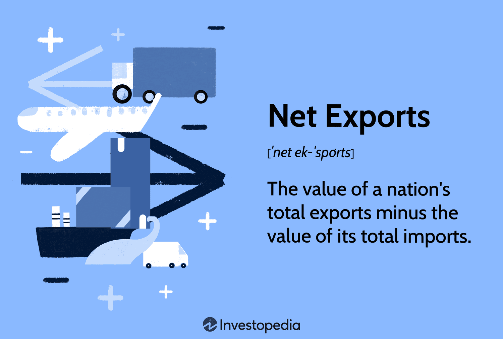

In today's interconnected global economy, understanding key economic concepts is crucial for analyzing and navigating international trade. As countries increasingly engage in cross-border transactions, the complexities of economic activity demand a comprehensive grasp of certain terminologies. Among these, 'net exporter,' 'international trade,' and 'algo trading' stand out for their significance and implications.

A 'net exporter' is a country that exports more goods and services than it imports, contributing positively to its balance of trade. This status is often indicative of a nation's competitive advantage and its influence in global markets. International trade, the exchange of goods and services across national boundaries, is a cornerstone of economic growth and development. It fosters interdependence among nations, enabling them to capitalize on their comparative advantages and access a wider range of goods and services.



Algo trading, short for algorithmic trading, represents a technological advancement in the financial markets. It uses computer algorithms to automate trading decisions, enhancing efficiency and liquidity while minimizing human error and emotional influence.

This article explores these concepts, examining their intersections and relevance in modern economic structures. By understanding their definitions, significance, and impact on the economy, one can better navigate the complex landscapes of global commerce and finance.

## Table of Contents

## Understanding Economic Terms

Economic terms are fundamental to understanding the intricate mechanisms that govern economic activities and policies on a global scale. These terms not only encapsulate the essence of various economic practices but also provide a framework for analyzing and interpreting the economic interactions between nations. Among these terms, the concept of a 'net exporter' holds particular significance, as it is pivotal in understanding the dynamics of international trade.

A 'net exporter' refers to a country that sells more goods and services to other countries than it purchases from them over a defined period. This status is quantified by calculating the difference between the total value of exports and imports, often expressed through the following formula:

$$
\text{Net Exports} = \text{Total Exports} - \text{Total Imports}
$$

When the value of net exports is positive, a country is classified as a net exporter, implying that it contributes a surplus to its trade balance. This status has broad implications for a country's economy, as it often correlates with strong domestic production capabilities, competitive industries, and a favorable balance of payments.

Net exporters play a crucial role in global trade by supplying essential goods and services to meet international demand. Countries that consistently maintain a net exporter status often benefit from increased foreign exchange earnings, which can bolster their currency value and economic stability. Moreover, they might have strategic advantages in political and economic negotiations on the world stage. 

However, achieving and sustaining a net exporter status is not without challenges. It requires a competitive edge in specific industries, supported by efficient production processes, effective supply chain management, and often substantial government support through policies such as subsidies or trade agreements.

Examples of prominent net exporting countries include Germany, China, and Saudi Arabia, each of which has carved out significant niches in sectors such as automotive manufacturing, electronics, and [crude oil](/wiki/crude-oil), respectively. These nations illustrate the economic strategies that underpin a net exporter status, such as investing in technology, maintaining high-quality standards, and targeting emerging markets.

Understanding the concept of a net exporter, along with other economic terms, is crucial for analyzing the intricate web of economic relationships that define today's global market. It offers insights into the economic health of nations and their comparative advantages, which are essential for policymakers, economists, and business leaders in making informed decisions and strategies.

## Net Exporter: Definition and Importance

A net exporter is defined as a nation whose total value of exports exceeds its total value of imports over a specified period. This economic condition highlights the nation's ability to generate more revenue from its outbound shipments than spending on inbound goods and services, thereby contributing positively to its trade balance. The mechanics of net exporting countries are significant as they have a profound impact on global markets. 

Net exporting countries typically possess competitive advantages in specific industries or natural resources, enabling them to produce certain goods more efficiently or cost-effectively than other nations. For example, countries rich in natural resources, such as Saudi Arabia with oil or Australia with minerals, often emerge as net exporters due to their ability to capitalize on resource availability coupled with technological capabilities in extraction or production.

The strategic importance of being a net exporter includes the accumulation of foreign currency reserves, which can bolster a nation's currency value. By generating a surplus in trade, nations can reinvest these funds into their economies, pay off international debts, or support domestic developments, thus strengthening economic stability and growth. Additionally, net exporters can leverage their trade positions to negotiate favorable trade agreements, enhancing their competitive stance in international trade.

Prominent net exporters such as China, Germany, and Japan represent clear examples of successful net exporting strategies. China has become a global manufacturing hub, producing and exporting a wide array of goods, from electronics to textiles, supported by a large labor force and robust manufacturing infrastructure. Germany's economy thrives on high-quality manufacturing, particularly in automobiles and machinery, which drives its export-led growth. Japan combines advanced technology with innovative processes to export products like automobiles and electronics.

Each of these countries employs unique economic strategies to maintain their net exporter status. Common strategies include investing in technology and innovation, developing efficient production processes, and enhancing supply chain logistics to reduce costs and increase export competitiveness. By prioritizing sectors where they hold distinct comparative advantages, these nations effectively position themselves in global markets to secure sustained economic benefits from being net exporters.

## International Trade: The Global Exchange

International trade involves the exchange of goods and services across international borders and is fundamental to economic growth. It allows countries to access products and services not readily available domestically, promoting economic efficiency and consumer choice. The concept is predicated on the principle of comparative advantage, which suggests that countries should specialize in producing goods where they have a lower opportunity cost compared to others. This specialization enhances overall global production and resource efficiency.

The operation of international trade is facilitated by agreements and regulations designed to reduce barriers and promote fair competition. Trade agreements, such as the North American Free Trade Agreement (NAFTA) and the European Union (EU) Single Market, are examples of how countries collaborate to ensure the smooth flow of trade. These agreements typically encompass tariffs, import quotas, and trade subsidies, which directly influence the costs associated with international trade.

One of the primary advantages of international trade is economic growth. By accessing larger markets, countries can increase their production and consumption, leading to higher incomes and improved living standards. It also fosters innovation as companies strive to compete globally. Moreover, consumers benefit from a greater variety of products at competitive prices.

However, international trade also presents challenges. Disparities between developed and developing countries can lead to unequal benefits. Developed nations often have better access to international markets, advanced technology, and capital, giving them a competitive edge. Developing countries, on the other hand, may struggle with infrastructure and policy barriers that limit their participation in global trade.

Trade policies significantly affect international trade. Protectionist policies, such as tariffs and quotas, can inhibit trade by making imported goods more expensive and less competitive. Conversely, free trade policies aim to remove barriers, promoting an open market system. Exchange rates also play a critical role; fluctuations can impact the relative cost of imports and exports, affecting trade balances. For example, a stronger domestic currency can make exports more expensive and imports cheaper, potentially leading to a trade deficit.

In summary, international trade is a vital component of global economic activity, supported by principles of comparative advantage and regulated by various agreements and policies. While it promotes growth and innovation, challenges such as inequality and protectionism require careful management to ensure equitable benefits across nations.

## The Role of Algo Trading in Modern Markets

Algorithmic trading, commonly referred to as algo trading, involves using computer algorithms to execute trading decisions in financial markets. This method leverages mathematical models and complex algorithms to place and manage trades with efficiency and precision. The advent of algo trading has significantly transformed financial markets, offering enhanced speed and reduced transaction costs, which are critical competitive advantages for traders and investors.

### Overview and Mechanisms

At its core, algo trading uses pre-defined instructions or algorithms based on criteria such as timing, price, quantity, or any mathematical model. These algorithms can be simple or highly complex, capable of processing multiple market data points simultaneously. The process generally entails identifying trading opportunities, executing orders, and managing positions—all of which are conducted at a speed and scale impossible for human traders.

A simple Python example of an algorithm used for moving average crossover strategy is illustrated below:

```python
import pandas as pd
import numpy as np

def moving_average_strategy(prices, short_window=40, long_window=100):
    signals = pd.DataFrame(index=prices.index)
    signals['price'] = prices
    signals['short_mavg'] = prices['price'].rolling(window=short_window, min_periods=1, center=False).mean()
    signals['long_mavg'] = prices['price'].rolling(window=long_window, min_periods=1, center=False).mean()
    signals['signal'] = 0.0
    signals['signal'][short_window:] = np.where(signals['short_mavg'][short_window:] 
                                                > signals['long_mavg'][short_window:], 1.0, 0.0)   
    signals['positions'] = signals['signal'].diff()

    return signals

# Assuming 'data' is a DataFrame containing your price data
# moving_average_strategy(data['Close'])
```

This algorithm identifies buy and sell signals by comparing short-term and long-term moving averages. When the short-term average exceeds the long-term average, it generates a buy signal, and vice versa.

### Advantages

One prominent advantage of algo trading is its efficiency. Algorithms can analyze vast datasets and execute orders within milliseconds, minimizing human error and emotional biases. This efficiency leads to improved order accuracy and faster transaction speeds, which can reduce market impact and execution costs. Additionally, algorithms can operate continuously without fatigue, ensuring that trading opportunities are captured 24/7 across different time zones and markets.

### Concerns and Challenges

Despite its advantages, algo trading raises several concerns. Market [volatility](/wiki/volatility-trading-strategies) can be exacerbated by the rapid execution and [high frequency](/wiki/high-frequency-trading) of trades characteristic of algorithmic strategies. "Flash crashes," sudden and severe market downturns facilitated by algo trading, underscore the potential risks associated with automated trading systems. Furthermore, the complexity of algorithms can result in unpredictable outcomes if models are not thoroughly back-tested and validated.

Regulatory challenges also exist, as financial authorities strive to keep pace with technological advancements. Ensuring that market participants do not engage in manipulative practices, such as quote stuffing or spoofing, requires vigilant monitoring and updated regulatory frameworks.

In conclusion, [algorithmic trading](/wiki/algorithmic-trading) is a pivotal component of contemporary financial markets, presenting both substantial opportunities and challenges. Its ability to enhance trading efficiency and execution quality contrasts with the potential for increased market volatility and regulatory scrutiny. Understanding these dynamics is essential for modern market participants navigating the evolving landscape of global trade and investment.

## Interconnection of Concepts

The interconnection of net exporter status, international trade, and algorithmic trading reflects the complex dynamics of the global economy. Net exporter status signifies a country's ability to produce more goods and services for export than it imports, which is a foundational concept in international trade. Countries that are net exporters often have a strategic advantage in global trade negotiations, as their economic strength is derived from a surplus in trade balance. This surplus can enhance a country's currency value, impact national GDP, and influence global market perceptions.

International trade operates as a platform for these exchanges, enabling countries to leverage their comparative advantages. It allows for diversification of markets, access to a wider range of goods and services, and fostering international relations. For instance, Germany is a notable case of a net exporter, with its economy heavily reliant on strong automotive and machinery exports[1]. The impact of its export surplus is visible in its trade balances and strengthens the Eurozone economy.

Algorithmic trading (algo trading) introduces an additional layer to these frameworks by automatically executing trades based on predetermined criteria. It enhances efficiencies in trading financial instruments such as currencies and commodities, which are directly affected by international trade dynamics. Algo trading can affect how commodities are priced, which in turn influences the trade balance of net exporters who primarily export such goods.

Consider the interrelation of these concepts through the example of the crude oil market. Countries like Saudi Arabia, a prominent net exporter of oil, often utilize their export capabilities to influence prices globally. The international trade of oil primarily involves negotiations and contracts based on current and projected supply-demand dynamics. Algo trading algorithms can rapidly respond to these dynamics by executing trades that reflect new information, such as geopolitical tensions or unexpected changes in oil supply.

Suppose an algorithm is designed to trade crude oil contracts based on real-time data from international markets. Here’s a basic pseudocode example of such an algorithm:

```python
import time

def get_market_data():
    # This function would access an API to get up-to-date market data
    pass

def analyze_data(data):
    # Analyze data to find trends and patterns
    # Return buy or sell signals
    pass

def execute_trade(signal):
    # Execute trade based on signal
    pass

while True:
    market_data = get_market_data()
    trade_signal = analyze_data(market_data)
    execute_trade(trade_signal)
    time.sleep(60)  # Run every 60 seconds
```

In practice, these algorithms have the capacity to process vast amounts of data more efficiently than human traders, thereby providing net exporter countries real-time capabilities to adjust their market activities based on international trade outcomes. Thus, the interconnectedness of these concepts not only shapes but also responds dynamically to the ever-evolving global economic landscape.

[1] "Germany Trade Balance 1960-2023," Macrotrends, https://www.macrotrends.net/countries/DEU/germany/trade-balance-deficit.

## Conclusion

Understanding economic terms and their implications is crucial for navigating today's complex global market dynamics. The interconnected nature of concepts like net exporting, international trade, and algorithmic trading highlights the multifaceted structure of modern economies. A nation that achieves net exporter status often benefits from a trade surplus, which can strengthen its currency and increase its influence in international markets. Such status is typically indicative of a robust and competitive export sector, often underpinned by advanced manufacturing, technology, or natural resources.

International trade, as a critical driver of economic growth, facilitates the exchange of goods and services across borders, fostering economic connections and providing access to a broader market base. The efficiency and regulation of these exchanges can have profound impacts on global trade dynamics, especially when influenced by fluctuating trade policies and exchange rates. Understanding these dynamics is essential, as they contribute significantly to shaping the global economy.

Algorithmic trading, or algo trading, introduces a technological dimension to financial markets, employing complex algorithms to execute trades at superior speed and efficiency compared to manual trading. This automation has the potential to affect market [liquidity](/wiki/liquidity-risk-premium), pricing, and volatility. While algorithmic trading offers substantial advantages such as reduced transaction costs and enhanced trade execution, it also raises concerns over market manipulation and systemic risk due to its reliance on sophisticated technology.

The interplay between net exporting, international trade, and algo trading underscores the intricate relationships that define today's economic environment. Each concept influences the others, creating a feedback loop that impacts global market dynamics. For instance, a country's net exporter status could be affected by global trade policies, which in turn might be impacted by developments in financial markets driven by algorithmic trading strategies.

As such, staying informed about these interconnected concepts is invaluable. A comprehensive understanding of these economic terms equips individuals and businesses to make informed decisions, mitigating risks and maximizing opportunities in the ever-evolving landscape. Recognizing the implications of these relationships enables more strategic economic and investment decisions, ultimately contributing to sustained growth and competitiveness in the global economy.

## References & Further Reading

[1]: Bergstra, J., Bardenet, R., Bengio, Y., & Kégl, B. (2011). ["Algorithms for Hyper-Parameter Optimization."](https://dl.acm.org/doi/10.5555/2986459.2986743) Advances in Neural Information Processing Systems 24.

[2]: ["Advances in Financial Machine Learning"](https://www.amazon.com/Advances-Financial-Machine-Learning-Marcos/dp/1119482089) by Marcos Lopez de Prado

[3]: ["Evidence-Based Technical Analysis: Applying the Scientific Method and Statistical Inference to Trading Signals"](https://www.amazon.com/Evidence-Based-Technical-Analysis-Scientific-Statistical/dp/0470008741) by David Aronson

[4]: ["Machine Learning for Algorithmic Trading"](https://github.com/stefan-jansen/machine-learning-for-trading) by Stefan Jansen

[5]: ["Quantitative Trading: How to Build Your Own Algorithmic Trading Business"](https://www.amazon.com/Quantitative-Trading-Build-Algorithmic-Business/dp/1119800064) by Ernest P. Chan