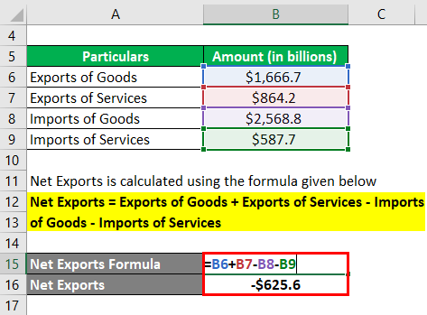

## Table of Contents

## What are net exports?

Net exports are the difference between the value of a country's exports and the value of its imports. If a country exports more than it imports, it has a positive net export, also known as a trade surplus. If a country imports more than it exports, it has a negative net export, or a trade deficit. This measure is an important part of a country's economy because it shows how much a country is trading with the rest of the world.

Net exports can affect a country's economy in many ways. For example, a trade surplus can help boost a country's economy because it means more money is coming into the country than going out. On the other hand, a trade deficit can be bad for the economy because it means the country is spending more money on foreign goods than it is earning from its own exports. Economists and policymakers pay close attention to net exports to understand and manage the health of their country's economy.

## Why are net exports important in economics?

Net exports are important in economics because they show how much a country is trading with other countries. When a country sells more things to other countries than it buys from them, it has a trade surplus. This means more money is coming into the country than going out, which can help the economy grow. On the other hand, if a country buys more from other countries than it sells, it has a trade deficit. This means the country is spending more money on foreign goods than it is earning from its own exports, which can be bad for the economy.

Economists and policymakers look at net exports to understand how well a country's economy is doing. If a country has a big trade surplus, it might mean that the country is good at making things that other countries want to buy. But if a country has a big trade deficit, it might mean that the country is buying too many things from other countries and not selling enough of its own products. By keeping an eye on net exports, leaders can make decisions to help their country's economy stay strong.

## How do you calculate net exports?

To calculate net exports, you need to know two things: the total value of the country's exports and the total value of its imports. Exports are the goods and services a country sells to other countries. Imports are the goods and services a country buys from other countries. Once you have these two numbers, you subtract the value of imports from the value of exports. The formula is simple: Net Exports = Exports - Imports.

If the result is a positive number, it means the country has a trade surplus. This is good because it means more money is coming into the country than going out. If the result is a negative number, it means the country has a trade deficit. This is not as good because it means the country is spending more money on foreign goods than it is earning from its own exports. Economists use this calculation to understand how well a country is doing in the global market.

## What is the difference between exports and net exports?

Exports are the goods and services that a country sells to other countries. When a country makes things like cars, computers, or food, and sells them to other countries, those are called exports. The total value of all these exports is important because it shows how much money a country is earning from selling things to other countries.

Net exports, on the other hand, are calculated by taking the total value of exports and subtracting the total value of imports. Imports are the goods and services that a country buys from other countries. If a country's exports are more than its imports, it has a positive net export, which is also called a trade surplus. If a country's imports are more than its exports, it has a negative net export, which is called a trade deficit. Net exports help economists understand if a country is earning more from selling things to other countries than it is spending on buying things from them.

## Can you provide examples of countries with high net exports?

Germany is a country with high net exports. It makes a lot of cars, machines, and other things that people in other countries want to buy. Because Germany sells more of these things to other countries than it buys from them, it has a big trade surplus. This means more money comes into Germany from its exports than goes out for its imports. Having high net exports helps Germany's economy stay strong.

Another country with high net exports is China. China makes a lot of electronics, clothes, and toys that people all over the world want to buy. It sells more of these things to other countries than it buys from them, so it also has a big trade surplus. Like Germany, China's high net exports bring a lot of money into the country, which helps its economy grow.

## How do net exports affect a country's GDP?

Net exports are a part of a country's Gross Domestic Product (GDP). GDP is the total value of all the goods and services made in a country in a year. When a country sells more things to other countries than it buys from them, it has a trade surplus. This trade surplus adds to the country's GDP because it means more money is coming into the country from selling things to other countries. So, if a country has high net exports, its GDP will be higher.

On the other hand, if a country buys more things from other countries than it sells to them, it has a trade deficit. This trade deficit takes away from the country's GDP because it means the country is spending more money on foreign goods than it is earning from its own exports. So, if a country has low or negative net exports, its GDP will be lower. Economists look at net exports to understand how well a country's economy is doing and how it is affected by trade with other countries.

## What factors can influence a country's net exports?

A country's net exports can be affected by many things. One big thing is how much other countries want to buy the things the country makes. If other countries really like the cars, machines, or food from a country, they will buy more of them. This makes the country's exports go up. Another thing that can change net exports is the price of the country's money, called the exchange rate. If the country's money gets weaker, it can make their things cheaper for other countries to buy, so exports might go up. But if the country's money gets stronger, their things might be more expensive for other countries, and exports might go down.

Another factor is how much the country buys from other countries. If people in the country start buying more things from other places, like electronics or clothes, then the country's imports will go up. This can make net exports go down because the country is spending more money on foreign things. Also, things like taxes on imports, called tariffs, can affect net exports. If a country puts high taxes on things coming in from other countries, it might buy less from them, which can lower imports and help net exports. But if other countries do the same to the country's exports, it might hurt the country's ability to sell things abroad.

## How do changes in exchange rates impact net exports?

Changes in exchange rates can really affect a country's net exports. The exchange rate is how much one country's money is worth compared to another country's money. If a country's money gets weaker, it means their things become cheaper for other countries to buy. This can make other countries want to buy more of the country's stuff, so the country's exports might go up. More exports can lead to a higher net export number, which is good for the country because it means more money is coming in than going out.

On the other hand, if a country's money gets stronger, it means their things become more expensive for other countries. This can make other countries buy less of the country's stuff, so the country's exports might go down. If exports go down but the country keeps buying the same amount of things from other countries, then the country's net exports will go down too. This can be bad for the country because it means they are spending more money on foreign stuff than they are earning from their own exports.

## What role do trade policies play in net exports?

Trade policies can really affect how much a country sells to other countries and how much it buys from them. If a country puts high taxes on things coming in from other places, called tariffs, it can make those things more expensive. This might make people in the country buy less from other countries, which can lower imports. Lower imports can help make net exports higher because the country is spending less money on foreign stuff. But if other countries do the same and put high taxes on the country's exports, it can make it harder for the country to sell its things abroad, which can hurt net exports.

Another way trade policies can affect net exports is through trade agreements. If a country makes a deal with another country to lower taxes on each other's goods, it can make it easier for them to trade. This can help the country sell more of its things to other countries, which can increase exports. More exports can lead to higher net exports if the country keeps buying the same amount of things from other countries. But if the trade agreement makes it easier for the country to buy more from other countries too, then imports might go up, which can lower net exports. So, trade policies can have a big impact on how much a country's net exports go up or down.

## How can a country improve its net export position?

A country can improve its net export position by making its products more attractive to other countries. This can be done by improving the quality of the things it makes or by making them cheaper. If a country can make its cars, machines, or food better than other countries, more people will want to buy them. Also, if the country's money gets weaker compared to other countries' money, its things become cheaper for others to buy. This can help the country sell more abroad and increase its exports. If the country can do this while keeping its imports the same, its net exports will go up.

Another way to improve net exports is by using trade policies wisely. A country can put taxes on things coming in from other countries, which can make those things more expensive. This might make people in the country buy less from other places, which can lower imports. Lower imports can help make net exports higher. But the country also needs to be careful not to upset other countries with these taxes, because they might put taxes on the country's exports too. Also, making trade deals with other countries can help. If a country can lower taxes on its exports to other countries, it might be able to sell more things abroad and increase its net exports.

## What are the economic implications of a trade surplus versus a trade deficit?

A trade surplus means that a country sells more things to other countries than it buys from them. This is good for the economy because it brings more money into the country than goes out. When a country has a trade surplus, it can use the extra money to invest in things like schools, hospitals, and roads. This can help the economy grow and create more jobs. Also, having a trade surplus can make the country's money stronger because other countries need to buy it to pay for the things they are buying. But a trade surplus can also cause problems if it makes other countries mad and they start putting taxes on the country's exports.

On the other hand, a trade deficit means that a country buys more things from other countries than it sells to them. This can be bad for the economy because it means the country is spending more money on foreign goods than it is earning from its own exports. If the trade deficit is big, it can make the country's money weaker because it has to buy other countries' money to pay for the things it is buying. A weak money can make things from other countries more expensive, which can make the trade deficit even bigger. But having a trade deficit is not always bad. It can mean that people in the country have more things to buy, and it can help other countries' economies grow too.

## How do global economic conditions affect a country's net exports?

Global economic conditions can really change how much a country sells to other countries and how much it buys from them. If the world economy is doing well, other countries might have more money to spend on things from the country. This can make the country's exports go up. But if the world economy is not doing so well, other countries might not have as much money to spend. This can make the country's exports go down. Also, if the price of things like oil goes up a lot, it can make it more expensive for the country to make things and ship them to other countries. This can hurt the country's exports and make its net exports go down.

Another way global economic conditions can affect a country's net exports is through changes in other countries' money. If other countries' money gets weaker, it can make the country's things more expensive for them to buy. This can make the country's exports go down. But if other countries' money gets stronger, it can make the country's things cheaper for them to buy. This can make the country's exports go up. Also, if other countries start buying a lot more things from the country because their own economies are growing, it can help the country's net exports go up. But if other countries start buying less because their economies are not doing well, it can make the country's net exports go down.

## What is the Role of Net Exports in Trade Balance?

Net exports represent a fundamental aspect of a nation's trade balance, defined as the value of a country's total exports minus its total imports. These figures are instrumental in determining whether a country experiences a trade surplus or deficit. A positive net export figure, or trade surplus, indicates that a country's export value exceeds its import value, contributing positively to the nation's Gross Domestic Product (GDP). Thus, the equation for net exports can be expressed as:

$$
\text{Net Exports} = \text{Total Exports} - \text{Total Imports}
$$

Several factors exert influence over a country's net exports. The availability of natural resources plays a crucial role; countries rich in resources often have a competitive advantage in exporting raw materials or resource-based products. Manufacturing capacities significantly affect the trade balance, as nations with advanced industrial bases can produce and export a diverse range of goods. Technological advancements further enhance export capabilities by improving production efficiency, reducing costs, and enabling the creation of innovative products that meet global demand.

Assessing net exports provides valuable insights into a country's economic vitality and its standing in the international marketplace. A consistent trade surplus suggests robust export activities and competitiveness, supporting GDP growth and national income. Conversely, persistent trade deficits might signal an overreliance on imports, potentially impacting economic stability. Understanding these dynamics is crucial for evaluating a country's economic policy and its implications on international competitiveness.

## Are Economic Indicators Tied to Trade Balance?

Trade balance is closely linked to several key economic indicators, providing insights into a nation’s financial health and stability. Among these indicators, Gross Domestic Product (GDP), inflation rates, and employment levels hold particular significance.

A trade surplus, characterized by a country exporting more goods and services than it imports, can lead to an increase in GDP. The formula for calculating GDP is:

$$
\text{GDP} = C + I + G + (X - M)
$$

where $C$ represents consumer spending, $I$ is investment in the economy, $G$ is government spending, and $(X - M)$ is net exports (exports minus imports). A positive trade balance increases $(X - M)$, thus contributing positively to GDP. This increase in GDP typically translates to higher national income and improved economic performance. As national wealth grows, there is often a subsequent boost in domestic investment and spending, further stimulating economic activity.

Conversely, a prolonged trade deficit can have adverse effects. When a nation imports more than it exports, the negative net export figure decreases GDP. Over time, this can lead to debt accumulation as countries may need to borrow funds to finance their deficits. Increased borrowing can strain public finances and potentially lead to economic instability. Moreover, continuous trade deficits may weaken a nation’s currency value, impacting its international purchasing power.

Inflation rates are another crucial economic indicator tied to trade balance. A trade surplus might lead to appreciation of the national currency, making imports cheaper and potentially controlling inflation. In contrast, a trade deficit might contribute to currency depreciation, making imports more expensive and adding inflationary pressures. 

Employment levels are also affected by trade balance dynamics. A healthy trade surplus generally indicates robust production and manufacturing sectors, which can create jobs and reduce unemployment rates. Conversely, industries facing significant competition from imported goods in a trade deficit scenario might experience job losses as domestic production declines.

Monitoring the trade balance together with consumer spending and investment trends is essential for obtaining a comprehensive picture of a country's economic health. Consumer spending, reflecting the demand for goods and services, is deeply influenced by the trade balance and can be seen as an indicator of economic confidence and disposable income levels. Meanwhile, investment trends can signal future economic potential, as increasing investment in infrastructure and industries often indicates economic optimism and growth prospects.

In conclusion, trade balance is integral to understanding the dynamics of GDP, inflation, and employment levels. A balanced and well-managed trade strategy can help ensure sustainable economic growth and stability, while a poorly managed trade balance can pose significant risks to a nation’s economic well-being.

## References & Further Reading

[1]: Krugman, P. R., & Obstfeld, M. (2009). ["International Economics: Theory and Policy."](https://archive.org/details/internationaleco0008krug) Pearson Education.

[2]: Bagus, P. (2011). ["The Tragedy of the Euro."](https://mises.org/library/book/tragedy-euro) Mises Institute.

[3]: Aldridge, I. (2010). ["High-Frequency Trading: A Practical Guide to Algorithmic Strategies and Trading Systems."](https://onlinelibrary.wiley.com/doi/pdf/10.1002/9781119203803.fmatter) Wiley Trading.

[4]: Hull, J. C. (2017). ["Options, Futures, and Other Derivatives."](https://www.semanticscholar.org/paper/Options%2C-Futures%2C-and-Other-Derivatives-Hull/89bdee500c8623864fc9eb7a471546aa713acc44) Pearson Education.

[5]: Stoll, H. R. (2006). ["Electronic Trading in Stock Markets."](https://www.jstor.org/stable/pdf/30033638.pdf) Journal of Economic Perspectives, 20(1), 153–174.